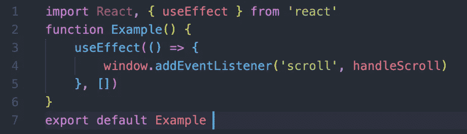
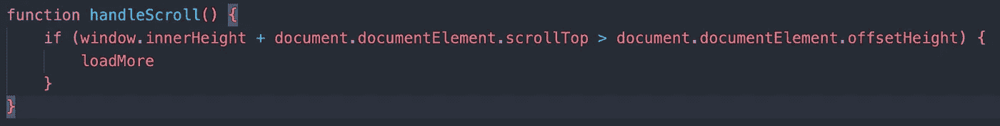
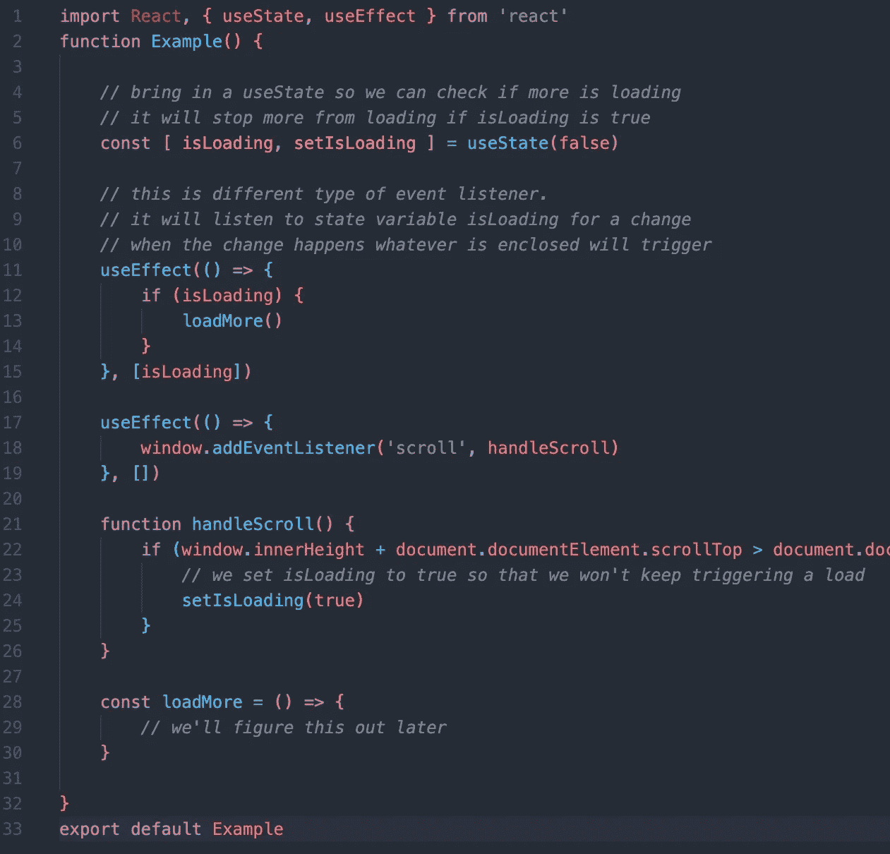
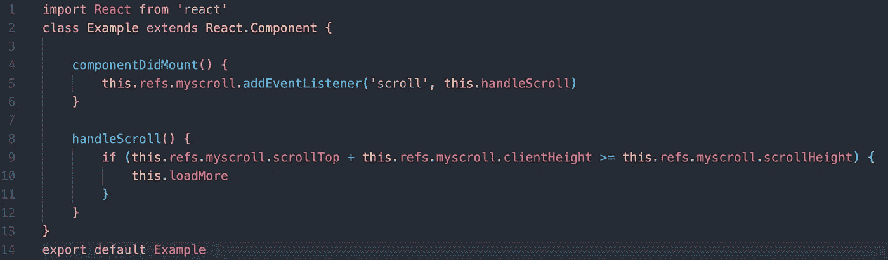
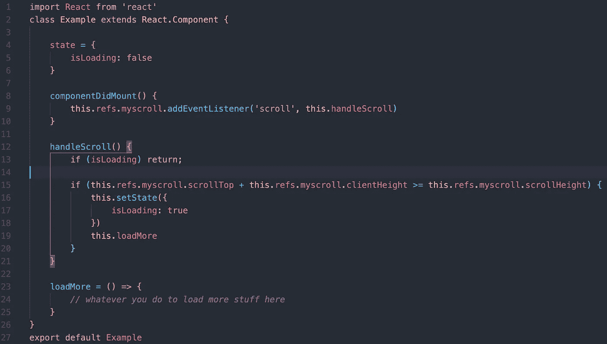

# 如何在 React 中创建无限卷轴

> 原文：<https://betterprogramming.pub/infinite-scrolling-in-react-839bbade153f>

## 这比你想象的要容易

[泰勒·威尔科克斯](https://unsplash.com/@taypaigey?utm_source=unsplash&utm_medium=referral&utm_content=creditCopyText)在 [Unsplash](https://unsplash.com/s/photos/scroll?utm_source=unsplash&utm_medium=referral&utm_content=creditCopyText) 上的照片

最近到处都是。无限滚动是刷新时愤怒的来源，也是试图入睡时浪费无数时间的提醒。

当然，这么高的使用率，你可能想把它包含在你的 app 里。

这个想法很简单:

1.  创建一个事件侦听器，它查看您当前在窗口对象中的位置。
2.  确保它不会听起来太难，因为你只希望出现少量的新元素，而不是几千个。

# 功能组件

## 1.让我们从添加事件监听器开始

使用功能组件，我们必须引入带有空数组的`useEffect`作为第二个参数，这实际上是功能组件中新的`componentDidMount`。

现在，我们需要构建出`handleScroll`函数。只需将它添加到类中的`loadMore`中，并保持原样以用于函数。

有很多方法可以创建`handleScroll`函数——上面的方法是监听`innerHeight`和`scrollTop`的当前位置，并检查它是否大于`offsetHeight`。

只有当你将*滚动过底部的*时，它才会被触发，让浏览器以轻微的弹性运动拉起整个页面。

## 2.不要听得太认真。什么？

如果你看看我们设计事件监听器的方式，`loadMore`会在你喘口气之前发出很多声音。所以我们稍微后退一点，创建一个`useState`，它会告诉我们是否/何时到达`loadMore` ——用一个小缓冲区在事件和负载之间创建一些滞后。

现在，我们创建的第一个事件监听器将只有`setIsLoading(true)`。

我们在第 11 行添加了另一个事件监听器，它将监听`isLoading`中的变化。当`isLoading`改变时，它会检查`isLoading`是否为`true`，然后加载更多元素。

现在，重要的是要注意，如果在你到达页面底部之前是`false`，那么`isLoading`应该只变成`true`。因此，每次到达底部时，只应调用一次`useEffect`事件监听器。

# 类别组件

## 1.添加事件监听器

在功能模型中，我们将初始事件侦听器添加到

`useEffect(() => {},[])`，本质上是一个`componentDidMount`。

然后，检查用户是否在页面底部。

## 2.听得太认真了

现在，我们遇到了和以前一样的问题(我们加载的太多了)。

所以我们创建了一个名为`isLoading`的状态。如果`isLoading`为真，我们返回并退出函数，根本不检查`scrollTop` / `clientHeight` / `scrollHeight`。

确保在`loadMore`中首先是`setState({ isLoading: false})`。

# 结论

这一切都是基于这样一个假设，即您正在从头开始构建它。但是如果您想走更简单的路线，只导入一个库，这也很容易。

 [## 反应-无限-滚动

### ES6 中用于 React 的无限滚动组件

www.npmjs.com](https://www.npmjs.com/package/react-infinite-scroller)