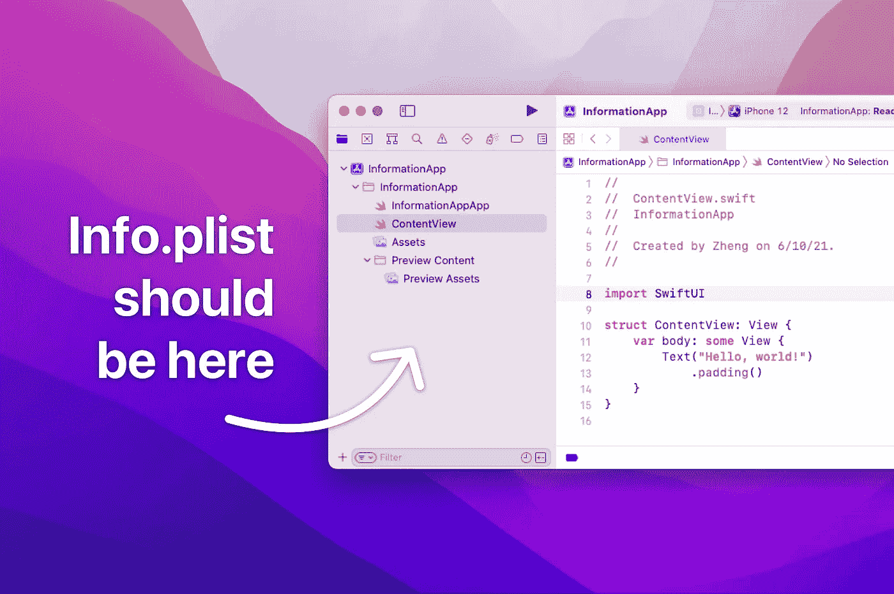
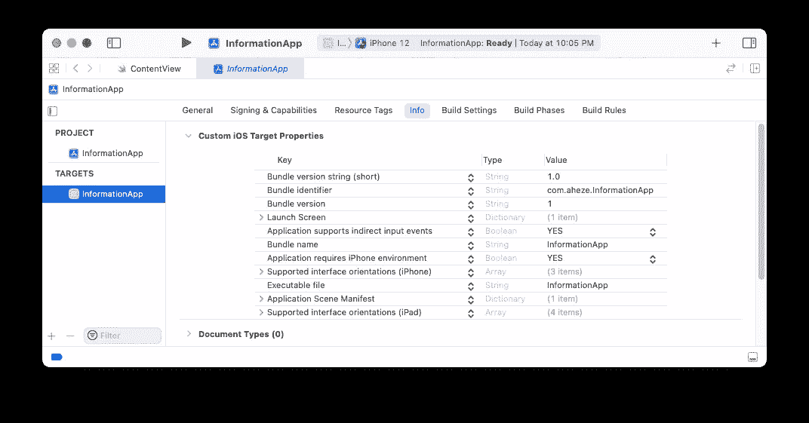
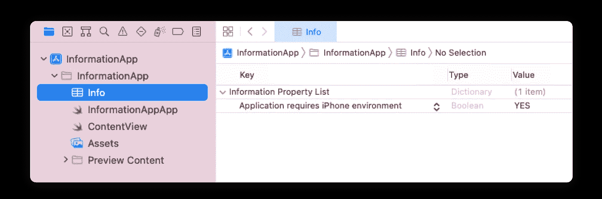
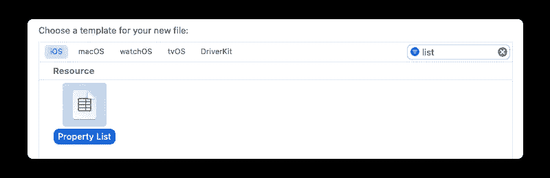
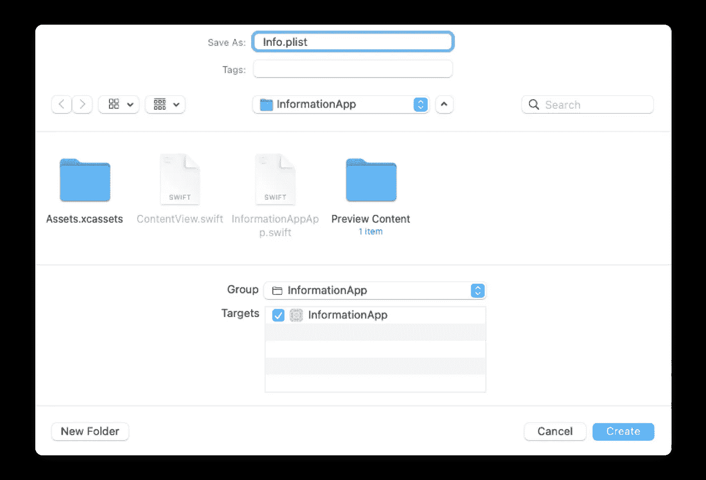
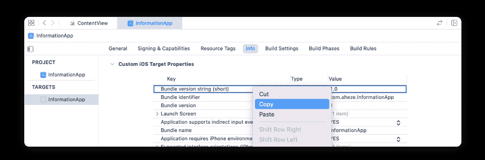
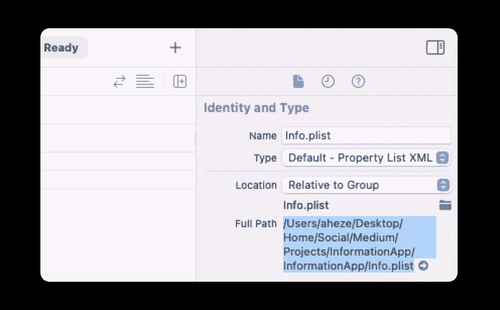
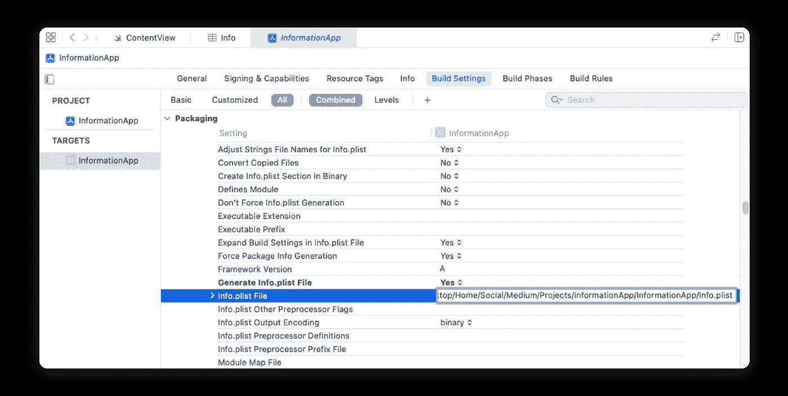
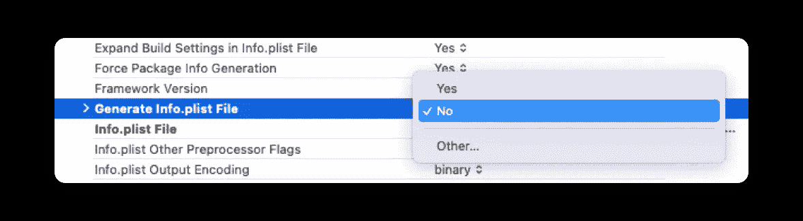
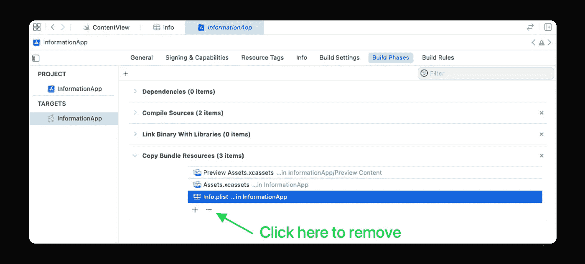

# Xcode 13 中缺少 Info.plist 以下是找回它的方法

> 原文：<https://betterprogramming.pub/info-plist-is-missing-in-xcode-13-heres-how-to-get-it-back-1a7abf3e2514>

## 这应该是一个“特色”



图片由作者提供。

如果你用 Xcode 13 创建了一个新的 SwiftUI 应用，你会注意到`Info.plist`不见了。这不是一个错误。根据 [Xcode 13 发行说明](https://developer.apple.com/documentation/xcode-release-notes/xcode-13-beta-release-notes):

> “从几个模板创建的项目不再需要配置文件，如授权和`Info.plist`文件。在目标的“信息”选项卡中配置公共字段，并在项目编辑器中构建设置。

那很好，但是有一个问题。你得到的只是一个 GUI，所以你看不到底层的 XML 源代码。当您解决合并冲突或者您只想粘贴一些模板属性时，这可能会有所限制。

让我们讨论一下我们的选择。

# 选项 1:遵循苹果公司的建议

首先，转到:

```
Project → Targets → Info → **Custom iOS Target Properties**
```

…然后编辑属性，就像你回到`Info.plist`一样。



第一次，Xcode 会自动生成一个与`Custom iOS Target Properties`半同步的新`Info.plist`文件。Xcode 稍后会为您合并它们。(感谢斯图尔特·林奇的提示！)



新生成的 Info.plist

我说“半同步”是因为，嗯，它们没有完全同步。有些类似`*Privacy — Camera Usage Description*`的属性只会出现在`Custom iOS Target Properties`中，而`*Application requires iPhone environment*`两者都会出现。Xcode 如何确定这一点是个谜。

但是也许你想把所有的属性都放在一个地方，而不是依靠 Xcode 来整理。那样的话，系好安全带…

# 选项 2:完全恢复 Info.plist

有时候，你只需要恢复到旧版本。以下是一位苹果工程师在 WWDC21 上告诉我的话。

**1。**新建一个“属性列表”文件(`File` → `New` → `File`):



**2。**将其命名为`Info.plist`，然后点击“创建”:



**3。**因为刚被创建，`Info.plist`还是空的。我们需要将现有属性从“自定义 iOS 目标属性”转移到这里。所以，让我们复制并粘贴它们:



复制每个属性…


…然后粘贴

如果您不想复制和粘贴每个属性(仍然没有全选特性)，这个要点[具有 XML 格式的默认属性。要使用它们，右击`Info.plist` → `Open As` → `Source Code`，然后粘贴。](https://gist.github.com/aheze/fe11e259f78c4716897a599e01e593e2)

**4。**从属性检查器复制路径到`Info.plist`:



**5。**现在是配置构建设置的时候了。转到:

```
Project → Targets → Build Settings → **Info.plist File**
```

然后，粘贴刚才复制的路径:



**6。**将`Generate Info.plist File`设置为“否”:



**7。**最后，请访问:

```
Project → Targets → Build Phases → **Copy Bundle Resources**
```

并移除`Info.plist`。这是为了防止出现“多个命令产生”的错误。



就是这样！按下`Command` + `B`，您的项目将成功构建:


# 结论

无论你是配合 Xcode 的半同步`Info.plist`使用`Custom iOS Target Properties`，还是只使用经典的`Info.plist`，你的应用都不会改变。取决于你是想要更少的工作还是更多的控制，两种选择都可以——结果是一样的。感谢阅读。