# 使用 Terraform 和 GitHub 操作的 Infra CI/CD

> 原文：<https://betterprogramming.pub/infra-ci-cd-using-terraform-github-actions-8fbcca0d2226>

## 为什么不利用 Terraform 和 GitHub 操作的强大功能，在基础架构部署中使用自动化的概念呢？

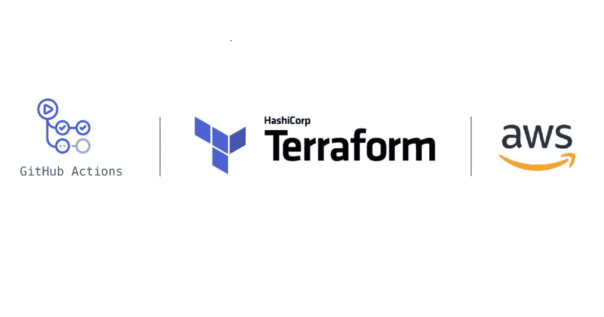

使用 Terraform 触发 AWS S3 的 GitHub 操作

GitHub 以存储代码和提供 VCS 而闻名，但随着 GitHub 使用 Github actions 进入 CI-CD 市场，它完全占领了自动化市场。

凭借 GitHub 动作和存储在 GitHub 中的代码的强大功能，为什么不让它们在本地管理自动动作，而不是依赖任何其他更复杂的工具并用 webhooks 连接它们呢？

*Terraform* *是一款用于供应基础设施(或者将基础设施作为代码进行管理)的工具。它支持几乎所有的云提供商，如 AWS、Google Cloud、Azure 等。Terraform cloud 与 Terraform 的无缝集成允许您使用 Terraform 与各种 CI-CD 工具集成。*

本文将关注以下内容:

```
Create a GitHub Repo and Enable GitHub Actions in It
Create AWS Secret Key and Access Key
Setting Up Secrets in GitHub Actions
Create a Terraform Script to Provision an S3 Bucket in AWS
```

完成上述所有步骤后，您将看到一键式基础自动化。

让我们开始吧。按照步骤顺序，你也可以做到这一点。

# 创建一个 GitHub Repo 并在其中启用 GitHub 操作

登录您的 GitHub 帐户或注册一个新帐户，然后使用指定的回购。

```
[https://github.com/djangochain/terraform-github-action](https://github.com/djangochain/terraform-github-actions)
```

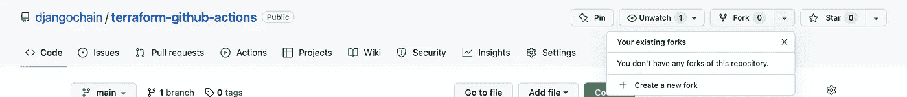

派生 GitHub 回购

默认情况下，GitHub 操作在所有回购上启用。如果在您的回购中看不到 GitHub 操作，请检查您的帐户设置或您的组织是否使用 GitHub 中的 org 帐户。

如果你想使用自己的回购，在 GitHub 中创建一个新的回购。


GitHub 新回购创建

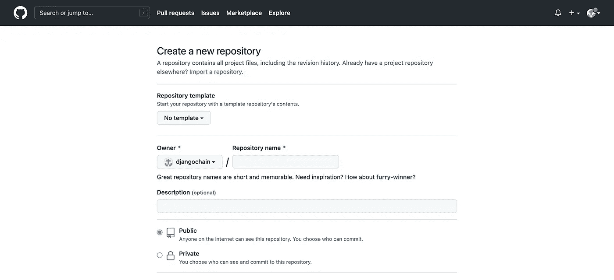

新回购创建表单

# AWS 帐户和 AWS 机密

如果您已经有了一个 AWS 帐户，那么通过点击 AWS 帐户中的标签[安全凭证](https://console.aws.amazon.com/iam/home?region=ap-south-1#security_credential)来创建安全凭证。

如果您没有 AWS 帐户，请使用以下链接创建一个帐户[https://AWS . Amazon . com/premium support/knowledge-center/create-and-activate-AWS-account/](https://aws.amazon.com/premiumsupport/knowledge-center/create-and-activate-aws-account/)

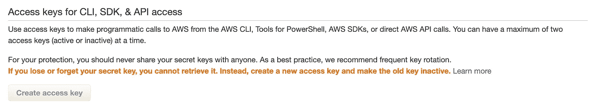

AWS 创建和访问密钥

创建访问密钥时，请记住复制并下载访问密钥和密码(因为它不会在以后出现)。

# 在 GitHub 操作中设置秘密

现在是时候在 GitHub 中创建秘密了。保留在上一步中复制/下载的 AWS 秘密访问密钥和访问密钥 id，以便在下一步中使用。

转到 GitHub repo 中的设置，并从左侧选择机密选项卡。之后，选择其中的操作，如下所示:

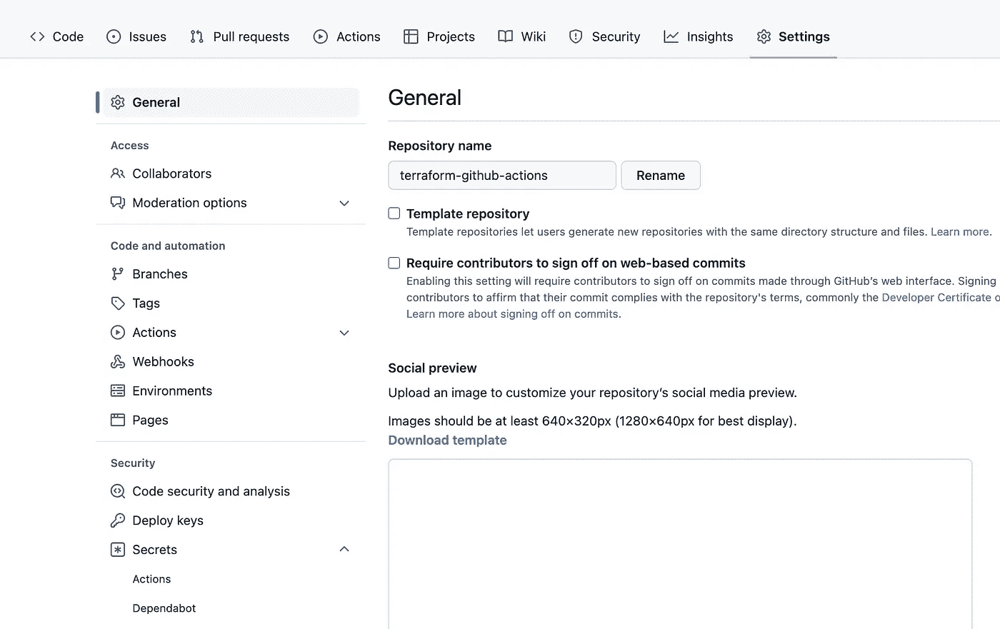

GitHub 秘密

在操作中，选择新的存储库密码。

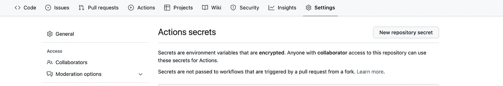

创建两个秘密——`AWS_ACCESS_KEY_ID`和`AWS_SECRET_ACCESS_KEY`——并存储我们在上一步中复制的值。

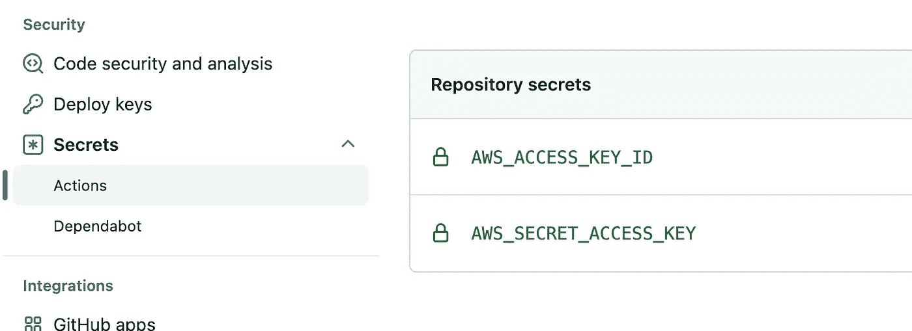

在秘密之后，看起来

# terra form GitHub Actions In…Action

GitHub 动作是通过在。`github/workflows/<file_name>.yml`并在其中定义如下配置:

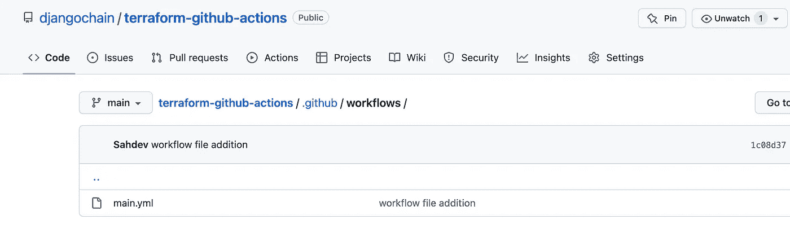

或者直接访问 GitHub 中的 actions 选项卡并选择 new workflow。完成此操作后，您可以选择预定义的操作模板，或者为本文创建自己的模板。请选择 Terraform 模板。

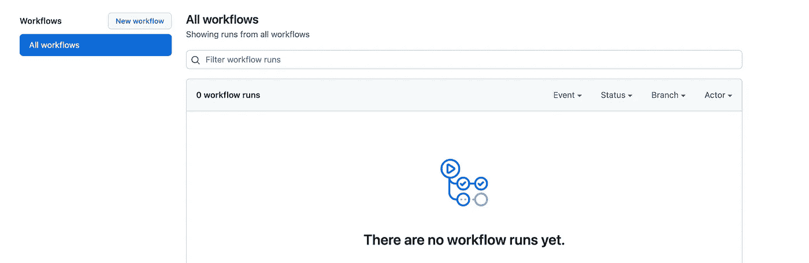

现在，在为动作选择了模板之后，我们有了一个带有一些预定义步骤的 yml。让我们深入研究一下，根据我们的需要定制几个步骤。

第一个是`name`，它给出了工作流的名称。我们需要决定行动的触发点。使用当前的配置，只要主分支中有新的 push 和任何 pull 请求，就会触发这些操作。还有许多其他“on”触发器可以使用。在处检查其他“开”动作[。](https://help.github.com/en/actions/automating-your-workflow-with-github-actions/events-that-trigger-workflows)

下一步是在 GitHub 操作中设置作业。为此，我们需要配置 runner，或者我们可以指定哪个作业将运行，然后安装如 yml 所示的 Terraform

现在我们已经设置好了地形，让我们开始做一些地形的事情。

第一块是初始化 Terraform，这样它将安装所需的提供者和模块——但是一定要记住注入我们之前存储的 GitHub 秘密中的秘密。

然后，验证并应用 Terraform。我们已经将 Terraform 配置为自动批准模式，因为这是我们进行自动化时所必需的。否则，GitHub 操作会在该步骤停止，并最终失败。

```
name: 'Terraform'

on:
  push:
    branches: [ "main" ]
  pull_request:

permissions:
  contents: read

jobs:
  terraform:
    name: 'Terraform'
    runs-on: ubuntu-latest
    environment: production

    # Use the Bash shell regardless whether the GitHub Actions runner is ubuntu-latest, macos-latest, or windows-latest
    defaults:
      run:
        shell: bash

    steps:
    # Checkout the repository to the GitHub Actions runner
    - name: Checkout
      uses: actions/checkout@v3

     # Install the latest version of Terraform CLI and configure the Terraform CLI configuration.
    - name: Install Terraform
      run: |
        wget -O- https://apt.releases.hashicorp.com/gpg | gpg --dearmor | sudo tee /usr/share/keyrings/hashicorp-archive-keyring.gpg
        echo "deb [signed-by=/usr/share/keyrings/hashicorp-archive-keyring.gpg] https://apt.releases.hashicorp.com $(lsb_release -cs) main" | sudo tee /etc/apt/sources.list.d/hashicorp.list
        sudo apt update && sudo apt install terraform

    # Initialize a new or existing Terraform working directory by creating initial files, loading any remote state, downloading modules, etc.
    - name: Terraform Init
      env:
        AWS_ACCESS_KEY_ID: ${{ secrets.AWS_ACCESS_KEY_ID }}
        AWS_SECRET_ACCESS_KEY: ${{ secrets.AWS_SECRET_ACCESS_KEY }}
      run: terraform init -input=false

    # Generates an execution plan for Terraform
    - name: Terraform Plan
      env:
        AWS_ACCESS_KEY_ID: ${{ secrets.AWS_ACCESS_KEY_ID }}
        AWS_SECRET_ACCESS_KEY: ${{ secrets.AWS_SECRET_ACCESS_KEY }}
      run: terraform plan -input=false

      # On push to "main", build or change infrastructure according to Terraform configuration files
      # Note: It is recommended to set up a required "strict" status check in your repository for "Terraform Cloud". See the documentation on "strict" required status checks for more information: https://help.github.com/en/github/administering-a-repository/types-of-required-status-checks
    - name: Terraform Apply
      env:
        AWS_ACCESS_KEY_ID: ${{ secrets.AWS_ACCESS_KEY_ID }}
        AWS_SECRET_ACCESS_KEY: ${{ secrets.AWS_SECRET_ACCESS_KEY }}
      run: terraform apply -auto-approve -input=false
```

# 创建 Terraform 脚本以在 AWS 中供应 S3 存储桶

现在我们已经完成了所有种类的设置，我们可以编写实际的`terraform .tf`文件，由 GitHub 动作触发并由上面定义的步骤执行。

对于本文，我们将在 AWS 中以最少的配置提供一个 S3 存储桶。根据您的要求更改配置，并记住选择一个唯一的存储桶名称。

```
terraform {
  required_providers {
    aws = {
      source  = "hashicorp/aws"
      version = "4.12.1"
    }
  }
}

# Configure the AWS Provider
provider "aws" {
  region = "ap-south-1" # define region as per your account
}

resource "aws_s3_bucket" "new_bucket" {
  bucket = "demo-github-action-tf-medium"

  object_lock_enabled = false

  tags = {
    Environment = "Prod"
  }
}
```

创建一个新的文件`main.tf`，添加上面的代码，并在提交后提交修改。现在是时候看看 GitHub 的实际操作了。

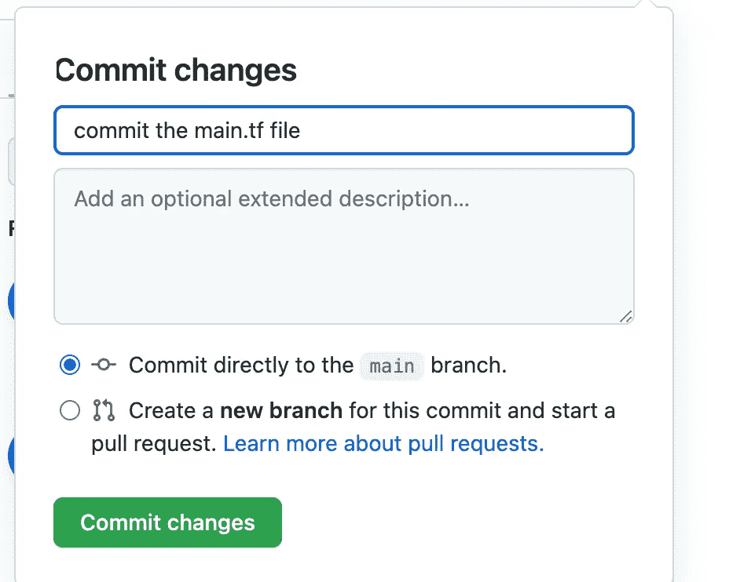

提交之后，转到 action 选项卡，看到将会触发该操作。

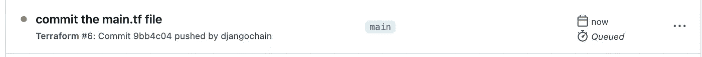

请注意行动。如果出现错误，请检查作业中的日志。但是如果一切顺利，细节应该是这样的:

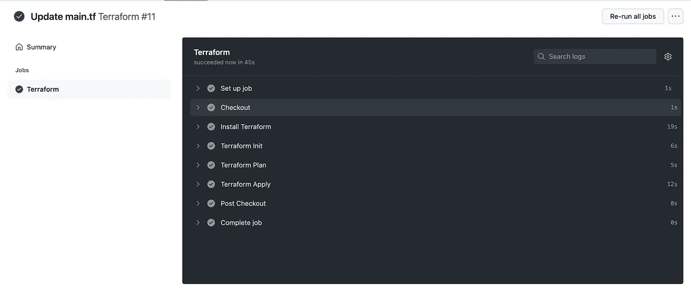

验证您的 AWS 帐户是否显示 S3 桶。


瞧，我们终于成功了！

# 结论

这只是一个开始。您可以使用 Terraform 和 GitHub 操作探索无限的可能性。更多信息，请点击查看 GitHub 动作[。](https://github.com/actions)

您也可以直接在 Terraform cloud 上从 GitHub actions 运行这些 Terraform 脚本。让我们在下一篇[文章](https://medium.com/@sahdevgarg/github-actions-in-action-with-terraform-cloud-bfd7b5be666c)中讨论这个问题。

不断学习，不断成长。

如有任何意见和建议，请联系我。