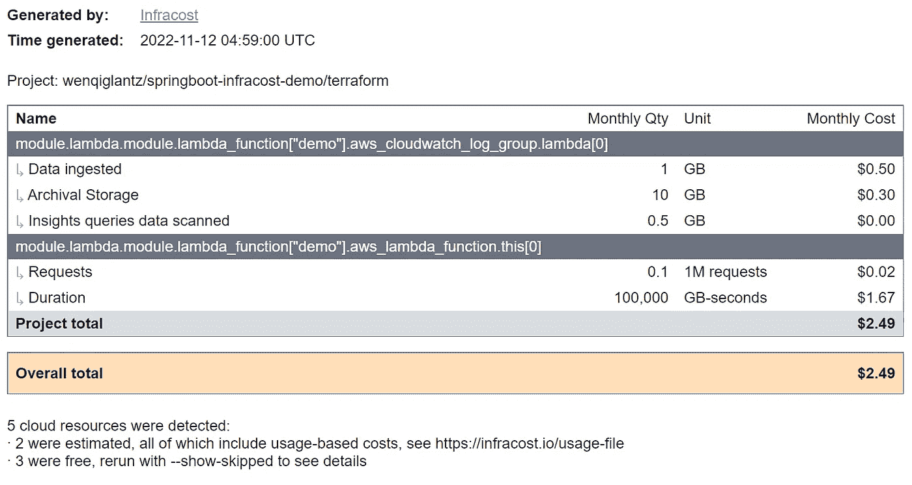
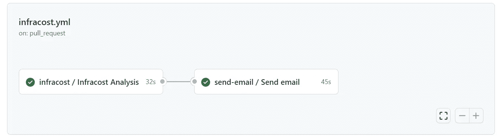
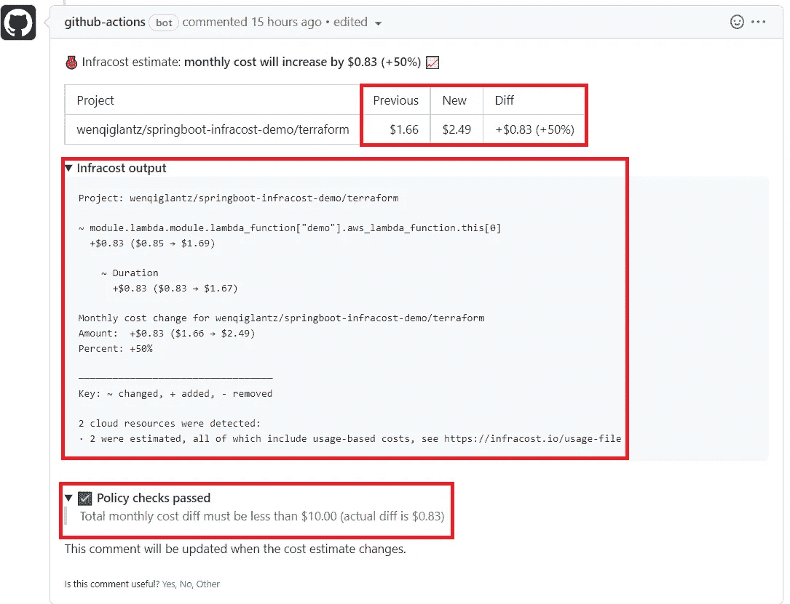
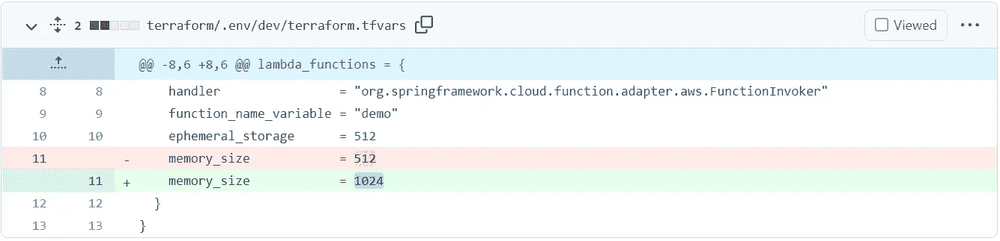
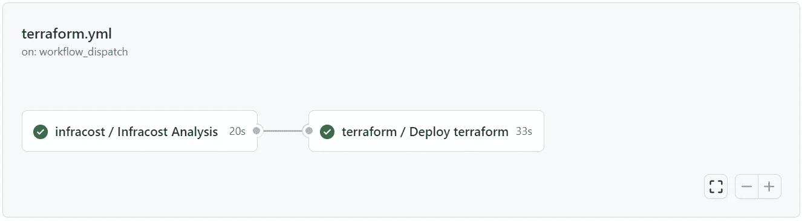
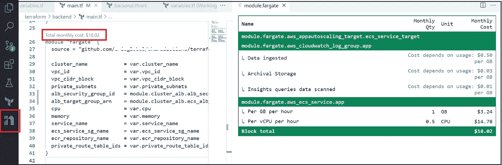

# infra Cost+Terraform+GitHub Actions =自动化云成本管理

> 原文：<https://betterprogramming.pub/infracost-terraform-github-actions-automate-cloud-cost-management-a62b329f2834>

## 如何在 Terraform 开发过程中使用 Infracost 作为管理云成本的护栏


作者照片

DevOps 民主化，DevOps 自助服务，你可能听说过这些术语。这是近年来的一个 DevOps 趋势，主要源于支持云原生架构和开发的需求。DevOps 不应成为向开发团队发布其服务的瓶颈，这样开发人员就可以自助服务其关于基础设施 CI/CD 和应用 CI/CD 的应用。

“但是这种 DevOps 自助服务有风险，”你马上回答！如果一个开发者篡改了他们的地形配置会怎么样？拥有大型开发团队和微观管理每个团队的 IaC 代码以确保他们不会破产的大型组织可能令人望而生畏！

如何才能安心管理这样的 DevOps 自助服务？

好问题！让我们开始吧！

# 自动化云成本管理

想象一下这个:

1.  开发人员对他们的 Terraform 配置进行更改，然后他们提交一个 pull 请求。
2.  这个拉取请求会自动触发一个 CI 工作流，该工作流会计算变更前后的云成本差异。它很好地将成本差异以表格的形式显示为一个拉式请求注释，并详细地追溯成本变化发生的位置。
3.  如果每月云成本变化超过您预定义的策略阈值，您的工作流将无法接受进一步检查，以确保您的 Terraform 配置中没有人为错误。
4.  该工作流还可以为基础架构生成一份关于云成本的 HTML 报告，其中包含最新的变更。
5.  您和/或开发人员会收到附有此报告的电子邮件通知。请参见下面来自我们演示应用的示例报告:



因此，在几秒钟之内，您和/或开发人员就可以在收到开发人员提出的 Terraform 配置请求时，将云成本报告直接发送到您的电子邮件收件箱。您可以清楚地看到开发人员的代码更改会对云成本产生什么影响。

# 自动化背后的引擎— Infracost！

通常，云成本的峰值是在您产生成本之后才被捕捉到的。Infracost 让 DevOps、SRE 和工程师在终端或拉式请求中进行更改之前，可以看到成本分解并了解成本。这为您的团队提供了一个安全网，以捕捉由于 Terraform 配置中的胖指或错误配置而导致的异常云成本估计。

在这个故事中，我们将使用一个简单的名为`springboot-infracost-demo`(简称为`demo`)的 Spring Boot 应用程序来演示如何将 Infracost 整合到我们的 GitHub Actions 工作流中，以便在配置我们的基础架构之前管理云成本，在本例中，这是一个简单的 AWS Lambda 函数。

## 低于成本政策

Infracost 支持开箱即用的[开放策略代理](https://www.infracost.io/docs/features/cost_policies/#quick-start-open-policy-agent-opa) (OPA)策略。策略文件是用 OPA 的本地查询语言[减压阀](https://www.openpolicyagent.org/docs/latest/policy-language/)编写的。Infracost 利用减压阀使您能够编写通过规则定义的灵活而强大的成本策略。规则规定了基础设施变更在合并之前必须通过哪些检查。以下是 rego 文件格式的 OPA Infracost 政策示例。见第 7 行。我将其配置为 100 美元，这意味着如果您的 Terraform 配置更改的每月云成本增加超过 100 美元，您的 CI 工作流将会失败。

你必须仔细检查，以确保你的地形变化是有效的，没有人为错误。如果它确实有效，你可以很容易地提高这个`maxDiff`的数量，以确保你的工作流通过合并代码的审批。

该策略文件直接来自 Infracost 团队提供的示例策略文件。有关政策文件的更多详情，请参见[成本政策](https://www.infracost.io/docs/features/cost_policies/)。我们所做的唯一更改是`maxDiff`金额。

我们将这个策略文件命名为`infracost-policy.rego`，并将其放在我们项目的`terraform` 目录下。

## 低于成本使用

根据您的`.tfvars`文件中的配置计算静态云成本很容易，但是如何处理基于使用的动态云成本呢？Infracost 对此有一个答案！您可以在一个文件中配置相关云资源的使用详细信息，如`infracost-usage.yml`，下面是我们演示应用程序的几个 AWS 资源的示例片段:

正如您所看到的，在这个用法文件中有两个主要部分:

*   `resource_type_default_usage`:本节定义的使用值适用于给定类型的每个资源，这在定义默认值时很有用。
*   `resource_usage`:本节中定义的使用值适用于单个资源，并覆盖`resource_type_default_usage`节中定义的任何值。

有关您可以定义的所有可能的云资源使用属性的完整列表，请参考位于主 infra cost/infra cost(github.com)的[infra cost/infra cost-usage-example . yml。请务必将此链接加入书签，因为在配置资源的使用数据时，您将需要参考它。](https://github.com/infracost/infracost/blob/master/infracost-usage-example.yml)

# infra Cost+Terraform+GitHub Actions =自动化云成本管理

是时候了解以上所有内容的核心了！让我们探讨如何将 Infracost 整合到 GitHub Actions 工作流中，以实现自动化云成本管理。

## 步骤 1:机密配置

我们需要为这个 Infracost 工作流配置的唯一 GitHub 秘密是一个存储库秘密，它带有一个键`INFRACOST_API_KEY`和值作为您的 API 键。你可以按照 Infracost 网站的指示[安装 Infracost](https://www.infracost.io/docs/#1-install-infracost) ，然后[获取 API 密匙](https://www.infracost.io/docs/#2-get-api-key)，从而获得 API 密匙。

## 步骤 2: Infracost 可重用工作流

Infracost 工作流评估基础分支云成本估计，并将其与提出拉取请求的分支进行比较。云成本估算的差异会显示为 PR 注释。基于 Infracost 提供的[示例 GitHub action，我开发了一个 GitHub Actions 可重用工作流`terraform-infracost-pr.yml`，见下文，展示了基于拉取请求的 Terraform 的 AWS 云成本估算。要了解什么是 GitHub Actions 的可重用工作流以及如何使用它，请查看我的故事，](https://github.com/infracost/actions/)[深入了解 GitHub Actions 的可重用工作流](/how-to-use-github-actions-reusable-workflow-8604e8cbf258?sk=016e931ac8c4058eea74ce7838039bf6)。除了显示云成本估算，这个可重复使用的工作流还:

*   根据最新的 Terraform 配置和使用文件生成 HTML 报告。
*   将报告上传到 GitHub 工件，以便调用者工作流可以下载报告并将其作为附件通过电子邮件发送。

上述可重用工作流中的每一步都有注释来解释每一步的目的。需要提及的几个要点:

*   第 33–36 行，Harden Runer，由 [StepSecurity](https://www.stepsecurity.io/) 开发，是保护我们的工作流程免受供应链攻击的安全措施。关于哈登转轮的更多细节，请查看我的博客[《哈登转轮初看:防止供应链攻击的必备 GitHub 行动](/a-first-look-at-harden-runner-the-must-have-github-action-to-prevent-supply-chain-attacks-d7707bbc106e?sk=db3c14979b5d8245822e6b6450d3e689)。
*   第 40–44 行,“Setup Infracost”步骤调用 Infracost 的 GitHub 操作`infracost/actions/setup@v2`，该操作安装 Infracost CLI v0.10.x 的最新补丁版本，并获取向后兼容的错误修复和新资源。请注意我们为该操作锁定的 git SHA `6bdd3cb01a306596e8a614e62af7a9c0a133bc5c`。这是 GitHub 操作的安全强化最佳实践。将动作固定到全长提交 SHA 是当前将动作用作不可变发布的唯一方式。锁定特定的 SHA 有助于降低不良参与者向操作存储库添加后门的风险。
*   第 73–83 行，“生成 Infracost 差异”步骤运行`infracost diff` CLI 生成基本成本和 PR 变更引入的成本之间的差异，并将详细信息保存在 JSON 文件中，该文件用于生成其下“生成 Infracost 报告”步骤中的报告。这种 JSON 格式也是用户可以上传到 Infracost Cloud 的格式，如果他们想在开源产品上使用 SaaS 的功能。
*   注意带有`--policy-path`的最后一行，它定义了我们的`infracost-policy.rego`文件的路径，这允许`infracost comment`执行这个策略文件来失败或通过这个工作流的策略检查。

## 步骤 3:调用 Infracost 可重用工作流

您的应用程序的 Infracost 工作流应该调用上述 Infracost 可重用工作流。下面是一个调用 Infracost 可重用工作流的示例工作流。请注意，触发器仅是拉式请求，没有手动触发器，因为 Infracost 工作流需要两个分支机构来比较云成本估计。

以下是呼叫者工作流程中的两项工作:



*   `infracost`:调用可重用的工作流`terraform-infracost-pr.yml`生成报告、有差异金额的 PR 注释等。
*   `send-email`:从 GitHub 工件下载上述作业生成的报告，然后调用可重用的工作流向指定的收件人发送邮件通知，附件中包含报告。

## 步骤 4:工作流执行结果

一旦工作流执行完毕，我们可以在 pull 请求中找到 Infracost 注释。详情见下面截图:

*   以前金额、新金额和差异金额的成本
*   详细的输出将被向下钻取，以查看哪些资源增加/减少了成本。
*   差异量是否在最大差异量的策略阈值范围内。



要找出是哪个 Terraform 文件更改导致了此成本更改，请单击该拉取请求中的“文件更改”选项卡，我们会看到以下内容:



啊，从 512 到 1024 的内存大小变化导致每月增加 0.83 美元。还不错！

同时，电子邮件收件人将收到一封附件中带有 Infracost HTML 报告的电子邮件。请看下面来自我们演示应用的样本报告:


# 将 Infracost 分析添加到 Terraform 工作流

除了上述用于 Terraform pull 请求的 GitHub Actions 工作流，我还扩展了 GitHub Actions Terraform 工作流，在运行 Terraform init/plan/apply 之前，增加了一个进行 Infracost 分析的先决步骤。这看似多余，但实际上，这是在我们通过 Terraform 工作流实际调配基础架构之前，确保云成本在政策阈值内的最后一道关卡。

无论出于何种原因，如果云成本超过了政策阈值，这是我们在 Terraform 发挥作用之前抓住它的最后机会。因此，我们的 terraform 工作流程包含两项工作:

*   低成本分析
*   地形部署



如果 Infracost 分析作业失败，工作流也将失败，因此 Terraform 的工作是永远不执行，直到 Infracost 分析通过。

有关工作流代码的详细信息，请参考以下链接:

*   可重用工作流:[terra form-infra cost . yml](https://github.com/wenqiglantz/reusable-workflows-modules/blob/main/.github/workflows/terraform-infracost.yml)和 [terraform.yml](https://github.com/wenqiglantz/reusable-workflows-modules/blob/main/.github/workflows/terraform.yml)
*   呼叫者工作流程: [terraform.yml](https://github.com/wenqiglantz/springboot-infracost-demo/blob/main/.github/workflows/terraform.yml)

# 在你的终端上运行 Infracost

除了在我们的 GitHub Actions 工作流中运行 Infracost 之外，我们还可以在终端运行 Infracost，以获得成本细分、差异和生成报告等。

以下命令基于 Terraform 代码运行 Infracost 成本细分:

```
infracost breakdown --path . --show-skipped --terraform-var-file='./.env/dev/terraform.tfvars' --no-color
```

以下命令根据 terraform 代码和预计使用情况运行 Infracost 成本分解:

```
infracost breakdown --path . --usage-file './.env/dev/infracost-usage.yml' --terraform-var-file='./.env/dev/terraform.tfvars' --no-color
```

以下命令首先生成 JSON 输出文件:

```
infracost breakdown --path . --usage-file './.env/dev/infracost-usage.yml' --terraform-var-file='./.env/dev/terraform.tfvars' --format json --out-file infracost-with-usage.json --show-skipped
```

然后，它将 JSON 文件呈现为 HTML:

```
infracost output --path infracost-with-usage.json --format html --out-file report.html --show-skipped
```

# Infracost VSCode 扩展

除了上面提到的精彩 GitHub 动作和 CLI，Infracost 在你的 IDE 中为开发者提供了另一个很棒的工具！ [Infracost VSCode 扩展](https://www.infracost.io/docs/integrations/vscode/)可让您在开发基础设施配置时查看云成本。见下面截图:

*   “每月总费用”显示在您的`main.tf`模块的正上方。
*   单击“每月总成本”可深入查看每个资源的成本明细，以表格形式显示在 VSCode 的右侧。
*   请注意，在 VS 代码扩展中计算的每月总成本是基于静态成本，而不是使用数据。如果您的`terraform.tfvars`文件位于子目录中，而不是与`main.tf`文件在同一个目录中，您可能看不到每月费用。如果发生这种情况，请确保在开发或成本分析期间将您的`.tfvars`文件复制到与`main.tf`相同的目录中，您可以获得金额。



在 VS 代码启动时，Infracost 扩展在 terraform 根目录下创建一个`.infracost`文件夹。这个`.infracost`文件夹保存 Infracost 的引擎，以便可以在 VSCode 中执行成本计算。不要将这个`.infracost`文件夹提交到您的 git 存储库中。您可以在您的`.gitignore`文件中添加一个额外的行条目`**/.infracost/*`，以便在将代码推送到 git 时忽略文件夹`.infracost`。

# Infracost 作为基础设施设计辅助工具

Infracost 也是帮助基础设施设计的一个有价值的工具。如果您在设计基础设施时考虑多个选项，例如是否将您的微服务托管在 ECS 或 EKS，是否将您的 UI SPA 托管在 S3/CloudFront 或 ECS，作为与后端服务相邻的独立服务，Infracost 可以指导您做出最具成本效益的设计选项，用真实的美元数字来说服您的经理和团队为什么您提出的选项最具成本效益。

# Infracost 提高了开发人员对云支出的认识

使用 Infracost 的另一个主要好处是，它提高了开发人员对云支出的认识。当你开发你的 Terraform 代码，比较和选择不同的配置选项来找到最合适的配置时，看到花费金额的变化是令人惊讶的！

# 摘要

安心地将 DevOps 民主化并非不可能。Infracost 可以是护栏。在这个故事中，我们探索了 Infracost，是什么，为什么，以及如何。希望这个故事对你有帮助。

这个故事的源代码可以在我的 GitHub 资源库中找到:

*   [https://github.com/wenqiglantz/reusable-workflows-modules](https://github.com/wenqiglantz/reusable-workflows-modules)
*   https://github.com/wenqiglantz/springboot-infracost-demo

编码快乐！

# 参考

*   [Infracost](https://www.infracost.io/)
*   GitHub — infracost/actions:一组针对 infracost 的 GitHub 操作。请参见拉式请求中 Terraform 的云成本估算。💰📉喜欢你的云账单！
*   [成本政策| Infracost](https://www.infracost.io/docs/features/cost_policies/)
*   [https://www.stepsecurity.io/](https://www.stepsecurity.io/)
*   [https://docs . github . com/en/actions/security-guides/security-hardening-for-github-actions](https://docs.github.com/en/actions/security-guides/security-hardening-for-github-actions)