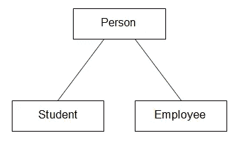

# 继承与构成

> 原文：<https://betterprogramming.pub/inheritance-vs-composition-2fa0cdd2f939>

## 你应该使用哪一个？


多梅尼科·洛亚在 [Unsplash](https://unsplash.com/s/photos/website?utm_source=unsplash&utm_medium=referral&utm_content=creditCopyText) 上拍摄的照片

自从引入以来，继承一直是 OOP 最受欢迎的特性之一。但是现在似乎不推荐将它作为编程中的好实践。很容易找到许多关于“[组成优于继承](http://Composition over inheritance)”的讨论和文章，作为工程师的一种预防措施。一些现代编程语言，如 Go，甚至不允许使用继承，而只允许使用复合。

> 有人:让我们使用继承来重用代码
> 
> Go:什么是继承？

让我们搞定这件事！首先，什么是继承？

# 遗产

来自维基百科[这里](https://en.wikipedia.org/wiki/Inheritance_(object-oriented_programming))。

长话短说，当子类从父类继承时，子类从父类获得所有行为。继承会产生一个类层次结构——你可以把它想象成一个类的树。



# 作文

同样来自维基百科[这里](https://en.wikipedia.org/wiki/Composition_over_inheritance)

组合与继承相反，它通过组合其他类型的对象(组件)来创建复杂类型，而不是从基类或父类继承。简单地说，composition 包含实现所需功能的其他类的实例。

我们可以把构图想象成玩乐高积木，而组件就是乐高积木。


照片由[埃里克&尼克拉斯](https://unsplash.com/@penguinphotography?utm_source=unsplash&utm_medium=referral&utm_content=creditCopyText)在 [Unsplash](https://unsplash.com/s/photos/lego?utm_source=unsplash&utm_medium=referral&utm_content=creditCopyText) 拍摄

# 继承与构成

继承和组合的主要区别在于对象之间的关系。

*   继承:“是”例如，汽车*是*车辆。
*   组成:“有一个”。例如汽车*有一个*方向盘。

继承被认为是面向对象编程中最紧密的耦合形式。改变一个基类会对它的子类甚至整个代码库产生不必要的副作用。

组合是一种非常松散的耦合。结合依赖注入(这里的，它带来了更多的灵活性，也允许我们改变运行时的行为。

当构建一个组合各种组件的类时，使用组合比试图找到它们之间的共性并创建一个类树更自然。

这种方法适应了未来的需求变化，这可能需要在继承方法中更容易地完全重构类树。我们可以简单地向复合类添加一个新组件，而不是修改超类来适应变化。

他们的目的也不同。

*   继承:根据它是什么来设计一个类。
*   组成:根据它做什么来设计一个类。

在大多数情况下，组合可以与继承互换使用。让继承如此广为人知的一点是多态性。组合最初不是为多态性设计的。但是大多数编程语言都允许我们通过接口(在 Swift 世界中被称为协议)来做到这一点。

# 成分多态性

Swift 中的多态性可以通过协议来完成。最流行的术语是 POP(面向协议编程)。

让我们看一个例子来进一步理解它。我们有一个`Animal`类，而`Dog`和`Cat`是从它继承而来的。

一只狗会叫，一只猫会叫，所有的动物都需要，呃…去洗手间。

使用继承方法:

```
class Animal { 
   func poop() { }
}class Dog: Animal {
   func bark() { }
}class Cat: Animal { 
   func meow() { }
}let animals: [Animal] = [Dog(), Cat()]
```

用构图法，一只狗既是*便便者*又是*剥皮者，*和一只猫既是*便便者*又是*喵儿*:

```
protocol Poopale {
   func poop()
}protocol Barkable { 
   func bark() 
}protocol Meowable {
   func meow()
}class Dog: Poopable, Barkable {
   var barker: Barkable
   var pooper: Poopable 
   func bark() { barker.bark() }
   func poop() { pooper.poop() }
}...typealias Animal = Poopable & ... // and any behaviorslet animales: [Animal] = [Dog(), Cat()]
```

使用组合的一个缺点是，由单个组件(Barker)提供的方法可能必须在派生类型中重新实现。

*注:但这种不便有些方面可以通过 Swift 中的协议扩展功能来解决

# 继承的问题

你会很快得到一份相当深厚和广泛的遗产。有一天你可能会有一个很深的阶级结构。上层阶级的一个变化可能会摧毁所有下层阶级。当你决定从另一个类继承的时候，就是你把你的类绑定到它的时候了。你永远不知道超类会做什么，因为它不在你的控制之内，:D，这就是所谓的脆弱基类问题

一旦被部署，类的层次结构是很难改变的。一种选择是重写全部内容。

显然，遗传给我带来了很多烦恼。正常的一天，我得到了:

```
git pull master
```

一切看起来都很好——没有冲突。是时候创建一个工作分支了。首先，运行项目——仍然很好，编译成功。然后，我对我最新开发的功能进行了全面检查——结果，它搞砸了。


经过一段时间的调试，我终于找到了原因。是因为根类做了一些改动！

有时候，我们确实不恰当地使用了继承。里斯科夫替代原则是决定继承是否适合你的设计的最重要的指导方针。

比如:B 继承自 A，用 Liskov 代换证明 B 和 A 的关系，然后反转关系，再次证明。如果这种关系在两个方向上都有意义，那么最好不要使用继承。

有了继承，你可以考虑超类在做什么，以及你的子类想要覆盖/改变什么。你可能不得不花时间去理解应用程序中的大量代码，而不是专注于你的范围，只是为了“让它工作”得更好。

继承的一个问题是它鼓励你预测未来——这是一个陷阱。继承鼓励您在项目的早期建立对象的分类。你这样做可能会犯设计错误。在某些情况下，它还通过暴露属性/方法供子类使用来打破封装。

继承的另一个缺点是，当类的层次结构变得太复杂时，它使调试成为一个巨大的挑战。当有 30 层继承时，简单的堆栈跟踪可能会溢出屏幕。

# 结论

凡事都有利弊。像软件开发中的所有事情一样，需要做出权衡。在大多数情况下，合成可以代替继承。但这不是银弹。

*选择编程工具类似于选择正确的厨房工具:你不会用黄油刀切菜，同理，你也不应该为每个编程场景选择构图。*

在真正需要的时候使用继承，而不仅仅是重用一些代码。当你考虑使用继承时，问问你自己子类是否真的是超类的一个更专门化的版本，否则，总有一天你会经历混乱。

当谈到继承时，总是再问自己一次“使用组合是否更有意义？”

[](https://lvhan.medium.com/membership) [## 用我的推荐链接加入媒体-布莱恩

### 作为一个媒体会员，你的会员费的一部分会给你阅读的作家，你可以完全接触到每一个故事…

lvhan.medium.com](https://lvhan.medium.com/membership)