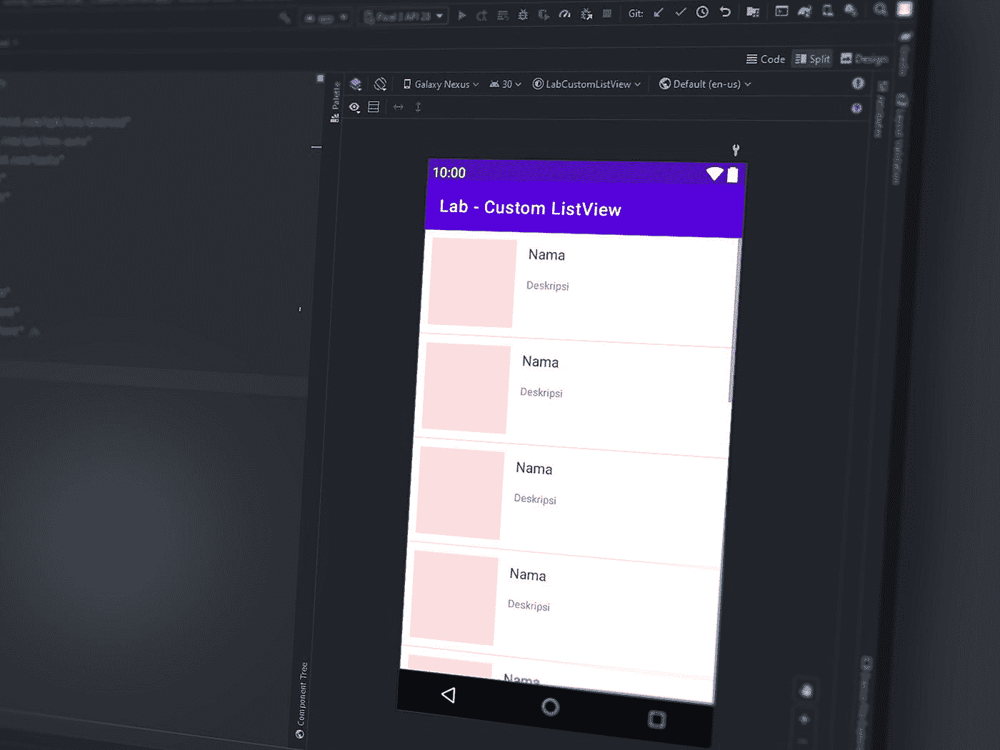

# 在干净的架构中注入带有 Dagger2 的 Android 视图模型

> 原文：<https://betterprogramming.pub/injecting-android-viewmodels-with-dagger2-in-clean-architecture-744c1fe81530>

## 基于 Dagger2 的视图模型依赖注入框架



Muhammad Rosyid Izzulkhaq 在 [Unsplash](https://unsplash.com?utm_source=medium&utm_medium=referral) 上拍摄的照片。

这是关于使用合适的干净架构构建 Android 应用程序的系列文章的第三部分。在这一部分，我们将关注`ViewModels`和他们的依赖注入框架。

在继续之前，我强烈推荐阅读本系列的前几部分:

*   [《Android 的清洁架构教程(上)》:如何用 Dagger2 建立复杂的 DI 结构](/how-to-set-up-a-dependency-injection-framework-with-dagger2-in-android-aa23ee9299db)。
*   [“Android 的干净架构教程(第 2 部分)”:使用协程创建存储库和用例](/creating-a-repository-data-layer-with-kotlin-coroutines-in-android-1375ab79b6f0)。
*   《Android 的干净架构教程(第三部分)》:你来了。

今天，我们将学习如何在 clean architecture 中使用`ViewModel`，并使用 [Dagger2](https://dagger.dev/) 构建一个依赖注入框架，以便我们可以快速将它们注入到像`Activities`和`Fragments`这样的 Android 组件中。

在开始使用`ViewModels`之前，我们应该问自己为什么要使用一个`ViewModel`。答案很简单:关注点分离(SoC)。这使得应用程序可维护、可扩展和可测试。

不过，这可以通过演示者来完成。为什么要用`ViewModel`？首先，`ViewModel`可以经受住配置的变化。仅这一点就可以解决许多由于组件停止而导致的常规错误。如果你有兴趣了解更多关于`ViewModels`的信息，我强烈推荐你阅读下面这篇文章:

[](/best-practices-for-using-viewmodels-in-android-e986b25dc78f) [## 在 Android 中使用视图模型的最佳实践

### 如何正确设置和使用 Java 和 Kotlin 视图模型

better 编程. pub](/best-practices-for-using-viewmodels-in-android-e986b25dc78f) 

# 综合

要将`ViewModel`架构组件集成到您的项目中，请在应用程序级`gradle`文件中的`dependency`标签下添加以下库:

```
/* Viewmodel */
implementation **“androidx.lifecycle:lifecycle-viewmodel-ktx:2.3.0”**
```

# 创建视图模型

既然我们知道了为什么要使用`ViewModel`并将其集成到项目中，下一步就是创建一个`ViewModel`。这是最简单的任务。我们只需要创建一个名为`SampleViewmodel`的 Kotlin 类(例如)并用`ViewModel`扩展它。看一看:

```
class SampleViewmodel : ViewModel() {}
```

# 视图模型注入框架

在不使用任何依赖注入逻辑的情况下，我们可以通过向`ViewModelProvider`提供`ViewModel`类对象，在 Android 组件中创建一个`ViewModel`实例对象。这将生成绑定到在`ViewModelProvider`构造函数中传递的上下文的`ViewModel`实例。看一看:

内部发生的情况是，每次我们请求时，它都会创建一个新的`ViewModelFactory`实例，它负责创建我们的`ViewModels`实例。

这个过程可能看起来不错，但实际上并不奏效。由于`ViewModel` API 的抽象工厂模式，我们不能在`ViewModel`构造函数中传递任何参数。这意味着我们不能有参数化的`ViewModel`。然而，这可以通过创建我们的`ViewModelFactory`实现来解决。

在`di`下创建一个子包，然后创建一个名为`ViewModelFactory`的新 Kotlin 类。然后用`ViewModelProvider.Factory`扩展它并导入一个`create`方法，我们将在其中比较对象并返回`ViewModel`，如下所示:

现在让我们看看如何用我们的自定义`ViewModelFactory`类创建`ViewModel`对象:

现在，这解决了参数化的`ViewModel`构造函数的问题，这意味着我们可以使用 Dagger2 在`ViewModel`构造函数中注入依赖关系。

# 带 Dagger 的视图模型工厂 2

我们的`ViewModelFactory`类实现完美地工作，但是它是一个优化的解决方案吗？可能不是因为我们已经为项目中的每个`ViewModel`创建了一个新的`ViewModelFactory`类。想象一下，在实时应用程序中，我们可能会有多少额外的类。

所以`ViewModelFactory`类工作得很好，但是它需要一些修正来使它通用。这就是 Dagger2 库中的`IntoMap`发挥作用的地方。

`IntoMap` API 允许我们创建一个可以注入 Android 组件的对象图。

为了使我们的`ViewModelFactory`类通用，我们需要替换构造函数中的`ViewModel`，用`MutableMap-Class<? extends ViewModel>`作为键，用`ViewModel`作为值(`MutableMap<Class<? extends ViewModel>, ViewModel>`)。

在`create`函数内部，我们不需要比较`ViewModel`对象，而是需要使它成为一个通用的返回类型。看一看:

我们已经使用了构造函数注入，所以可变映射应该由 dagger 提供。为此，我们必须创建一个名为`ViewModelModule`的 Kotlin 抽象类，并用`@Module`对其进行注释。这是负责提供`mutablemap`到`ViewModelFactory`的模块。

此时，如果您重新构建项目，dagger 将抛出一个错误(类似于“`[@Binds](http://twitter.com/Binds)`map 类型的方法必须声明一个 map 键”)。为了解决这个问题，我们可以使用匕首中的`MapKey`。首先，我们需要创建一个名为`ViewModelKey`类型为`KClass<out ViewModel>`的 Kotlin `annotation`类，并添加必要的注释:

然后我们需要在`ViewModelModule`内部的函数上使用这个`ViewModelKey`来提供映射键。看一看:

```
[@Binds](http://twitter.com/Binds)
[@IntoMap](http://twitter.com/IntoMap)
[@ViewModelKey](http://twitter.com/ViewModelKey)(SampleViewmodel::class)
abstract fun splashViewModel(viewModel: SampleViewmodel): ViewModel
```

每次我们创建一个新的`ViewModel`，我们都必须将它们包含在`ViewModelModule`中，这样它们就可以被注入到 Android 组件中，并在构造函数中传递必要的依赖关系。

# 视图模型构造函数中的依赖项

现在我们已经完成了`ViewModel`依赖注入框架，让我们看看如何进行构造函数注入，并将`ViewModels`注入到类似`Activities`和`Fragments`的 Android 组件中。

首先，我们需要在`ViewModel`类构造函数中使用`@Inject`来注入所有必要的依赖项。在这种情况下，它是`repository`。要了解关于存储库及其注入的更多信息，请参考本系列的第 2 部分。

然后我们需要注入所需的`ViewModel`。为此，我们需要注入我们的`ViewModelFactory`类。然后，使用`ViewModelProvider`，我们可以创建所需的`ViewModel`对象。看一看:

# 奖金

## GitHub 回购

导入项目并切换到`branch articles/viewmodels`以查看与本文相关的代码:

[](https://github.com/SG-K/Clean-Architecture-Sample) [## SG-K/Clean-架构-示例

### 在 GitHub 上创建一个帐户，为 SG-K/Clean-Architecture-Sample 开发做贡献。

github.com](https://github.com/SG-K/Clean-Architecture-Sample) 

要了解有关高级 Android 开发和架构组件的更多信息，请阅读以下文章:

*   [“在 Android 中使用视图模型的最佳实践”](/best-practices-for-using-viewmodels-in-android-e986b25dc78f)
*   [“kot Lin 的存储库中不再有 live data”](/no-more-livedata-in-repositories-in-kotlin-85f5a234a8fe)
*   [“使用 Kotlin 进行高级编程”](/advanced-android-programming-with-kotlin-5e40b1be22bb)
*   [《Android Clean 架构详细指南》](https://medium.com/android-dev-hacks/detailed-guide-on-android-clean-architecture-9eab262a9011)

目前就这些。希望你学到了有用的东西。感谢阅读。