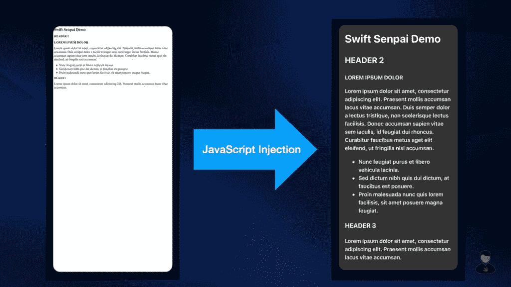
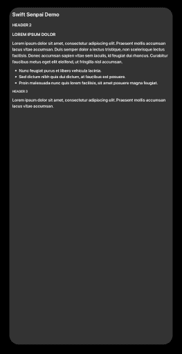

# 在 iOS 网络视图中注入 JavaScript

> 原文：<https://betterprogramming.pub/injecting-javascript-in-ios-webviews-7bc664668bd2>

## WKWebView 的一个鲜为人知但超级强大的功能


来源:[未绘制](https://undraw.co/search)

使用 web 视图显示一些频繁更新的内容，如 FAQ，这是大多数 iOS 开发人员非常常用的策略。通过这样做，开发人员可以轻松更新 web 视图内容，而无需经过 App Store 审核流程。另一方面，用户将能够在不离开应用程序的情况下查看在线内容。

使用这种策略时，我们可能会遇到一些非常常见的问题，如 web 视图内容的样式与应用程序的设计不匹配，或者内容在移动设备中不能正确缩放。

在本文中，让我们通过使用一种叫做“ **JavaScript 注入**”的技术来解决这两个问题。下面是您将从本文中学到的一些东西:



使用 JavaScript 注入在 web 视图中样式化 HTML

看着有意思？让我们开始吧！

# 为注入准备 CSS 和 JavaScript

对于这篇文章，我们将对我之前准备的这个 HTML 进行样式化。为了设计 HTML 的样式，我们必须首先创建定义我们想要的样式的 CSS。

假设你有一些基本的 CSS 知识，上面的代码是不言自明的。但是，我想提醒您注意`font-family`属性。请注意我是如何将其设置为`-apple-system`的，这样 web 视图将使用 iOS 系统字体呈现 HTML。

> **亲提示:**
> 
> 如果您的样式需要长而复杂的 CSS，建议从 CSS 文件中读取 CSS。

现在，让我们编写一些 JavaScript 来加载我们刚刚编写的 CSS。

请注意，在将 CSS 与 JavaScript 结合之前，将 CSS 放入一个单独的 liner 中是很重要的，否则注入将不起作用。

# JavaScript 注入

这就是奇迹发生的地方！我们将使用`[WKUserScript](https://developer.apple.com/documentation/webkit/wkuserscript/1537750-init)`类将 JavaScript 注入到我们的 web 视图中。

如您所见，我们使用刚刚创建的 JavaScript 初始化了`WKUserScript`实例，并要求它在 HTML 文档完成加载后注入 JavaScript(使用`.atDocumentEnd`)。这非常重要，因为如果在此之前进行注入，JavaScript 将无法运行。

用户脚本就绪后，我们可以继续将用户脚本加载到 web 视图中，如下所示:

# 缩放 HTML 内容

现在，如果我们继续加载我之前准备的 HTML，

我们会看到这样的情况:



发生这种情况的原因是我们的 HTML 缺少了`<meta>`标签。因此，web 视图不知道如何正确缩放 HTML。这个问题的解决方案非常简单，我们所需要做的就是在 HTML 前添加下面的`<meta>` [视窗](https://www.w3schools.com/css/css_rwd_viewport.asp)元素。

```
<meta name=\"viewport\" content=\"user-scalable=no, width=device-width\">
```

记住这一点，我们现在可以像这样更新示例代码:

就是这样！如果您尝试执行示例代码，您应该能够看到 HTML 在 web 视图中被很好地呈现。

你可以在这里获得完整的示例代码[并尝试一下。](https://gist.github.com/LeeKahSeng/d4fc890871e13627ccc511d2b227adef)

# 包扎

对 HTML 进行样式化只是 JavaScript 注入的用例之一。你还能想到其他什么用例？请在 [Twitter](https://twitter.com/Lee_Kah_Seng) 上与我分享你的想法，我真的很想听到你的声音！

感谢阅读。