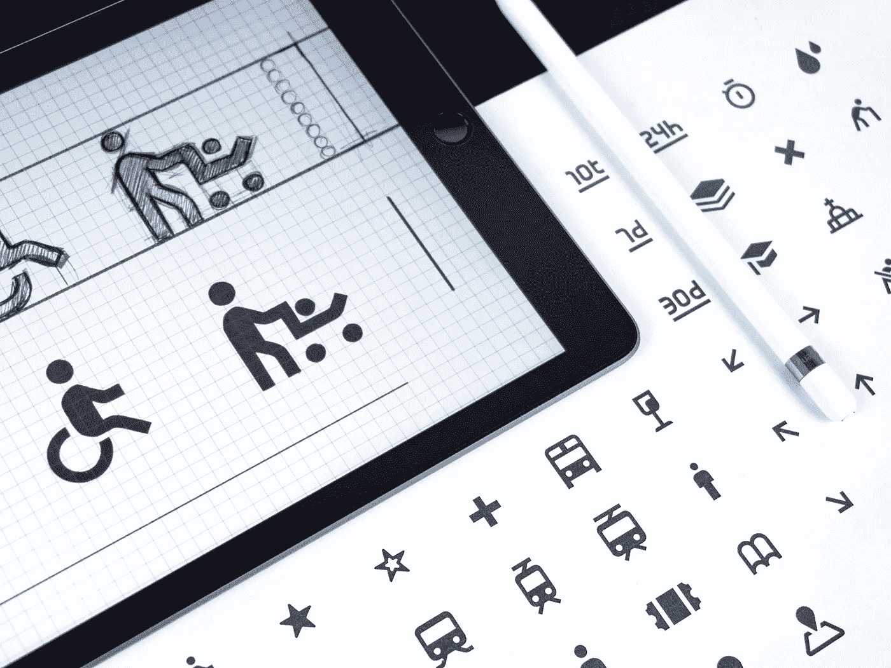

# 内嵌 SVG 或图标字体:使用哪一种

> 原文：<https://betterprogramming.pub/inline-svg-or-icon-fonts-which-one-to-use-77c0daf1c527>

## 像脸书、Github 和 Trivago 这样的公司转而使用内嵌 SVG 图标。这是否意味着你也应该使用它们？

照片由 [Balázs Kétyi](https://unsplash.com/@balazsketyi?utm_source=unsplash&utm_medium=referral&utm_content=creditCopyText) 在 [Unsplash](https://unsplash.com/s/photos/icons?utm_source=unsplash&utm_medium=referral&utm_content=creditCopyText) 上拍摄

你开始使用新的应用程序了吗？建立一个图标系统？或者考虑从图标字体切换到内嵌 SVG 图标？这本指南是给你的。

让我们比较一下，看看您是否应该使用，基于:

*   [易用性](#c4df)
*   [尺寸](#a2a6)
*   [CSS 控制](#b912)
*   [性能](#604c)
*   [易读性](#c691)
*   [多色支持](#88f6)
*   [动画](#0387)
*   [无障碍](#c721)
*   [浏览器支持](#2438)

# 易用性

有很多免费和付费的库可以使用，比如[材质设计图标](https://material.io/resources/icons/)、[字体牛逼](https://fontawesome.com/)、[线条图标](https://lineicons.com/)，还有更多提供数千种图标字体，方便安装和使用。将图标字体 CDN 链接添加到 HTML 文件中，并将`@font-face`添加到 CSS 文件中。你可以走了！

使用 inline SVG，您可以直接在 DOM 中添加图标 SVG 代码，它会根据您设置的`viewBox`大小自动呈现。在 React 中，每个图标都可以导出为一个组件，这使得它们(有效地)成为 JavaScript 中具有很多灵活性的道具。

但是我从哪里得到 SVG 图标呢？大多数图标库都提供了 SVG 图标(包括我上面提到的那些),你可以使用。或者，您可以要求您的设计团队提供 SVG 图标，或者您可以使用 [Icomoon](https://icomoon.io/app/) 、 [Fontello](http://fontello.com/) 将现有图标字体转换为 SVG 字体。

**赢家:**对于开发者来说，图标字体更容易使用(如果你不介意库中未使用的图标的话)，因为与内联 SVG 相比，它的设置和使用非常快。

# 大小

许多图标字体库都提供 cdn，或者你可以把它们放在你的服务器上，为图标字体设置缓存，这对以后的重新加载很有帮助。在大多数情况下，您最终只会使用库中的一小部分图标，但仍会加载整个库(Google 的 Material Icons 库只下载使用过的图标块，减少了网络请求大小)。

你可以要求你的设计团队只为应用程序中使用的图标创建一个图标字体，这样可以大大减小字体的大小。

如果你有一个很长的包含图标的列表，导致一个很大的 DOM 树，那么内联 SVG 会给你的应用增加很多权重。你失去了内嵌 SVG 缓存图标的优势；但是，您可以选择缓存整个页面或应用程序。

**赢家:**当你有成百上千的图标要处理，并且不想增加你的 DOM 树大小时，图标字体更好。

# CSS 控件

用 CSS 设置图标字体的样式与你在 CSS 中处理文本的方式非常相似。只需更改`font-size`属性，就可以像控制文本一样控制图标的大小。然而，对于一些库，你可能需要处理`line-height`和`vertical-align`来精确定位。

另一方面，内联 SVG 将拥有图标字体的所有 CSS 功能，以及 SVG 特有的属性，如`fill`和`stroke`。如果你有一个多部分的图标，那么你可以为不同的部分设置不同的颜色。此外，您可以使用内联 SVG 制作动画图标。

**赢家:**在 CSS 样式、定位和图标字体动画方面，内联 SVG 是明显的赢家。

# 表演

图标字体可以缓存；浏览器无法缓存内联 SVG。然而，图标字体的缺点是需要一个额外的 HTTP 请求。

用户面临图标字体闪烁的问题，因为他们在其他内容之后加载。内联 SVG 和你的 DOM 一起渲染，不会出现闪烁的图标。在 React 中，内联 SVG 实际上变成了 Javascript，然后可以捆绑在一起交付，实现一次渲染。然而，对于使用内联 SVG 的大型图标集，由于 DOM 开销和 SVG 绘制性能，会出现性能下降。

如果你想在载入内容的同时载入图标并避免闪烁，那么内嵌 SVG 可能是一个更好的选择。但是如果你有很长的带有图标的列表，并且没有机会将它们作为外部 SVG 文件加载，图标字体可能是一个更好的选择。

**赢家:**各有利弊；这完全取决于什么最适合你。

# 易辨认

图标字体和内嵌 SVG 都是矢量，这意味着它们可以很好地放大和缩小而不会损失质量。但是，对于图标字体，浏览器将其视为文本，因此图标是抗锯齿的。对于内嵌 SVG，它们是即使在小尺寸下也没有抗锯齿问题的矢量，并且它们在 retina 显示屏上看起来更清晰。

**赢家:**如果你不介意图标字体被反锯齿，图标字体是正确的选择。但是如果你真的希望图标清晰，SVG 图标是一个更好的选择。

# 多色支持

图标字体支持单色，就像您更改文本颜色一样。但是，如果您有一个不同颜色的现代多部分图标集，那么 inline SVG 是一个不错的选择。

**获胜者:**这是根据你的应用设计做出的选择。

# 动画片

图标字体基本上就像文本一样，所以你可以用文本做各种动画，淡入淡出，旋转，缩放，倾斜等等。但是如果你想对图标的单个部分的动画有更精细的控制，内嵌 SVG 是显而易见的选择。您可以使用创建动画您的图标 [SVGGator](https://www.svgator.com/) 或任何 SVG 动画库。

这里有一个关于纯 SVG 动画的指南。

**赢家:**谈到动画图标，内联 SVG 显然是赢家。

# 易接近

SVG 在可访问性方面比图标字体更有优势。SVG 支持像`<title>`、`<desc>`和`<aria-labelledby>`这样的内置元素，使它更容易被浏览器和屏幕阅读器访问。然而，你也可以让你的图标字体具有可访问性；下面是如何设置的指南。

[如何让图标字体无障碍](https://www.filamentgroup.com/lab/bulletproof_icon_fonts)。

[如何使内嵌 SVG 图标可访问](http://blog.paciellogroup.com/2013/12/using-aria-enhance-svg-accessibility/)。

**赢家:**就可访问性而言，SVG 是明显的赢家，但是你也可以将你的图标字体设置成可访问的。

# 浏览器支持

如果你必须支持 IE 6–8 或 Android v2.3 或更低版本，那么图标字体是你显而易见的选择。另一方面，所有现代浏览器都支持 SVG，但是在 IE 9–11 和 Edge 浏览器中缩放 SVG 可能会遇到一些问题。如果您仍然想使用 SVG，您可以使用回退或聚合填充来支持旧的浏览器。

赢家:在支持方面，图标字体是赢家，因为它们支持跨浏览器、桌面和移动设备。

# 还是不确定用哪个？

[https://gph.is/1XB0vfX](https://gph.is/1XB0vfX)

## 在以下情况下使用图标字体:

*   您不想经历设置内嵌 SVG 图标系统的麻烦。
*   您肯定需要缓存字体，并且没有缓存页面的选择。
*   你在一个页面上渲染了数千个图标，性能对你来说是至关重要的。
*   您需要支持旧的浏览器，而没有构建后备和使用聚合填充的麻烦。

## 在以下情况下使用内嵌 SVG 图标:

*   你不会在一个页面上呈现成千上万个图标。
*   您不介意向文件中添加额外的代码，并准备缓存页面(或者根本不缓存)。
*   你需要绝对控制多部分图标的不同部分的调整和动画。
*   你真的需要在普通显示器和视网膜显示器上清晰的图标。
*   你有多种颜色的图标，需要根据你的主题将它们平滑地转换成不同的颜色。
*   您必须为您的用户提供辅助功能支持。

我已经涵盖了重要的和相关的因素进行比较，但如果你有我错过的东西，请在评论中告诉我。