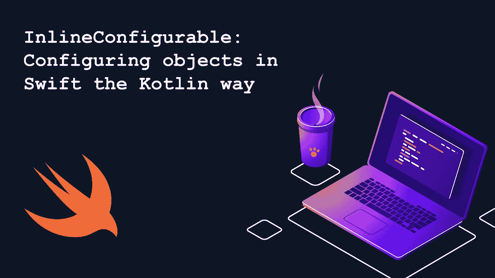

# InlineConfigurable:以 Kotlin 方式在 Swift 中配置对象

> 原文：<https://betterprogramming.pub/inlineconfigurable-configuring-objects-in-swift-the-kotlin-way-e26cc0a1e0d8>

## 通向更具可读性的 Swift 代码之路



# 背景

作为一名 Android 和 iOS 开发者，我总是比较这两个平台及其特性。两者都有各自的优点和缺点，这使得发展如此令人兴奋。

我经常发现自己想知道为什么一些很酷的特性在一种语言中实现了，而在另一种语言中却没有。所以在这篇短文中，我们将讨论 Kotlin 中名为`apply`的内联函数，我们将在 Swift 中实现该函数。它帮助您在一个块中配置一个对象。您将看到它如何使您的代码更易于阅读。

# 问题

你可能会想，“为什么我们需要斯威夫特的科特林的任何东西？”然而，我很有信心，你们大多数人在配置`UITableView`时都遇到过这种混乱的`viewDidLoad()` 方法:

```
tableView.delegate = **self** tableView.dataSource = **self** tableView.tableFooterView = UIView()
tableView.addSubview(refreshControl)
tableView.separatorStyle = .none
tableView.register(// register cell)
tableView.register(// register cell)
```

大多数人会认为这很正常，这段代码没有任何问题。当然，我是站在你这边的——这没什么不对。但是我内心的 Android 开发者想减少`tableView` 变量的重复，把所有东西都放在一个块里面。让我们看看:

```
tableView.apply {
    $0.delegate = **self** $0.dataSource = **self** $0.tableFooterView = UIView()
    $0.addSubview(refreshControl)
    $0.separatorStyle = .none
    $0.register(// register cell)
    $0.register(// register cell)
}
```

这看起来更干净，更容易阅读，不是吗？如果你不想阅读这个实现背后的理论，你可以跳过下一章直接进入实现。

# **内嵌函数**

函数式编程的好处之一是能够将一个函数作为参数传递给另一个函数。在斯威夫特。我们称之为`closure`，在科特林，它被称为`lambdas`。两个人都有各自的问题。

```
//Kotlin
sampleCollection.filter { it == 1 }//Swift
sampleCollection.filter { $0 == 1 }
```

在 Swift 中，您会遇到的最常见的闭包问题是当您没有正确使用它们时发生的保留循环。为了解决这个问题，我们在闭包中使用了`strong`、`weak`和`unowned` 引用。

在 Kotlin 中，这有点复杂，因为它仍然与 Java 紧密相连。你可以在这里阅读关于高阶函数(lambdas)的一般[。我只讨论存在的一些问题。](https://www.baeldung.com/kotlin-inline-functions)

第一个问题是函数调用开销。如果我们使用上面显示的`filter`函数，为了实际执行 Kotlin lambda 中封装的操作，需要在实例上额外调用一个名为`invoke`的特殊方法。由于额外的调用，结果是更多的开销。

另一个问题是内存开销。我不想深入探讨，但是大多数时候，JVM 在每次调用时都会创建一个函数类型的实例。换句话说，每次我们声明一个 lambda，就会创建一个`Function*`类型的特殊对象来封装 lambda 中的代码——从而产生内存开销。

Kotlin 中的关键字`inline` 可以解决这两个问题，它声明了一个内联函数。使用内联函数时，编译器内联函数体。也就是说，它将主体直接替换到函数被调用的地方。

```
val numbers = listOf(1, 2, 3, 4, 5)
numbers.each { println(it) }
```

上述内容被替换为以下内容:

```
val numbers = listOf(1, 2, 3, 4, 5)
for (number in numbers) {
    println(number)
}
```

当使用内联函数时，没有额外的对象分配，也没有额外的虚方法调用，因为我们不是处理 lambda，而是将 lambda 中的代码提取到相应的位置。

你可能会说，“不，我不需要这种内嵌的东西，因为它不在 Swift 中。”令人惊讶的是，Swift 中也存在内联函数；然而，`@inline`关键字是被禁止的。它做的事情与 Kotlin 中的一样——它用函数的内容替换函数调用，从而减少额外的函数调用开销。阅读[这篇文章](https://swiftrocks.com/the-forbidden-inline-attribute-in-swift.html)了解更多信息。

事实证明，在 Swift 中还有另一种处理行内函数的方式。我们可以称之为函数内部的函数或*嵌套函数。*让我们来看看这个例子。

```
**class** SomeViewController: UIViewController { **override** **func** viewDidLoad() {
        **super**.viewDidLoad()

        func initHeader() {
            //...
        } func initContent() {
            //...
        } func initFooter() {
            //...
        } initHeader()
        initContent()
        initFooter()
    }
}
```

你可以在这里找到关于这种方法[的更多信息。](https://medium.com/@GalvinLi/tinyexperience-when-to-use-inline-function-1c88de4b7ea5)

# **在 Swift 中实施**

Kotlin 中有许多内联扩展函数，但是今天我们只实现一个叫做`apply` 的函数，它可以帮助你在一个块中配置对象(closure/lambda)。

在 Kotlin 中，`apply`是一个特定类型的扩展函数，它将自己的作用域设置为调用它的对象。`apply`对表达式中的对象引用运行，并在完成时返回对象引用。当然，它不仅用于设置属性，还能够在返回之前评估复杂的逻辑。最后，它返回同一个对象，只是做了一些修改。这是它在科特林的样子:

```
inline fun T.apply(block: T.() -> Unit): T {
    block()
    return this
}
```

现在让我们在 Swift 中实现它。这很简单:

迄今为止我们所做的:

*   我们声明了`InlineConfigurable` 协议，然后由`NSObject` **实现。为了能够使用它，其他类实际上也可以实现这个协议。**
*   我们编写了一个名为`apply` 的扩展函数，并使用了一个名为`configurator`的闭包。这个闭包可以有任何类型的逻辑。
*   我们在这个对象引用上执行了这个逻辑
*   我们归还了物品

现在，您可以随时随地轻松使用名为`apply` 的功能。例如，你可以在一个程序块内配置你的`UIView` :

```
containerView.apply {
    $0.layer.borderColor = ColorConstants.borderBackground.cgColor
    $0.layer.borderWidth = 1
    $0.layer.cornerRadius = NumberConstants.cornerRadius
    $0.layer.masksToBounds = **true** }
```

任何类型都可以实现该协议，以便从`apply`功能中获益。然而，我发现通过`NSObject`实现在大多数情况下是足够的，因为它帮助你处理`UIView`实例，并且这种重复的变量调用行为通常与`UIView` **相关联。**

# **总结**

一般来说，内联函数在效率和性能方面非常出色。

然而，正如我们之前讨论的，它们在 Swift 中是被禁止的(也许只是现在)。尽管本文中在 Swift 中实现的`apply` 函数并不是真正的内联函数，但它通过减少源文件中的噪音和使代码更具可读性而大有帮助。