# 我们如何度量软件的模块性和依赖性？

> 原文：<https://betterprogramming.pub/inside-software-modularity-and-related-metrics-2e5af2b447dc>

## 什么是模块化，有哪些度量标准可以用来衡量模块化？

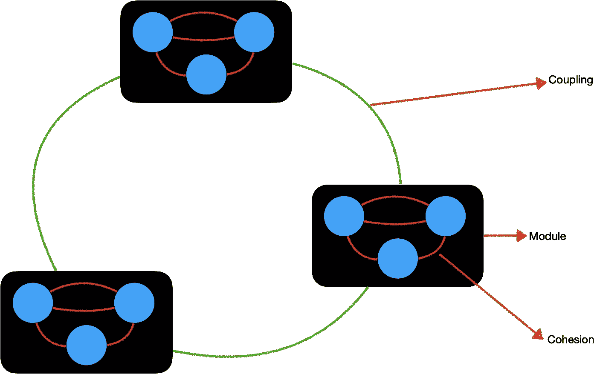

依赖外部或外部耦合。图片由作者提供。

# 介绍

在本文中，我将讨论模块化:什么是模块化？为什么重要？我们如何衡量模块化？

模块化包括将一个系统分成单独和独立的部分，称为*组*或*模块。*

模块化应用。图片由 [Kieran Wood](https://unsplash.com/@kieran_wood) 在 [Unsplash](https://unsplash.com/photos/UOk1ghQ7juY) 上拍摄。

*   我们可以将一个应用程序分成独立的技术层:业务层、持久层、UI 层和数据库层
*   我们可以将一个应用程序分成独立的功能层:用户、支付、订单等。
*   我们可以将相关的方法分组到一个类中(`Car:` `move`、`accelerate`、`park`、`setPreferences`等等)。)

## **模块化对重用和可维护性有直接影响**

良好的模块组织和划分增加了清晰性和可维护性。

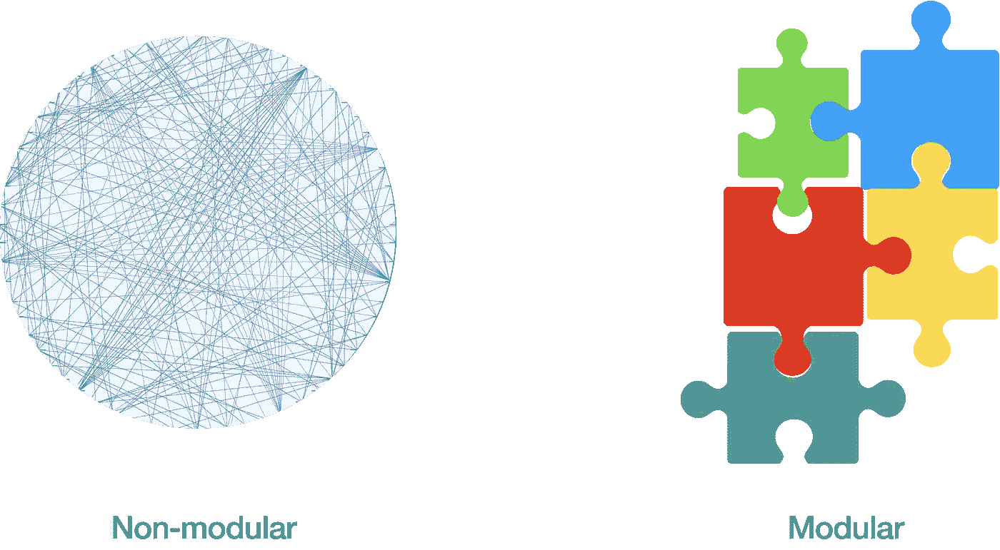

非模块化与模块化。图片由作者提供。

同一组内的元素之间的关系是根据共同的功能属性(认证、支付、交付等)定义的。)或技术(业务、服务、持久性、UI 等。).

这个定义让我们想起了一个数学理论，它已经处理了组、它们的元素、它们的关系以及它们的运算:[集合论](https://en.wikipedia.org/wiki/Set_theory#Basic_concepts_and_notation)。

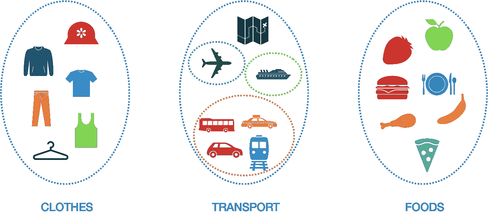

集合内部耦合强，外部依赖弱。图片由作者提供。

为了解释模块化，我将参考一些 set 原则。我不是从微观的角度(例如，作为数据结构的集合)而是从宏观的角度来做这件事。

然后，因为模块化是一个数学概念，我们可以测量它:一个架构的模块化程度如何？这些模块有多独立？模块内部的元素有多紧密？

我们开始吧！

# 模块化:数学方面(集合)

一个*集合*是共享一个公共属性的元素的集合，并根据这个公共属性聚集在一起。

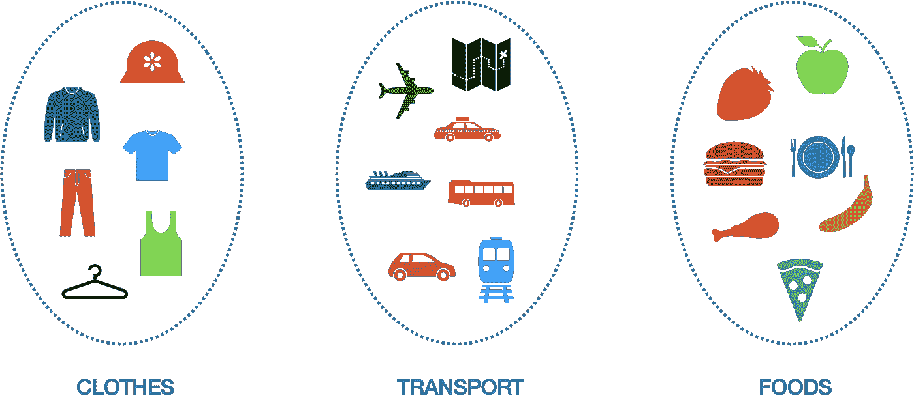

不同的元素集合。图片由作者提供。

在每个集合中，元素之间有很强的联系，而与其他集合中的元素的联系相对较弱。

其他已知类型的器械包:

*   `∅`表示空集
*   `Z`表示整数集合
*   `R`表示实数集合
*   `N`表示自然数的集合

> 在数学中，集合是明确定义的不同元素或成员的集合。构成集合的元素可以是任何东西:人、字母表中的字母或数学对象，如数字、空间中的点、线或其他几何形状、代数常数和变量或其他集合
> 
> ——贾恩·艾哈迈德通过维基百科

*   *定义明确的*意味着对于任何元素，问题“这个元素属于集合吗？”有一个明确的是或不是的答案
*   不同的元素意味着集合中的元素不会被计算两次

> 在计算机科学中，关注点分离(SoC)是一种将计算机程序分成不同部分的设计原则，每个部分处理一个单独的关注点— [维基百科](https://en.wikipedia.org/wiki/Separation_of_concerns)
> 
> “DRY 原则被表述为‘每个知识都必须在一个系统中有一个单一的、明确的、权威的表示。’”——[维基百科](https://en.wikipedia.org/wiki/Don%27t_repeat_yourself)
> 
> “单一责任原则(SRP)规定每个软件模块应该有且只有一个变更的理由。”罗伯特·马丁

一个*软件模块*仅仅是一组具有某种共同属性的部分或层的集合(一个*关注点*)。公共属性可以是功能性的(认证、支付、交付等)。)或技术(业务、服务、持久性、UI 等。).

在面向对象编程中，*类*是一组转换成员变量的成员方法。

集合在结构上彼此独立，但它们可以组合在一起形成其他集合。

例如，我们可以将我们的`Clothes`集合、`Transport`集合和`Foods`集合组合成一个独特的上下文/集合，称为`Human needs`。

*   人类需要穿衣服
*   人们需要一种交通工具去工作、拜访家人、旅行等。
*   人类需要食物才能生存

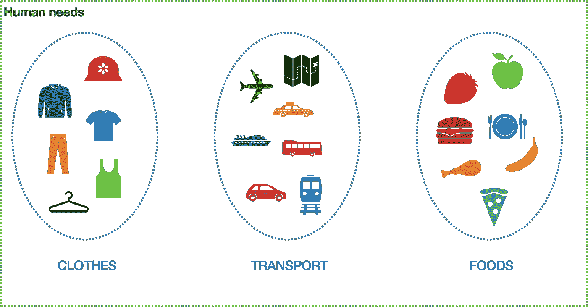

全球环境—应用程序。图片由作者提供。

我们可以将不同的独立模块组合成一个单一的全局环境:应用程序。

顺便说一下，`Human needs`是一个集合，`Clothes`、`Transport`和`Foods`现在是子集。

子集保持相同的集合属性。

我们还可以在子集内定义独立的子集:

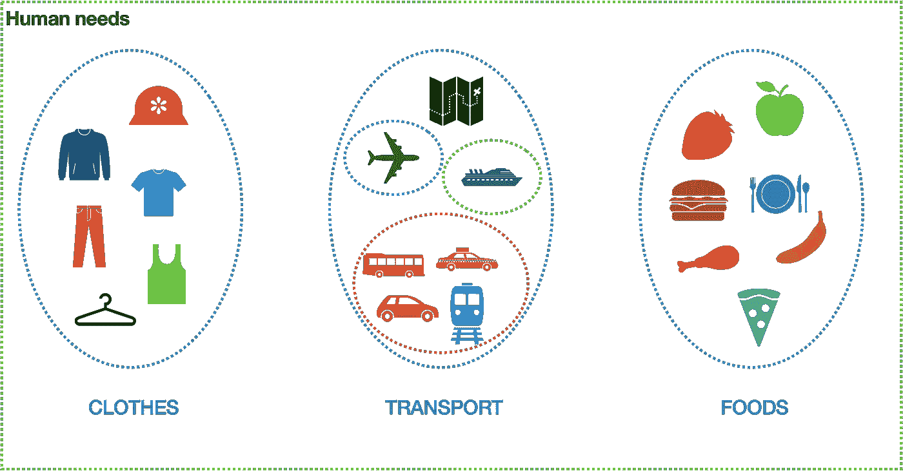

子集运输现在有了自己的子集:空运、陆运和海运。图片由作者提供。

当我们有一个复杂的全球背景时，我们可以把它分成小的独立的子背景。

> “一个复杂的系统可以通过把它分成更小的部分，并分别看待每一个来管理。”
> 
> **—** Carliss Y. Baldwin 和 Kim B. Clark 在《设计规则:模块化的力量》

## **集合或子集也可以有共享元素**

当我们乘坐飞机、轮船、火车或汽车旅行时，我们可以使用/带上地图:

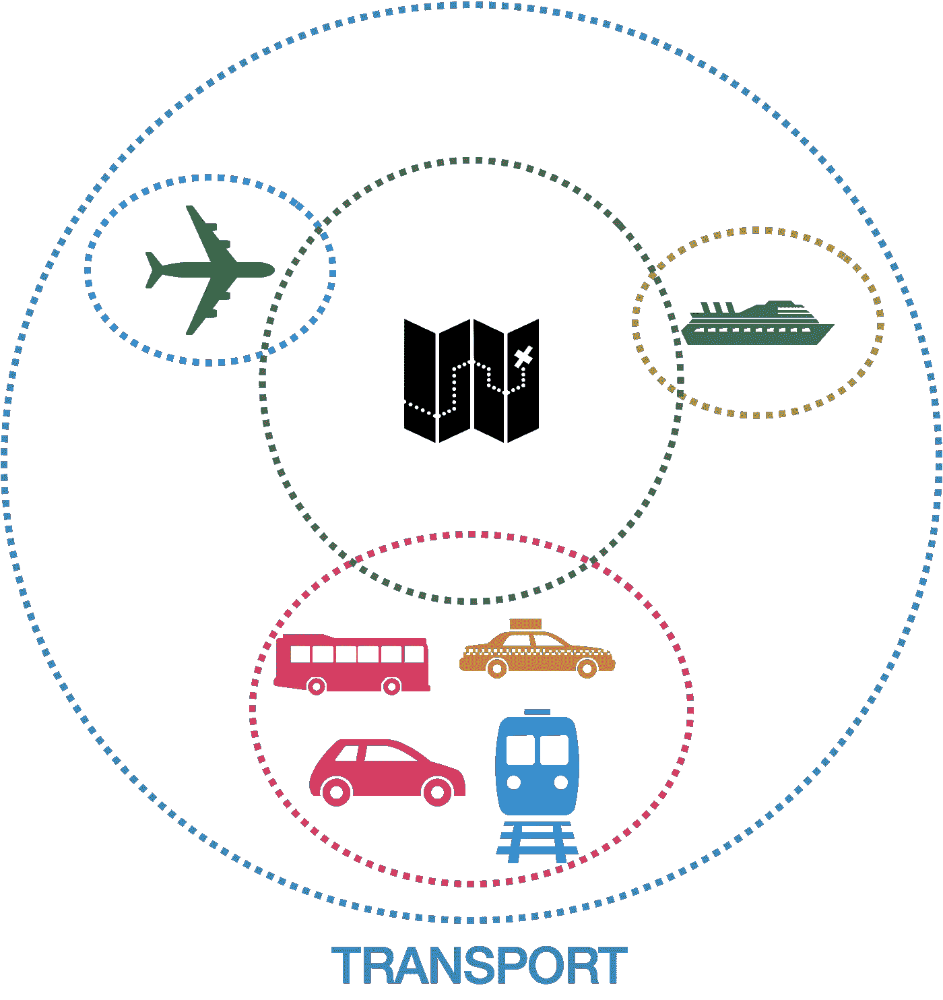

该映射在不同的传输子集之间共享。图片由作者提供。

不同子集的交集就是映射子集。

{1, 2} ∩ {2, 3} = {2}.
{1，2} ∩ {3，4} = ∅.

每个元素在一个集合中只能存在一次:

> “集合是我们的感知和思维的一个集合，集合成一个确定的、不同的对象的整体，这些对象被称为集合的元素。”
> 
> —集合论的创始人乔治·康托尔

当集合或子集之间有重复或公共元素时:

> **"也可以通过确定两个集合中哪些成员有共同的'【T13'来构造一个新的集合**——[维基百科](https://en.wikipedia.org/wiki/Set_(mathematics)#Intersections)

如果模块或类共享公共元素，我们创建一个公共的共享模块或类(干:不要重复自己)。

# 我们能从集合论中保留什么？

## 集合和元素

*   内部集合内聚性(元素根据一个公共标准被强有力地组合在一起)
*   默认情况下，集合中的元素是内聚的
*   集合中的每个元素只存在一次(DRY 和 SRP)
*   一个集合独立于其他集合(松散外部耦合，SoC)
*   分解(子集)
*   集合或子集之间公共元素的新集合(干)

## 软件模块化是一个**数学方面**

*   模块是一组部分或层
*   类是一组成员方法

# 集合论在软件中的应用实例:分层体系结构

在分层架构中，共同的属性是技术角色。我们根据它们的技术角色对文件、类或代码进行分组:表示、业务、持久性和数据库。

## 我们有四套

*   演示文稿集:{HTML，CSS}
*   业务集:{UI 逻辑适配器，接口}
*   持久性集= {ORM}
*   数据库集= {表，SQL 查询}

每个集合还可以分成子集。

# 集合论在软件中应用的例子 ***: SOA 架构***

在 SOA 架构中，我们根据它们的功能角色对文件、类或代码进行分组:书籍、订单、帐户、用户等。

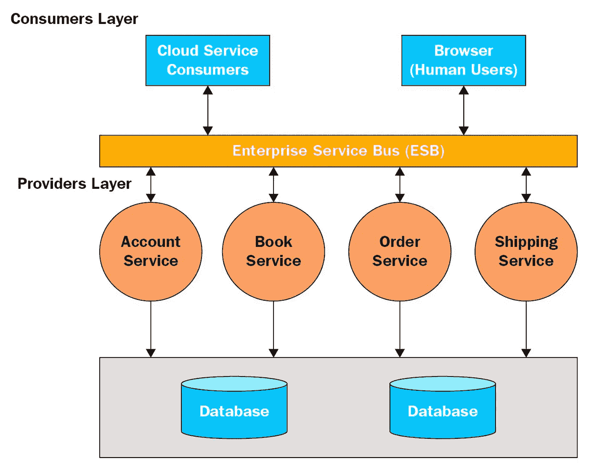

[通过 Dinesh Rajput 的“动手微服务—监控和测试”](https://subscription.packtpub.com/book/application_development/9781789133608/1/ch01lvl1sec12/service-oriented-architecture-soa)

# 如何衡量模块化

因为模块化是一个数学概念，我们可以测量:

*   内部群体凝聚力

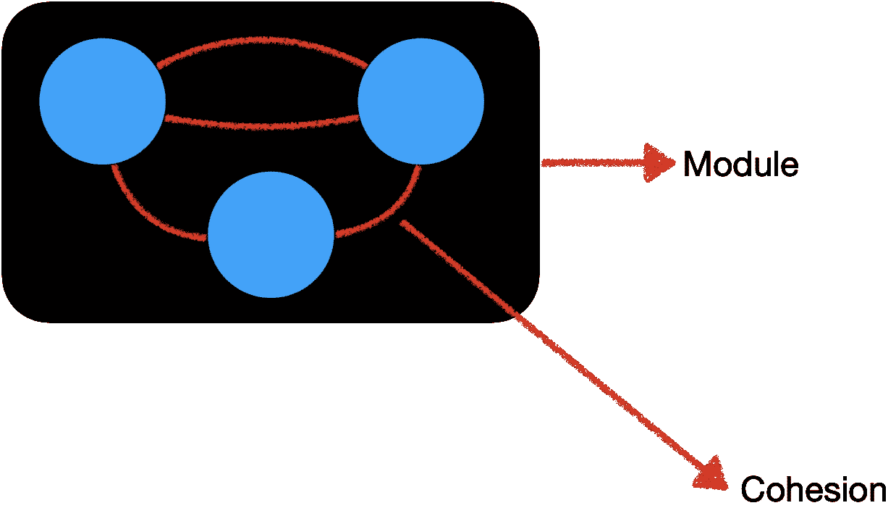

内部凝聚力。图片由作者提供。

*   软件模块之间的相互依赖程度或耦合程度

对外部或外部耦合的依赖性。图片由作者提供。

# 内聚力

## **定义**

> "在计算机编程中，内聚性指的是一个模块中的元素属于一起的程度."
> 
> ——爱德华·尤顿和拉里·l·康斯坦在《结构化设计:计算机程序和系统设计学科的基础》中

## **类型**

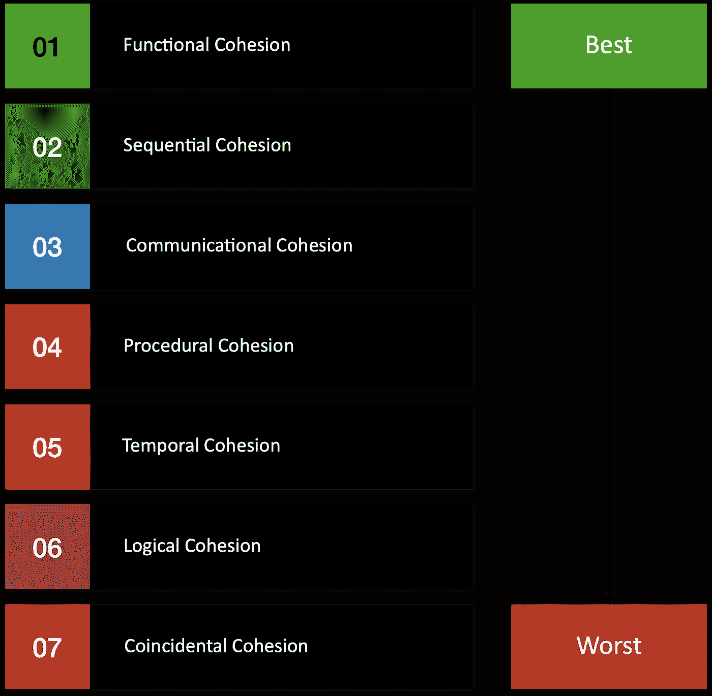

[衔接类型](https://en.wikipedia.org/wiki/Cohesion_(computer_science)#Types_of_cohesion)。图片由作者提供。

*功能内聚*是模块的各个部分被分组，因为它们都有助于模块的一个明确定义的任务。

*顺序内聚* 是指模块的各个部分被分组，因为一个部分的输出是另一个部分的输入(例如，从文件中读取数据并处理数据的函数)。

## **测量凝聚力**

以下集合中的元素没有内聚性:元素被任意分组；各部分之间的唯一关系是它们被组合在一起(巧合的内聚)。

非粘性基团。图片由作者提供。

当一个集合中的元素不共享任何公共属性时，该集合就失去了其*明确定义的*特征，并且我们无法确保*明确的*标准，因为在该集合中没有定义归属的属性。

内聚子集。图片由作者提供。

集合中的元素必须是内聚的；否则，我们将不得不继续分解，直到我们有内聚的子集。

## **阶级凝聚力(******)****

****例如:****

**考虑一个有三种方法的类`C`:`M1`、`M2`和`M3`。**

**设`{Ij}` =方法`Mi`使用的实例变量集**

**让`{I1}` = `{a,b,c,d,e}`和`{I2}` = `{a,b,e}`和`{I3}` = `{x,y,z}`**

*   **`{I1} ∩ {I2}`非空**
*   **`{I1} ∩ {I3}`和`{I2} ∩ {I3}`是空集**

**LCOM =空交叉点的数量-非空交叉点的数量。**

**在我们的例子中，LCOM = `2-1` = `1`。**

****通用公式:****

**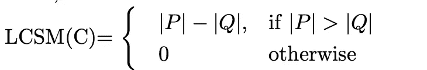**

**凝聚力通用公式**

> *****"P = {(Ii，Ij) | Ii ∩ Ij = φ}*** *和* ***Q = {(Ii，Ij) | Ii ∩ Ij ≠ φ}*****
> 
> **取类中的每一对方法。如果它们访问不相交的实例变量集，则将 P 增加 1。如果它们共享至少一个变量访问，则 Q 增加 1。**
> 
> **LCOM 是相似度为零的方法对的计数。**
> 
> **LCOM = 0 表示一个内聚类。**
> 
> **LCOM > 0 表示该类需要或可以分成两个或更多个类，因为它的变量属于不相交的集合。"**
> 
> **— [奇丹博和凯梅勒](https://www.aivosto.com/project/help/pm-oo-cohesion.html)**

****

**缺乏内聚力——分裂成子类。图片由作者提供。**

# **连接**

## ****定义****

> **“在软件工程中，耦合是软件模块之间相互依赖的程度；衡量两个例程或模块的紧密程度— [维基百科](https://en.wikipedia.org/wiki/Coupling_(computer_programming))**

## ****类型****

****

**[联轴器](https://en.wikipedia.org/wiki/Coupling_(computer_programming)#Types_of_coupling)类型。图片由作者提供。**

**低耦合通常是结构良好的计算机系统和良好设计的标志，当与高内聚结合时，它是高可读性和可维护性的标志。**

## ****测量联轴器****

****传出耦合(** `**CE**` **)****

**`CE`测量包内依赖于包外类的类的总数。**

****

**传出耦合示例。图片由作者提供。**

**在上面的例子中，`Module A`对其他三个类有输出依赖。**

**指标`CE>20`的高值表示包的不稳定性——众多外部类中的任何一个发生变化都会导致需要对包进行更改。指标`CE`的优选值在 0 到 20 的范围内——较高的值会给代码的维护和开发带来问题。**

****传入耦合(** `**CA**` **)****

**`CA`测量依赖于包内类的包外类的总数。**

****

**传入耦合示例。图片由作者提供。**

**在上面的例子中，`Module A`有两个传入的依赖项。**

**`CA`指标与便携性高度相关。具有更高`CA`的包是坏包，因为它们更难被替换，因为它们有许多其他依赖它们的包。度量`CA`的优选值在 0 到 500 的范围内。**

****不稳定****

**此指标衡量包的不稳定性，其中*稳定性*通过计算在不影响应用程序中其他包的情况下更改包的工作量来衡量。**

**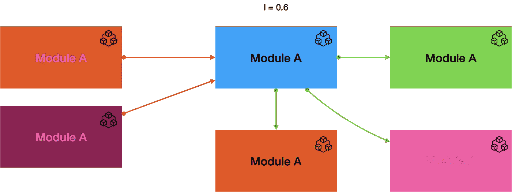**

**模块不稳定。图片由作者提供。**

**`Instability I = CE / (CE + CA)`**

> **"此度量产生范围[0，1]内的结果。值 I=0 表示不依赖于任何东西的最大稳定包，I=1 表示不具有输入依赖性但依赖于其他包的完全不稳定包。因此，不稳定性会对可重用性、可维护性和可移植性产生负面影响。”**
> 
> **— [Gurpreet Kaur 和 Deepak Sharma 在“使用模糊逻辑研究 Robert C.Martin 的数据包分类指标”](https://pdfs.semanticscholar.org/18ce/e8682c75f8ed069891f67731d159d3b8c5ff.pdf)**

# **结论**

**在本文中，我们讨论了什么是模块化，为什么它很重要，以及我们可以测量它。**

**内聚性是衡量软件设计在 SRP 和 SoC 原则方面有多好的一个标准:如果一个模块或一个类中的元素没有内聚性，这表示多重责任和过度责任。在这种情况下，它们应该被分开。**

**一段没有关注和责任分离的代码就像一个没有椅子、墙壁、门和窗户的房子:一切都是开放的。一切都一起改变(回归测试必须测试一切——相关和不相关的代码)。**

**当我们缺乏凝聚力、SRP 和 SoC 时，我们就缺乏模块化。(没有凝聚力、SRP 和 SoC，就没有边界或团体。然后也没有模块——只有一大块。**

**一个没有内聚性的类或模块就像一个无序的车库，在那里我们随机快速地扔出所有东西。很难找到东西。**

**凝聚力衡量的是一个群体内部各元素的关联程度——这就是为什么凝聚力必须很高的原因。**

**当内聚力较低时，这表明 SRP 和 SoC 原则已被破坏。**

**另一方面，群体对其环境的影响或群体与其环境之间的相互作用必须尽可能的弱——仅仅为了必要的需要。**

**与外部的强耦合对可维护性、重构和稳定性有很大的影响。对于一个类或模块的每一个小的变化或发展，我们应该验证每一个链接仍然工作。**

**当传出耦合(CE)、传入耦合(CA)和不稳定性很高时，这给出了关于设计有多弱以及每个改变和重构有多弱的想法。**

**我建议在软件设计和开发过程中使用这些度量标准，这样你就不会欠下一大笔债。**

# **进一步的信息**

** [## 软件架构基础:工程方法

### 诺特/5。软件架构基础:工程方法和数百万库存…

www.amazon.fr](https://www.amazon.fr/Fundamentals-Software-Architecture-Comprehensive-Characteristics/dp/1492043451)  [## 构建进化架构:支持不断的变化

### 诺特/5。建造进化的建筑:支持股票市场的持续变化和数百万里弗…

www.amazon.fr](https://www.amazon.fr/Building-Evolutionary-Architectures-Support-Constant/dp/1491986360)**