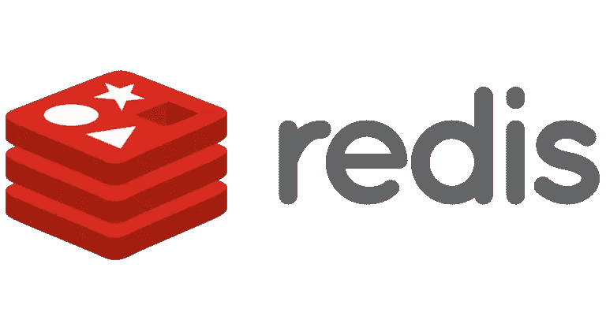
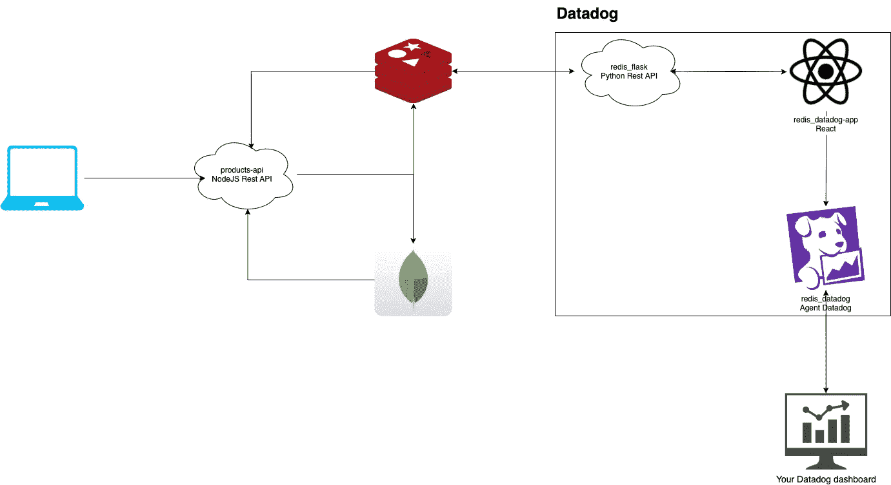
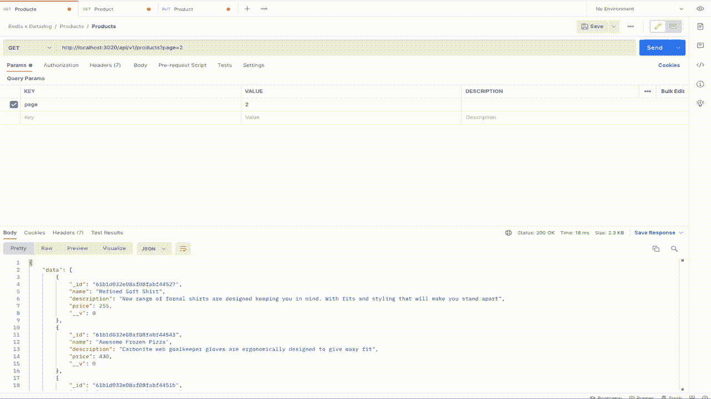
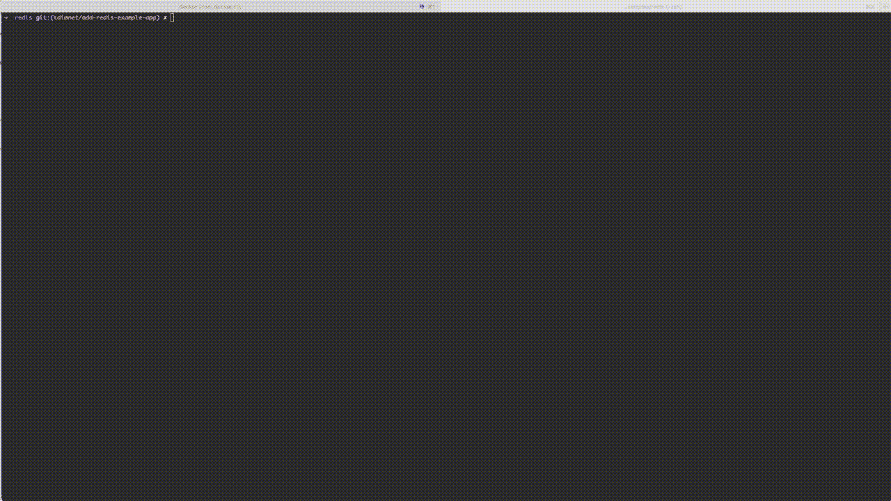
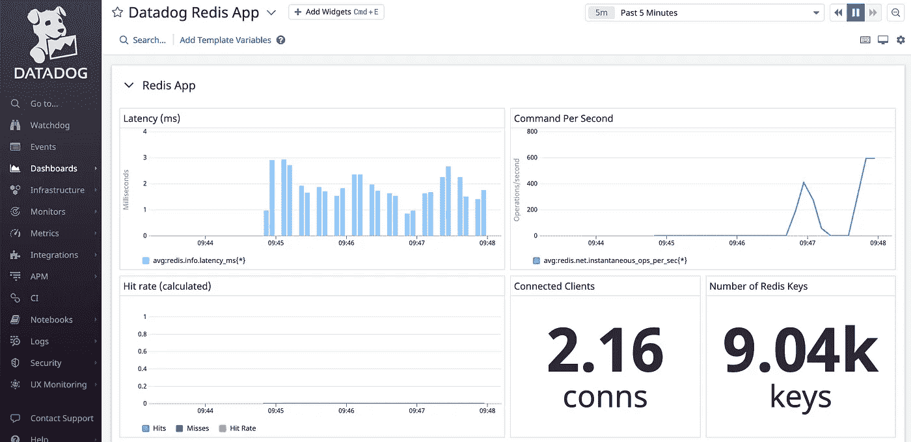
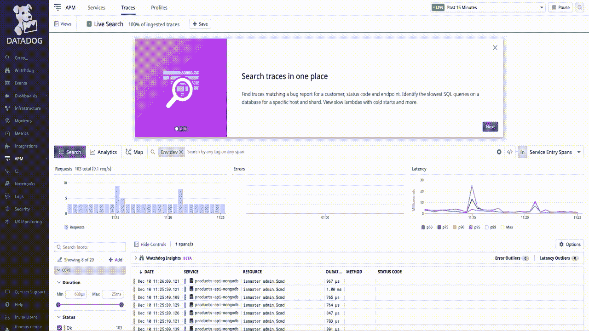
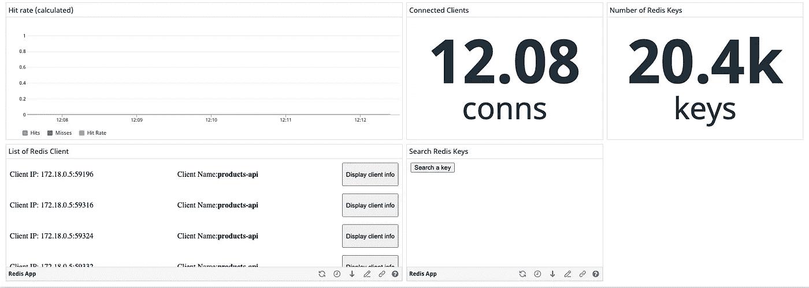
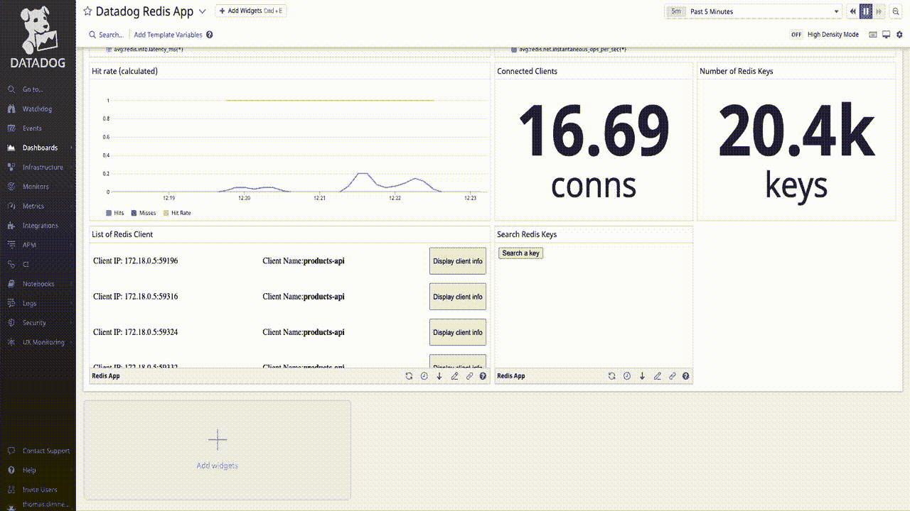

# 使用数据狗应用程序检查和删除 Redis 密钥

> 原文：<https://betterprogramming.pub/inspect-and-delete-redis-keys-with-a-datadog-app-6e623e2695a6>

## 与 Redis 交互的传统整体和微服务

作者图片

有一段时间，我在法国的一家小公司做开发。我们使用了很多不同的技术，例如我们使用 GraphQL 作为不同微服务的网关，RabbitMQ 作为代理，Elastic Search 作为搜索引擎，Redis 用于缓存数据。

我们使用 Redis 来缓存不同类型的数据:我们的旧系统，一个巨大的 Php 模块，缓存 HTML 块，我们的 GraphQL 缓存 SQL 结果，一些微服务缓存繁重计算的结果，就像你可能根据愿望清单喜欢的电影。问题是这些不同的服务有时有不一致的行为，尤其是我们的巨型独石。这意味着有时数据在一个服务中以某种方式写入，然后另一个服务以不同的方式重写。

我记得有一天我们重写了一个 cron 作业，用来计算 111 部最受欢迎的电影。一旦任务完成了它的工作，它会将结果写入 Redis 并添加一个一周的 TTL。但是每周，即使任务正在运行，缓存也不会更新，我们必须手动将其从 Redis 集群中删除。但有时我们会删除错误的键，不得不重新运行一个计算机繁重的脚本。这通常不是您想要做的，尤其是在高峰负载期间。

因此，当您遇到 Redis 的问题时，例如，当数据没有您想要的格式时，或者当 Redis 中的数据与数据库中的数据之间存在差异时，大多数情况下，您可以执行以下操作:

*   连接到您的 VPN 以便能够访问您的服务器；
*   打开您的终端并连接到正确的服务器。如果您使用的是集群 Redis 或 Redis sentinel，您必须小心谨慎；
*   找到钥匙并获取相关信息。你会看到像数据本身、TTL、哪个工人写的这样的信息；
*   最后，采取行动，例如删除键。

问题是它很容易出错。例如，您可能会在错误的服务器上删除数据并导致一些问题，尤其是在您使用 Redis Sentinel 的情况下，或者您可能会删除错误的 Redis 键并导致一些性能问题。对我来说，直接在 Redis 服务器上删除数据就像直接在关系数据库中删除数据一样:你不知道会造成什么样的混乱。

# 一个没有正确更新 Redis 的错误项目

在这篇文章中，我们将使用一个真实的场景:你可以在[这个 Github 库](https://github.com/DataDog/apps)中找到项目的源代码。克隆完成后，导航到`examples/redis`文件夹，您将找到使其工作的所有安装步骤！唯一的先决条件是在您的计算机上安装 Docker 和一个带有 API 令牌和应用令牌的 Datadog 帐户。

该项目是一个返回产品的 REST API。每个产品都由名称、描述和价格组成。产品数据存储在 MongoDB 和 Redis 中。还记得您运行“docker-compose run products-API yarn run seed”吗？它将 10，000 个产品填充到 MongoDB 中，然后添加到 Redis 中。

这个项目由六个 Docker 容器组成:products-api、redis、mongo、flask、datadog-app 和 datadog 代理

您可以从`products-api`容器中执行不同的 HTTP 请求:

*   `GET /api/v1/products?page=1` -返回 10 种产品的列表。
*   `GET /api/v1/products/61aa2b45baa4ae952cd4034a` -返回 ID 为 61aa2b45baa4ae952cd4034a 的产品。
*   `POST api/v1/products` -创造新产品。
*   `PUT api/v1/products/61aa2b45baa4ae952cd4034a` -用 ID 61aa2b45baa4ae952cd4034a 更新项目

当您对特定产品发出 GET 请求时，它首先询问 Redis 并查看该数据是否存在。如果是，它将返回产品数据。如果没有，它向 MongoDB 请求，得到结果，添加到 Redis，然后将数据返回给您。

现在我们来看一个看跌请求。根据 HTTP 最佳实践，当您想要创建一个新资源时，比如我们示例中的一个产品，您将执行一个 POST 请求。但是，如果您想要更新一个现有的产品，您将执行一个 PUT 请求。因此，在这个场景中，我们将更新一个现有的产品。

首先，您需要找到要更新的产品。可以抢`GET /api/v1/products?page=1`的第一个产品。然后，如果您愿意，您可以使用`/api/v1/products/productId` request 检查它，并查看它的名称、描述和价格。最后，更新产品，例如，它的价格。

虽然我更新了产品价格(1000)，但是 API 仍然返回原来的价格。(250)

如果这样做，就会出现问题:您刚刚用一个 PUT 请求更新了数据，但是当您对同一产品发出 GET 请求时，数据仍然是旧版本。但是，如果您查看 MongoDB 数据库，您会发现数据发生了变化。

如果你看我刚刚更新的产品(61b1d032e08af08fabf44527)，你会看到数据库中的数据是正确的

所以这肯定是一个缓存问题，正如我在介绍中告诉您的，直接从 Redis 中删除数据不是一个好的做法。这就是 Datadog 应用程序派上用场的地方。首先，我们将查看 Datadog 上的数据，然后我们将查看 Datadog 应用程序如何帮助我们删除 Redis 密钥。

# 使用 Datadog 调查键、值更新

当我们调试像这样的情况时，我们经常使用像 Datadog 或 New Relic 这样的监控服务。我们可以将收集的数据(如日志或 Redis 密钥)发送到监控服务，而不必连接到每个服务器并检查服务。这就是我们在这里要做的！

如果你再看一下项目模式，你会发现我还没有提到三个容器:`redis_flask`、`redis_datadog-app`和`redis_datadog`。从最后一个开始吧！

`redis_datadog`是运行 Datadog 代理的容器。它收集不同的指标，如 CPU 或内存使用情况。在我们的例子中，它还收集 Redis 指标。例如，您可以收集连接的客户端数量或击键次数。为此，您需要启用 Redis 集成并添加定制标签。

例如，我通过添加以下行来收集 Redis 服务日志:

运行 docker-compose 构建时创建的仪表板

Datadog Redis 应用仪表板包含 Redis 数据:Redis 服务器延迟、每秒命令数、命中率，以及连接的客户端和 Redis 密钥的数量。

如果您想获得关于我们的查询的更多信息，我们可以使用跟踪到 APM 服务。它们在我们的项目中被启用，因为在`products-api`项目上安装并初始化了`dd-trace`依赖项，还因为在 docker-compose 文件的环境属性中引用了 Datadog 代理。

如果您想了解更多关于 APM 和跟踪的信息，请看一下 [APM 和连续分析器](https://docs.datadoghq.com/tracing/)。

通过过滤请求，可以在跟踪中找到 GET 请求

好的，使用 Datadog，我们可以通过查询我们的 productId 看到，我们没有错误，数据来自 Redis。问题是我们不能检查 Redis 键中的内容，也不能与它交互。正如我在本文开头提到的，这通常是我们需要行动并连接到 Redis 服务器的时候。

所以现在是时候看看最后两个容器和我还没有介绍的仪表板的最后一个元素了。我们先看看仪表盘。

# 在 Datadog 应用程序中搜索和删除 Redis 键

底部的两个部件是一个正在运行的 Datadog 应用程序

如果你已经是一个 Datadog 用户，这可能已经让你吃惊了:我们有一个不寻常的设计和一个直接在 Datadog 里面的按钮。这是一个正在运行的 Datadog 应用程序。试着点击它，搜索我们正在寻找的产品。如果找到了，它应该会给出密钥的名称和其中包含的值，比如名称、描述、价格和 id。您还有一个允许您删除密钥的按钮。

试试吧！然后再次尝试产品上的 GET 请求，您应该有更新的产品。很酷，对吧？我们不仅能够检查数据，还能与之互动。那么怎么可能呢？

使用 Datadog 应用程序从 Datadog 仪表板中删除 redis 密钥

记住我还没有告诉你两个最新的容器:`redis_datadog-app`和`redis_flask`。`redis_datadog-app`是一个简单的 React 应用程序，运行在端口 3010 上。它是呈现在 Datadog 仪表板内部的容器。

以下是搜索小部件的源代码:

这只是经典的 React 代码，其中创建了一个组件并绑定了一个 click 事件。当您单击“Search a key”按钮时，您将调用 modal 对象上的 open 方法，该方法允许您在 Datadog 中打开一个 modal。如果你已经对 React 有了一些基本的了解，那就没什么好惊讶的了，就像 React 101 一样。奇迹实际上发生在第一行。

该代码块允许组件代码通过 SDK 与 Datadog 接口。有了它，您可以做不同的事情，比如打开一个模型，获取上下文数据(以便在组件之间传递信息)，存储机密，甚至管理 Datadog 认证凭证。这部分是必须的:如果你忘记添加 init 方法，你的应用程序将不会在 Datadog 中呈现。

现在，让我们来看看模态。

模态包含两个组件:`Key`和`Modal`。在一个更大的项目中，我会把它们分成两个不同的文件，但是这个文件只包含不到 70 行代码。至于小部件，代码仍然是经典的 React 代码，它还添加了`init`方法。尝试删除并重新渲染该项目，您将在 Datadog UI 中得到一条错误消息。

为了搜索和删除键(`geyKeys`和`deleteKey`函数)，我们调用一个运行在端口 5000 上的 API:这是我们最新的 docker 容器。这是一个小的 REST Flask API，它允许我们搜索一个 GET，获取一个键的信息并删除一个键。在这个例子中，我们在 Docker 容器中使用 Flask，但是也可以使用不同的技术，比如 Lambda 函数。

# 允许用户在 Datadog 应用程序中对 Redis 进行身份验证

所以我们已经接近这篇博文的结尾了，但是振作起来，就像他们在最新的《沙丘》中说的，这只是开始！有很多内容需要涵盖，比如如何创建一个应用程序，如何在组件之间传递信息，如何处理身份验证，以及如何发布一个应用程序。

在下一篇文章中，我们将看到如何在 Datadog 接口中创建一个应用程序，以及如何配置它。一旦配置完成，我们将致力于组件之间的通信。

如果你有任何问题，不要犹豫问他们，我将非常乐意与你讨论！下次见，再见！