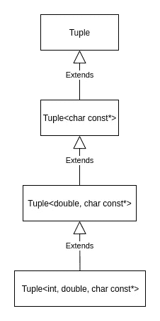
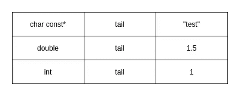
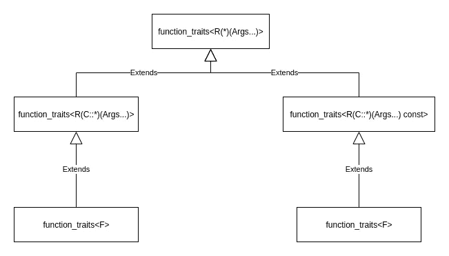

# C++中用函数特征检验可调用函数的性质

> 原文：<https://betterprogramming.pub/inspecting-properties-of-callables-with-function-traits-in-c-6bb2d9388fc5>

## 理解我们如何检查可调用的属性来提高代码的抽象层次


照片由[福蒂斯·福托普洛斯](https://unsplash.com/@ffstop?utm_source=medium&utm_medium=referral)在 [Unsplash](https://unsplash.com?utm_source=medium&utm_medium=referral) 上拍摄

# 模板元编程

## 概观

C++中的模板元编程(TMP)是一种在编译时使用模板执行计算的技术。这种技术可以被认为是用类型编程来生成源代码。没错，就是编码生成代码。

这种技术主要用于库，使它们通用。这是一个非常广泛和复杂的主题，但是理解基础知识和常用技术对于普通开发人员提高代码的抽象级别是非常重要的。

我知道 TMP 可以做很多事情，但是在本文中我们需要知道的是，模板元编程允许我们在编译时获取类型、值和操作类型。让我们看一些例子。

我们可以通过使用`std::is_integral`来检查一个类型是否是整型。在下面的代码中，我们希望有一个仅适用于整型的`print()`函数。

当我们向它传递非整数类型时，例如，`print(1.5)`,我们会得到一个类似这样的编译错误:

```
error: static assertion failed: print() only supports integral type
```

另一个例子是当我们想要修改一个类型时，比如从一个变量中删除一个`const`限定符。

变量`x`是一个带有`const`限定符的变量。我们可以通过使用`std::remove_const`来移除它的`const`限定符。上面的代码打印出来:

```
1
0
```

第`4`行在编译时被计算以产生一个`int`，没有`const`限定符，所以第`5`行是`int y = 2;`。`std::is_const`是 TMP 实现的另一个例子，如果变量有一个`const`限定符，则返回`true`，否则返回`false`。

需要注意的重要一点是，我们使用`::value`从类模板中获取值，使用`::type`获取可以修改或不修改的类型，这取决于我们使用的类模板。

## 可变模板

与我们的主题相关的另一个重要概念是变量模板，我们将在这里简要讨论它。顾名思义，可变模板是一种接受可变数量参数的模板。

如果你懂 C 编程语言，你应该知道`printf()`可以接受任意数量的参数。为了拥有可变数量的参数，我们可以在声明函数时使用省略号`…`。我们来看看`printf()`是怎么申报的:

```
void printf(const char *fmt, …); 
```

省略号告诉编译器这个函数可以接受任意数量的参数。

模板也可以有任意数量的参数，它们被称为可变模板。使用省略号，我们可以告诉编译器我们的模板可以接受 ***零*** 或者更多的参数。现在让我们看一些例子和它们的可视化来帮助理解可变模板是如何工作的。

## 可变函数模板

`print()`函数接受任意数量的参数，如果它们有一个重载的`<<`操作符来支持输出流的打印，就打印出来。幕后发生的是，当我们编译这段代码时，编译器为我们生成了一堆函数。

当编译器读取第`16`行时，它生成以下内容:

注意第`11`行的`args…`语法将参数列表扩展为`(t2, t3)`。然后编译器继续生成我们在函数体中调用的两个函数。

这个过程继续进行:

我们现在知道它是如何工作的了。一些要点是:

*   `typename… Args`转换为类型列表，如`<double, char const*>`
*   `Args… args`转换为类型和名称，如`(double t1, char const* t2)`
*   `args…`转换为名称，如`(t1, t2)`

## 可变类模板

我们可以对类模板做同样的事情，我们可以使用省略号`…`告诉编译器我们的类模板接受 ***零个*** 或更多的模板参数。演示可变类模板最常见的例子是通过实现一个元组。元组是不可变的数据结构，可以包含不同类型的数据(异构的)。在 C++中，`std::tuple`可以认为是`std::pair`的泛化。

让我们看看如何用可变类模板在 C++中实现元组的简化版本。

我们有两个类模板，一个是主模板，另一个是它的部分专门化。就像在可变函数模板中一样，我们使用递归来实现元组。在第`19`行发生了什么，编译器生成如下的类:

通过递归，编译器为我们生成了三个类。下面的类图显示了这些类之间的关系。



元组类图(图片作者提供)

这就是我们的数据在内存中的存储方式。



我们数据的内存布局(图片由作者提供)

我们可以看到，我们的数据是按照与其声明相反的顺序存储的。这是因为类是如何生成的。我们可以从可变模板中学到很多东西，但是在理解了上面的想法之后，理解我想在本文中讨论的主题，即如何检查可调用的属性，可能就足够了。

# 可赎回财产的检查

## 类型特征概述

Type Traits 是一种使用模板元编程来检查和修改类型属性的技术。在上面的第一部分中，我们看到了一个使用`std::integral`的例子，它是 type traits 的类模板之一。用`std::integral`我们可以检查一个变量是否是整型的。

## 功能特征

在本文中，我们希望对**调用**做同样的事情。我们希望能够检查一个可调用的。现在可能不太清楚我们为什么要这样做，但是现在，让我们假设让我们的代码更加 ***通用*** 是有用的。在以后的文章中，我们将在实际例子中使用这种技术。在 C++中，我们有各种各样的可调用函数，其中一些是:

*   非成员函数
*   成员函数
*   函子
*   Lambdas(捕获和无捕获)

我们想要的是将一个 callable 传递给一个名为`function_traits`的类模板，并能够检查以下内容:

*   Arity，参数的数量，0 或更多
*   返回类型
*   参数类型

我们可以使用模板元编程和可变模板来实现这一点。

## 接口

我们希望提供三种接口，如下所示:

*   `function_traits<T>::arity`
*   `function_traits<T>::result_type`
*   `function_traits<T>::template arg<Index>`

## 课程模板

我们想要专门化的主要版本是函数指针，如下面的代码所示。

如你所见，这里我们专门化了`ReturnType(*)(Arguments…)`，它是一个变量函数指针。当我们传递一个函数指针时，这个版本会工作得很好。

对于`result_type`，我们可以简单的在`ReturnType`上加一个`typedef`。对于`arity`，我们可以使用`sizeof…`运算符来查询一个参数包中元素的数量。此外，我们没有重新发明轮子，而是使用标准库来创建一个可调用参数的`std::tuple`对象，并使用`std::tuple_element<Index, std::tuple<Arguments…>::type`来获取第 Index-th 参数的类型。

接下来，我们添加从这个主版本继承的类模板，以便我们可以将它们转换到主版本。

两个版本都是指向成员函数的指针，第一个版本是针对`const`成员函数`ReturnType(ClassType::*)(Arguments…) const`的，第二个版本是针对非`const`成员函数`ReturnType(ClassType::*)(Arguments…)`的。我们现在做的是将这两个版本转换成主版本。

最后，我们添加主要的类模板，如下面的代码所示。

这个版本接受任何实现`operator()`的类型，比如 lambdas、functors 和`std::function`对象。这里发生的是，函数对象类型被转换成指向成员函数的指针。Lambdas 将被转换为`const`成员函数。

下图说明了这些类模板之间的关系。



功能特征类图(图片由作者提供)

## 例子

为了更好地理解它，我们来看一些例子。我们首先创建一个自由函数来打印我们的可调用函数的 arity。

首先，我们可以尝试检查下面的 free(非成员)函数的 arity。

当我们调用`print_arity(print);`时，编译器将使用主版本`function_traits<void (*)(int, int, int)>::arity`直接生成该类，它将打印`3`。

接下来，我们将使用函子测试它。

当我们创建一个名为`test`的`Test`实例，并调用`print_arity(test)`时，编译器将依次创建以下内容:

*   `struct function_traits<Test> : public function_traits<void (Test::*)(int, int)>`
*   `function_traits<void (Test::*)(int, int)> : public function_traits<void (*)(int, int)>`
*   `function_traits<void (*)(int, int)>::arity`

其中会打印`2`。

lambdas 的结果是相似的，唯一的区别是它将使用指向成员函数的指针的`const`版本。例如，我们可以传递一个类似于`print_arity([](const int x){});`的 lambda，我们的代码将打印`1`。

## 成员函数

我们也可以像在`print_arity(&Test::sum);`中那样直接传递成员函数，这将直接使用指向成员函数的指针的`const`版本并正确打印`0`。

但是，我们应该注意，它没有计算调用成员函数所需的`this`指针。这意味着我们只能检查它，而不能调用它。如果我们想稍后调用它，我们可以使用`std::bind`并将其包装在一个`std::function`对象中。

`print_arity(f)`将正确打印`0`，我们可以调用`f()`返回`3`。

这里是完整的`function_traits`代码。

# 关键要点

*   模板元编程允许我们在编译时执行计算来获取值、类型和操作类型。就是编码生成代码。
*   可变模板允许我们处理带有任意数量参数的模板。
*   函数特征可以帮助我们考察可调用函数的性质。我们可以检查返回类型、参数数量和单个参数的类型等属性。