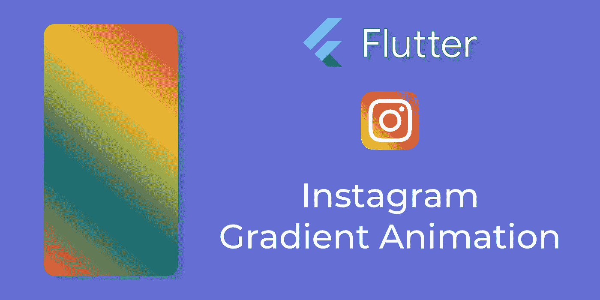
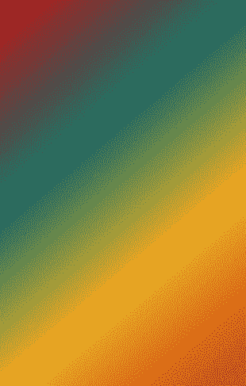
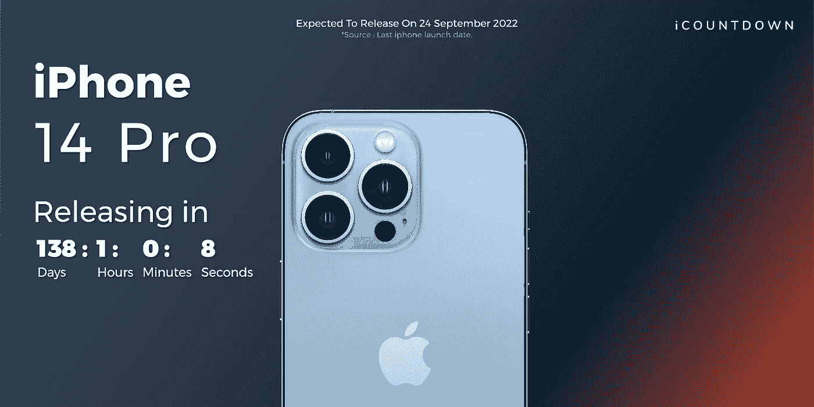

# 颤振的 Instagram 渐变动画

> 原文：<https://betterprogramming.pub/instagram-gradient-animation-for-flutter-1d74d3869997>

## 在应用程序中添加 Instagram 登录渐变动画。



要不要在你的 Flutter app 中加入类似 Instagram 的颜色渐变动画？不要再等了！



最终生成的梯度

在本文中，我们将实现美丽的颜色渐变动画，并使我们的应用程序更具吸引力。我们将创建一个简单的`Utility`方法，用这个漂亮的渐变动画制作我们的小部件。

# 设置常数

让我们定义一些我们将在动画中使用的常量。首先，让我们创建一个`Color`列表，它将被打乱以获得随机颜色。

我们还将创建一个`Alignment`列表。这些对齐将用于设置渐变的方向。这个列表会给我们随机的值，所以我们会在每个周期得到不同的动画。很酷，对吧？代码如下:

# 启动动画计时器

我们将创建一个间隔为五秒钟的`Timer`。每五秒钟，我们将更新小部件的用户界面。在更新小部件状态时，将绘制一个新的渐变，我们将看到平滑的渐变动画。

我们还将存储间隔的计数器，这将用于获得梯度的正确对齐。下一节将详细介绍这一点。代码如下:

# 创建渐变小部件

让我们创建一个有状态的部件，我们将使用`AnimatedContainer`作为基本部件。这个部件将负责从一个渐变到下一个渐变的平滑过渡。

在`AnimatedContainer`内部，我们将定义`LinearGradient`，我们将使用上面创建的颜色列表和对齐列表。我们将只取彼此相反的排列，这将允许我们显示一个对称的梯度。为此，我们使用之前在`Timer`方法中存储的`counter`值。使用`counter`，我们将计算相反的对准位置。

# **让我们制作动画**

我们将调用小部件的`initState`中的`startBgColorAnimationTimer()`方法。这将启动动画定时器，我们可以看到很酷的渐变动画。

> 现在，您可以根据自己的要求定制颜色和计时器持续时间，并欣赏这个令人惊叹的动画。

# 结果呢

看看这个使用相同代码来显示渐变动画的网站构建:

## [iCOUNTDOWN](https://iphone-launch-coutdown.web.app/#/)



iCOUNTDOWN

# 完整代码

谢谢你，我希望这篇文章对你有所帮助。如果你喜欢这篇文章，请继续关注。祝您愉快！

```
**Want to connect?**You can reach me on [LinkedIn](https://www.linkedin.com/in/abdul-rehman-khilji/).
```