# 安装 Apache，MySQL，PHP macOS Mojave 10.14

> 原文：<https://betterprogramming.pub/install-apache-mysql-php-macos-mojave-10-14-b6b5c00b7de>


macOS Mojave 是苹果公司用于麦金塔电脑的桌面操作系统 macOS 的第十五个主要版本。马科斯山高地的继承者。

如果您已经将系统更新到 macOS Mojave，那么当您打开 localhost 时会遇到以下错误:

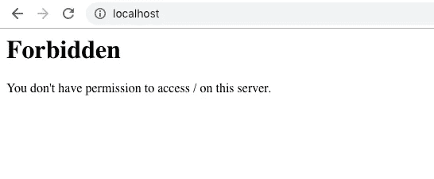

# 如何在 macOS Mojave 上安装 Apache、PHP、MySQL 和 phpMyAdmin

打开终端并按照以下步骤操作。

# 步骤 1 —在 Mac 上安装或重启 Apache Web Sharing

要启动 Apache web 共享:

```
*sudo apachectl start*
```

要停止 Apache 服务:

```
*sudo apachectl stop*
```

要重新启动 Apache 服务:

```
*sudo apachectl restart*
```

要查找 Apache 版本:

```
*httpd -v*
```

现在打开您的浏览器并打开 localhost —您将看到如下屏幕:

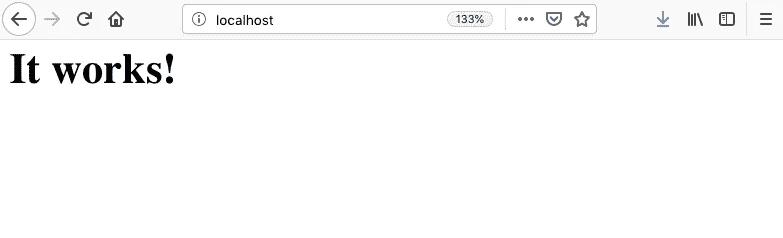

# 步骤 2 —文档根(系统级和用户级)。htaccess 覆盖，安装 PHP

## 系统级 web 根目录

*   默认的系统文件根仍然在`[http://localhost/](http://localhost/.)` [中。](http://localhost/.)
*   文件在`/Library/WebServer/Documents /`在归档系统中共享

## 用户级根

键入下面的代码找到您的用户名(在我的例子中是“home”)。

```
whoami
```

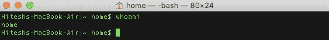

在用户名下创建`/Sites`文件夹:

```
*sudo mkdir ~/Sites*
```

打开 Apache 文件夹，在`/users`目录下创建`username.conf`:

```
cd /etc/apache2/userssudo nano username.conf
```

在`username.conf`中添加以下文本并保存(`CTRL+ O`)。

```
<Directory "/Users/username/Sites/">
AllowOverride All
Options Indexes MultiViews FollowSymLinks
Require all granted
</Directory>
```

现在打开`httpd.conf`，

```
sudo nano /etc/apache2/httpd.conf
```

并取消对以下模块的注释:

```
LoadModule authz_core_module libexec/apache2/mod_authz_core.soLoadModule authz_host_module libexec/apache2/mod_authz_host.soLoadModule userdir_module libexec/apache2/mod_userdir.soLoadModule include_module libexec/apache2/mod_include.soLoadModule rewrite_module libexec/apache2/mod_rewrite.so
```

## PHP 模块

另外，取消 PHP 模块的注释:

```
LoadModule php7_module libexec/apache2/libphp7.so
```

并在允许用户主目录的`httpd.conf` **—** 中取消对该配置文件的注释。

```
Include /private/etc/apache2/extra/httpd-userdir.conf
```

## 覆盖。htaccess 和允许 URL 重写

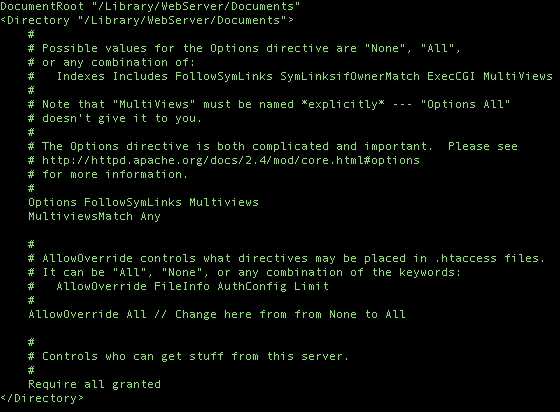

保存文件(`CTRL+ O`)并退出。

打开另一个 Apache 配置文件并取消对另一个文件的注释:

```
sudo nano /etc/apache2/extra/httpd-userdir.conf
```

取消注释:

```
Include /private/etc/apache2/users/*.conf
```

重启 Apache 并打开浏览器。在搜索框中输入`localhost/~username`。

```
sudo apachectl restart
```

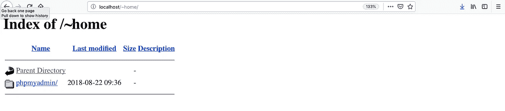

要检查 PHP 是否正在运行，在`/Library/WebServer/Documents/`中创建一个`index.php`文件

```
sudo touch /Library/WebServer/Documents/index.phpsudo nano /Library/WebServer/Documents/index.php
```

并添加下面的 PHP 代码:

```
<?php 
phpinfo(); 
?>
```

保存它并打开您的浏览器。搜索`localhost/index.php`，您将获得:

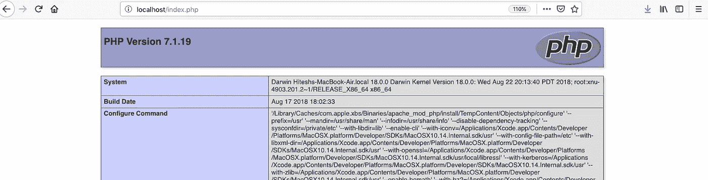

# 步骤 3 —安装 MySQL

MySQL 没有预装 macOS Mojave 它需要从 MySQL 网站下载。

*   MySQL 8.0.12 的最新版本确实可以与 macOS 的公开版本兼容。
*   使用 macOS 10.13 (x86，64 位)，DMG 存档版本(适用于 macOS Mojave)。
*   如果您正在从以前的 macOS 升级，并且有一个旧的 MySQL 版本，您不必更新它。
*   如果你有一个全新的安装，并且想要更早的 MySQL 版本 5.7，你仍然可以从 MySQL 网站上获得它——从“寻找以前的 GA 版本”链接。(MySQL 8 相对较新，在许多生产环境中并不存在)。

MySQL 升级的一个问题是，总是要对你的数据库进行数据转储，以防事情变糟。在你升级到 macOS Mojave 之前，确保你的 MySQL 服务器没有运行。

当你下载的时候，你不需要注册——寻找:“不，谢谢，带我去下载！”直接进入下载镜像，从离你最近的镜像下载软件。

下载完成后，打开`.dmg`并运行安装程序。

在 MySQL 过程中，系统会提示您在强密码加密和传统密码加密之间做出选择，因为版本 8 是全新的(一些软件，如 phpMyAdmin，不能与新的加密连接)，所以如果您打算使用像 phpMyAdmin 这样的 GUI 包装器，我建议您坚持使用传统的**。**

**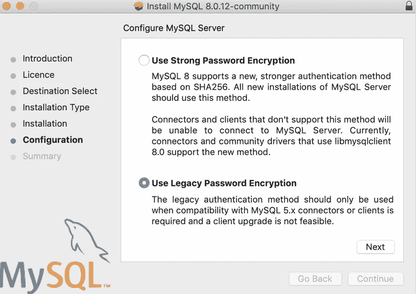**

## **将 MySQL 添加到您的路径中**

**安装后，为了使用 MySQL 命令而无需输入命令的完整路径，您需要将`mysql`目录添加到您的 shell 路径中。**

**这是一个可选步骤，在您的主目录下的`.bash_profile`文件中完成。**

**如果您没有该文件，只需使用 Vi 或 Nano 创建它:**

```
cd ; nano .bash_profileexport PATH="/usr/local/mysql/bin:$PATH"
```

**第一个命令将您带到您的主目录并打开`.bash_profile`文件(或者创建一个新文件，如果它不存在)，然后在上面的行中添加，这将 MySQL 二进制路径添加到您可以运行的命令中。**

**用`CTRL+ X`退出文件，当提示保存更改时，键入`y`。**

**这里要做的最后一件事是重新加载 shell，以便上面的内容立即生效。**

```
source ~/.bash_profile
```

## **启动 MySQL**

**然后，您可以从“系统偏好设置”或通过命令行启动 MySQL 服务器。**

**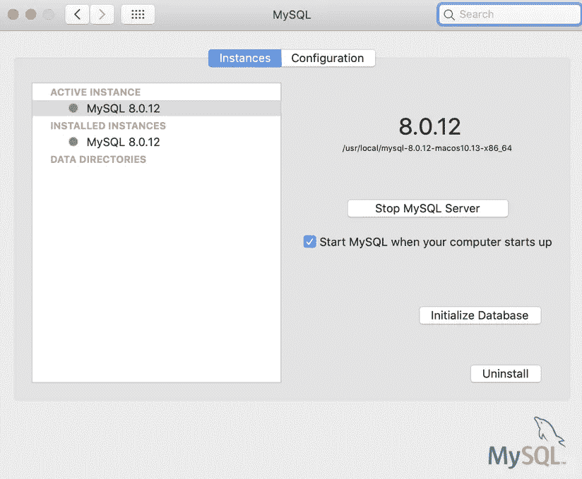**

# **步骤 4 —安装 phpMyAdmin**

**首先使用以下命令修复“2002 套接字错误”:**

```
sudo mkdir /var/mysqlsudo ln -s /tmp/mysql.sock /var/mysql/mysql.sock
```

**下载[phpMyAdmin](http://www.phpmyadmin.net/home_page/downloads.php)——zip English 包将适合很多用户——然后解压缩它并将文件夹及其内容移动到文档根级别，将文件夹重命名为`phpmyadmin`。**

**创建`config`文件夹。**

```
mkdir ~/Sites/phpmyadmin/config
```

**在浏览器中运行设置。**

*   **[http://localhost/~ username/phpmyadmin/setup/](http://localhost/~username/phpmyadmin/setup/)或者**
*   **[http://localhost/PHP myadmin/setup/](http://localhost/phpmyadmin/setup/)**

**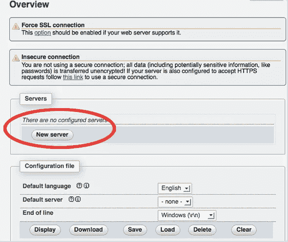**

**您需要创建一个新的本地主机 MySQL 服务器连接—单击`new server`。**

**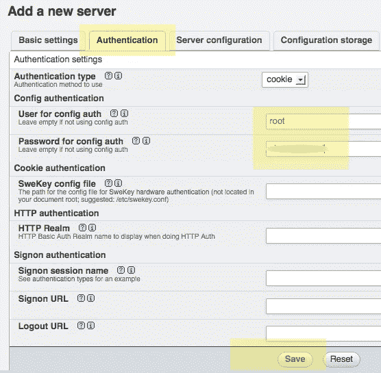**

**切换到`Authentication`选项卡，设置本地 MySQL root 用户和密码。**

**在用户名`root`(可能已经填充)中，添加您之前为 MySQL root 用户设置的密码，点击保存，您将返回到上一个屏幕。**

**注意:这不是 macOS 管理员或 root 密码，而是 MySQL root 用户。**

**现在，转到`http://localhost/~username/phpmyadmin/`将允许您与 MySQL 数据库进行交互。**

**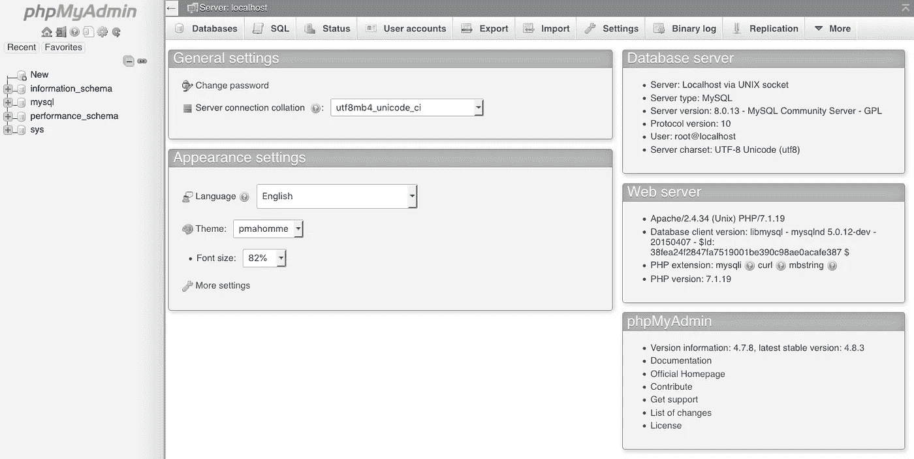**

**就是这样！现在，您已经拥有了运行在 macOS Mojave 之上的本地 AMP 堆栈。**