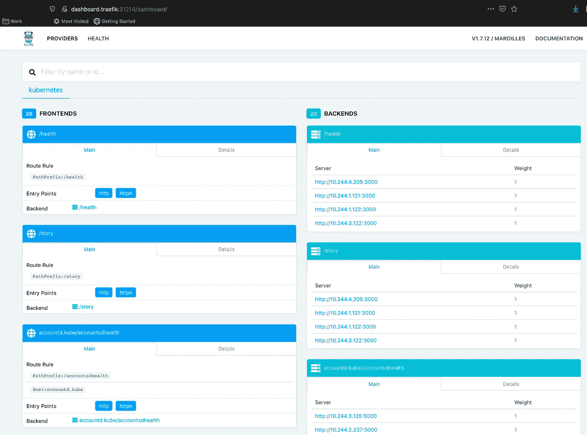

# 如何在 Raspberry Pi 集群上安装 Kubernetes Ingress

> 原文：<https://betterprogramming.pub/install-kubernetes-ingress-on-a-raspberry-pi-cluster-e8d5086c5009>

## …但不仅仅是树莓派


照片由[天舒刘](https://unsplash.com/@tianshu?utm_source=unsplash&utm_medium=referral&utm_content=creditCopyText)在 [Unsplash](https://unsplash.com/s/photos/gate?utm_source=unsplash&utm_medium=referral&utm_content=creditCopyText)

这是描述 Kubernetes 应用程序在 Raspberry Pi 集群上的[开发和部署的系列文章的第四篇。前一篇文章描述了如何在 Raspberry Pi 集群上安装 Kubernetes。这篇文章是关于 Kubernetes 入口。下一篇文章，](https://medium.com/better-programming/develop-and-deploy-kubernetes-applications-on-a-raspberry-pi-cluster-fbd4d97a904c) [Kubernetes 在一个 Raspberry Pi 集群上的应用程序监控](https://medium.com/better-programming/kubernetes-application-monitoring-on-a-raspberry-pi-cluster-fa8f2762b00c)，介绍了在集群上设置 Prometheus、Grafana 和 Elasticsearch、Fluentd 和 Kibana (EFK)栈。

尽管标题如此，但本文并不完全面向 Raspberry Pi 部署。Raspberry Pi 唯一特有的是用于测试入口的应用程序的 Docker 图像。

# 概观

Ingress 是一种机制，允许外部网络中的客户端调用运行在我们的 Kubernetes 集群中的服务。在 Kubernetes 中还有其他方法可以实现这一点——例如，`kubectl expose…` —节点端口和负载平衡器。它们各有利弊，但只要说 Kubernetes Ingress 提供了使其更具吸引力的附加功能就足够了。其中包括:

*   服务发现
*   金丝雀释放路由
*   限速
*   断路
*   还有更多…

所有这些还有很多我不会涉及的。如果您对更多细节感兴趣，请参见" [Kubernetes 节点端口 vs 负载平衡器 vs 入口？什么时候该用什么？](https://medium.com/google-cloud/kubernetes-nodeport-vs-loadbalancer-vs-ingress-when-should-i-use-what-922f010849e0)" Kubernetes Ingress 文档也是了解更多信息的好地方。在这个系列中，我们将使用 [Traefik](https://docs.traefik.io) 作为我们的 [Kubernetes 入口控制器](https://kubernetes.io/docs/concepts/services-networking/ingress-controllers/)。

我使用“[Kubernetes&Traefik 101](https://medium.com/@geraldcroes/kubernetes-traefik-101-when-simplicity-matters-957eeede2cf8)”作为本文的主要信息来源。不过，我在这里展示的一些内容略有不同——但在重要方面有所不同。请将本文视为安装 Traefik 和确认 Traefik 安装的真实来源。我会指出显著的差异。

# 一个小弯路

在我们设置 Kubernetes 集群的入口之前，我们需要安装 [Helm](https://helm.sh/) 。如果我们使用为此目的开发的舵图，将 Traefik 部署为入口控制器会容易得多。在这个系列的后面我们还需要 Helm，所以我们不会做任何我们不需要做的事情。

在 Mac 上安装 Helm 非常简单:

`brew install kubernetes-helm`

其次是:

`helm repo add stable [https://kubernetes-charts.storage.googleapis.com/](https://kubernetes-charts.storage.googleapis.com/)`

这将使用一组公共图表(如 Traefik)初始化 Helm 存储库。

需要注意的是，上面安装并初始化了 Helm 3.x，Helm 最近发布了 3.x，之前的主版本 Helm 2.x 的安装有点不同。一些包含的参考资料谈到了 Helm 2.x。

就这样——现在回到 Traefik！

# ***设置 Traefik***

安装 Traefik 入口控制器相对简单。

**注意** : 这与“[Kubernetes&trae fik 101](https://medium.com/@geraldcroes/kubernetes-traefik-101-when-simplicity-matters-957eeede2cf8)”参考不同。

```
helm install stable/traefik --name <your-name-here> --set dashboard.enabled=true,serviceType=NodePort,dashboard.domain=dashboard.traefik,rbac.enabled=true,externalIP=<pi-router-IP>,imageTag=1.7.12 --namespace kube-system
```

这是安装 Traefik 的一种相对常见的方式。以下是上述命令各部分的含义:

*   `stable/traefik`是描述如何部署 Traefik 的掌舵图。有趣的是，它引用了一个[多原型 Docker 映像](https://www.docker.com/blog/docker-official-images-now-multi-platform/)，所以我们不必担心找到一个`arm`映像来安装。
*   `<your-name-here>`是 Helm 将赋予部署的名称，也是 Kubernetes 资源名称的一部分(例如，部署名称)。在我的集群上，我用了相对来说比较枯燥的名字`my-traefik-release`。
*   `dashboard.enabled=true`表示 Traefik 仪表板应该可用。
*   `serviceType=NodePort`表示通过`NodePort`从外部访问仪表板。稍后将详细介绍。
*   `dashboard.domain=dashboard.traefik`指定使用`dashboard.traefik`作为主机名(例如`[http://dashboard.traefik](http://dashboard.traefik.)`T16)将 Traefik 仪表板配置为可访问。我们稍后将使用它来确认安装。
*   `rbac.enabled`表示 Traefik 正在为扩展的 Kubernetes 权限进行配置。坦率地说，我不太清楚为什么需要这样做，但确实如此。
*   需要使用`externalIP=<pi-router-IP>`来暴露 Traefik 将监听的外部地址。`pi-router-IP`引用我们的 Pi 路由器的外部网络 IP 地址。在“[设置一个 Raspberry Pi 集群，](https://medium.com/better-programming/setup-a-raspberry-pi-cluster-ff484a1c6be9)”中，这是位于`10.0.0.100`的`kubemaster`主机。
*   `imageTag=1.7.12`安装特定版本的 Traefik。如果未指定，将安装 Traefik 的最新映像。Traefik 刚刚发布了一个新的主要版本 2.x。由于这个系列是在 2.x 发布之前开始的，并且使用 v1.7.12，我认为最好坚持使用那个版本。
*   `--namespace kube-system`将 Traefik 安装到`kube-system`名称空间中。这有点武断——如果你愿意，你可以改变它。

这是我的环境的输出:

您可以通过检查部署来验证安装:

注意，服务`my-traefik-release`的`EXTERNAL-IP`值是我们在`helm install ...`命令中指定的。

验证安装的最后一种方法是打开 Traefik 仪表板。注意服务`my-traefik-release` 的类型是 `NodePort`。服务的端口是`80:31214/TCP,443:30308/TCP`。创建仪表板的 URL 需要端口信息。根据港口信息，它位于`[http://dashboard.traefik:31214/dashboard/](http://dashboard.traefik:31214/dashboard/)`。端口`31214`来自`80:31214`中指定的 HTTP 外部端口。

注意`443:30308/TCP`指的是 HTTPS 端点。您安装的端口可能会有所不同。要从 curl 或浏览器访问仪表板，您需要将仪表板的主机名添加到`/etc/hosts`。如果您为 PI 路由器使用了不同的 IP 地址，请使用该地址而不是`10.0.0.100`。

`10.0.0.100 [dashboard.traefik](http://dashboard.traefik:31214/dashboard/)`

这是必需的，因为 Traefik 正在主机名`[dashboard.traefik](http://dashboard.traefik:31214/dashboard/)`上路由。需要一个`/etc/hosts`条目，以便可以正确解析任何请求中使用的主机名。以下是 Traefik 仪表板在我的集群上的外观:



我的 Traefik 仪表板位于 http://dashboard.traefik:31214

您还可以通过`helm ls`查看舵的部署信息。

# 测试安装

**注意:**这不同于“[Kubernetes&trae fik 101](https://medium.com/@geraldcroes/kubernetes-traefik-101-when-simplicity-matters-957eeede2cf8)”参考。

最后，我们希望通过部署一个使用 Traefik 进行入口的服务来测试安装。我们将使用由 [Containous](https://github.com/containous/whoami) 提供的示例 whoami 应用程序。这是用于创建入口、服务和部署的 YAML。它非常类似于“ [Kubernetes & Traefik 101，](https://medium.com/@geraldcroes/kubernetes-traefik-101-when-simplicity-matters-957eeede2cf8)”，但是它使用了一个`arm`映像用于 whoami 部署。

Traefik 特有的信息是`Ingress`规格。

`spec/rules`用于定义`whoami`服务的路由。

`spec/rules/host`定义将在服务请求中使用的主机名，在本例中为`whoami.localhost`。

`spec/rules/host/http:/paths/path`是`/`。这指定了对该主机的任何请求(例如`http://<somehost>/`)都将被路由到 whoami 服务。

`spec/rules/host/http/paths/backend`指定`serviceName: whoami-service`。这引用了来自`Service`规范的服务名。

`servicePort: http`引用`Service`规格中命名的`spec/ports/name`，为`http`。

还需要一个步骤来连接所有的东西。正如我们对上面的 Traefik 仪表板所做的那样，您需要将下面一行添加到您的`/etc/hosts`文件中(假设您使用`10.0.0.100`作为您的 Pi 路由器的地址):

`10.0.0.100 whoami.localhost`

如果一切顺利，可以在`[http://whoami.localhost](http://whoami.localhost.)` [查询 whoami 服务。](http://whoami.localhost.)

你也可以在除 Chrome 之外的大多数浏览器中这样做。Chrome 不会使用`/etc/hosts`文件。

# 结论

就是这样。回顾我们:

1.  安装了 Helm，这样我们可以用它来大大简化 Traefik 的安装。
2.  已安装 Traefik，包括设置其仪表板。
3.  使用简单的应用程序测试入口。

# 资源

*   [Ingress](https://kubernetes.io/docs/concepts/services-networking/ingress/) :这是描述 Ingress 的 Kubernetes 官方文档。这是相关概念的一个很好的概述
*   这是 Traefik 的官方文档。Kubernetes 上有一个特定的部分。
*   ["Kubernetes & Traefik 101 —当简单很重要"](https://medium.com/@geraldcroes/kubernetes-traefik-101-when-simplicity-matters-957eeede2cf8):这是一篇中型文章，专门介绍入口和 Traefik 概念、安装 Traefik 以及测试安装。这是本文的主要信息来源。
*   [“Kubernetes trae fik 装置(头盔)](https://8gwifi.org/docs/kube-traefik.jsp)”:我用这个作为“ [Kubernetes & Traefik 101](https://medium.com/@geraldcroes/kubernetes-traefik-101-when-simplicity-matters-957eeede2cf8) ”的备份参考
*   [在树莓码头的舵上堆叠溢出螺纹](https://stackoverflow.com/questions/49859391/install-helm-on-raspberry-pi-3)