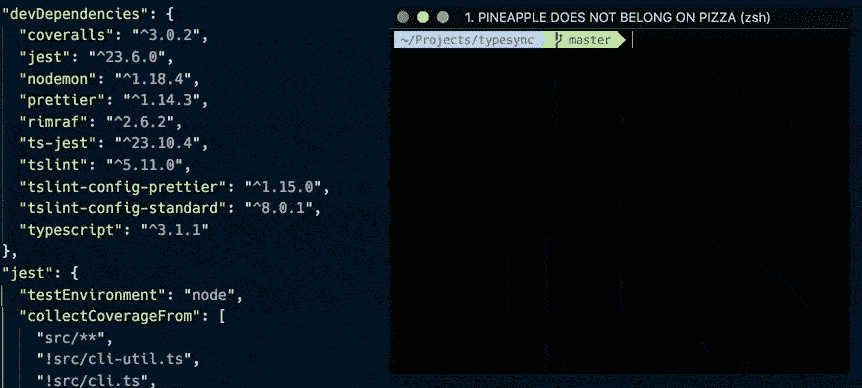
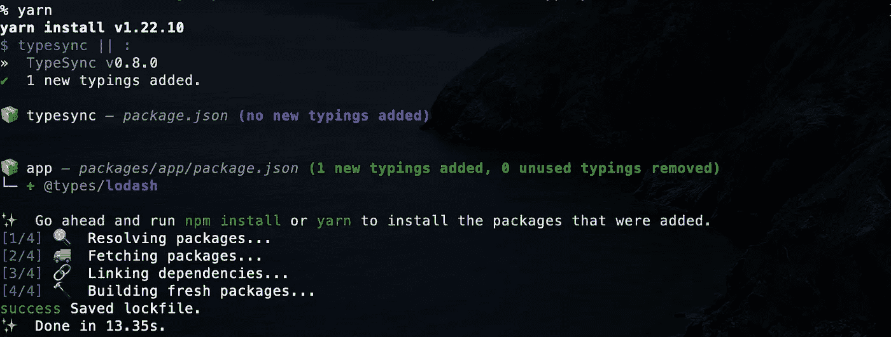

# 用 TypeSync 安装缺少的 TypeScript 类型

> 原文：<https://betterprogramming.pub/install-missing-typescript-typings-with-typesync-5e3d89943f7c>

## 自动安装丢失的打字


[觉吞](https://unsplash.com/@kyawthutun?utm_source=unsplash&utm_medium=referral&utm_content=creditCopyText)在 [Unsplash](https://unsplash.com/s/photos/gap?utm_source=unsplash&utm_medium=referral&utm_content=creditCopyText) 上拍摄的照片

在本文中，我将带您了解如何在`package.json`中自动安装 TypeScript 类型。

# 类型同步

[TypeSync](https://github.com/jeffijoe/typesync) 是一个允许你安装丢失的打字稿的工具。

当您执行该命令时，它会自动在`package.json`中添加一个打字包，就像这样:



TypeSync 将搜索`@types/package`,并试图为打字包找到永远的奇偶校验，或者将退回到最新的版本。

它还支持 monorepos，并将抓取`workspaces`并同步子包中所有匹配的文件。

# 连接到预安装

让我们在一个项目中引入 TypeSync。

```
yarn add -D typesync
```

将`preinstall`添加到`package.json`的脚本中。

第一次安装的时候会遇到缺包错误，所以如果没有 TypeSync，就什么都不做。

添加一些依赖项，让我们看看它是如何工作的:

和安装包:

```
yarn
```


当使用工作空间时，它会在子包中添加类型。

假设我们的 monorepos 是这样的:

```
├── package.json
├── packages
│   └── app
│       └── package.json
└── yarn.lock
```

而`app/package.json`是这样的:

当你运行`yarn`时，它会将`@types/lodash`加到`app/package.json`上:



# 结论

TypeSync 将减少 TypeScript 项目中的繁琐工作，并提高您团队的 DX。

希望对你有帮助。