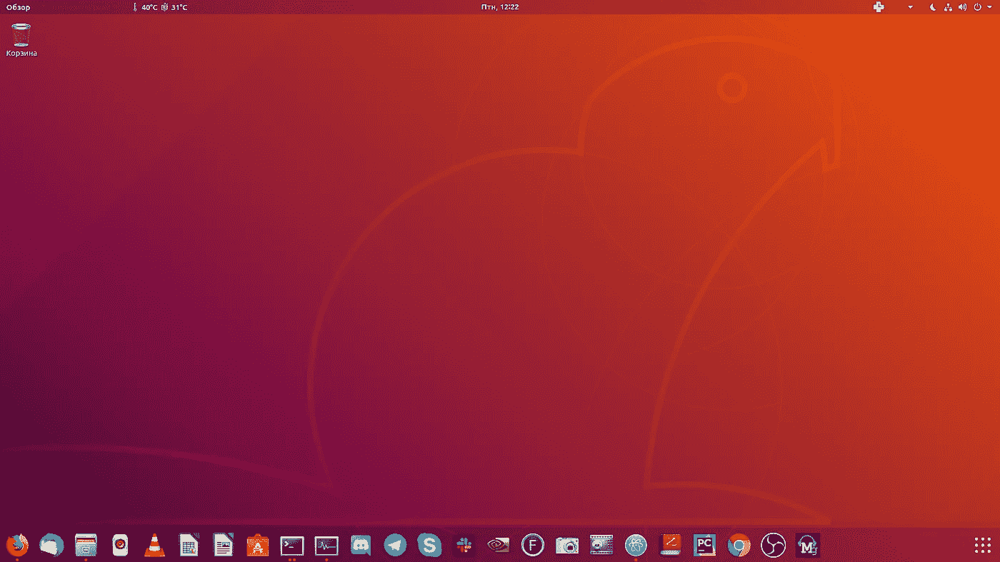
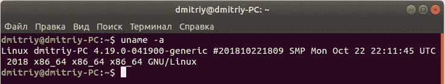
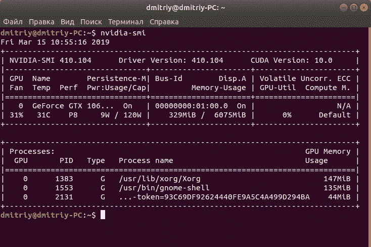
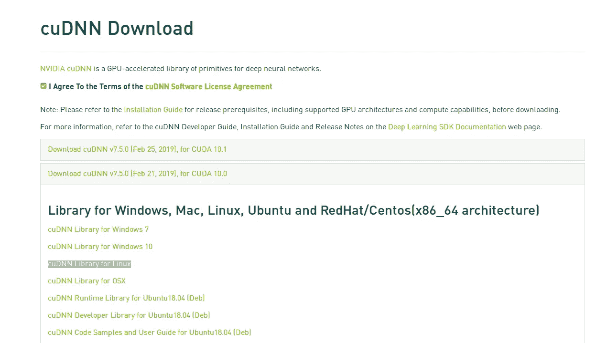
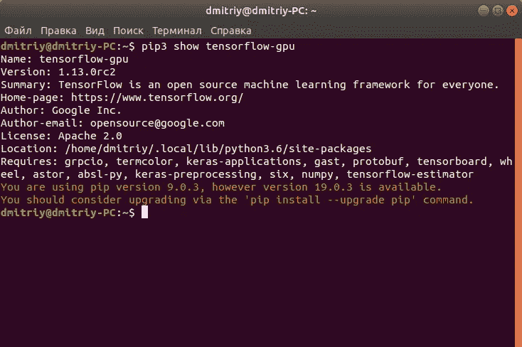

# 在有 GPU 支持的 Ubuntu 18.04 上安装 Tensorflow 1.13

> 原文：<https://betterprogramming.pub/install-tensorflow-1-13-on-ubuntu-18-04-with-gpu-support-239b36d29070>

## 完整的安装指南



**注意:**本文不是为了从源代码构建，因为 1.13 已经支持 CUDA 10.0 和 CuDNN 7.5。此外，在这里你不会发现 NCCL 安装-因此，[发布](https://github.com/tensorflow/tensorflow/releases/tag/v1.13.1) NCCL 是核心的一部分，不需要安装。

为什么不装 2.0 版本？Tensorflow 2.0 现已发布，计划今年在 Q2 稳定发布。如果你现在想试试这个，点击这里查看来自 Tensorflow 团队[的官方指南。**更新**:tensor flow 2 快速安装指南你可以在这里](https://www.tensorflow.org/install/gpu)[找到](https://medium.com/@Oysiyl/install-tensorflow-2-with-gpu-support-on-ubuntu-19-10-f502ae85593c?)。

像往常一样，我添加了最新内核的安装过程，该内核有一个长期版本(在本例中是 4.19)。你可以点击查看关于内核[的信息。这一部分是可选的，需要你签署一个未签名的内核——这可能很危险——所以请随意跳过这一部分。](https://www.kernel.org/category/releases.html)

那么，让我们开始吧！

# 步骤 1:更新和升级您的系统

```
sudo apt-get update 
sudo apt-get upgrade
```

# 步骤 2:验证你有一个支持 CUDA 的 GPU

```
lspci | grep -i nvidia
```

如果看不到任何设置，请通过在命令行输入 update-pciids(通常位于/sbin 中)来更新 Linux 维护的 PCI 硬件数据库，并重新运行前面的 lspci 命令。

# 步骤 3:验证您拥有受支持的 Linux 版本

要确定您运行的是哪个发行版和发行版本号，请在命令行中键入以下内容:

```
uname -m && cat /etc/*release
```

x86_64 行表示您正在 cuda 10.0 支持的 64 位系统上运行。

# 可选步骤:安装 4.19 内核

下载数据:

```
cd /tmp/
wget -c http://kernel.ubuntu.com/~kernel-ppa/mainline/v4.19/linux-headers-4.19.0-041900_4.19.0-041900.201810221809_all.deb
wget -c http://kernel.ubuntu.com/~kernel-ppa/mainline/v4.19/linux-headers-4.19.0-041900-generic_4.19.0-041900.201810221809_amd64.deb
wget -c http://kernel.ubuntu.com/~kernel-ppa/mainline/v4.19/linux-image-unsigned-4.19.0-041900-generic_4.19.0-041900.201810221809_amd64.deb
wget -c http://kernel.ubuntu.com/~kernel-ppa/mainline/v4.19/linux-modules-4.19.0-041900-generic_4.19.0-041900.201810221809_amd64.deb
```

安装:

```
sudo dpkg -i *.deb
```

现在你得到了内核，但是需要签名才能使用(在其他情况下，你可以从内核启动，并得到一条消息，说明你的内核版本未经签名，系统无法启动)。为此，您需要安装 lib-elf 包:

```
sudo apt install libelf-dev
```

然后下载并安装 libssl(如果下面的链接已经过时，请点击[此处](http://security.ubuntu.com/ubuntu/pool/main/o/openssl/)并用新版本替换 ubuntu4.3_amd64):

```
wget -c security.ubuntu.com/ubuntu/pool/main/o/openssl/libssl1.1_1.1.0g-2ubuntu4.3_amd64.deb
sudo dpkg -i *.deb
```

安装后，重启你的 ubuntu 系统:

```
sudo reboot
```

检查 linux 内核版本:

```
uname -a
```

你会得到这样的东西:



如果您愿意，您可以删除这个内核(确保您至少有一个额外的内核来保持您的系统可启动):

```
sudo dpkg --purge linux-image-unsigned-4.19.0-041900-generic linux-image-4.19.0-041900-generic
```

# 第四步:安装 NVIDIA CUDA 10.0

删除以前安装的 cuda(如果您以前安装过 cuda):

```
sudo apt-get purge nvidia*
sudo apt-get autoremove
sudo apt-get autoclean
sudo rm -rf /usr/local/cuda*
```

添加密钥并下载:

```
sudo apt-key adv --fetch-keys http://developer.download.nvidia.com/compute/cuda/repos/ubuntu1804/x86_64/7fa2af80.pub
echo "deb https://developer.download.nvidia.com/compute/cuda/repos/ubuntu1804/x86_64 /" | sudo tee /etc/apt/sources.list.d/cuda.list
```

安装 CUDA-10.0:

```
sudo apt-get update 
sudo apt-get -o Dpkg::Options::="--force-overwrite" install cuda-10-0 cuda-drivers
```

重新启动并键入:

```
echo 'export PATH=/usr/local/cuda-10.0/bin${PATH:+:${PATH}}' >> ~/.bashrc
echo 'export LD_LIBRARY_PATH=/usr/local/cuda-10.0/lib64${LD_LIBRARY_PATH:+:${LD_LIBRARY_PATH}}' >> ~/.bashrc
source ~/.bashrc
sudo ldconfig
```

检查安装是否成功:执行下一个命令后，您需要查看您的 nvidia 驱动程序和 GPU 的版本:

```
nvidia-smi
```



nvidia-smi 命令的输出

如果您的屏幕分辨率较低，请使用 Xorg 解决这个问题:

```
sudo nvidia-xconfig
```

如果这没有帮助，检查我以前的一个安装(我已经详细描述了如果问题仍然存在应该有什么帮助)。

此外，不要忘记检查 NVIDIA-settings——在这里你可以发现加载了多少 GPU(例如，如果使用 ML 框架训练 neuralnets):

```
nvidia-settings
```


在我看来，这个标签是最有用的

# 第五步:安装 cuDNN 7.5.0

前往[此处](https://developer.nvidia.com/cudnn)并点击下载 CuDNN。登录并接受所需的协议。点击以下:“下载 cuDNN v 7 . 5 . 0(2019 . 2 . 21)，针对 CUDA 10.0”然后“cud nn 库针对 Linux”。



从这里下载 tgz

然后安装:

```
tar -xf cudnn-10.0-linux-x64-v7.5.0.56.tgz
sudo cp -R cuda/include/* /usr/local/cuda-10.0/include
sudo cp -R cuda/lib64/* /usr/local/cuda-10.0/lib64
```

# 步骤 6:安装依赖项

安装 libcupti:

```
sudo apt-get install libcupti-dev
echo 'export LD_LIBRARY_PATH=/usr/local/cuda/extras/CUPTI/lib64:$LD_LIBRARY_PATH' >> ~/.bashrc
```

Python 相关:

```
sudo apt-get install python3-numpy python3-dev python3-pip python3-wheel
```

# 第七步:安装 Tensorflow-GPU

使用 pip 安装 Tensorflow-GPU 1.13:

```
pip3 install --user tensorflow-gpu==1.13.1
```

现在您可以检查您安装的 tensorflow 版本:

```
pip3 show tensorflow-gpu
```



没错。你已经准备好使用 GPU 了！

一如既往，我建议你去[这篇文章](https://medium.com/@Oysiyl/install-and-configure-monitoring-tool-in-ubuntu-18-04-8fe1566050a8)如果你想从系统托盘看到 GPU 的温度。要安装 Tensorflow 以前的安装版本，您可以通过我的[个人资料](https://medium.com/@Oysiyl)查看。

祝您愉快！

链接，应该可以帮助您:

[](https://www.pytorials.com/how-to-install-tensorflow-gpu-with-cuda-10-0-for-python-on-ubuntu/) [## 如何用 CUDA 10 安装 tensor flow | pytorials.com

### 这将是一个如何安装 tensorflow 1.12 GPU 版本的教程。我们还将安装 CUDA 10.0 和…

www.pytorials.com](https://www.pytorials.com/how-to-install-tensorflow-gpu-with-cuda-10-0-for-python-on-ubuntu/) [](https://askubuntu.com/questions/1069433/upgrade-from-16-04-to-18-04-failed-please-help) [## 从 16.04 升级到 18.04 失败，请帮助

### 感谢贡献回答问 Ubuntu！请务必回答问题。提供详细信息并分享您的…

askubuntu.com](https://askubuntu.com/questions/1069433/upgrade-from-16-04-to-18-04-failed-please-help) [](https://askubuntu.com/questions/1039201/why-ubuntu-stopped-publishing-signed-linux-kernel-images-since-4-16-4) [## 为什么 Ubuntu 从 4.16.4 开始停止发布签名的 linux 内核镜像？

### 感谢贡献回答问 Ubuntu！请务必回答问题。提供详细信息并分享您的…

askubuntu.com](https://askubuntu.com/questions/1039201/why-ubuntu-stopped-publishing-signed-linux-kernel-images-since-4-16-4)