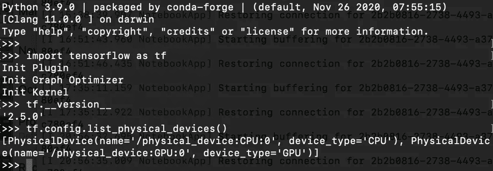

# 用新的金属插件在苹果 M1 上安装 Tensorflow

> 原文：<https://betterprogramming.pub/installing-tensorflow-on-apple-m1-with-new-metal-plugin-6d3cb9cb00ca>

## 如何在 Mac M1 上启用 GPU 加速并实现顺利安装


[威森·王](https://unsplash.com/@wesson?utm_source=medium&utm_medium=referral)在 [Unsplash](https://unsplash.com?utm_source=medium&utm_medium=referral) 上拍照

自从苹果放弃了 Nvidia 的支持，M1 芯片的出现在 ML 社区点燃了新的希望。该芯片使用苹果神经引擎，这是一种允许 Mac 以惊人的速度执行机器学习任务的组件，并且没有热量问题。

当苹果发布 M1 时，与 Tensorflow 的集成非常困难。这个过程包括下载一个预先配置好的 environment.yml 文件以及其他包，该文件具有特定的依赖关系，因此不会出现依赖冲突。

不幸的是，情况并非总是如此。本文讨论了如何使用 Metal 插件在 Miniforge 上安装 Tensorflow，这是一个更简单、更不容易出错的过程。

# **第一步:安装 Xcode**

要安装的第一个组件是 Xcode，可以很容易地从 App Store 下载。此外，安装命令行工具:

```
$ xcode-select --install
```

# **第二步:安装 MiniForge**

MiniForge 是一个极简的`conda`安装程序，默认使用`conda-forge`通道，支持 aarch64 架构(包括苹果 M1)。

换句话说，它是苹果友好的。要下载它，只需进入此[页面](https://github.com/conda-forge/miniforge)并下载苹果芯片的安装程序。安装简单:

```
$ bash Miniforge3-MacOSX-arm64.sh
```

如果您已经有了一个预先存在的 conda 发行版，例如 Anaconda 或 MiniConda，那么就没有必要卸载它来使用 MiniForge。对于那些熟悉 conda 生态系统的人来说，在一个给定的时间内，只有一个 conda 发行版可以“正常运行”。查看这篇[文章](/switching-between-multiple-conda-distributions-on-macos-b78b6b21720)，了解如何有效地同时管理多个 conda 发行版！

# **第三步:设置环境，安装 Tensorflow base 和 tensorflow-metal 插件**

让我们创建一个新的环境，叫做`tensorflow_m1`:

```
$ conda create --name tensorflow_m1 python==3.9
$ conda activate tensorflow_m1
```

然后，安装以下组件:

```
$ conda install -c apple tensorflow-deps
$ pip install tensorflow-macos
$ pip install tensorflow-metal
```

或者，安装 Jupyter 笔记本电脑或实验室:

```
$ conda install -c conda-forge jupyter jupyterlab
```

为了确保一切正常，TensorFlow 安装确实使用了 GPU，请打开 Python 提示符并执行:

```
import tensorflow as tf
tf.__version__
tf.config.list_physical_devices()
```



如果您在设备列表中看到 GPU，这意味着它可以通过 Tensorflow 访问。

接下来，运行一个简单的 MNIST 示例，以确保一切按预期运行:

```
import tensorflow as tf
mnist = tf.keras.datasets.mnist(x_train, y_train), (x_test, y_test) = mnist.load_data()
x_train, x_test = x_train / 255.0, x_test / 255.0model = tf.keras.models.Sequential([
 tf.keras.layers.Flatten(input_shape=(28, 28)),
 tf.keras.layers.Dense(128, activation=’relu’),
 tf.keras.layers.Dropout(0.2),
 tf.keras.layers.Dense(10)
])loss_fn = tf.keras.losses.SparseCategoricalCrossentropy(from_logits=True)model.compile(optimizer=’adam’,
 loss=loss_fn,
 metrics=[‘accuracy’])model.fit(x_train, y_train, epochs=10)
```

# 解决一些常见错误

## **1。不正确的 python 路径**

必须确保您拥有关于 MiniForge 环境的正确 python 路径。

如果没有，您可能会看到以下消息:

```
Collecting package metadata (repodata.json): 
done Solving environment: failed ResolvePackageNotFound: 
      — tensorflow-deps
```

如果您在没有指定 python 版本的情况下初始化一个新的`conda`环境，也会出现这个错误，因为最新的可用版本(例如 3.9.7)可能没有这个包。

最安全的选择是使用 3.9.0(前面提到过)。

## 2.**安装 tensorflow-deps 时构建 grpcio 出错**

您很可能会遇到这个错误。要修复它，只需安装:

```
$ pip install tensorflow-macos --no-dependencies
```

## 3. **Numpy 未被识别**

安装`tensorflow-deps`有时也会安装非康达-福吉 NumPy 版本，无法正常工作。在某些情况下，当尝试导入此 NumPy 版本时，您可能会看到以下消息:

```
IMPORTANT: PLEASE READ THIS FOR ADVICE ON HOW TO SOLVE THIS ISSUE!Importing the numpy C-extensions failed. This error can happen formany reasons
```

要解决这个问题，请安装`openblas`包:

```
$ conda install -c conda-forge openblas
```

## 4.**拟合模型时内核死亡**

这是最常见的错误，会在定型模型时发生。

具体来说，执行崩溃，抛出一个`NSInvalidArgumentException` 。在引擎盖下，TensorFlow 使用了使用 GPU 的`MPSGraph`推理增强功能构建的`tensorflow-metal`。

要解决这个问题，请使用之前版本的 Tensorflow，以及之前版本的`tensorflow_metal`。例如，如果 Tensorflow 的当前版本是 2.6，而`*tensorflow-metal*`是 0.2，请尝试:

```
$ conda create --name tensorflow_m1 python==3.9
$ conda activate tensorflow_m1$ conda install -c apple tensorflow-deps==2.5.0
$ pip install tensorflow-macos==2.5.0
$ pip install tensorflow-macos==2.5.0 --no-dependencies
$ pip install tensorflow-metal==0.1.2
```

# **奖励提示**

1.  为了加强一致性和互操作性，只使用`conda-forge`通道下载软件包是很重要的，即使软件包也位于默认通道中。
2.  并不是所有的库都能在 MiniForge 中找到。因此，为极端情况保留一个单独的 Anaconda 或 Miniconda 环境是一个很好的实践。

# **结束语**

作为一名 Mac 用户，能够充分利用最流行的深度学习框架是至关重要的。

传统上，他们求助于第三方工具(如 Colab)，这并不总是可取的。我希望这个指南对许多 Mac 开发者有益，并帮助他们在开发过程中节省时间。