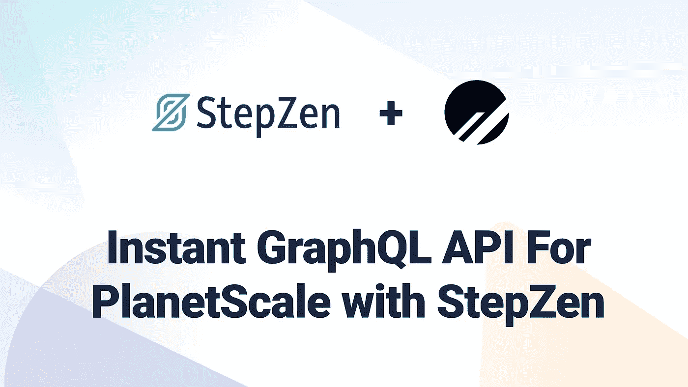
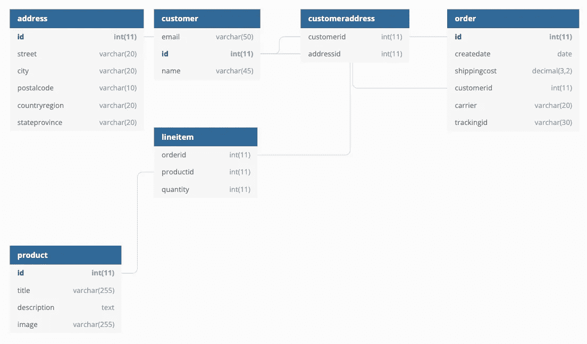

# 使用 StepZen 为 PlanetScale 提供即时 GraphQL API

> 原文：<https://betterprogramming.pub/instant-graphql-api-for-planetscale-with-stepzen-ff9e4721d9fa>

## 使用 StepZen CLI 为 PlanetScale 构建 GraphQL API，并在 GraphQL 模式中编写声明性代码



对于开发人员来说，在云中运行他们的基础设施从未如此简单。只需几次点击，您就可以在全球范围内创建和部署各种开发人员的产品和服务。对于 StepZen 提供的 GraphQL-as-a-Service 以及今天的许多其他网站、API 和数据库来说都是如此。其中一个可以快速部署到云的数据库是 [PlanetScale](https://planetscale.com/) 。

PlanetScale 是一个基于 MySQL 的无服务器数据库平台。它使得水平扩展你的数据库成为可能，因为它是建立在 [Vitess](https://vitess.io/) 之上的。由于 PlanetScale 是基于 MySQL 的，所以您可以使用 StepZen 来自省数据库，并创建一个可以在几秒钟内部署的 GraphQL 模式。将 PlanetScale 和 StepZen 结合起来，就可以在云中运行数据库和 GraphQL。这两个可伸缩的服务防止您的团队担心他们构建的产品的可伸缩性。

在本文中，您将学习如何设置 PlanetScale 并使用 StepZen 为其创建即时 GraphQL API。

## 设置行星秤

> 已经在用 PlanetScale 了？您可以通过运行`stepzen import mysql`为您的数据库创建一个即时 GraphQL API，您将在[导入 MySQL 数据库](https://stepzen.com/blog#importing-a-mysql-database)中了解到这一点。

用 PlanetScale 建立一个数据库只需几个步骤，正如你在 StepZen 的官方 PlanetScale 示例[中看到的。您可以使用 PlanetScale CLI 或他们的管理仪表板来设置数据库。在设置了一个新的 PlanetScale 实例之后，您需要在用 GraphQL 查询它之前用数据填充它。](https://github.com/stepzen-dev/examples/tree/main/with-planetscale)

PlanetScale 允许你从远程连接导入一个现有的 MySQL 数据库，但是如果你还没有一个活动的数据库，你可以从命令行使用`mysql` CLI 来更新一个`.sql`文件。在我们的[官方 PlanetScale 示例](https://github.com/stepzen-dev/examples/tree/main/with-planetscale)中，您可以找到一个名为`init.sql`的文件，它可以用来填充这个新数据库。

您应该将文件`init.sql`下载到您的机器上，或者签出并克隆示例存储库。要使用`[mysql](https://dev.mysql.com/doc/refman/8.0/en/mysql.html)` [CLI](https://dev.mysql.com/doc/refman/8.0/en/mysql.html) 填充数据库，您应该从终端或命令提示符运行以下命令:

```
mysql -h [PLANETSCALE_HOST] -u [PLANETSCALE_USERNAME] -p[PLANETSCALE_PASSWORD] --ssl-mode=VERIFY_IDENTITY --ssl-ca=/etc/ssl/cert.pem < init.sql
```

> 您可以通过从 PlanetScale 仪表板打开您的数据库并点击“连接”按钮来获得`PLANETSCALE_HOST`、`PLANETSCALE_USERNAME`和`PLANETSCALE_PASSWORD`的值。您需要在下拉列表中选择“常规”来获取您的数据库凭据。

导入填充数据库的`.sql`文件后，er 图(实体关系图)将如下所示:



您可以使用管理仪表板中的控制台、PlanetScale CLI 或任何其他连接到 MySQL 数据库的方法从 PlanetScale 查询这些数据。我们还可以将 PlanetScale 连接到 StepZen，并获得一个基于其数据库模式的即时 GraphQL API。

## 导入 MySQL 数据库

> 在运行命令导入 PlanetScale 数据库之前，请确保您安装了 StepZen CLI(`npm i -g stepzen`)并登录到您的 step Zen 帐户(`stepzen login`)。您可以在[我的步骤](https://stepzen.com/account)页面找到您的证书。

通过 StepZen，您可以使用 CLI 导入 MySQL 数据库。在导入这个数据库时，StepZen 将基于它的表和列生成一个 GraphQL 模式。该模式将为您的查询提供查询，并为这些表中的列提供返回类型。要导入 PlanetScale 数据库，您需要运行命令`stepzen import mysql`并在提示符下提供您的 PlanetScale 主机、用户名、数据库名称和密码。

```
stepzen import mysql

? What would you like your endpoint to be called? api/with-planetscale

Downloading from StepZen...... done

? What is your host? <PLANETSCALE_HOST>
? What is your database name? <PLANETSCALE_DATABASE>
? What is the username? <PLANETSCALE_USERNAME>
? What is the password? [hidden] <PLANETSCALE_PASSWORD>
```

StepZen 将自动为您的 PlanetScale 数据库创建一个 GraphQL 模式，其中包含一组示例查询和变异。模式将在文件`mysql/index.graphql`中，您可以在`stepzen.config.json`中找到端点。如果导入更多的数据库(或其他数据源)，StepZen CLI 将在不同的目录中生成模式。文件`index.graphql`将您的数据源的所有模式集合在一起。

此外，通过运行`stepzen import mysql`，创建了一个名为`config.yaml`的文件，其中保存了 PlanetScale 的凭证。因为 PlanetScale 只允许通过 SSL/TLS 访问，所以您需要在这个文件中的 DSN 配置后面添加`?tls=true`:

```
configurationset:
  - configuration:
      name: mysql_config
      dsn: <PLANETSCALE_DSN>?tls=true
```

为了探索创建的 GraphQL 模式，您可以打开文件`mysql/index.graphql`或启动 GraphQL API，您将在下一节中了解到。

## 使用 StepZen 运行 GraphQL API

StepZen 为 PlanetScale 数据库生成的 GraphQL 模式和配置细节可以立即部署。使用 StepZen 部署的 GraphQL API 是高性能的，延迟低于 100 毫秒，可用性为 99.99%。与 PlanetScale 类似，StepZen 也部署无服务器。要部署您的 GraphQL 模式，您需要运行以下命令:

```
stepzen start
```

这将返回以下消息:

```
Deploying api/with-planetscale to StepZen... done in 4.1s 🚀

Your API url is  https://<YOUR_USERNAME>.stepzen.net/api/with-planetscale/__graphql

You can test your hosted API with cURL:

curl https://<YOUR_USERNAME>.stepzen.net/api/with-harperdb/__graphql \
   --header "Authorization: Apikey $(stepzen whoami --apikey)" \
   --header "Content-Type: application/json" \
   --data '{"query": "your graphql query"}'

or explore it with GraphiQL at  http://localhost:5001/api/with-planetscale

Watching ~/stepzen/examples/with-planetscale for GraphQL changes...
```

这条消息意味着您的 GraphQL API 已成功部署到 StepZen。您可以在`https://<YOUR_USERNAME>.stepzen.net/api/with-planetscale/__graphql`查询生产就绪端点，或者在`http://localhost:5001/api/with-planetscale`使用 GraphQL 在本地探索 graph QL。如果您想进入本地 GraphQL 接口，您可以探索为 PlanetScale 数据库生成的 graph QL 模式。


例如，当您使用上面的查询`getCustomerList`时，StepZen 将只请求查询中描述的字段。这样，数据库上的负载保持最小，而 GraphQL API 将是最高效的。上面的查询将遍历 SQL 中的以下内容:

```
SELECT email, id FROM customer;
```

接下来探索您的 GraphQL 模式，您可以在这个平台上运行查询和变异。已经为每个数据库表生成了一个查询，包括基于该表中的列的返回类型。但是您可以使用 StepZen 做更多的事情，因为您还可以使用自定义指令创建表之间的关系。

## 查询表之间的关系

由于 MySQL 数据库是关系数据库，所以可以使用外键在不同的表之间建立连接。PlanetScale 不允许[外键约束](https://docs.planetscale.com/learn/operating-without-foreign-key-constraints)，但是我们仍然可以使用键来链接表。PlanetScale 数据库的 ER 图在表之间有多个关系。使用 StepZen，您可以通过在 GraphQL 模式中编写声明性代码来构建 GraphQL API。您可以使用自定义指令`@materializer`到[组合来自不同查询](https://stepzen.com/docs/features/linking-types)的数据。

工作台`customer`通过`order`中的`customerid`键链接到`order`。在文件`mysql/index.graphql`中，生成了一个查询来获取所有订单，名为`getOrderList`，返回类型为`Order`。如果您想为每个订单返回客户，您需要向 GraphQL 模式添加一个名为`getCustomerById`的新查询:

```
getCustomerById(id: Int!): [Customer]
  @dbquery(
    type: "mysql"
    query: """
    select * from `customer` where `id` = ?
    """
    configuration: "mysql_config"
  )
```

并将该查询链接到名为`customer`的新(关系)字段上的 GraphQL 类型`Order`:

```
type Order {
  carrier: String!
  createdat: Date!
  customerid: Int!
  customer: [Customer]
    @materializer (query: "getCustomerById" arguments: [{ name: "id" field: "customerid"}])
  id: Int!
  shippingcost: Float
  trackingid: String!
}
```

当您在查询`getOrderList`中请求字段`customer`时，查询`getCustomerById`也将被执行以从该关系中获取您请求的字段。即使数据库中没有描述关系字段，您也可以使用`@materializer,`进行任意组合的查询。

## 下一步是什么？

在本文中，您了解了如何使用 StepZen CLI 为 PlanetScale 构建 GraphQL API，并在 GraphQL 模式中编写声明性代码。如果您想了解更多，请查看 Github 上 StepZen 示例库中的[完整示例代码](https://github.com/stepzen-dev/examples/tree/main/with-planetscale)。有问题或想要分享您正在构建的内容吗？加入我们的[不和谐](https://discord.com/invite/9k2VdPn2FR)。