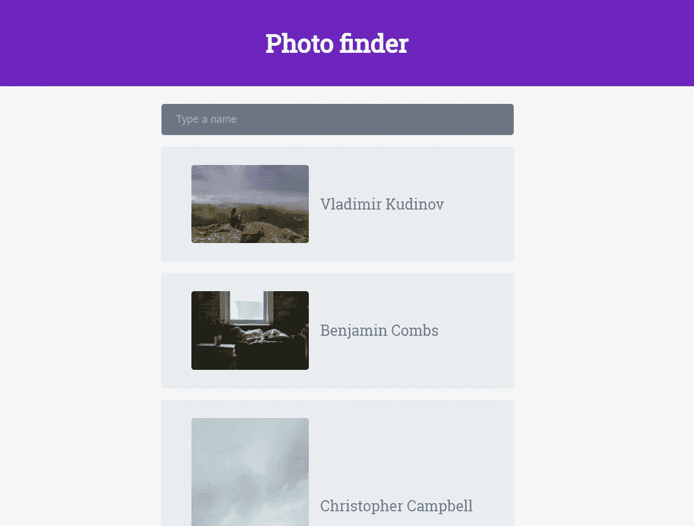
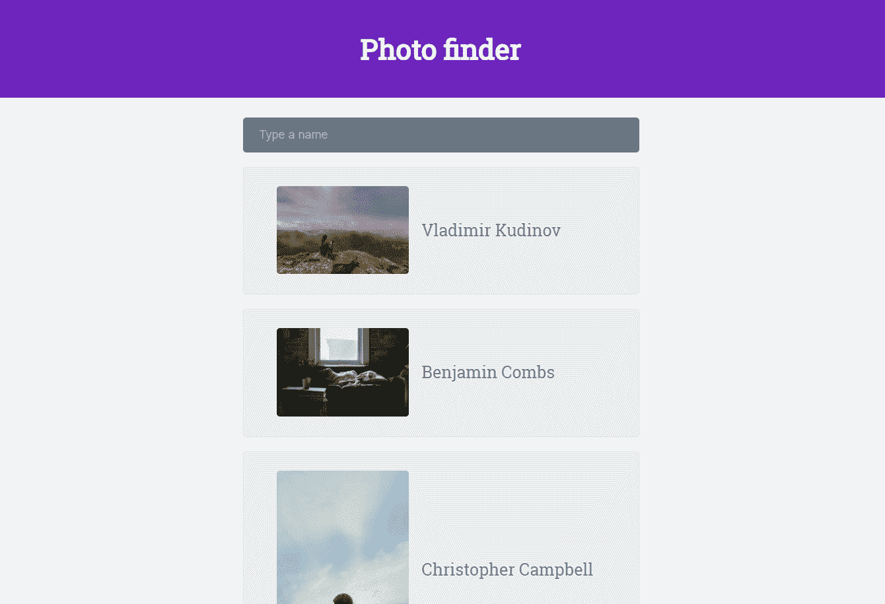

# 使用 Vue.js 和 Axios 进行即时搜索

> 原文：<https://betterprogramming.pub/instant-search-with-vue-js-and-axios-5b78a3a59f01>

## 从 Web API 获取数据，并添加具有计算属性的动态过滤器

[通讯社 follow EB](https://unsplash.com/@olloweb?utm_source=unsplash&utm_medium=referral&utm_content=creditCopyText)在 [Unsplash](https://unsplash.com/s/photos/magnifying-glass?utm_source=unsplash&utm_medium=referral&utm_content=creditCopyText) 上拍摄的照片(添加了 Vue.js 标识)

[Vue.js](https://vuejs.org/) 是一个很有潜力的框架。就字节而言，它简单易学、快速、轻便。我从如何构建你的第一个 Vue.js 应用开始了我的 Vue.js 之旅。现在，我将继续这篇关于如何制作一个即时搜索输入框来过滤来自 Web API 的数据的文章。

您将在[我的存储库](https://github.com/FrancescoBonizzi/VueJs-Experiments/tree/master/Instant%20search)中找到最终结果。

# 佐料

*   Vue.js 库:我们的 Javascript 框架
*   Axios 库:基于 Promise 的 HTTP 客户端，我们将使用它来调用 Lorem Picsum Web API
*   公共 [Lorem Picsum API url](https://picsum.photos/v2/list?page=2&limit=10) : `https://picsum.photos/v2/list?page=2&limit=10`
*   将组成我们的应用程序的文件:`index.html`文件、`app.js`、`style.css`

# 第一步

首先我们来看看 [Lorem Picsum Web API](https://picsum.photos/v2/list?page=2&limit=2) 的输出是什么:

Web API 返回一个 JSON 数组，该数组表示带有 URL、作者和 ID 的图像列表。这些属性将定义我们的应用程序模型。

然后，开发简单的应用程序框架，包括标题、输入文本框、图像列表和作者姓名。起初，它看起来像这样:

这个网页的主体非常简单:

用一个非常简单的 CSS 工作，图片列表的样式是:

和输入框的样式:

# Vue.js 集成

是时候给我们的小应用程序添加动态性了:

*   导入 Vue.js: ``
*   导入 Axios: ``

定义新的 Vue 应用程序:

如您所见，我们将应用程序绑定到元素`#app-instasearch`，并定义了两个属性:

*   `authorNameSearchString`:它将包含绑定到我们的输入框的搜索字符串
*   `photoFeed`:下载后会包含图片数组

在我们之前阅读的 JSON 中，我们了解了代表模型的属性。因此，下一步是将所有 Vue 绑定添加到我们的 HTML 文件中。

输入框绑定到我们的`authorNameSearchString`:

主列表绑定:

*   `v-for=”photo in filteredPhotoFeed”`:使 Vue 能够对`filteredPhotoFeed`数组中的每个元素重复一次`li`
*   `v-bind:key=”photo.id”`:选择一个键来唯一地表示一个图像，以便能够动态显示列表，这一点很重要
*   `v-bind:src=”photo.download_url”`:没有这个，我们看不到图像
*   `{{ photo.author }}`:在每张照片附近打印作者姓名

# 安装的功能

在 Vue.js 中，您可以添加挂载的函数，这些函数只是钩子，在 Vue 实例被加载并绑定到接口后将被调用。在这种情况下，我们需要从 Web API 获取数据，这是正确的位置。

在这个例子中，我们使用`Axios`进行 HTTP 调用并管理其回调。特别是，我们将使用应用程序`photoFeed`数组的`JSON`响应数据，并将最终错误写入输出控制台。

# 计算属性

计算的属性是缓存的 Vue 应用程序属性，它们只在被动依赖关系改变时重新计算**。注意，如果某个依赖关系超出了实例的范围(即非反应性的)，则**计算属性**将不会被更新。**

在这种情况下，我们将使用它们来应用**即时搜索过滤器**。

首先，我们通过不考虑 null 或空字符串来检查没有输入。然后，我们需要用搜索字符串返回一组经过**过滤的**照片。为此，我们使用`filter`方法和`indexOf`函数作为谓词，只选择作者包含在搜索字符串中的照片。

每次输入字符串改变时，这个属性都会被重新计算，接口也会更新。

这是最终结果的一个小演示，添加了一些动画到列表中，使它更有趣。[你可以在这里找到全部代码](https://github.com/FrancescoBonizzi/VueJs-Experiments/tree/master/Instant%20search)。

