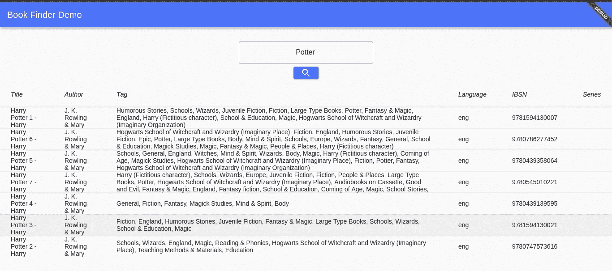

# 将弹性研究与颤振相结合

> 原文：<https://betterprogramming.pub/integrate-elasticsearch-with-flutter-d3c5f2a5da12>

## Flutter 搜索 UI 中显示的 Dart 弹性客户端功能概述


Joshua Sortino 在 [Unsplash](https://unsplash.com?utm_source=medium&utm_medium=referral) 上拍摄的照片

[Elasticsearch](https://www.elastic.co/) 是一款现代全文搜索和分析引擎。您可以使用它来存储任何类型的数据，然后对其进行搜索、索引和分析。

在本教程中，我们将深入研究 Dart 的[弹性客户端](https://pub.dev/packages/elastic_client)库的特性。我们将在 Flutter 中构建一个搜索用户界面，并执行查询从 Elasticsearch 中检索数据。

让我们开始编码吧！

# 安装 Elasticsearch

为了简单起见，我将使用一个 Docker 图像。

*   使用以下配置创建一个`docker-compose.yml`文件:

*   用这个命令启动容器:`docker-compose up -d`
*   通过在浏览器中键入以下 URL 来测试安装:`[http://localhost:9200/](http://localhost:9200/)`

您应该会看到一个显示 Elasticsearch 实际版本和其他信息的响应。

# 将数据插入弹性搜索

下一步是将一些数据放入 Elasticsearch。在我们的例子中，我们将创建一个图书搜索引擎。我准备了一个 JSON 文件，包含各种数据，比如标题、作者和语言。请随意从我的 GitHub 资源库(链接在本文的底部)下载该文件，并使用它。

*   现在，让我们使用 CURL 命令将数据提交给 Elasticsearch:

```
curl -H "Content-Type: application/json" -XPOST "localhost:9200/books/_bulk?pretty&refresh" --data-binary "@books.json"
```

*   在您的浏览器中键入此地址以检索第一个文档:`[http://localhost:9200/books/_doc/1](http://localhost:9200/books/_doc/1)`

您应该会看到以下响应:

```
{"_index":"books","_type":"_doc","_id":"1","_version":1,"_seq_no":0,"_primary_term":1,"found":true,"_source": {"authors":"John Schember","isbn":"","languages":"eng","series":"","tags":"","title":"Quick Start Guide"}}
```

我们有一些数据，最后，我们可以开始使用它。

# 创建用户界面

本教程假设您的机器上已经安装了 Flutter SDK。如果没有，检查安装[指南](https://flutter.dev/docs/get-started/install?gclid=CjwKCAjww5r8BRB6EiwArcckC2dY8hyKBv-UtXbJPM-l-6kpL_P2RdLakr4Sa1JM0y1PoPwtbfkvuBoCwiUQAvD_BwE&gclsrc=aw.ds)。

*   在 IDE 中创建一个新的 Flutter 项目
*   打开`pubspec.yaml`文件。我们需要获得以下依赖关系:

```
elastic_client: ^0.1.13
universal_io: ^1.0.1
```

*   执行`flutter pub get`命令下载库。
*   让我们创建我们的`Book`对象。在`lib`目录下创建一个名为`book.dart`的文件。基于我们的 JSON 数据，我们需要以下属性:

*   让我们继续我们的`main.dart`文件。删除自动生成的代码，因为我们要用我们的代码替换它。
*   导入必要的`elastic_client`包和`book.dart`。

注意，我们必须为`http_tans_impl.dart`导入创建一个单独的类。我们很快就会这么做。

*   创建`MyHomePage`小部件:

## web 频道中一个错误的解决方法

我想为本教程创建一个 web 应用程序。在写这篇文章的时候，在`elastic_client`包中有一个已知的[错误](https://github.com/flutter/flutter/issues/36126)影响了网络频道。如果您打算使用`elastic_client`库进行移动开发，请随意跳过这一部分。你可以从`elastic_client`的安装页面跟随官方的[例子](https://pub.dev/packages/elastic_client/example)。如果您对这种变通方法感兴趣，请继续阅读。

官方的`elastic_client`例子使用了`ConsoleHttpTransport`类。问题是当你在网上运行你的 Flutter 代码时，你会收到一个错误信息:

```
Uncaught (in promise) Error: Unsupported operation: Platform._operatingSystem
```

据 Flutter 的开发者社区称，问题在于`dart:io`在为 web 编译时并没有得到真正的支持。

作为一种变通方法，您可以使用`[universal_io](https://github.com/dint-dev/universal_io)`库来代替。

我将向您展示如何实现一个工作示例。

你所需要的就是创建你自己的 Elastic 的`Transport`类的实现，并调整代码来满足你的需求。

这是我对这个演示的实现:

注意`_httpClient.autoUncompress`被设置为`true`是为了防止客户端在我们发送数据时创建 GZIP 文件。还有，头`contentType`应该接受 JSON。

现在，我们有了一个工作的`Transport`，我们可以继续应用程序的其余部分。

## 返回我们的用户界面

*   让我们回到`main.dart`文件，并创建`_MyHomePageState` 小部件

```
class _MyHomePageState extends State<MyHomePage> {
}
```

*   为了方便起见，只需将下面的代码粘贴到这个新类中。解释就在它的正下方。

*   我们已经为查询搜索标准创建了关键字。
*   我们希望匹配所有文档中的标准。`bool`查询组合了多个查询条件。`should`条款表明该标准是可取的。

请注意，Elasticsearch 根据文档满足每个子句中的标准的程度，返回按相关性分数排序的文档。

*   为了通知 UI 对象的内部状态已经改变，我们使用了`setState()`方法，并将我们的图书列表添加到一个`resultBookList`变量中。我们还存储了一个变量`searchStarted`来指示搜索是否被触发。
*   我们需要从用户输入字段获取文本，并将其传递给`indexCall()`方法的查询参数。这是通过`TextController`实现的。
*   建议在使用后将其丢弃，因此让我们实现该方法:

*   最后，关闭运输:

```
await transport.close();
```

我们将在一个`DataTable`小部件中显示数据。

*   添加以下代码来创建小部件:

正如你所看到的，我们在两个地方调用搜索查询函数:当用户按下`ElevatedButton`和当他们按下`Enter`键时。当你在网络浏览器中使用它时，它会更方便。

*   这就是如何创建`DataTable`并根据查询结果填充其内容:

如果`resultBookList`为空，我们不想显示表格。我们返回一个空的`Container`。但是，如果搜索已经开始，并且没有找到结果，那么我们显示一个`Text`字段来通知用户。这就是为什么我们需要在`setState()`方法中设置变量。

就是这样！我们的代码已经可以测试了。

# 测试应用程序

首先，执行以下命令来启用 web 通道并启动应用程序:

```
flutter channel beta
flutter upgrade
flutter config --enable-web
flutter run -d web
```

您应该会看到以下屏幕:


来自我电脑的图片显示了 Flutter 搜索演示的起始页

让我们找一些书:



我的电脑上显示查询结果的图片

现在，让我们试试不存在的东西:


我的电脑屏幕截图显示没有搜索结果

# 查询限制和替代解决方案

我想指出弹性客户端查询的一些局限性。

您的搜索只会得到一个完整的单词匹配。例如，如果你想找到“波特”并输入“水獭”，你不会得到任何结果。

在本文发表时，Elastic 的`Query`中还没有通配符支持。如果需要使用通配符，看看`[query_string](https://www.elastic.co/guide/en/elasticsearch/reference/current/query-dsl-query-string-query.html)`。然而，根据官方文档，任何无效的语法都会返回一个错误，所以不建议在搜索框中使用。相反，他们建议你使用`[simple_query_string](https://www.elastic.co/guide/en/elasticsearch/reference/current/query-dsl-simple-query-string-query.html)`查询，它不太严格。

# 结论

我们已经到了本教程的结尾。我们已经探讨了弹性客户端的一些特性和局限性。您还了解了 web 版本中一个已知问题的解决方法。

你可以在下面链接的我的 GitHub 资源库中找到这个演示的完整代码。

我希望你喜欢这个教程。感谢您的阅读，祝您编码愉快！

# 参考

*   [GitHub 上的 kirshiyin 89](https://github.com/kirshiyin89/flutter_elasticsearch)
*   [弹性客户端](https://pub.dev/packages/elastic_client)
*   [弹性单据:“查询字符串查询”](https://www.elastic.co/guide/en/elasticsearch/reference/current/query-dsl-query-string-query.html)
*   [弹性文档:“开始搜索”](https://www.elastic.co/guide/en/elasticsearch/reference/current/getting-started-search.html)