# 将 Elasticsearch 与 Node.js 集成

> 原文：<https://betterprogramming.pub/integrate-elasticsearch-with-node-js-37ed7b286f1c>

## 完整而简单的集成


[Kobu 机构](https://unsplash.com/@kobuagency?utm_source=unsplash&utm_medium=referral&utm_content=creditCopyText)在 [Unsplash](https://unsplash.com/s/photos/search?utm_source=unsplash&utm_medium=referral&utm_content=creditCopyText) 上拍摄的照片

[Elasticsearch](https://www.elastic.co/) 是一个搜索引擎(也是一个数据库),主要用于搜索、收集和分析日志。它变得非常受欢迎，并被用于各种应用。

在本文中，我将告诉你 Elasticsearch 与 Node.js 的完全集成。我们将创建自己的数据库，并从该数据库中搜索内容。Elasticsearch 与 Node.js 的集成相当容易。

但是，在整合这个之前，你要有 [Elasticsearch](https://www.elastic.co/guide/index.html) 的基础知识。

# 在这篇文章中我们做了什么？

*   我们将安装 Elasticsearch 并在我们的系统中运行它。(我们将使用 [Docker](https://medium.com/@svsh227/docker-do-you-know-about-it-c7a5151e27ef) ，Elasticsearch 将在那里运行，这非常容易。
*   我们将为实时搜索创建一个巨大的数据存储。
*   我们将从我们创建的数据存储中创建索引(+100，000 个索引)。
*   我们将使用 Elasticsearch 从我们的数据存储中整合和搜索内容。
*   我们将分析搜索时间。
*   删除 Elasticsearch 的索引。

# 安装 Elasticsearch

让我们在[Ubuntu](https://docs.docker.com/install/linux/docker-ce/ubuntu/)/[Mac](https://docs.docker.com/docker-for-mac/install/)/[Windows](https://docs.docker.com/v17.09/docker-for-windows/install/)上安装 Elasticsearch，同时安装 [Docker](https://medium.com/@svsh227/docker-do-you-know-about-it-c7a5151e27ef) 。

## 用 Docker 运行弹性搜索

在继续之前，我假设您已经成功安装了 Docker。让我们使用 Docker 在本地运行 Elasticsearch。

您需要使用以下命令提取图像进行弹性搜索:

```
docker pull docker.elastic.co/elasticsearch/elasticsearch:6.4.0
```

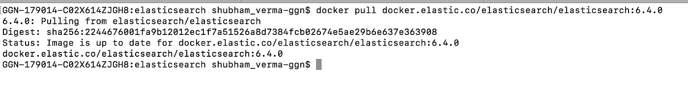

“码头工人拉 docker.elastic.co/elasticsearch/elasticsearch:6.4.0"命令的快照

注意:在上面的快照中，内容/信息可能有所不同，因为我已经为 Elasticsearch 提取了图像。所以，不要迷茫。

## **运行 Docker 镜像**

现在是时候使用下面的命令运行 Docker 映像了:

```
docker run -p 9200:9200 -p 9300:9300 -e "discovery.type=single-node" docker.elastic.co/elasticsearch/elasticsearch:6.4.0
```


运行以上命令的快照

默认情况下，该 Docker 运行在端口 9200 上。现在，打开浏览器，点击 URL `localhost:9200`并测试如下所示的消息:

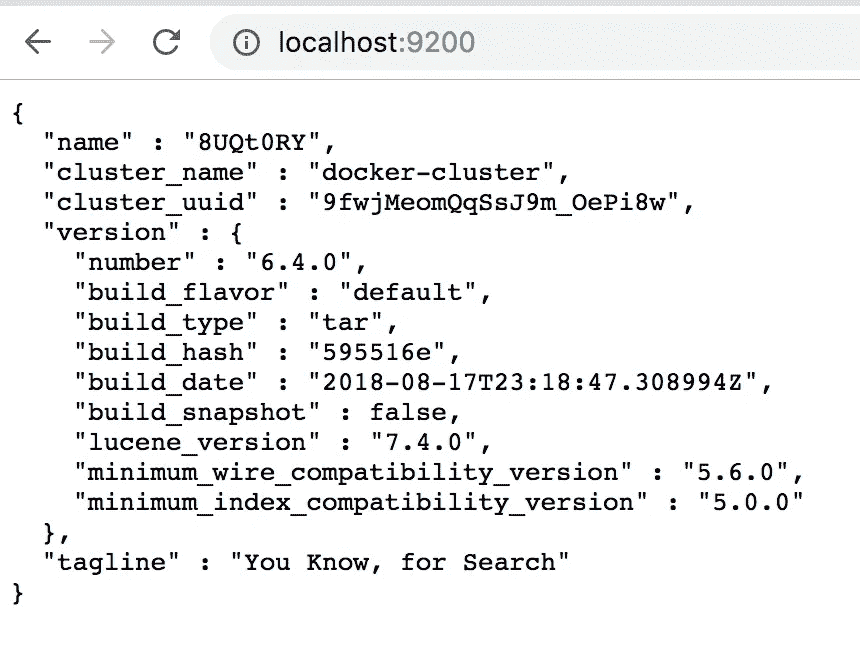

“本地主机:9200”的快照

上面的消息是一个很好的迹象，表明你在 Docker 上的 Elasticsearch 正在运行。

保持这个终端打开，不要关闭。如果您的 Elasticsearch 没有运行，您将会看到以下错误:

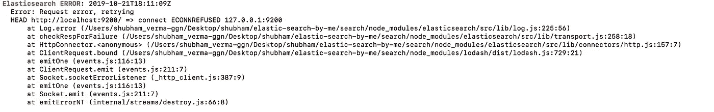

弹性搜索错误的快照:错误:请求错误，正在重试

# 为实时搜索创建一个巨大的数据存储

要创建一个巨大的数据库，需要从 [GitHub](https://github.com/geometalab/OSMNames/releases/download/v2.0/planet-latest_geonames.tsv.gz) 下载一个名为`planet-latest_geonames.tsv.gz`的文件，里面包含了大量的信息。

如果上述链接不起作用，则进入[该链接](https://github.com/OSMNames/OSMNames/releases)并下载文件`planet-latest_geonames.tsv.gz` 并解压。

检查文件名，应该是`planet-latest-100k_geonames.tsv`。如果不是，就改名为`planet-latest-100k_geonames.tsv`。

如果以上链接都不起作用，那么评论我，我会亲自分享/发送给你。

现在，复制这个文件并创建一个目录，`elasticsearch`，然后粘贴进去。

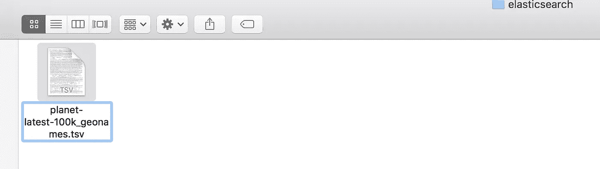

dir:planet-latest-100k _ geonames . tsv 快照

现在，我们有一个包含大量数据的巨大数据库。这是我们将对其执行索引的数据，以便我们可以实时执行搜索。

# 编写索引代码并开始使用 Elasticsearch

为上述数据库编写创建索引的代码，并开始使用 Elasticsearch。

创建一个名为`makeIndex.js`的文件，并将以下代码粘贴到其中:

代码:makeIndex.js

现在是时候执行`makeIndex.js`并使用这个命令创建索引了:

```
node makeIndex.js
```

如果您得到如下快照所示的错误:`No living connections`:

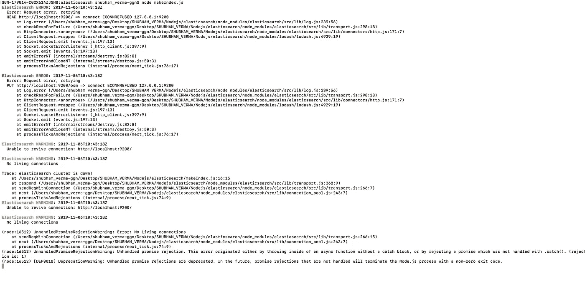

错误:没有活动连接

上述错误表明您没有任何 Elasticsearch 的活动连接，这意味着您的 Elasticsearch 没有在 Docker 上运行(检查`localhost:9200`)。

在这种情况下，你需要重复上面的步骤“用 Docker 运行 Elasticsearch”，直到在终端上执行命令`node makeIndex.js`时得到如下消息。

如果您收到如下快照所示的消息:`Elastic search`:


创建索引的快照。

一段时间后，索引将会完成。(完成索引可能需要一些时间。)

索引的数量可能与下面的快照不同，因为它取决于下载文件`planet-latest_geonames.tsv.gz`。

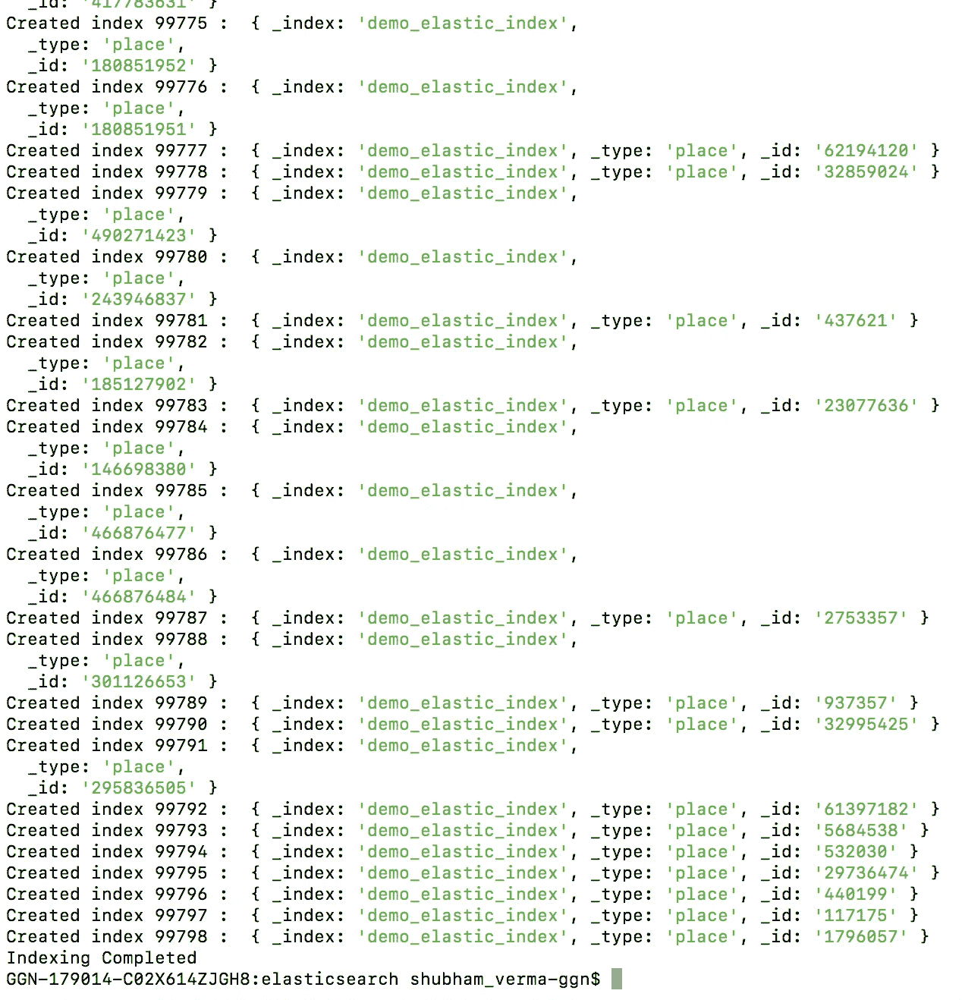

索引完成的快照。

如果您可以在终端上看到消息`Indexing Completed`，这意味着您的索引已经创建，现在您可以开始搜索了。

# 从上述索引中搜索数据

为了搜索索引`demo_elastic_index`中的数据，我们需要编写搜索数据的代码。因此，让我们创建一个文件`searchData.js`，并将下面的代码粘贴到这个文件中。

代码:searchData.js

*   //1:`query`参数表示查询上下文。
*   //2 和//3:`bool`和`match`子句在查询上下文中使用，这意味着它们用于对每个文档的匹配程度进行评分。
*   //4:`filter`参数表示过滤上下文。
*   //5 和//6:`term`和`range`子句用于过滤上下文。它们会过滤掉不匹配的文档，但不会影响匹配文档的分数。

现在，使用下面的命令运行上面的代码:

```
node searchData
```

您可以在下面看到结果:

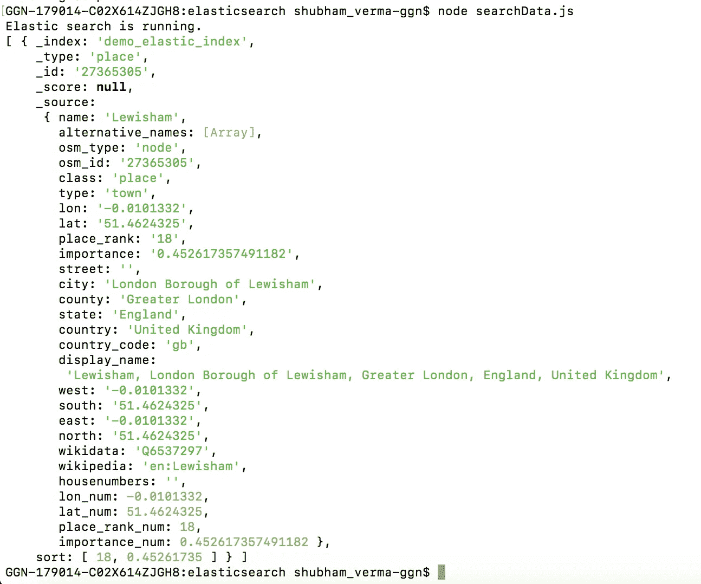

搜索结果

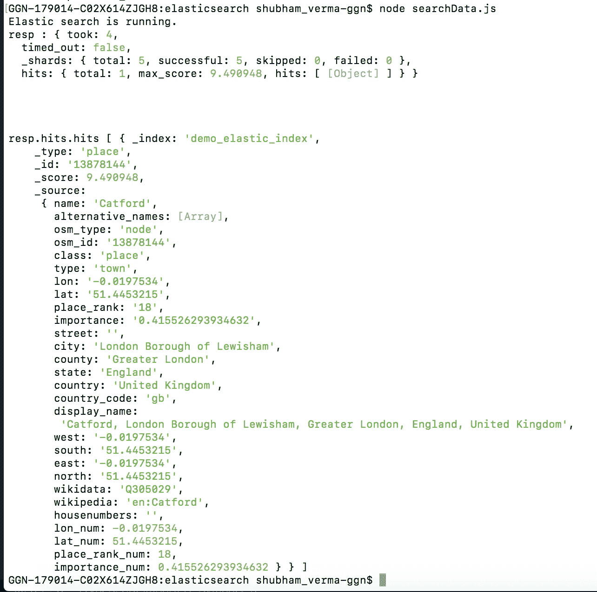

分数:每个文档的匹配程度。

一些其他查询及其结果:

代码:查询示例

# 删除索引

让我们删除所有的索引。

代码:deleteIndex.js

运行上面的代码:

```
node deleteIndex.js
```

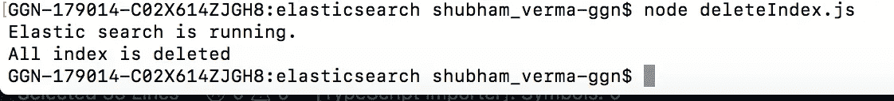

让我们现在搜索:

```
node searchData.js
```

您可以在终端中看到一条消息:

`Index not found`。(因为索引现在被删除了，所以您需要通过运行命令`node makeIndex.js`再次创建索引。)

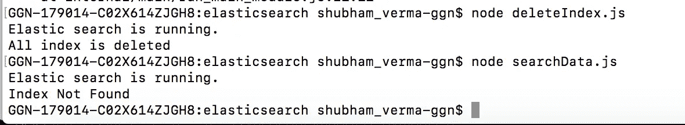

让我们再次创建索引:

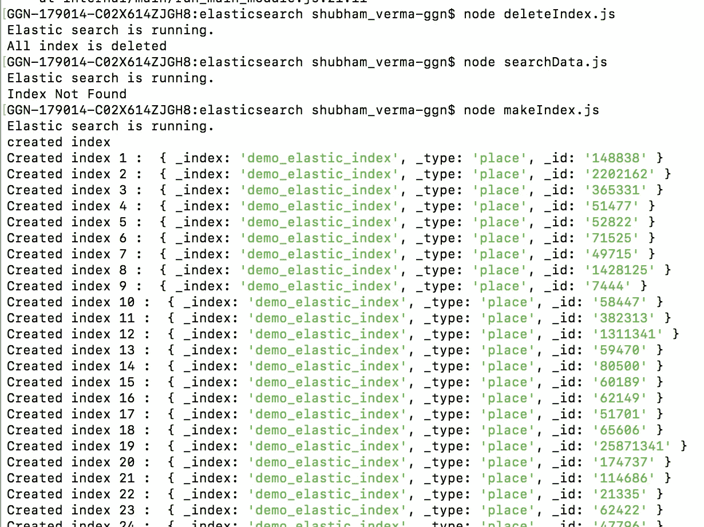

创建索引后，您可以使用`searchData`文件再次搜索数据。

所以，让我们享受 Elasticsearch 吧。感谢阅读。继续编码。