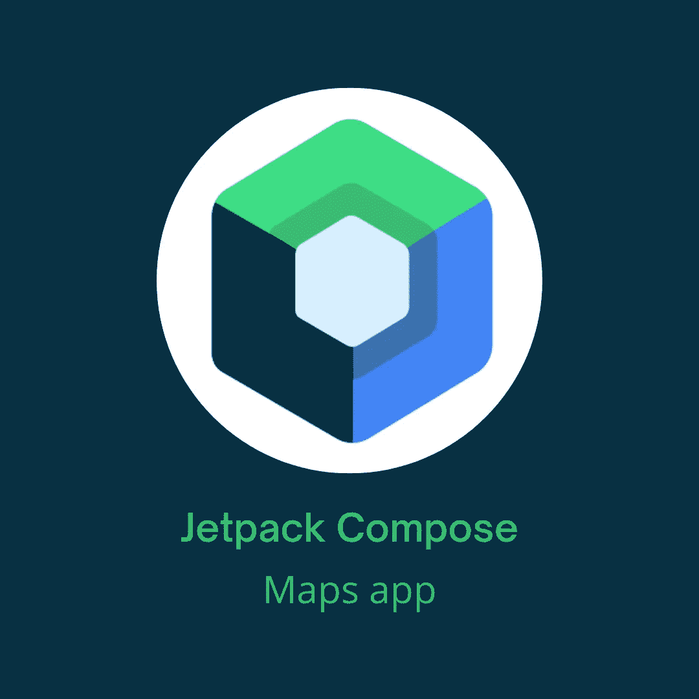

# 将谷歌地图集成到 Jetpack Compose 应用程序中

> 原文：<https://betterprogramming.pub/integrate-google-maps-into-the-jetpack-compose-app-c2710a226af2>

## Jetpack 合成+地图合成库



本图中使用的 Jetpack Compose 徽标是由 Google | base image 作者创建的[官方徽标](https://android-developers.googleblog.com/2020/08/announcing-jetpack-compose-alpha.html)

今天我们将讨论如何将地图集成到您的 Jetpack Compose 应用程序中。为此，我们将使用地图合成库。

> "地图合成库包含可合成的函数和数据类型，让您执行许多常见的任务."根据[地图组成图书馆官方文件](https://developers.google.com/maps/documentation/android-sdk/maps-compose)

首先，您需要按照本页上的说明获取 API 密钥:

[](https://developers.google.com/maps/documentation/android-sdk/get-api-key) [## 使用 API 键 Android 地图| Google 开发者

### 本主题介绍如何为 Android 版地图 SDK 创建 API 密钥，将其添加到您的应用程序，并通过以下方式保护应用程序

developers.google.com](https://developers.google.com/maps/documentation/android-sdk/get-api-key) 

接下来，让我们包括所需的依赖项:

```
implementation 'com.google.maps.android:maps-compose:2.7.2'
implementation 'com.google.android.gms:play-services-maps:18.1.0'
```

**注意:**检查这些依赖项是否有更新的版本。

接下来，在您的清单文件中，添加以下元数据:

```
<meta-data
    android:name="com.google.android.geo.API_KEY"
    android:value="${MAPS_API_KEY}" />
```

现在我们已经准备好在代码中实现地图了！

# 将地图集成到应用程序中

通过调用`GoogleMap()`，我们将在应用程序中显示地图。就这么简单！`GoogleMap`是`MapView`的合成容器。它允许我们在应用程序中显示地图。我们可以向这个 composable 传递许多参数，但所有参数都是可选的。

一些参数如下:

*   `cameraPositionState: CameraPositionState` —用于控制或观察地图的摄像头状态。
*   `googleMapOptionsFactory: () -> GoogleMapOptions` —创建地图时提供的用于创建`GoogleMapOptions`的块。
*   `properties: MapProperties` —地图的属性，如`isBuildingEnabled`、`isIndoorEnabled`、`isMyLocationEnabled`等。如果`isMyLocationEnabled`设置为真，那么我们需要请求精确和粗略位置的权限。要了解如何在 Jetpack compose 中请求位置权限，请查看我以前的文章之一。
*   `uiSettings: MapUiSettings` —地图上特定于 UI 的设置，如`compassEnabled`、`scrollGesturesEnabled`、`rotationGesturesEnabled`等。
*   各种兰姆达，像`onMapClicked`、`onMapLoaded`、`onMyLocationButtonClick`。

接下来，我们可以将相机状态设置为放大某个特定位置。

```
val cameraPositionState = *rememberCameraPositionState* **{** position = CameraPosition.fromLatLngZoom(LatLng(44.810058, 20.4617586), 16f)
**}**
```

我们也可以得到最后的位置或者当前的位置。有关该检查的更多信息，请查看本文档。

## 标记

如果我们想标记地点，例如，最近的加油站、酒店或任何你需要的东西，该怎么办？图书馆帮我们找到了。为此我们可以使用`Markers`。

`Marker` composable 有几个参数。我们将讨论最常用的，但也可以随意检查它们。

*   `state: MarkerState` —用于控制或观察标记状态，如其位置和信息窗口。
*   `draggable: Boolean` —设置标记的可拖动性。
*   `flat: Boolean` —设置标记是否应平放在地图上。
*   `icon: BitmapDescriptor` —设置标记的图标。
*   各种 lambdas，如`onClick`、`onInfoWindowClick`、`onInfoWindowClose`和`onInfoWindowLongClick`。

现在，让我们添加一些不同颜色的标记。代码如下:

您还可以从资源、资源、位图、文件等中获取标记的图标。如果您单击任何标记，您将看到一个带有标记标题的信息窗口。

## 多叉线

接下来我们要做的是在两点之间画一条线。为此我们可以使用`Polyline`。

它只有一个必需的参数，那就是纬度和经度列表。其他一些参数包括:

*   `clickable: Boolean` —布尔值，指示折线是否可点击
*   `color: Color` —折线的颜色
*   `startCap: Cap`-多段线起始顶点处的帽
*   `endCap: Cap`-多段线末端顶点处的帽子
*   `width: Float` —以屏幕像素为单位的折线宽度
*   `onClick: (Polyline) -> Unit`-单击折线时调用的 lambda

我们将只添加一条连接标记的折线:

最终的代码如下所示:

我们可以在地图上使用许多选项和组件，但现在没有必要一一介绍。你可以在官方文件中查看它们。

我们的`MapsApp`就到这里，我希望你从这篇文章中学到了一些新的东西，并喜欢它。

你可以在[我的 GitHub repo](https://github.com/Giga99/MediumRepos) 中找到所有的源代码。

```
**Want to Connect?**[GitHub](https://github.com/Giga99)
[LinkedIn](https://www.linkedin.com/in/igor-stevanovic/) [Twitter](https://twitter.com/igor_s1999)
[Portfolio website](https://giga99.github.io/portfolio-website/)
```

如果您想了解更多关于 Jetpack Compose 的信息，请阅读以下文章:

*   [在 Jetpack 排版中实现底部表单](/implement-bottom-sheet-in-jetpack-compose-d6472e8eaf2e)
*   [在 Jetpack Compose 中实现水平和垂直 view pager](/implement-horizontal-and-vertical-viewpager-in-jetpack-compose-a7a91f2ac746)
*   [使用 CameraX 在 Jetpack Compose 中构建相机 Android 应用](https://medium.com/better-programming/build-a-camera-android-app-in-jetpack-compose-using-camerax-4d5dfbfbe8ec)

此外，通过阅读本文，您可以了解如何使用拦截器在请求中包含访问令牌:

[](/android-access-token-logic-with-retrofit-okhttp-interceptors-740ea48547a0) [## Android 访问令牌逻辑和改进的 OkHttp 拦截器

### 使用 OkHttp 拦截器的访问令牌头逻辑

better 编程. pub](/android-access-token-logic-with-retrofit-okhttp-interceptors-740ea48547a0) 

# 资源

[](https://developers.google.com/maps/documentation/android-sdk/maps-compose) [## 地图合成库 Android 地图 SDK 谷歌开发者

### Jetpack Compose 是一个声明性的本地 UI 工具包，它简化并加速了 UI 开发。使用 Jetpack…

developers.google.com](https://developers.google.com/maps/documentation/android-sdk/maps-compose)