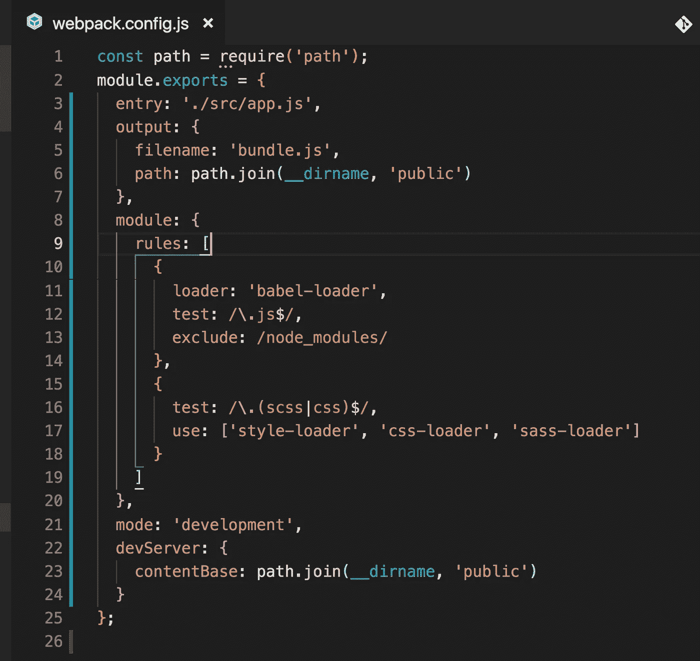
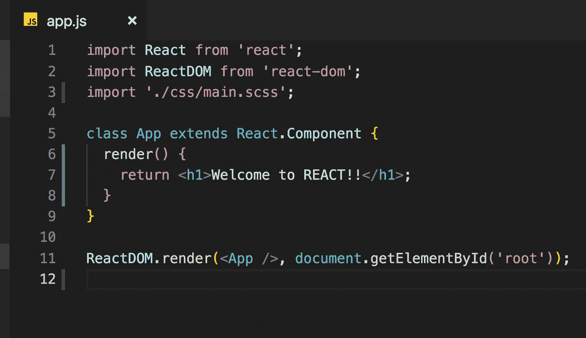
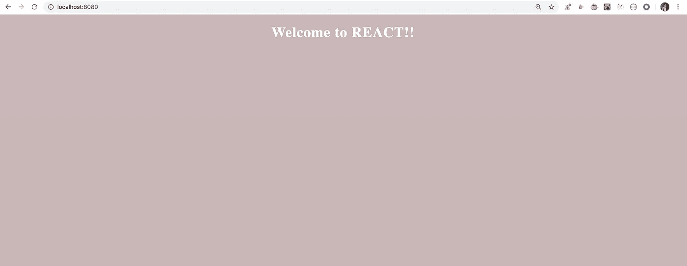

# 将 SASS 集成到 React 应用程序中

> 原文：<https://betterprogramming.pub/integrate-sass-into-your-react-application-5e7301b0f271>

## 了解如何轻松开始使用 SASS


[Filiberto Santillán](https://unsplash.com/@filijs?utm_source=medium&utm_medium=referral) 在 [Unsplash](https://unsplash.com?utm_source=medium&utm_medium=referral) 上拍摄的照片。

在当今快速发展的世界中，了解 [Sass](https://sass-lang.com/) 是 web 开发的一个重要部分——无论你是在 React、Angular 还是其他任何框架上工作。

如果你是 Sass 新手，你可以在[我之前的文章](https://medium.com/better-programming/an-introduction-to-sass-scss-fdbda159b40)中学习基本原理。

在本文中，我们将探索如何在 React 应用程序中开始使用 Sass。

首先，克隆我们在[本文](https://medium.com/javascript-in-plain-english/webpack-and-babel-setup-with-react-from-scratch-bef0fe2ae3e7)中创建的库，它描述了如何从头开始为 React 设置 webpack 和 babel。

克隆存储库后，从命令提示符或终端执行以下命令:

```
npm install style-loader@1.1.3 css-loader@3.4.2 sass-loader@8.0.2 node-sass@4.13.1
```

打开`webpack.config.js`并添加一个新对象，用于指定加载器:

```
{
 test: /\.(scss|css)$/,
 use: ['style-loader', 'css-loader', 'sass-loader']
}
```



1.测试条件通知 webpack 只查找以。scss 或. css。

2.`sass-loader`将在内部使用`node-sass`(我们已经在上面安装了)将 SCSS 文件转换成 CSS 文件。

3.`css-loader`将解析 css 文件的导入，我们将把它导入一个 JavaScript 文件。

4.`style-loader`将获取所有的 CSS 代码，并将`style`标签添加到 HTML 文件的`head`标签中。

注意:`use`数组中的加载程序只能是这个顺序:

```
['style-loader', 'css-loader', 'sass-loader']
```

它将从右到左进行评估，因此首先是`sass-loader`完成其工作，然后是`css-loader`，最后是`style-loader`。

现在用下面的 CSS 在 SRC/CSS 文件夹中创建一个名为`main.scss`的新文件:

在`ReactDOM`导入后，打开`src/app.js`并导入`main.scss`文件:

```
import './css/main.scss';
```



现在通过从命令提示符或终端运行`npm start`命令来启动您的应用程序:



厉害！现在您可以开始在 React 中使用 Sass 提供的所有优秀特性。

**注意:** *如果你正在使用* `*create-react-app*` *那么要使用 sass，你只需要安装* `*node-sass*` *npm 包。不需要任何加载程序或巴别塔配置。Create-react-app 会帮你处理的。*

参见 GitHub 上的完整源代码[。](https://github.com/myogeshchavan97/react_sass_setup)

今天到此为止。我希望你学到了新东西。

**别忘了订阅我的每周简讯，里面有惊人的技巧、窍门和文章，直接在这里的收件箱里** [**。**](https://yogeshchavan.dev/)