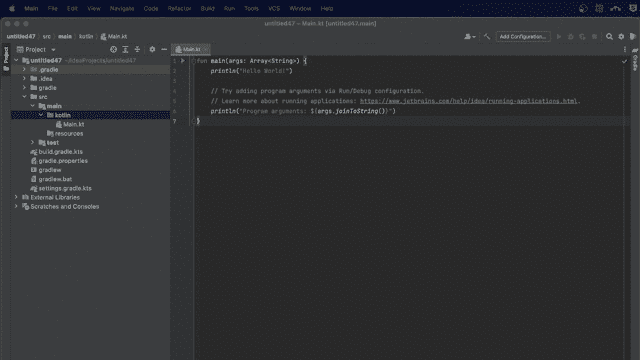
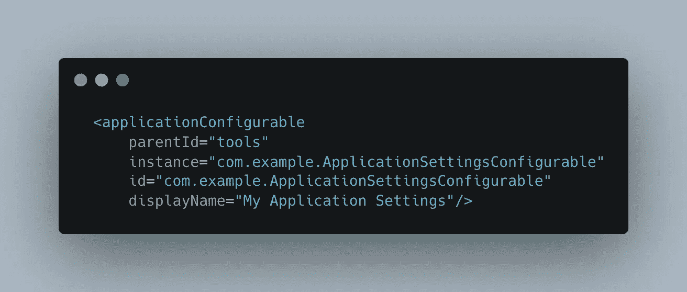
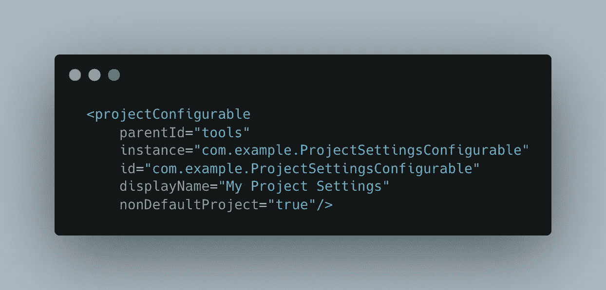
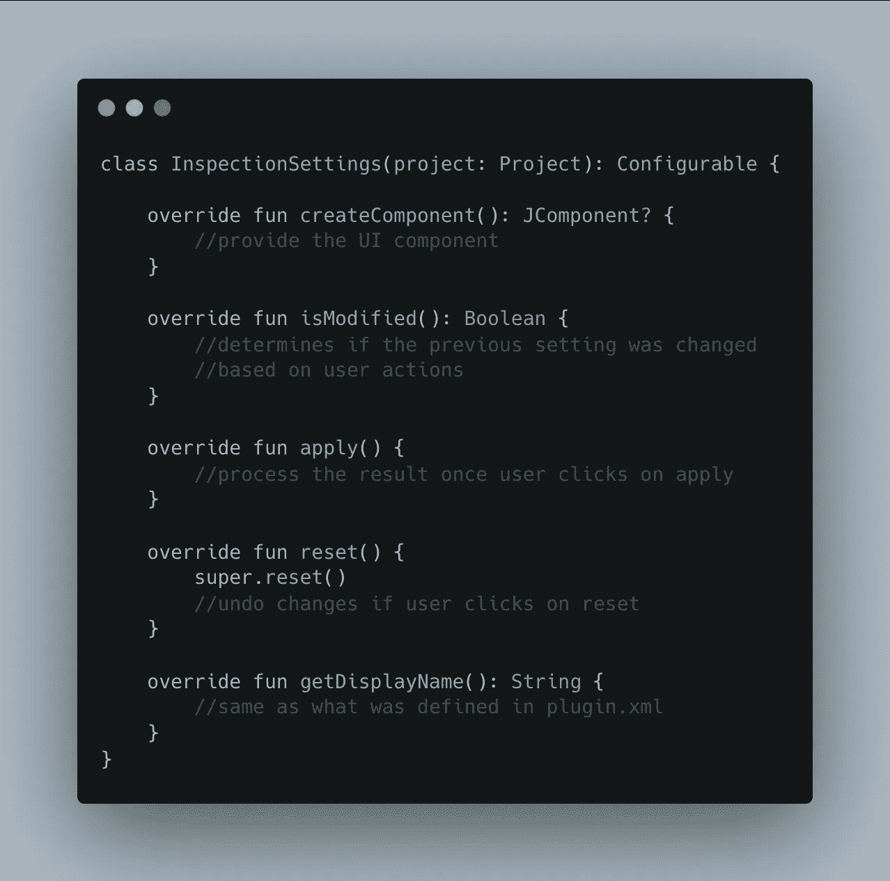
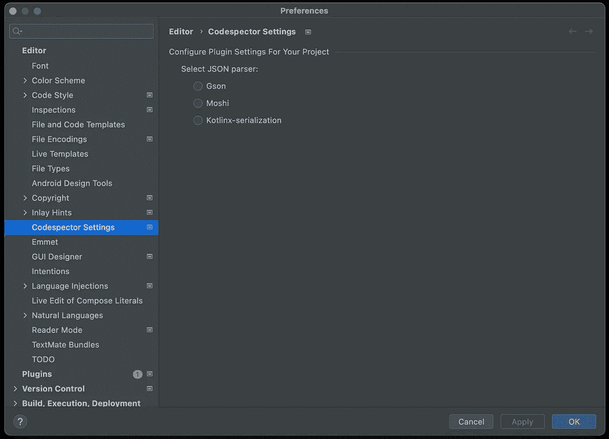
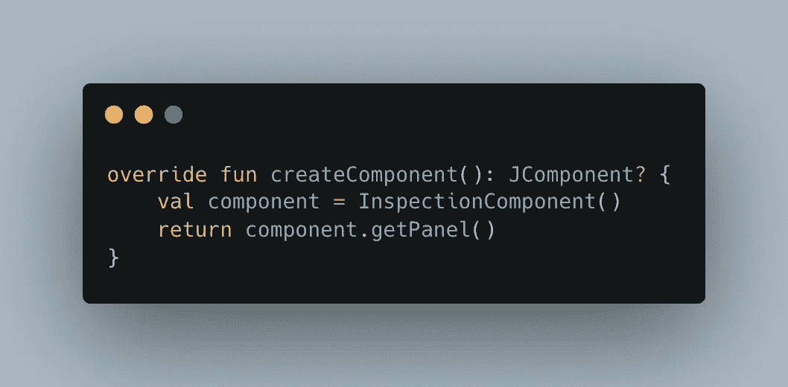
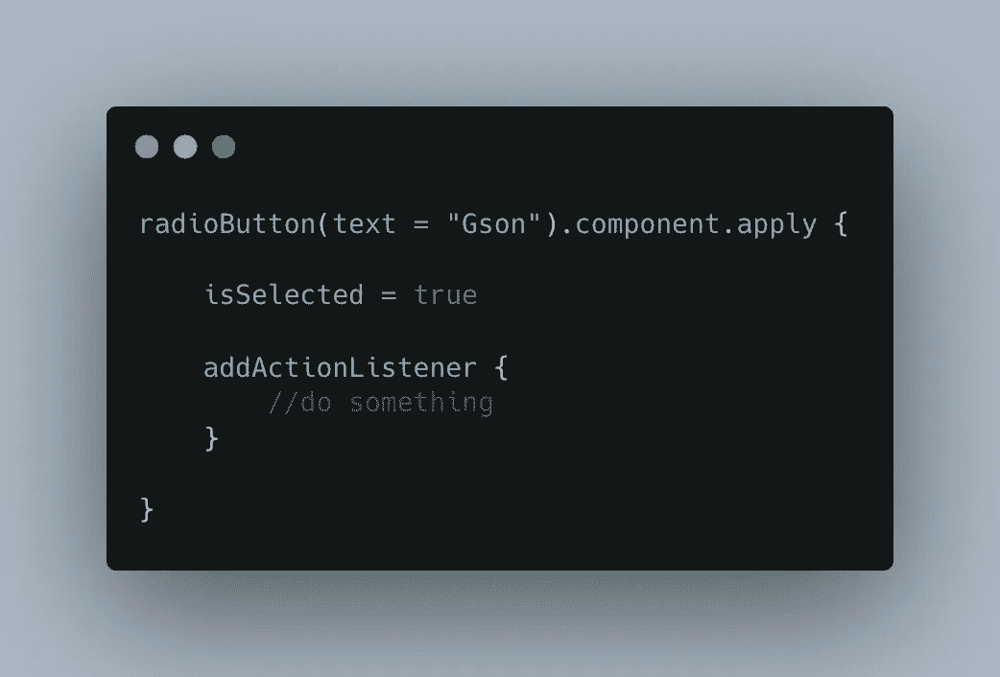
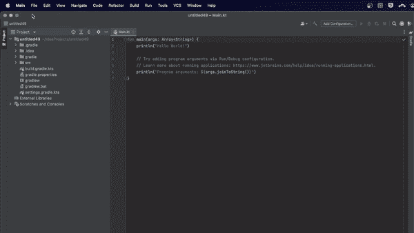
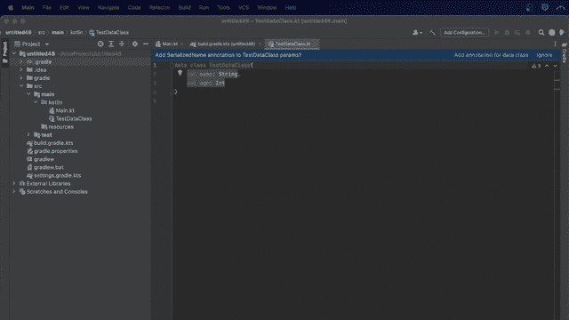

# 将设置集成到自定义 IntelliJ 代码检查插件中

> 原文：<https://betterprogramming.pub/integrate-settings-into-a-custom-intellij-code-inspection-plugin-47d845b1c9f5>

## 将设置 UI 添加到 Kotlin 数据类检查插件


照片由[哈维尔·阿莱格·巴罗斯](https://unsplash.com/es/@soymeraki?utm_source=unsplash&utm_medium=referral&utm_content=creditCopyText)在 [Unsplash](https://unsplash.com/s/photos/choices?utm_source=unsplash&utm_medium=referral&utm_content=creditCopyText) 拍摄

## 介绍

在[上一篇文章](/build-a-custom-intellij-code-inspection-plugin-c6973a6d3f3)中，我演示了如何创建自己的插件来检查缺失的 *SerializedName* 注释并将其添加到数据类参数中。如果你还没有通读这篇文章，我强烈建议你现在就通读。

在这篇文章中，我想告诉你如何扩展它来支持不同的解析库。目前我已经增加了对 [Moshi](https://github.com/square/moshi) 和 [Kotlinx-Serialization](https://github.com/Kotlin/kotlinx.serialization) 的支持。



行动中的合作伙伴

## 声明设置

*设置持久存储控制基于 IntelliJ 平台的 ide 的行为和外观的状态*。

插件设置应该在插件配置文件中定义。在插件工作区中，主要有两种类型的设置:

*   应用程序级别设置—这些设置在 IDE 级别有效，并且在所有项目中保持不变。



应用程序级别设置

*   项目级别设置—这些设置在项目级别有效，不同的项目可能会有所不同。



项目级别设置

让我们试着理解声明这些设置所需的属性。

`parentId` —需要显示该设置的父组。您可以参考[父 ID 属性](https://plugins.jetbrains.com/docs/intellij/settings-guide.html#values-for-parent-id-attribute)来查看所有可接受的值。

`instance` —这是最重要的属性。设置类应该提供一个`[Configurable](https://upsource.jetbrains.com/idea-ce/file/idea-ce-6ed4281aa53e1672d2e5870243c6606bb48afc84/platform/ide-core/src/com/intellij/openapi/options/Configurable.java?_ga=2.259198858.1283209720.1658170920-2036414270.1644938104&_gl=1*1p2xmvc*_ga*MjAzNjQxNDI3MC4xNjQ0OTM4MTA0*_ga_9J976DJZ68*MTY1ODI1MTM2Ny44NC4xLjE2NTgyNTMwODUuMA..)`接口的实现，该属性的值是该实现的全限定名。

`id` —该设置的唯一标识符。可以提供完全限定的名称以保持唯一性。

`displayName` —显示给用户的设置名称。

您可以在这里看到所有可用的设置属性[。](https://plugins.jetbrains.com/docs/intellij/settings-guide.html#table-of-attributes)

了解了插件设置的基本知识，你能猜出`Codespector`插件需要哪种类型的设置吗？

如果你猜对了**项目等级**的设置，那么你绝对是对的！我们希望用户选择项目中使用的解析器，以便插件可以检查正确的缺失注释。有可能一个项目使用 Gson 解析 JSON，而另一个项目使用 Moshi 或其他库。

项目级插件设置

现在让我们继续创建实现`Configurable`接口的`InspectionSettings`类。



初始设置实施

让我们试着为每个方法提供实现。

## 创建设置用户界面

为插件创建 UI 的最佳方式是通过 [Kotlin DSL 版本 2](https://plugins.jetbrains.com/docs/intellij/kotlin-ui-dsl-version-2.html) 。这里需要注意的是，该 API 仅在版本 **2021.3 和更高版本**中可用。目前`Codespector`插件可以安装在 IDEs 2019.3 及更高版本中。因此，我们将使用 [Kotlin DSL 版本 1](https://plugins.jetbrains.com/docs/intellij/kotlin-ui-dsl.html) 来创建我们的 UI，该 UI 自 2019.2 版本起就有支持。

让我们直接进入代码:

初始设置用户界面

我们有一个标题，副标题和 3 个单选按钮。运行这段代码时，用户界面如下所示:



初始设置用户界面

回到我们的设置实现，我们可以提供如下组件:



提供检查组件

在此阶段，让我们尝试回答以下问题:

*   当一个选项被选中时会发生什么？
*   当用户点击应用设置时会发生什么？
*   当用户点击重置设置时会发生什么？
*   我们如何才能真正持久化项目的设置呢？

## 保持项目设置

IntelliJ 平台提供了一个名为`[PersistentStateComponent](https://upsource.jetbrains.com/idea-ce/file/idea-ce-6ed4281aa53e1672d2e5870243c6606bb48afc84/platform/projectModel-api/src/com/intellij/openapi/components/PersistentStateComponent.java?_ga=2.201023918.1601455964.1658343243-2036414270.1644938104&_gl=1*1u32z96*_ga*MjAzNjQxNDI3MC4xNjQ0OTM4MTA0*_ga_9J976DJZ68*MTY1ODQyNzAwMi44OC4xLjE2NTg0MjcwNTMuMA..)`的 API，用于跨项目和 IDE 重启保持状态。根据[文件](https://plugins.jetbrains.com/docs/intellij/persisting-state-of-components.html#using-persistentstatecomponent)您可以如下使用`PersistentStateComponent`:

*   标记一个实现`PersistentStateComponent`接口的服务
*   定义一个状态类—*`*PersistentStateComponent*`*的实现需要用状态类的类型参数化。state 类可以是单独的 JavaBean 类，也可以是实现* `*PersistentStateComponent*` *的类。**
*   *使用`@State`注释定义存储位置。*

*第一步是在插件配置文件中声明服务。主要有三种类型的服务:*应用级*、*项目级*和*模块级*。由于我们正在使用项目级设置，我们也需要一个项目级服务。*

*项目级服务*

*实现如下:*

*`PersistentStateComponent implementation`*

*既然设置持久性已经就绪，让我们使用它来根据用户输入选择正确的单选按钮，并应用/重置设置。*

## *应用设置*

*我们想要的第一件事是听单选按钮的选择。我们可以在`ActionListener`的帮助下做到这一点。我们可以借助`setSelected(Boolean)`判断单选按钮是否被选中。*

**

*单选按钮*

*更新后的`InspectionComponent`如下:*

*InspectionComponent.kt*

*现在运行插件代码会产生以下输出:*

**

*选择设置*

*既然我们能够听到单选按钮，让我们看看如何应用设置。*

*为了使应用按钮可被选择，我们首先必须在`InspectionSettings`中提供`isModified()`方法的实现，并应用我们必须实现的`apply()`方法的设置。*

*InspectionSettings.kt*

*现在运行插件代码，给出以下输出:*

**

*应用设置*

*应用新设置后，有两点需要注意:*

*   *现有的编辑器通知应该更新— *给类参数添加 X 注释**
*   *突出显示应该突出显示正确的问题，并提供更新的快速修复— *缺少 X 注释**

*重置通知和代码分析*

*您可以在这个资源库中找到这个插件的完整源代码。*

*[](https://github.com/rubenquadros/codespector) [## GitHub-rubenquadros/code spector:一个用于 IntelliJ 产品的 Kotlin 数据类检查插件

### 这是一个做代码检查的 IntelliJ 插件。它检查 Kotlin 数据类并检查每个参数是否…

github.com](https://github.com/rubenquadros/codespector) 

你也可以从 IntelliJ 市场获得这个插件。

[](https://plugins.jetbrains.com/plugin/19430-codespector) [## Codespector - IntelliJ IDEs 插件|市场

### Codespector 插件帮助您检测 kotlin 数据类中缺失的注释，并添加它们。

plugins.jetbrains.com](https://plugins.jetbrains.com/plugin/19430-codespector) 

如果你想在插件中处理任何额外的检查，请随时联系我。你可以通过创建一个问题或开始一个关于回购的讨论来做到这一点。我还会尝试在插件中包含错误报告，敬请关注！

感谢阅读！

```
**Want to Connect?**You can also connect with me on [LinkedIn](https://www.linkedin.com/in/ruben-quadros-b87995173/).We at ShareChat are constantly working on making our apps better across all our clients: Android, iOS and Web. If you are interested in building ShareChat/Moj or solving interesting problems, [let us know by applying here](https://sharechat.hire.trakstar.com/)!
```

## 额外资源

*   [IntelliJ 文档](https://plugins.jetbrains.com/docs/intellij/settings.html)深入了解设置。
*   [IntelliJ 文档](https://plugins.jetbrains.com/docs/intellij/user-interface-components.html)了解更多关于创建 UI 的信息。
*   [IntelliJ UI 指南](https://jetbrains.design/intellij/)用于创建一致的 UI。
*   [插件开发论坛](https://intellij-support.jetbrains.com/hc/en-us/community/topics/200366979-IntelliJ-IDEA-Open-API-and-Plugin-Development)查看问题并寻求帮助。
*   [众多开源插件的 GitHub repo](https://github.com/JetBrains/intellij-plugins) 。*