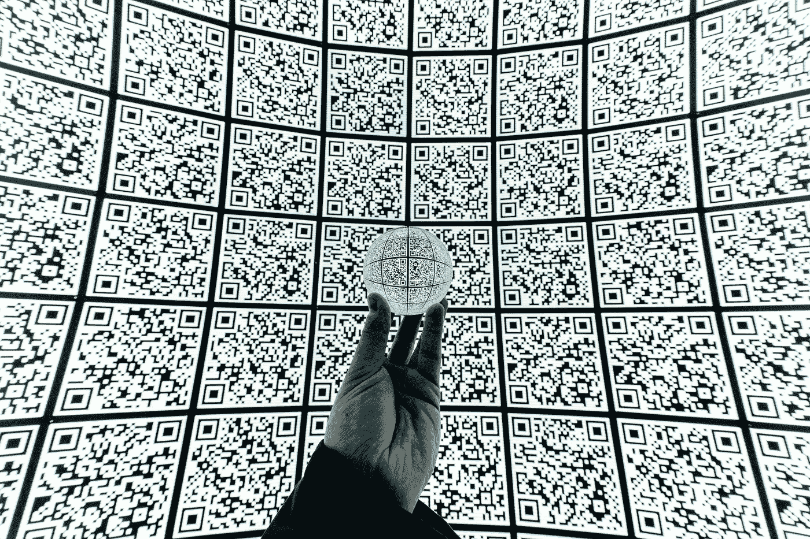
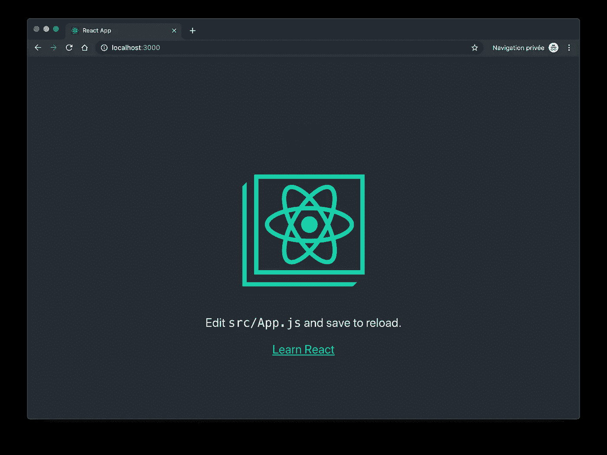
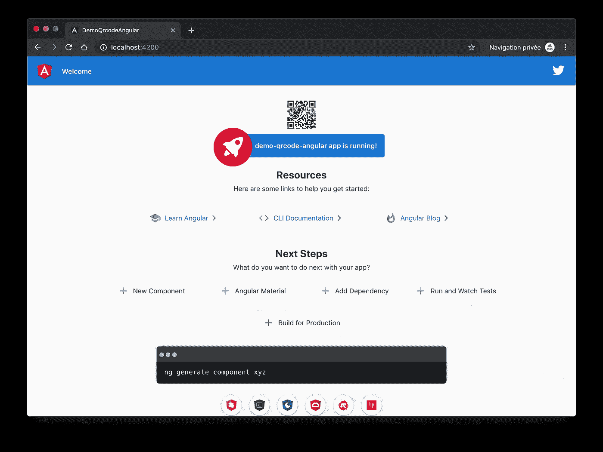
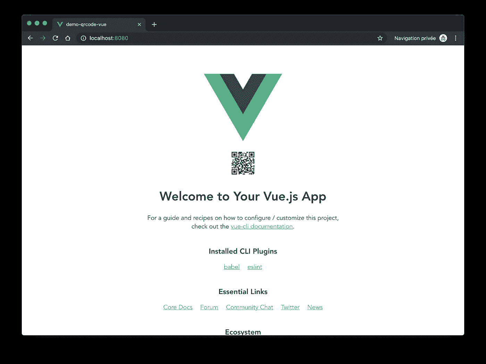

# 在 React、Angular 或 Vue.js 中集成一个二维码 Web 组件

> 原文：<https://betterprogramming.pub/integrate-the-same-qr-code-web-component-in-react-angular-or-vue-f282e7cff075>

## 比较和对比框架中的差异



由[米蒂亚·伊万诺夫](https://unsplash.com/@aka_opex?utm_source=unsplash&utm_medium=referral&utm_content=creditCopyText)在 [Unsplash](https://unsplash.com/s/photos/qr-codes?utm_source=unsplash&utm_medium=referral&utm_content=creditCopyText) 拍摄的照片

web 组件的一个很酷的特性是，它们可以集成到任何现代 web 应用程序中，不管它们是否使用框架。

我必须对我们在 [DeckDeckGo](https://deckdeckgo.com) 中使用的 QR code Web 组件进行一些改进，所以我认为展示它如何跨框架使用会很有趣。

我对 React 和 Vue 还不是很有经验，所以这对我来说也是一种提高技能的有趣方式！

# 介绍

我们将要使用的 Web 组件是我用 [StencilJS](https://stenciljs.com/) 围绕由 [Kazuhiko Arase](https://github.com/kazuhikoarase) 开发的[生成器](https://github.com/kazuhikoarase/qrcode-generator)实现的包装器。它的包名是`@deckdeckgo/qrcore`。

在接下来的章节中，我们将把组件集成到用 [React](https://reactjs.org) 、 [Angular](https://angular.io) 和 [Vue](https://vuejs.org) 开发的三个不同的启动器应用程序中。

不管是什么框架，流程都是一样的:

1.  使用初学者工具包创建新的应用程序
2.  用 [npm](https://www.npmjs.com) 安装组件
3.  在应用程序中导入组件
4.  渲染组件
5.  启动应用程序
6.  在浏览器中测试它

让我们开始吧。

# 反应

用于构建用户界面的 JavaScript 库(来源:[*https://reactjs.org*](https://reactjs.org)*)。*

## 1.使用初学者工具包创建新的应用程序

为了创建一个新的 React 应用程序，我们使用官方 CLI 项目 [create-react-app](https://github.com/facebook/create-react-app) 并运行以下命令(“demo-qrcode-react”是我们项目的名称):

```
$ npx create-react-app demo-qrcode-react
```

这个过程可能需要一段时间(需要获取超过 1500 个依赖项),但是一旦完成，我们就可以进入新创建的项目了:

```
$ cd demo-qrcode-react
```

## 2.使用 npm 安装组件

我们现在可以通过运行以下命令将 Web 组件添加到项目中:

```
$ npm install @deckdeckgo/qrcode --save
```

请注意，组件是不可知的，因此不需要获取其他依赖项并将其添加到项目中。

## 3.在应用程序中导入组件

在本文的所有示例中，我们将在主应用程序中导入组件。值得注意的是，用 StencilJS 构建和发布的组件是延迟加载的，因此被优化以匹配应用程序的最佳性能。

在 React 的特殊情况下，我们将在`src/index.js`中导入组件，并按照[文档](https://stenciljs.com/docs/react)中显示的那样继续，分别用加载器导入它并将其定义为自定义元素。

```
import React from 'react';
import ReactDOM from 'react-dom';
import './index.css';
import App from './App';
import * as serviceWorker from './serviceWorker';// A. We import our loader
import { applyPolyfills, defineCustomElements }
  from '@deckdeckgo/qrcode/dist/loader';ReactDOM.render(<App />, document.getElementById('root'));
serviceWorker.unregister();// B. We load our component
applyPolyfills().then(() => {
  defineCustomElements(window);
});
```

## 4.渲染组件

我们的配置已经设置好了，现在我们可以享受一下乐趣，严格地说，在我们的应用程序中实现组件。所以我们将它添加到主`src/App.js`:

```
import React from 'react';
import './App.css';function App() {
  return (
    <div className="App">
      <header className="App-header">

        <deckgo-qrcode content="https://reactjs.org">
        </deckgo-qrcode> </header>
    </div>
  );
}export default App;
```

## 5.启动应用程序

我们的组件已经导入并集成，现在我们可以测试我们的实现并运行应用程序:

```
$ npm run start
```

## 6.在浏览器中测试它

如果一切按计划进行，我们的应用程序和二维码应该已经部署好，可以在我们的浏览器中访问，地址是`http://localhost:3000`。



我们用 React 测试的结果

# 有角的

*一个框架。手机&桌面。(来源:*[*https://angular . io*](https://angular.io)*)。*

## 1.使用初学者工具包创建新的应用程序

要使用 Angular 创建新的应用程序，我们首先必须在我们的计算机上全局安装他们的 CLI:

```
$ npm install -g @angular/cli
```

一旦安装完毕，我们就可以继续创建我们的入门应用程序(“demo-qrcode-angular”是这个项目的名称)。

```
$ ng new demo-qrcode-angular
```

注意，对于我们的测试，路由不是强制性的，样式方法也不相关。该操作将再次花费一些时间，因为必须获取近 1500 个依赖项。一旦完成，我们就进入新创建的项目。

```
cd demo-qrcode-angular
```

## 2.使用 npm 安装组件

和以前一样，我们使用以下命令从 npm 安装组件:

```
$ npm install @deckdeckgo/qrcode --save
```

## 3.在应用程序中导入组件

当谈到 Angular 时，我不确定它是否仍然是强制性的，但在导入它之前，我们首先要告诉 Angular 允许使用自定义元素 schema。为了实现这个目标，我们修改了`src/app/app.module.ts`:

```
import { BrowserModule } from '@angular/platform-browser';
import { CUSTOM_ELEMENTS_SCHEMA, NgModule } from '@angular/core';
import { AppComponent } from './app.component';@NgModule({
  declarations: [AppComponent],
  imports: [BrowserModule],
  providers: [],
  bootstrap: [AppComponent],
  schemas: [CUSTOM_ELEMENTS_SCHEMA]
})
export class AppModule { }
```

注意`CUSTOM_ELEMENTS_SCHEEMA`需要包含在任何使用定制元素的模块中。

最后，通过使用加载器并在`src/main.ts`应用程序中定义我们的元素，我们导入我们的组件，如[文档](https://stenciljs.com/docs/angular)所示:

```
import { enableProdMode } from '@angular/core';
import { platformBrowserDynamic } from '@angular/platform-browser-dynamic';import { AppModule } from './app/app.module';
import { environment } from './environments/environment';// A. We import our loader
import { applyPolyfills, defineCustomElements }
  from '@deckdeckgo/qrcode/dist/loader';if (environment.production) {
  enableProdMode();
}platformBrowserDynamic().bootstrapModule(AppModule).catch(err => console.error(err));// B. We load our component
applyPolyfills().then(() => {
  defineCustomElements(window);
});
```

## 4.渲染组件

现在，我们可以在应用程序中实现该组件了。Angular 是基于 HTML 模板的，我们将把它添加到主应用程序`src/app/app.component.html`中，放在页面内容的顶部。

```
<div class="content" role="main">
    <deckgo-qrcode content="https://angular.io"></deckgo-qrcode>
</div>
```

## 5.启动应用程序

要运行我们的应用程序，我们可以再次运行默认命令:

```
$ npm run start
```

## 6.在浏览器中测试它

我们的应用程序和 QR 码现在应该已经部署好了，可以在我们的浏览器中访问，地址是`[http://localhost:4](http://localhost:3000)200`。



我们用 Angular 测试的结果

# 某视频剪辑软件

*渐进式 JavaScript 框架(来源:*[*https://vuejs.org*](https://vuejs.org)*)。*

## 1.使用初学者工具包创建新的应用程序

要用 Vue 创建一个新的应用程序，我们可以使用一个样板文件，但是要像用 Angular 一样继续，我们首先在我们的机器上全局安装他们的 CLI。

```
$ npm install -g @vue/cli
```

然后我们继续创建我们的应用程序(“demo-qrcode-vue”是这个项目的名称)。

```
$ vue create demo-qrcode-vue
```

这可能需要一些时间(但比以前少一点时间，因为只需要获取大约 1300 个依赖项)。一旦所有东西都安装好了，我们就进入新创建的项目:

```
cd demo-qrcode-vue
```

## 2.使用 npm 安装组件

我们从 npm 安装组件的方式与我们安装其他两个框架的方式完全相同:

```
$ npm install @deckdeckgo/qrcode --save
```

## 3.在应用程序中导入组件

除了使用加载器导入和定义我们的组件之外，正如我们之前所做的，我们还必须指示 Vue 编译器忽略我们的自定义元素标签。为此，我们应该修改`src/main.js`，如[文档](https://stenciljs.com/docs/vue)所示:

```
import Vue from 'vue'
import App from './App.vue'// A. We import our loader
import { applyPolyfills, defineCustomElements }
  from '@deckdeckgo/qrcode/dist/loader';Vue.config.productionTip = false// C. Tell  the compiler to ignore our custom element tag
Vue.config.ignoredElements = [/deckgo-\w*/];new Vue({
  render: h => h(App),
}).$mount('#app')// B. We load our component
applyPolyfills().then(() => {
  defineCustomElements(window);
});
```

## 4.渲染组件

我们现在可以将组件添加到主`src/App.vue`模板中，以便在我们的应用程序中呈现 QR 码。由于第一个页面的组件已经通过创建 starter kit 创建了，所以让我们在模板`src/components/HelloWorld.vue`的根元素的开头添加我们的组件:

```
<template>
  <div class="hello">
    <deckgo-qrcode content="https://vuejs.org"></deckgo-qrcode>
  </div>
</template>
```

## 5.启动应用程序

Vue 初学者工具包中没有默认的“开始”目标，所以让我们运行以下命令来启动我们的应用程序:

```
$ npm run serve
```

## 6.在浏览器中测试它

好了，最后的测试！我们的应用程序和 QR 码现在应该已经部署在我们的浏览器中，可以在地址`[http://localhost:](http://localhost:3000)8080.`访问



我们用 Vue 测试的结果

# 结论

我认为从这个小经验中最有趣的收获是注意到导入和使用 Web 组件几乎是完全相同的方法和体验，不管是什么框架。除了拥有跨技术无缝工作的完全相同的组件和代码的明显商业优势之外，它还给了我一种有趣的感觉，即它们，Web 组件，可能是让我更容易地从一个项目跳到另一个项目的缺失环节。我不知道你是否有同感，我很乐意听听你的想法。

## 蛋糕上的樱桃

我们刚刚使用的 QR code Web 组件提供了许多样式选项(使用 CSS4 变量),甚至能够在其上显示徽标。而且，它是开源的。所以，如果你需要这样一个组件或者有任何改进的想法，去做吧，从[文档](https://docs.deckdeckgo.com/components/qrcode/)开始。

到无限和更远的地方！

大卫