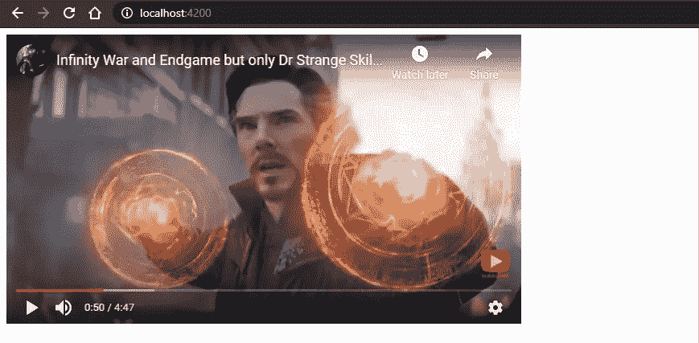

# 在 Angular 中集成 YouTube 的 IFrame 播放器 API

> 原文：<https://betterprogramming.pub/integrate-youtubes-iframe-player-api-in-angular-4e87f0ec98f4>

## 在 Angular 应用程序中添加 YouTube IFrame 播放器的简单指南


照片由 [Szabo Victor](https://unsplash.com/@vmxhu) 在 [Unsplash](https://unsplash.com/) 上拍摄

当涉及到将 YouTube IFrame Player API 与像 [Angular](https://angular.io/) 这样的基于组件的框架集成时，有点困难和棘手。在这里，我们将看看如何实现这一点。我将尝试讨论我在将 YouTube IFrame 播放器 API 集成到我的 Angular 应用程序中时所面临的所有问题和挑战。

首先，让我们使用下面的命令创建一个虚拟的 Angular 应用程序。如果您已经有一个正在运行的应用程序，只需跳过这一步。

```
ng new YTIFrameAPI-with-Angular
```

一旦应用程序准备好了，在你的模板文件中创建一个带有`id="player"`(或者任何你想要的东西)的 div，就像这样:

**注:**当然，你也可以根据自己的需求来更改模板。只要确保 div 有一个`id`就行了，因为 iframe(和视频播放器)将替换这个 div。

现在，声明一些有用的变量并创建一个`init`函数来初始化 YouTube IFrame API，如下所示:

`init()`中的代码用于加载 API 的 JavaScript 代码。如上所示，当 API 准备好时，我们调用`startVideo()`。该方法将定义一个全局变量`"player"`，该变量引用您要嵌入的视频播放器，然后该函数构造视频播放器对象。

现在，一旦玩家准备好了，就会调用`onPlayerReady()`。在本例中，我们只是在播放器准备好之后播放视频，就像这样:

使用 API，我们可以跟踪播放器何时改变其状态。当玩家的状态改变时，API 将调用`onPlayerStateChange()`，这可能表示玩家正在播放、暂停、结束等等。如果你想在播放器改变状态时执行一些动作，这可能对你有用。

注意:在下面的代码片段中，我们有两个额外的方法，`cleanTime()`和`onPlayerError(event)`。这些方法分别用于读取和计算播放器的当前时间戳以及记录错误。

现在，简单地使用组件的`ngOnInit()`方法初始化一个视频 ID，并调用`init()`方法。

现在，如果您运行`ng serve`并转到`localhost` URL，您会看到播放器已创建，其中嵌入了一个 YouTube 视频。

在我的例子中，它看起来像这样:



**注:**为了这个演示，我用的是来自[复仇者联盟的电影剪辑 YouTube 频道](https://www.youtube.com/channel/UCktqmIbWa_nMaAgQcRfOEWg)的 [YouTube 视频](https://www.youtube.com/watch?v=EY6cOlFPkpU)。

# 我在整合过程中遇到的一些问题

## HTML5 `'video’` 元素

某些移动浏览器(如 Chrome 和 Safari)中的 HTML5 `<video>`元素只允许播放由用户交互启动的内容(如点击播放器)。以下是摘自[苹果文档](https://developer.apple.com/library/safari/#documentation/AudioVideo/Conceptual/Using_HTML5_Audio_Video/AudioandVideoTagBasics/AudioandVideoTagBasics.html):

> 警告:为了防止用户付费通过蜂窝网络进行未经请求的下载，嵌入的媒体不能在 iOS 上的 Safari 中自动播放—用户总是会启动回放

由于这一限制，诸如`autoplay`、`playVideo()`和`loadVideoById()`之类的功能和参数将无法在所有移动环境中工作。

为了解决这个问题，我只是在受限设备上播放视频之前将视频静音，就像这样:

所以基本上我是在检查我的应用程序在哪个设备上运行，如果是 iPhone、iPad、iPod 或 Android，我只是在播放前将视频静音。

**注意:** [这里的](https://developers.google.com/youtube/iframe_api_reference#Mobile_considerations)是所有关于移动设备限制的详细内容。

## API 和注册页面的问题

让我们讨论我面临的另一个问题。

所以基本上在我的应用中，一旦用户提交注册表单，一个 API 就会被点击。在等待 API 服务器的响应时，我必须为用户播放一段视频。如果我们在 API 上取得了成功，那就没有问题了。但是，如果在 API 端出现问题，我们只需将它们重定向到注册页面。现在，如果用户再次提交而不做任何更改，视频将不会显示。

这是因为，第二次，播放器已经被创建了，但是当我们调用等待组件时，它试图再次创建播放器。所以基本上，API 无法调用`window['onYouTubeIframeAPIReady']`。

为了解决这个问题，让我们在再次初始化 YouTube IFrame 播放器之前设置一个条件。如果播放器已经创建，只需播放视频。如果没有，就从 YouTube 播放器的初始化开始。

# 结论

这就是这篇文章的内容。我希望这有所帮助。最终代码可以在 GitHub 上找到。点击链接:

[](https://github.com/gouravkajal/YTIFrameAPI-with-Angular) [## gouravkajal/YTIFrameAPI-带角度

### 此项目是使用 Angular CLI 版本 11.0.2 生成的。为开发服务器运行 ng serve。导航到…

github.com](https://github.com/gouravkajal/YTIFrameAPI-with-Angular) 

感谢阅读！

# **参考文献**

*   [“YouTube 播放器 iframe 参考嵌入](https://developers.google.com/youtube/iframe_api_reference)”通过谷歌开发者
*   [复仇者联盟的电影片段 YouTube 频道](https://www.youtube.com/channel/UCktqmIbWa_nMaAgQcRfOEWg)