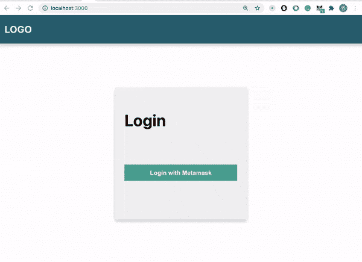
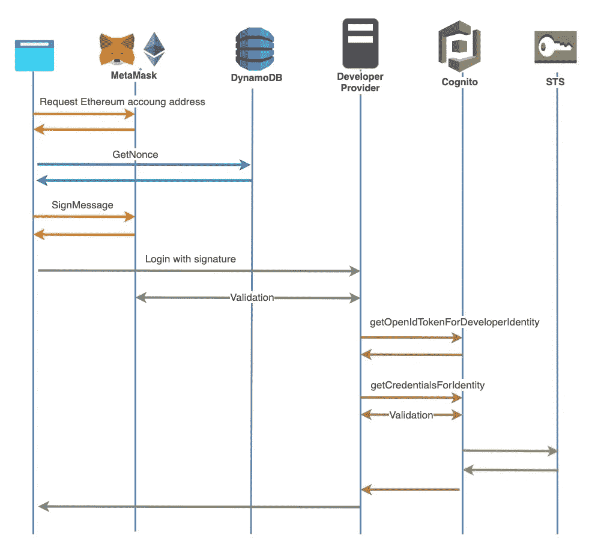
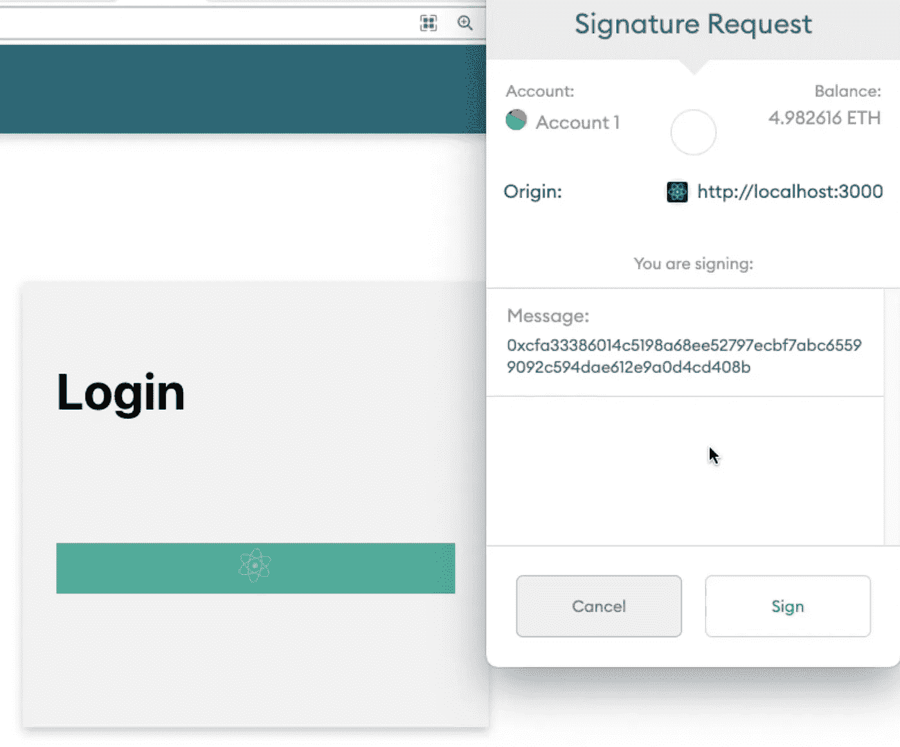
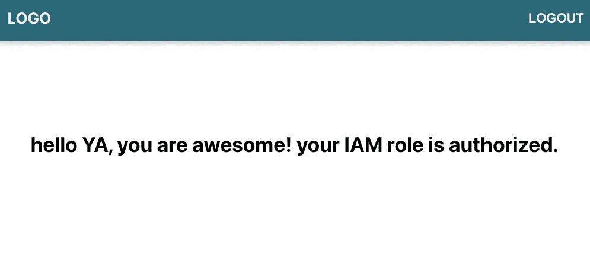

# 将 Amazon Cognito 与以太坊区块链集成

> 原文：<https://betterprogramming.pub/integrating-amazon-cognito-with-ethereum-blockchain-7e87f1425422>

## 使用 Amazon Cognito 和 MetaMask 构建自定义身份验证流程

照片由 [@helloimnik](http://twitter.com/helloimnik) 在 [Unsplash](https://unsplash.com/photos/qXakibuQiPU) 上拍摄。

当您构建区块链 DApp 时，您可以使用带有自定义逻辑的 AWS 服务，例如使用 AWS CloudWatch 监控您的合同事件日志并对其进行故障排除。使用 [Amazon Cognito](https://aws.amazon.com/cognito/) ，您可以向您的应用程序提供临时的、有限权限的凭证来访问 AWS 资源。

在本文中，我们将介绍一个使用 Amazon Cognito 增强的流和 [MetaMask](https://metamask.io/) 扩展和 Web3 的加密安全认证流。

# 解决方案概述

到本文结束时，我们将拥有一个网站，允许用户使用 MetaMask 登录，并通过 IAM 授权访问我们的 Amazon API Gateway APIs。

这是我们将要构建的演示:

## 授权流程包括以下步骤

1.  用户使用元掩码登录。
2.  从 DynamoDB 获取 nonce。如果 nonce 不存在，则生成一个。
3.  用当前帐户的私钥对邮件进行脱链签名。
4.  用 Web3 验证签名。
5.  获取开发人员认证的身份。
6.  获取返回的开发人员验证的身份 ID 的凭据。
7.  使用签名版本 4 对 AWS 请求进行签名。
8.  使用 IAM 授权控制对 AWS API 网关 API 的访问。

下图说明了身份验证流程:

艾毅的序列图。

# 先决条件

*   设置一个 AWS 帐户。
*   设置一个[元掩码](https://metamask.io/)钱包。
*   安装金属掩模[镀铬延伸件](https://chrome.google.com/webstore/detail/metamask/nkbihfbeogaeaoehlefnkodbefgpgknn?hl=en)。
*   安装或更新[无服务器框架](https://www.serverless.com/framework/docs/providers/aws/guide/installation/)。

我们开始吧！

# 反应前端 DApp

我为这篇文章创建了一个反应前端 DApp。这个项目可以在我的 [GitHub 库](https://github.com/yai333/AWSandBlochainAuthFlow)中看到。

当用户单击登录页面上的登录按钮时，他们需要连接到他们的元掩码钱包，并获取当前元掩码帐户的公共地址。元掩码连接函数如下所示:

一旦我们有了公共地址，我们将使用它通过公共地址获得随机数。如果在 DynamoDB 中没有发现 nonce，我们将调用`signup` API 来创建加密的强伪随机数据作为 nonce，并将其保存到 DynamoDB 表中。

接下来，我们使用`[web3.eth.personal.sign](https://web3js.readthedocs.io/en/v1.2.11/web3-eth-personal.html)`用 nonce 对字符串消息进行签名:

运行此代码片段将提示一个签名请求弹出窗口，用于对 MetaMask 中的消息进行签名。

当用户点击弹出窗口中的“签名”按钮时，`[web3.eth.personal.sign](https://web3js.readthedocs.io/en/v1.2.11/web3-eth-personal.html)`的回调函数会返回一个签名。

此后，前端进行身份验证 API 调用，传递签名和公共地址。如果令牌和签名在后端过程中被验证，前端将被给予 AWS STS 凭证(`accessKeyId`、`secretAccessKey`、`sessionToken`)。

身份验证过程完成后，我们可以使用 AWS STS 凭证通过`Signature Version 4`对我们的请求进行签名，然后连接到使用 AWS IAM 权限保护的 API 网关端点。

`login`页面的示例代码如下所示:

现在我们已经创建了我们的前端 DApp，让我们继续后端。

# 在无服务器应用程序中处理认证和授权

作为提示，我假设您已经安装了无服务器框架，并且熟悉它。如果你不是，看看[无服务器框架开源入门& AWS](https://www.serverless.com/framework/docs/getting-started/) 指南。

## 创建随机数和获取随机数

从 DynamoDB 获取 nonce。如果 nonce 不存在，则生成一个。

首先，我们需要在 DynamoDB 中存储 nonce 和用户的公共地址。我们将创建一个`user`表，其中每个条目都由`address`唯一标识。

让我们导航到您的无服务器应用程序文件夹中的`serverless.yml`文件。首先，将下列行添加到`Resources`部分:

现在我们已经定义了`user`表，让我们构建一个 API Gateway REST API，使用 Lambda 函数通过用户的公共地址来`get/set` nonce。

将以下配置添加到`functions`部分:

来自`functions`部分的代码片段定义了两个 API 端点，`getNonce`和`signup`(创建 nonce)。前端可以通过两个 API 网关 HTTPS 端点向 Lambda 函数发送请求。

让我们创建相关的 Lambda 函数:`getNonce`和`signup`。

`getNonce` Lambda 将如下所示:

并且`signup` Lambda 函数将如下所示:

接下来，我们将创建一个 IAM 策略，允许`Get/Put/update`访问`user` DynamoDB 表。在`serverless.yml`的`provider`部分添加以下几行:

## 构建认证流程

首先，我们需要创建一个与开发人员提供者`my.ether.login`相关联的 Cognito 身份池。

> “使用开发人员身份认证，您可以通过自己现有的身份认证流程注册和认证用户，同时仍然使用 Amazon Cognito 来同步用户数据和访问 AWS 资源。”— [AWS 文档](https://docs.aws.amazon.com/cognito/latest/developerguide/developer-authenticated-identities.html)

现在，让我们创建资源:`CognitoIdentityPool`、`CognitoAuthorizedRole`、`unAuthorizedRole`、`CognitoIdentityPoolRolesMapping`。将以下几行复制到`Resources`，使该部分如下所示:

接下来，是时候构建我们的无服务器认证流程了。该流程包括以下步骤:

1.  用 Web3 验证签名。
2.  获取开发人员认证的身份。
3.  获取返回的开发人员验证的身份 ID 的凭据。

## **签名验证**

当用户通过发送 POST 请求登录到站点时，第一步是验证用户是否正确地签署了 nonce。我们可以使用`web3.personal.ecRecover`函数来验证已签名的消息。`ecRecover`输出用于签署同一消息的`signing_address`。如果`signing_address`与我们来自请求体的地址匹配，那么发出请求的用户成功地证明了他们对公共地址的所有权:

## **开发者认证的身份**

一旦验证了签名，我们将在 Lambda 函数中实现我们自己的身份提供者，身份提供者函数应该返回一个包含属性`identityId`和`token`的响应对象。

## **获取已验证身份 ID 的凭证**

在我们建立了身份 ID 和令牌之后，我们可以调用`getCredentialsForIdentity`来返回所提供的身份 ID 的 STS 凭证。

为了防止用户每次都用同一个签名登录，我们将改变`login` Lambda 函数底部的 nonce ( `updateNonce`)。授权流的完整示例代码如下所示。

`serverless.yml`的`functions`段中的`login` API 端点:

`login`λ函数:

恭喜你！我们刚刚完成了区块链认证流程的构建。

现在，我们可以用`AWS_IAM Authorizers`创建`/hello` HTTP 端点。成功登录后，用户可以提交 IAM 用户的访问密钥进行身份验证，以调用我们的 Lambda 函数。

将以下几行复制到`serverless.yml`的`functions`部分:

而`hello`λ函数看起来是这样的:

然后使用 React 前端的`[aws4fetch](https://github.com/mhart/aws4fetch)`用签名版本 4 和`fetch()`对`hello`请求进行签名。

部署无服务器应用，`npm start`React 应用，使用 MetaMask 登录。我们应该在仪表板页面上看到“您的 IAM 角色已授权”消息。

# 结论

本文介绍了一种使用 MetaMask 和 Cognito 的身份池开发人员提供者对用户进行身份验证的方法。我向您展示了如何使用`AWS_IAM`授权器调用 AWS API 网关端点。我希望这篇文章对你有用。

你可以在我的 [GitHub 库](https://github.com/yai333/AWSandBlochainAuthFlow)中找到完整的项目。