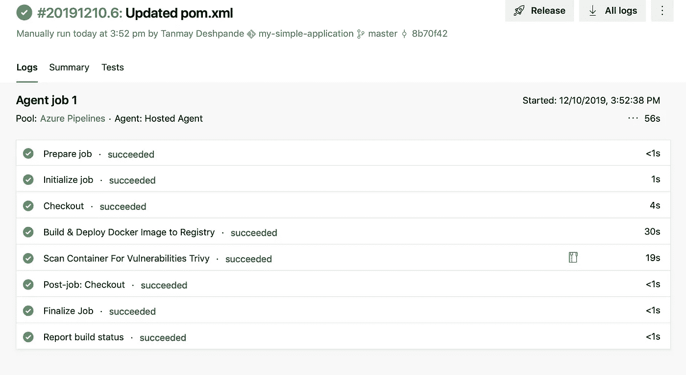
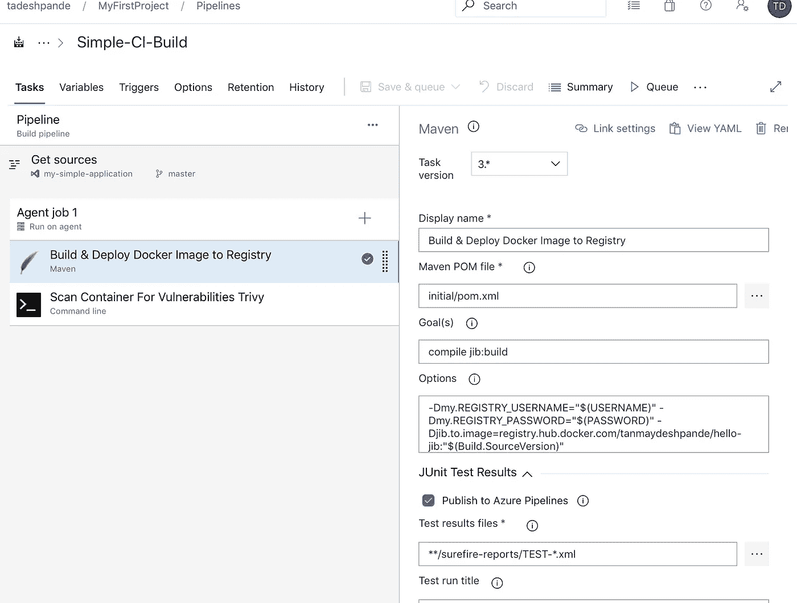
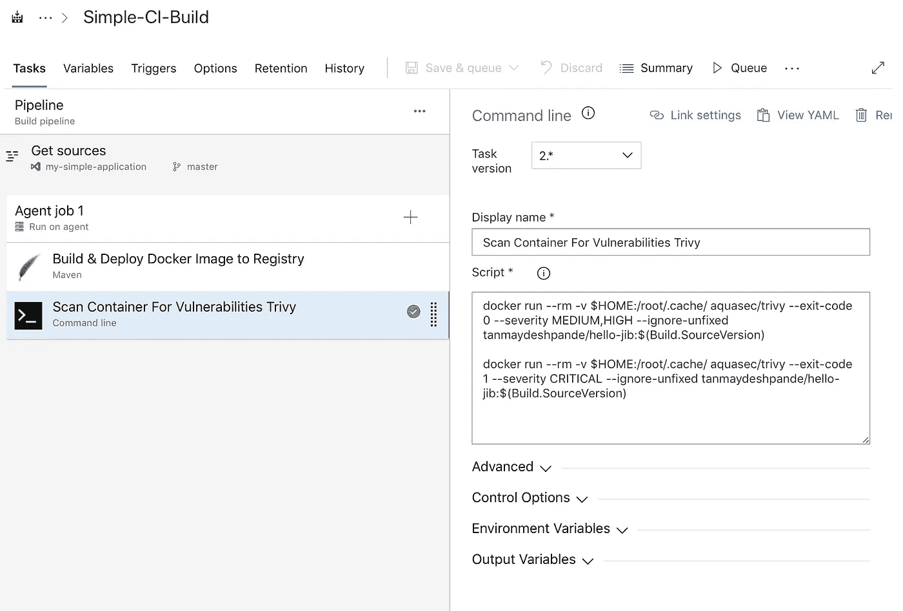
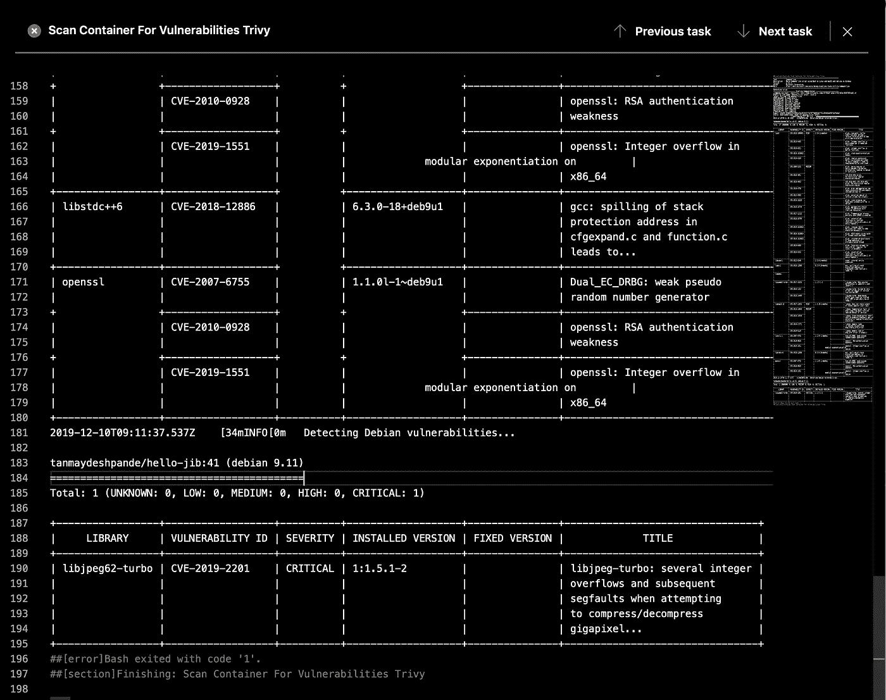
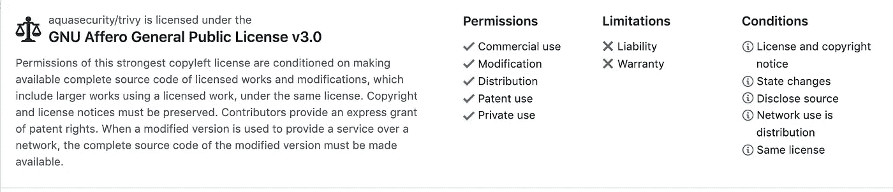

# 在 CI 构建中集成 Docker 容器漏洞扫描

> 原文：<https://betterprogramming.pub/integrating-docker-container-scans-in-ci-builds-991a94b9132b>

## 我们将使用 Trivy——一个简单而全面的容器漏洞扫描器，适用于 CI



我们中的许多人已经开始使用 Docker 容器构建和部署应用程序。在我的上一篇文章中，我谈到了如何在不编写 Dockerfile 的情况下将一个简单的 [Spring Boot 应用程序转换成 Docker 容器。](https://medium.com/better-programming/simplified-docker-image-builds-for-java-microservices-316648e0de81)

既然我们知道了如何构建 Docker 映像，我们需要确保扫描映像以发现已知的漏洞。

有各种开源(Quay，Clair 等。)和特定于注册表的漏洞扫描器(Docker Hub，GCR 等。)上市。开源的扫描器有一些有限的功能，而特定于注册表的扫描器与它们各自的注册表用法紧密结合。Docker Hub 注册表甚至不扫描任何非官方图片——这让情况变得更糟。

# 介绍 Trivy

Trivy 是一个简单而全面的容器漏洞扫描器。Trivy 检测操作系统包(阿尔卑斯，RHEL，CentOS 等)中的漏洞。)和应用依赖(Bundler、Composer、npm、yarn 等)。).

对我来说，它提供的最大优势是与 CI 构建集成的特性。你可以看看他们的 [GitHub 页面](https://github.com/aquasecurity/trivy#installation)关于各种平台的安装说明。

# 与 AzureDevOps CI 集成

对于本教程，我有一个示例 Spring Boot 应用程序，它是我上一篇文章的延续，它生成一个 Java 应用程序的 Docker 映像并将其推送到 Docker Hub 注册表。

所以我的第一个构建任务看起来非常简单:



接下来，我添加了一个任务，下载 Trivy Docker 映像，并对作为构建的一部分构建的映像运行扫描。



下面是我运行的第一个命令:

```
docker run --rm -v $HOME:/root/.cache/ aquasec/trivy --exit-code 0 --severity MEDIUM,HIGH --ignore-unfixed tanmaydeshpande/hello-jib:$(Build.SourceVersion)
```

这将从注册表中下载指定的 Docker 映像，并扫描它的`MEDIUM`和`HIGH`漏洞。如果发现任何漏洞，它将打印详细信息。但是这不会导致构建失败，因为我们已经将`Exit Code`设置为`0`。

我们的下一个命令是:

```
docker run --rm -v $HOME:/root/.cache/ aquasec/trivy --exit-code 1 --severity CRITICAL --ignore-unfixed tanmaydeshpande/hello-jib:$(Build.SourceVersion)
```

这将扫描图像的`CRITICAL`漏洞，由于`Exit Code`是`1`，它将使构建失败。

我还添加了一个标志:`--ignore-unfixed`。默认情况下，Trivy 还会检测未打补丁/未修复的漏洞。这意味着即使你更新了所有的包，你也不能修复这些漏洞。因此，在这面旗帜下谨慎呼吁。

当我在没有这个标志的情况下运行我的构建时，我得到了这样的输出:



现在，根据构建结果，您可以决定是否将映像部署到您的环境中。

## 批准

`acqusecurity/trivy`是否根据 GNU Affero 通用公共许可证 3.0 版许可[使用](https://github.com/aquasecurity/trivy/blob/master/LICENSE)。因此，您可以:



# 参考

*   【https://github.com/aquasecurity/trivy 
*   [https://www.aquasec.com/](https://www.aquasec.com/)

```
Hey, if you enjoyed this story, check out [Medium Membership](https://deshpandetanmay.medium.com/membership)! Just $5/month!*Your membership fee directly supports me and other writers you read. You’ll also get full access to every story on Medium.*
```