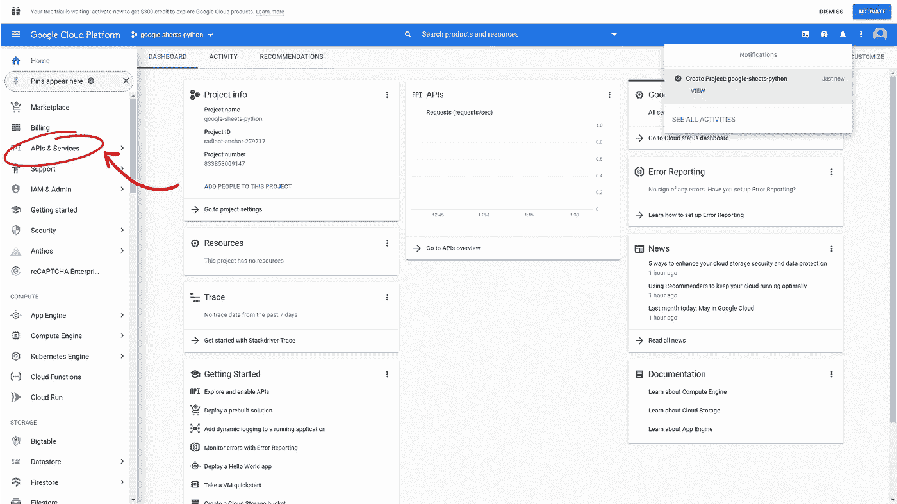
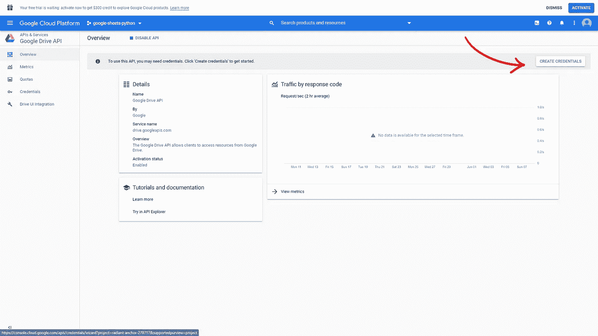
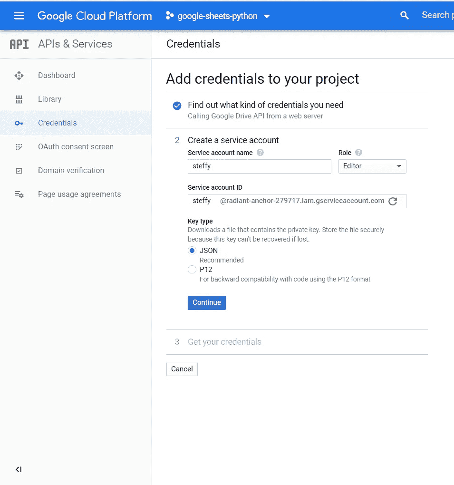
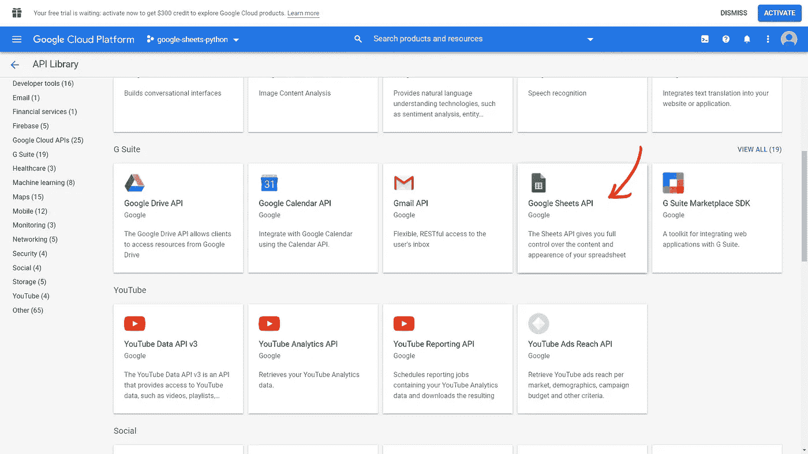
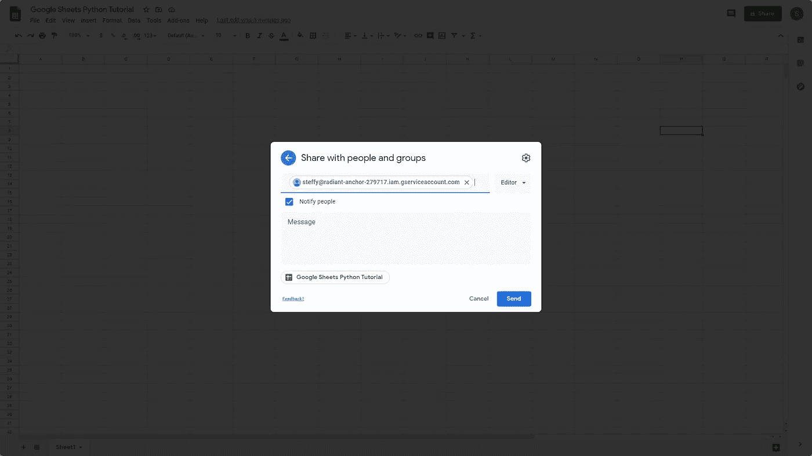
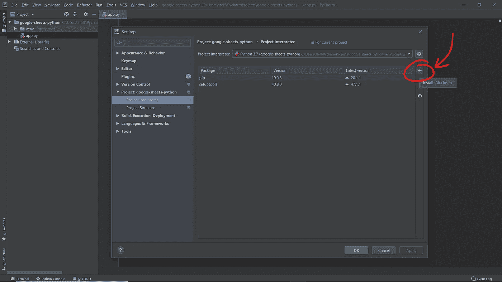
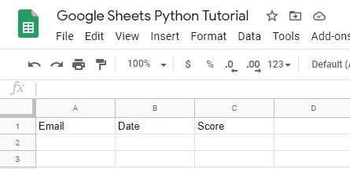

# 如何将 Google Sheets API 与 Python Flask 集成

> 原文：<https://betterprogramming.pub/integrating-google-sheets-api-with-python-flask-987d48b7674e>

## 构建一个在 Google Sheet 上执行 CRUD 操作的 API


在本教程中，我将展示如何通过构建您自己的 API 来集成 Google Sheets API 和 Python Flask，该 API 本质上在您的 Google Sheets 中执行 CRUD(创建、读取、更新和删除)操作。

# 初始设置

## 在谷歌云控制台上创建一个新项目

登录[console.cloud.google.com](https://console.cloud.google.com/)并创建一个新项目。您应该会被自动重定向到新项目的主仪表板。

然后，导航到**API&服务>库:**



向下滚动到G Suite 部分，点击 Google Drive API，然后启用它。


您将被重定向到以下页面:



单击“创建凭据”，并在表格中填写以下详细信息。


将“服务帐户名称”替换为您喜欢的名称。



点击“继续”后，包含您的凭证的 JSON 文件应该会自动下载。JSON 文件的名称可能很复杂。为了以后设置我们的 API 时的简单性和一致性，将文件重命名为`credentials.json`。

最后，对 Google Sheets API 做同样的事情，在 G Suite 部分搜索并启用它。然而，与 Google Drive API 不同，您不需要创建任何凭证。



现在，在您最喜欢的文本编辑器中打开 credentials.json，搜索`client_email` 键。复制相应的电子邮件地址值，并与该电子邮件共享 google sheet 文档，如下所示:



# Python 项目设置

与任何 Python 项目一样，首先创建您的虚拟环境。如果你不知道这意味着什么，我推荐使用`PyCharm`IDE——你可以在这里免费下载社区版[。`PyCharm`创建新项目时，会自动创建虚拟环境。](https://www.jetbrains.com/pycharm/download)

创建一个新项目后，用一个 **Python 文件**(您可以随意命名，但我将使用 [app.py](http://app.py/) )和 credentials.json(下载的 json 文件，我们已将其重命名)初始化项目目录。

现在，导航到设置>项目解释器并安装以下模块:

*   `Flask`
*   `gspread`
*   `oauth2client`



或者，如果您愿意，您可以选择`pip install`这些模块。

模块安装好后，我们终于可以开始编码了！

# 构建 API

首先，让我们导入所有已安装的模块:

接下来，让我们通过添加以下代码行来授权自己从我们的 API 访问我们想要修改的 google sheet(即，用您的 Google Sheet 的名称替换“Google Sheets Python Tutorial ”):

现在，我们正在阅读以建立我们的 API 路线。在这个例子中，我已经初始化了我的 google 工作表，使其标题行如下所示:



基本上，它是一个表格，显示代表每个用户在特定日期给出评论分数的电子邮件。很明显，你不需要遵循我的例子——这只是为了举例说明。

# 获取路线

如果我们想从工作表中获取所有的数据，那么我们只需调用`gsheet.get_all_records()`和一个`方法就可以实现如下:

```
# An example GET Route to get all reviews
@app.route('/all_reviews', methods=["GET"])
def all_reviews():
    return jsonify(gsheet.get_all_records())
```

# 邮寄路线

如果我们想要添加一个数据条目，那么我们可以调用接受两个参数的`insert_row`函数:一个表示您想要插入的行数据的列表和您想要插入数据的行号。

*注意:行号不是基于零索引的，这意味着标题行是索引* `*1*` *，因此如果您想在标题行之后插入一行，则* `*row_number*` *将是* `*2*` *。*

# 删除路线

如果我们想删除一个条目，那么我们可以调用`delete_row`函数，它接受一个参数——行号。

# 修补路线

如果我们想要修改一个条目，我们可以调用`update_cell`函数，它接受三个参数:行号、列号和我们想要更新的数据。前两个参数的作用类似于 2D 平面中的坐标，指定我们要更新表格中的哪个单元格。

# 包扎

为了让我们的 API 工作，我们需要它在运行时监听某个地方。为此，我们可以添加以下代码行:

```
if __name__ == "__main__":
    app.run(host='0.0.0.0', debug=False, port=os.environ.get('PORT', 80))
```

就是这样！现在，您已经有了一个可以通过 HTTP 请求修改 Google Sheets 的完整的 API。

显然，你可以用 Google Sheets API 做更多的事情，你可以在这里阅读，但是我认为这是一个好的开始。

感谢阅读！