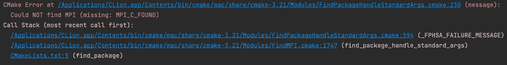
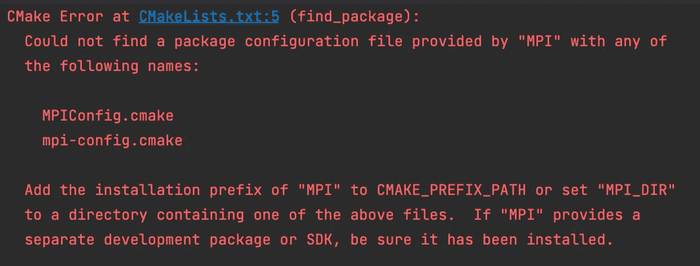
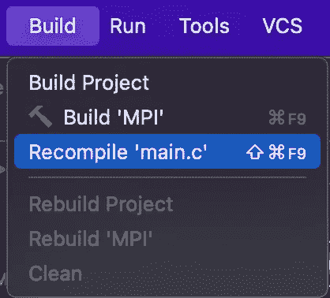
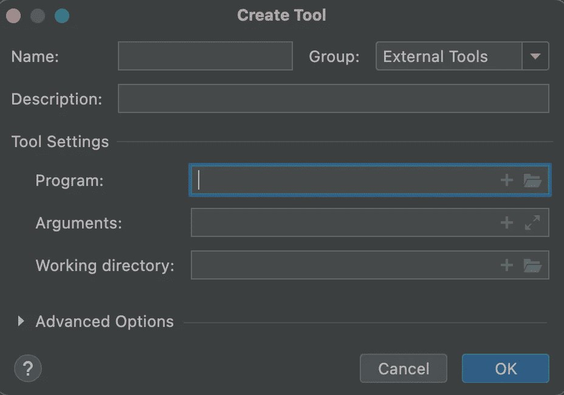

# 在苹果 M1 上集成开放 MPI 和 CLion

> 原文：<https://betterprogramming.pub/integrating-open-mpi-with-clion-on-apple-m1-76b7815c27f2>

## 关于如何将 Open MPI 4.1.2 与运行在苹果 M1 上的 CLion 2021.3.2 集成的简短教程


照片由[卡莱斯·拉巴达](https://unsplash.com/@carlesrgm?utm_source=medium&utm_medium=referral)在 [Unsplash](https://unsplash.com?utm_source=medium&utm_medium=referral) 上拍摄

# TL；速度三角形定位法(dead reckoning)

1.  设置[编译数据库](https://www.jetbrains.com/help/clion/compilation-database.html)
2.  用`mpicc -showme`的输出替换默认的“命令”
3.  通过将“程序”设置为 clang 的位置，将“参数”设置为来自`mpicc -showme`的参数，将被编译的文件的位置，以及可执行文件的位置和“工作目录”设置为 clang 的位置，设置[定制构建目标](https://www.jetbrains.com/help/clion/custom-build-targets.html)。
4.  通过将“可执行文件”设置为`mpirun`并将“程序参数”设置为处理器数量和可执行文件的位置(编译器的输出)，设置[自定义运行/调试配置](https://www.jetbrains.com/help/clion/custom-build-targets.html#custom-rundebug)

# 并行前进

假设有一天你厌倦了顺序编程，决定尝试一些更并行的东西。

您对并行编程的库或框架没有任何概念，但您对 C 编程有很好的体验。做一些谷歌搜索，你会很快到达 MPI(消息传递接口)。

长话短说，MPI 是如何在并行架构中连接事物的标准。

这个标准主要有两个实现: [Open MPI](https://www.open-mpi.org) 和 [MPICH](https://www.mpich.org) 。因为只是想玩，所以随机选择了 Open MPI。

由于我已经在我的 MacBook M1 (macOS Monterey 12.0)上安装了`CLion 2021.3.2`，我决定将 Open MPI 与 CLion 集成。我已经安装了`Open MPI 4.1.2`。按照[这里](https://formulae.brew.sh/formula/open-mpi)的说明使用 brew。

# 错误的方式

乍一看，不会有什么问题。在谷歌上搜索一些关于如何将开放的 MPI 和 CLion 结合在一起的教程，我找到了两个不错的资源。

这两个教程都指出，为了使用带有`CLion`的开放式 MPI，你所要做的就是将`[find_package](https://cmake.org/cmake/help/latest/command/find_package.html)(MPI REQUIRED)`包含在`CMakeLists.txt`文件中。问题是:



我的第一个想法是[指定安装 Open MPI 的路径](https://stackoverflow.com/questions/49816206/cmake-find-package-specify-path)，所以我使用了`[find_package](https://cmake.org/cmake/help/latest/command/find_package.html)(MPI REQUIRED PATHS /opt/homebrew/Cellar/open-mpi/4.1.2)`。不幸的是，这也不起作用:



做一些额外的研究，我发现这个问题与 CMake 的版本有关。

像 3.11 这样的 CMake 新版本有这个问题，而像 3.5 这样的旧版本没有。你可以在这里阅读更多关于这个[的内容](https://github.com/Intel-HLS/GenomicsDB/issues/187)。

# 解决方案


由[absolute vision](https://unsplash.com/@freegraphictoday?utm_source=medium&utm_medium=referral)在 [Unsplash](https://unsplash.com?utm_source=medium&utm_medium=referral) 上拍摄的照片

首先，这是我想在 CLion 中编译并运行的代码示例:

这是一个在[这个](http://condor.cc.ku.edu/~grobe/docs/intro-MPI-C.shtml)非常好的教程中给出的开放式 MPI 的 hello world 应用程序。为了编译代码，我们使用`mpicc`:

```
mpicc main.c -o main.o
```

为了运行可执行文件，我们使用`mpirun`。参数`-np 4`表示上述代码将并行运行的处理器数量:

```
mpirun -np 4 main.o
```

当我们使用 brew 安装开放的 MPI 时，两个命令(`mpicc`和`mpirun`)都变得可用。

我想在 CLion 中做的就是将 build 按钮与`mpicc`命令链接起来，将 run 按钮与`mpirun`命令链接起来。解决方案是使用 CLion 的两个很酷的特性:[编译数据库](https://www.jetbrains.com/help/clion/compilation-database.html)和[定制构建目标](https://www.jetbrains.com/help/clion/custom-build-targets.html)。

一旦你启用了[编译数据库](https://www.jetbrains.com/help/clion/compilation-database.html)，你将得到一个名为`compiled_commands.json`的 JSON 文件。在这个 JSON 中，您会发现一个名为`command`的元素。这是编译`main.c`时将要执行的命令。第一个想法是用`mpicc`替换默认命令:

问题是默认情况下 CLion 不会将`mpicc`识别为编译器，所以它会显示以下错误:

```
Cannot determine compiler type by executable file: ‘/opt/homebrew/bin/mpicc
```

做另一项额外的研究我发现`mpicc`实际上是系统编译器的包装器。在我的情况下，`mpicc`将使用 clang 编译器。要找到`mpicc`背后的内容，您可以执行以下命令:

```
mpicc -showme
```

以下是我的输出:

```
clang - I/opt/homebrew/Cellar/open-mpi/4.1.2/include -L/opt/homebrew/Cellar/open-mpi/4.1.2/lib - L/opt/homebrew/libevent/lib -lmpi
```

当从 compiled_commands.json 文件中指定“command”时，您需要用`mpicc -showme`的输出替换 mpicc。这是我的“命令”:

使用构建部分的`Recompile ‘main.c’`按钮编译`main.c`:



虽然编译成功，但是没有生成可执行文件，因为 CLion 会自动将标志`-fsyntax-only` 添加到 JSON 文件中指定的编译命令中。

为了生成可执行文件，您需要创建一个[定制构建目标](https://www.jetbrains.com/help/clion/custom-build-targets.html#custom-rundebug)。按照 CLion 的指示，我们得到了必须填写的以下表格:



“程序”描述了当我们按下 build 按钮时将要运行的程序。在我们的例子中，我们希望运行 clang 编译器，因此“程序”必须是:

```
/usr/bin/clang
```

“参数”是指传递给“程序”的参数。在我们的例子中,“参数”由`mpicc -showme`命令显示的 clang 编译器的参数、将要编译的文件和输出文件组成。对我来说,“论据”是:

工作目录是“程序”的位置，因此在我们的例子中:

```
/usr/bin
```

有了这些设置，当我们按下 build 按钮时，就会生成一个名为`main.o`的可执行文件。要运行这个可执行文件，我们必须设置一个[自定义运行/调试](https://www.jetbrains.com/help/clion/custom-build-targets.html#custom-rundebug)配置。我们基本上需要做的是填写以下表格:


“可执行文件”是指当我们按下运行按钮时将要运行的程序。在我们的例子中，这就是`mpirun`:

```
/opt/homebrew/bin/mpirun
```

“程序参数”是指“可执行文件”的参数。在我们的例子中，我们有两个参数:处理器的数量和可执行文件的位置(`mpicc`的输出):

```
-np 4 /Users/mihailplesa/Documents/Doctorat/Experiments/MPI2/main.o
```

现在，当我们按下 run 按钮时，我们可以看到上面示例代码的输出:

```
/opt/homebrew/bin/mpirun -np 4 /Users/mihailplesa/Documents/Doctorat/Experiments/MPI2/main.oHello world! I'm process 2 out of 4 processes
Hello world! I'm process 0 out of 4 processes
Hello world! I'm process 3 out of 4 processes
Hello world! I'm process 1 out of 4 processesProcess finished with exit code 0
```

# 结束语

虽然这是在苹果 M1 上集成开放 MPI 和 CLion 问题的解决方案，但我有一种感觉，这不是最优雅的解决方案。如果你知道其他方法，请在评论中告诉我。


肯尼·蒂莫尔在 [Unsplash](https://unsplash.com?utm_source=medium&utm_medium=referral) 上的照片

# 资源

*   [https://www . jetbrains . com/help/clion/compilation-database . html](https://www.jetbrains.com/help/clion/compilation-database.html)
*   [https://www . jetbrains . com/help/clion/custom-build-targets . html](https://www.jetbrains.com/help/clion/custom-build-targets.html)
*   [https://www.open-mpi.org](https://www.open-mpi.org)
*   [https://www.mpich.org](https://www.mpich.org)
*   [https://en.wikipedia.org/wiki/Message_Passing_Interface](https://en.wikipedia.org/wiki/Message_Passing_Interface)
*   [https://formulae.brew.sh/formula/open-mpi](https://formulae.brew.sh/formula/open-mpi)
*   [https://www . onooks . com/how-to-import-openmp-and-MPI-to-a-large-clion-cmake-project/](https://www.onooks.com/how-to-import-openmp-and-mpi-to-a-large-clion-cmake-project/)
*   [https://intellij-support . jetbrains . com/HC/en-us/community/posts/115000001110-Configure-CMakeList-July-to-work-with-open MPI-c-](https://intellij-support.jetbrains.com/hc/en-us/community/posts/115000001110-Configure-CMakeList-properly-to-work-with-OpenMPI-c-)
*   [https://cmake . org/cmake/help/latest/command/find _ package . html](https://cmake.org/cmake/help/latest/command/find_package.html)
*   [https://stack overflow . com/questions/49816206/cmake-find-package-specify-path](https://stackoverflow.com/questions/49816206/cmake-find-package-specify-path)
*   [https://github.com/Intel-HLS/GenomicsDB/issues/187](https://github.com/Intel-HLS/GenomicsDB/issues/187)
*   [http://condor.cc.ku.edu/~grobe/docs/intro-MPI-C.shtml](http://condor.cc.ku.edu/~grobe/docs/intro-MPI-C.shtml)