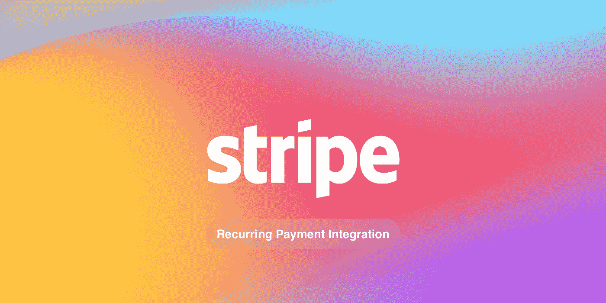
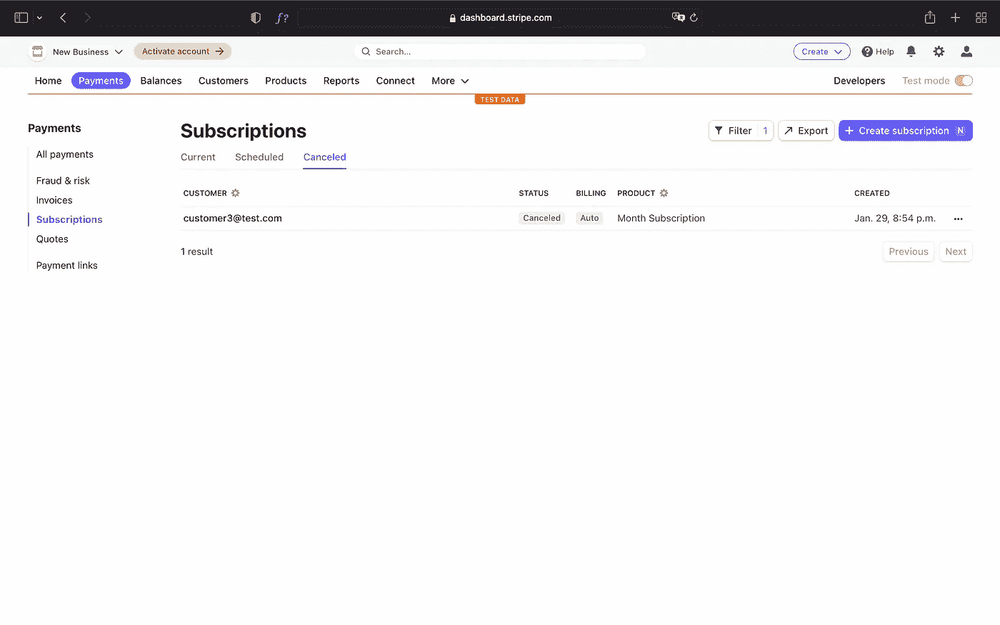
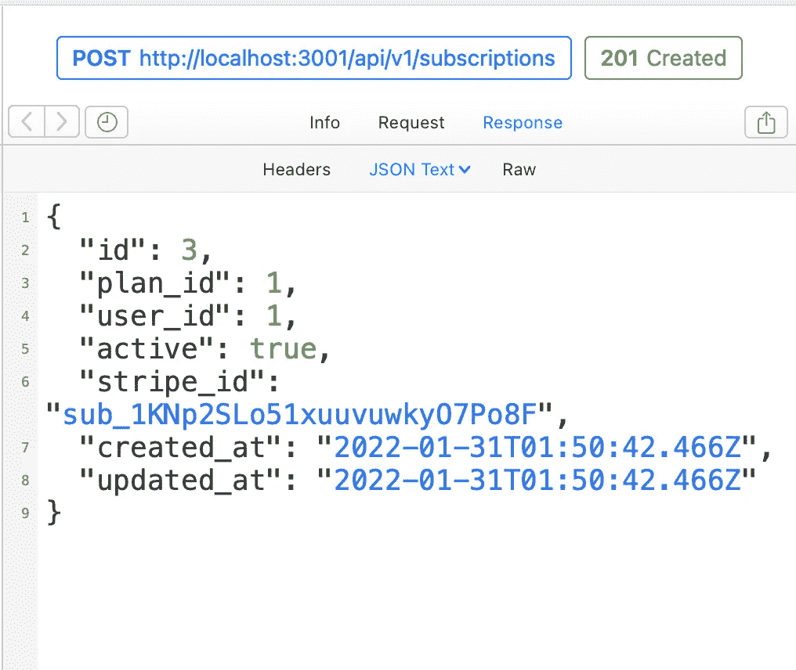
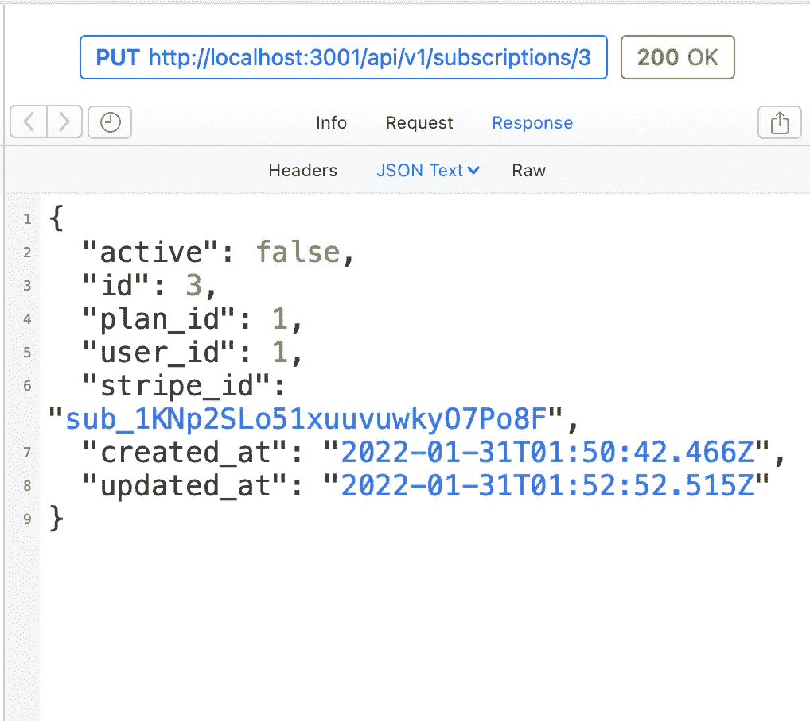
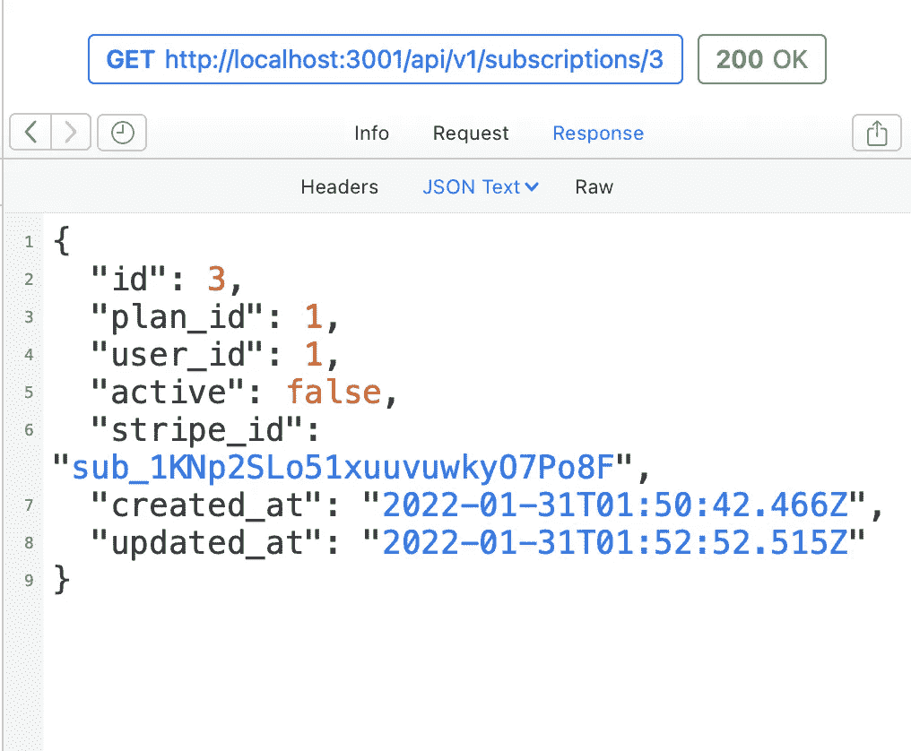

# 用 Stripe 将经常性支付集成到 Rails API 中

> 原文：<https://betterprogramming.pub/integrating-recurring-payments-to-your-rails-api-with-stripe-9a16cb539690>

## 在本文中，我将使用 Stripe API it 来完成 Rails API 中的订阅集成。



对于这个应用程序，我会认为你已经在你的应用程序中有一个用户的模型。万一你还没有，不用担心！我已经发表了一篇关于这个的文章，你可以[在这里](https://hey-feres.medium.com/jwt-auth-in-a-rails-api-561f046cc866)阅读。

# 入门指南

如果您按照我的另一篇文章的步骤来创建您的`User`模型，或者简单地从 GitHub 克隆它，您将需要更改 Gemfile 上的 Ruby 版本。对于本文，我将使用 Ruby 3.0.0，因此您的 Gemfile 必须如下所示:

```
source '[https://rubygems.org'](https://rubygems.org')
git_source(:github) { |repo| "[https://github.com/#{repo}.git](https://github.com/#{repo}.git)" }ruby '3.0.0'...
```

此外，添加条纹宝石到您的宝石档案。

```
gem 'stripe'
```

> 之后，不要忘记在您的终端中运行`*bundle install*`。

现在你需要在你的应用程序中创建一个 stripe 初始化文件。为此，在您的终端中运行以下命令:

```
touch config/initializers/stripe.rb
```

然后，打开`stripe.rb`文件，写下下面的内容:

```
Stripe.api_key = Rails.application.credentials.stripe_secret_key
```

我们没有在凭据文件中添加条带的密钥，所以让我们这样做。

要打开您的凭证文件，请在您的终端中运行:

```
EDITOR=nano rails credentials:edit
```

[在此获取您的条纹密钥。](https://dashboard.stripe.com/test/apikeys)

您的凭据文件必须如下所示:

```
# aws:
#   access_key_id: 123
#   secret_access_key: 345
# Used as the base secret for all MessageVerifiers in Rails, including the one protecting cookies.secret_key_base: [YOUR SECRET KEY BASE]
stripe_secret_key: [YOUR SECRET KEY HERE]
```

> 注意`*secret_key_base*`是自动生成的，不需要编辑。

# 用户模型

首先，我们需要我们的用户有一个 Stripe 客户 ID。我们需要将该 ID 存储在数据库中，因此运行下面的命令来创建迁移:

```
rails g migration AddStripeIdToUsers stripe_id
rails db:create db:migrate
```

我们还将为我们的用户添加一个新的验证，以确保条带 ID 将始终存在。添加到您的用户模型:

```
validates :stripe_id, presence: true, uniqueness: true
```

为了在 Stripe API 上创建我们用户的引用，让我们添加一个对`User`模型的回调。

将以下代码添加到用户模型中。

```
... before_validation :create_stripe_reference, on: :create def create_stripe_reference
    response = Stripe::Customer.create(email: email)
    self.stripe_id = response.id
  end
end
```

如果我们需要的话，有一种方法来检索关于客户的条带信息将是非常有趣的。幸运的是，Stripe SDK 提供了这个方法，我们也将把它添加到我们的用户模型中。

```
... def retrieve_stripe_reference
    Stripe::Customer.retrieve(stripe_id)
  end
end
```

最后，你的`User`模型应该是这样的:

```
class User < ApplicationRecord
  has_secure_password validates :email, uniqueness: { case_sensitive: false }
  validates :stripe_id, presence: true, uniqueness: true before_validation :create_stripe_reference, on: :create def create_stripe_reference
    response = Stripe::Customer.create(email: email)
    self.stripe_id = response.id
  end def retrieve_stripe_reference
    Stripe::Customer.retrieve(stripe_id)
  end
end
```

厉害！！让我们在控制台上尝试我们的代码，在您的终端上运行:

```
rails c
```

现在可以创建一个`User`，代码会自动联系 Stripe API 并创建引用。

```
User.create(email: "user@test.com", password: "123456")
```

您可以使用下面的命令检查该用户的条带 ID。

```
user = User.first
user.stripe_id
```

要检索该用户的所有条带信息，请运行:

```
user.retrieve_stripe_reference
```

看起来棒极了。

# 计划模型

计划模型将负责表示和处理我们将提供的订阅选项的业务规则。

在您的终端上运行:

```
rails g model Plan name description interval:integer price_cents:integer stripe_price_id
rails db:migrate
```

仔细看看`Plan`的属性:

*   `Name`将是一个字符串，代表计划的名称；
*   `Description`将是一个字符串，代表简短的文本，描述计划提供的内容；
*   `Interval`将是一个整数，代表向用户收费的时间间隔；
*   `price_cents` 将是一个整数，表示订阅的值，它需要是美分，因为 Stripe 使用美分值，这样更容易处理值。
*   `stripe_price_id`将是一个字符串，代表 Stripe API 中对我们计划的引用。

这就是`Plan`车型的外观:

```
class Plan < ApplicationRecord
  validates :name,
       :stripe_price_id,
       :price_cents, presence: true
  validates :name,
       :stripe_price_id, uniqueness: true enum interval: %i[month year] before_validation :create_stripe_reference, on: :create def create_stripe_reference
    response = Stripe::Price.create({
      unit_amount: price_cents,
      currency: 'usd',
      recurring: { interval: interval },
      product_data: { name: name }
    }) self.stripe_price_id = response.id
  end def retrieve_stripe_reference
    Stripe::Price.retrieve(stripe_price_id)
  end
end
```

仔细看看`Plan`型号:

*   首先，我们定义了一些验证，以确保`name`、`stripe_price_id`和`price_cents`总是存在。我们还定义了一个验证来确保`name`和`stripe_price_id`是唯一的。
*   之后，我们定义了区间枚举，rails 将处理这些选项，所以当我们为区间传递值“月”时，框架将在数据库中存储 0，当我们传递值“年”时，它将存储 1。
*   然后我们定义了一个回调来创建对 Stripe API 上的`Plan`的引用。
*   `create_stripe_reference`方法将负责回调时触发的所有逻辑。
*   `retrieve_stripe_reference`基本上会返回我们`Plan`的条带引用。

让我们在控制台上试试我们的新模型。在您的终端中运行:

```
rails c
```

您现在可以创建一个`Plan`，代码将自动联系 Stripe API 并创建引用:

```
# Month Subscription
Plan.create(
  name: 'Month Subscription',
  description: 'This subscription will be charged every month',
  interval: 'month',
  price_cents: 500
)# Year Subscription
Plan.create(
  name: 'Year Subscription',
  description: 'This subscription will be charged every year. Save $10 with this subscription.',
  interval: 'year',
  price_cents: 5000
)
```

要检索某些计划的所有条带信息，请运行:

```
# The 1 represents the ID of the record.
Plan.find(1).retrieve_stripe_reference
```

[条纹价格单据](https://stripe.com/docs/api/prices/object)。

# 订阅模式

订阅模型将负责表示和处理用户订阅的业务规则。

在您的终端上运行以下命令:

```
rails g model Subscription plan:references user:references active:boolean stripe_id
rails db:migrate
```

进一步了解订阅属性:

*   `plan`将是对正在购买的计划的引用；
*   `user`将是购买计划的用户的参考；
*   `active`将是一个布尔值，表示订阅是否仍然有效。
*   `stripe_id` 将是一个字符串，表示对 Stripe API 中订阅的引用。

打开迁移 create_subscriptions，并确保定义活动属性的默认值:

```
...
t.boolean :active, default: true
...
```

之后，我们来编写`Subscription`模型。它应该是这样的:

```
class Subscription < ApplicationRecord
  attr_accessor :card_number, :exp_month, :exp_year, :cvc belongs_to :plan
  belongs_to :user validates :stripe_id, presence: true, uniqueness: true before_validation :create_stripe_reference, on: :create def create_stripe_reference
    Stripe::Customer.create_source(
      user.stripe_id,
      { source: generate_card_token }
    ) response = Stripe::Subscription.create({
      customer: user.stripe_id,
      items: [
        { price: plan.stripe_price_id }
      ]
    }) self.stripe_id = response.id
  end def generate_card_token
    Stripe::Token.create({
      card: {
        number: card_number,
        exp_month: exp_month,
        exp_year: exp_year,
        cvc: cvc
      }
    }).id
  end
end
```

仔细看看`Subscription`型号:

*   首先，我们定义了一些虚拟属性。我们不会存储这些数据，因为它们很敏感。所以 Stripe 会帮我们处理。
*   然后，我们定义了模型的关系，a 属于计划和用户。
*   我们将验证的唯一属性是`stripe_id`，它必须存在并且是唯一的。
*   我们还有一个回调函数，它将在记录创建验证之前被触发。
*   `create_stripe_reference`将负责在 Stripe API 上创建我们订阅的引用。请注意，在 Stripe API 上创建订阅之前，我们为客户创建了一个来源，这将是付款方式。
*   `generate_card_token`将负责将卡数据传递给 Stripe API 并返回一个令牌。传递令牌比传递卡数据更安全，这就是 Stripe 以这种方式处理支付源的原因。

让我们在控制台上试试我们的新模型。在您的终端中运行:

```
rails c
```

现在可以创建一个`Subscription`，代码会自动联系 Stripe API 并创建引用。

```
Subscription.create(
  card_number: '5555555555554444',
  exp_month: 06,
  exp_year: 2029,
  cvc: '123',
  user_id: User.first.id,
  plan_id: Plan.first.id,
  active: true
)
```

> 请注意，条带具有预定义的允许测试卡号。可以在这里查看:[条纹测试卡](https://stripe.com/docs/testing)。

太棒了。！我们的订阅已经开始运行，您可以在 [Stripe 仪表盘](https://dashboard.stripe.com/test/subscriptions)上看到。


条纹仪表板

# 取消订阅

有时，我们需要省钱，一些订阅必须取消，让我们的程序允许取消。

我们要做的基本上是在 active 为 false 时更新 Stripe API 上的记录和引用。我们来编码吧。

添加一个回调以取消对 Stripe API 的订阅，并带有活动条件。

```
...before_update :cancel_stripe_subscription, if: :subscription_inactive?...
```

我们还需要添加回调调用的方法和定义条件的方法。

```
... def cancel_stripe_subscription
    Stripe::Subscription.delete(stripe_id)
  end def subscription_inactive?
    !active
  end
end
```

要测试它是否工作，请转到您的 rails 控制台并运行以下命令:

```
Subscription.first.update(active: false)
```

现在订阅被取消了，你可以在你的 [Stripe 仪表盘](https://dashboard.stripe.com/test/subscriptions?status=canceled)上查看。



条纹仪表板

# 控制器呢？

在这篇文章中，我们将只使用控制器来显示、创建和更新订阅。一旦 Plans CRUD 更多的是一个管理性的东西，我现在就不会为它创建一个控制器。

## 订阅控制器

要创建订阅控制器，请在终端中运行以下命令:

```
rails g controller subscriptions show create update
```

上面的命令会将一些路由添加到我们的 routes 文件中，但是一旦我们需要名称空间`api/v1`中的路由，我们就需要修改它。

所以你的路线可能看起来像这样:

```
Rails.application.routes.draw do
  namespace :api do
    namespace :v1 do
      post '/signup', to: 'users#signup'
      post '/signin', to: 'users#signin'
      get  '/signedin', to: 'users#signedin' resources :subscriptions, only: %i[show create update]
    end
  end
end
```

生成控制器之后，我们来写。因为这是一个非常通用的 rails 控制器，所以我不会在本文中解释它的代码。

您的控制器应该是这样的:

```
module Api
  module V1
    class SubscriptionsController < ApplicationController
      before_action :set_subscription, except: %i[create] def show
        render json: [@subscription](http://twitter.com/subscription)
      end def create
        [@subscription](http://twitter.com/subscription) = Subscription.new(subscription_params) if [@subscription](http://twitter.com/subscription).save
          render json: [@subscription](http://twitter.com/subscription), status: :created
        else
          render json: [@subscription](http://twitter.com/subscription).errors, status: :unprocessable_entity
        end
      end def update
        if [@subscription](http://twitter.com/subscription).update(subscription_params)
          render json: [@subscription](http://twitter.com/subscription)
        else
          render json: [@subscription](http://twitter.com/subscription).errors, status: :unprocessable_entity
        end
      end private def set_subscription
        [@subscription](http://twitter.com/subscription) = Subscription.find(params[:id])
      end def subscription_params
        params.require(:data).permit(:card_number, :exp_month, :exp_year, :cvc, :user_id, :plan_id, :active)
      end
    end
  end
end
```

# 测试控制器—请求

我将使用 [Paw](https://paw.cloud) 来运行请求并测试控制器，但是您将使用任何 HTTP 客户端获得相同的结果，比如 Postman 或失眠症。

使用以下命令启动本地服务器:

```
rails s
```

## 创建请求

该请求将触发订阅创建。

动作:`POST`

端点:

```
[http://localhost:3000**/api/v1/subscriptions**](http://localhost:3001/api/v1/subscriptions)
```

标题:

```
Content-Type: application/json
```

正文:

```
{
  "data": {
    "card_number": "5555555555554444",
    "exp_month": "09",
    "exp_year": "2029",
    "cvc": "123",
    "user_id": "1",
    "plan_id": "1"
  }
}
```

对此请求的响应应符合以下格式:



创建响应

## 更新请求

此请求将取消订阅。

动作:`PUT`或`PATCH`

端点:

```
[http://localhost:3000**/api/v1/subscriptions**](http://localhost:3001/api/v1/subscriptions)**/3**
```

> 上面端点上的数字 3 表示我们要更新的记录的 ID，您可以根据您的订阅 ID 来更改它。

标题:

```
Content-Type: application/json
```

正文:

```
{
  "data": {
    "active": false
  }
}
```

此请求的响应应符合以下格式:



更新响应

## 演出请求

该请求将检索订阅。

动作:**获取**

端点:

```
[http://localhost:3000**/api/v1/subscriptions**](http://localhost:3001/api/v1/subscriptions)**/3**
```

> 上面端点上的数字 3 表示我们要更新的记录的 ID，您可以根据您的订阅 ID 来更改它。

此请求的响应应符合以下格式:



显示响应

# 结论

Stripe 使支付系统集成变得非常简单和容易。

有许多关于 Stripe API 的资源没有在本文中探讨。我打算在未来发布另一个，关于支付意向和 webhooks，用于接收更新订阅状态的意向。

你可以在这里查看完整的 Stripe 文档。

```
**Want to Connect?**[Connect on Twitter](https://twitter.com/BrunoFeres4).
```