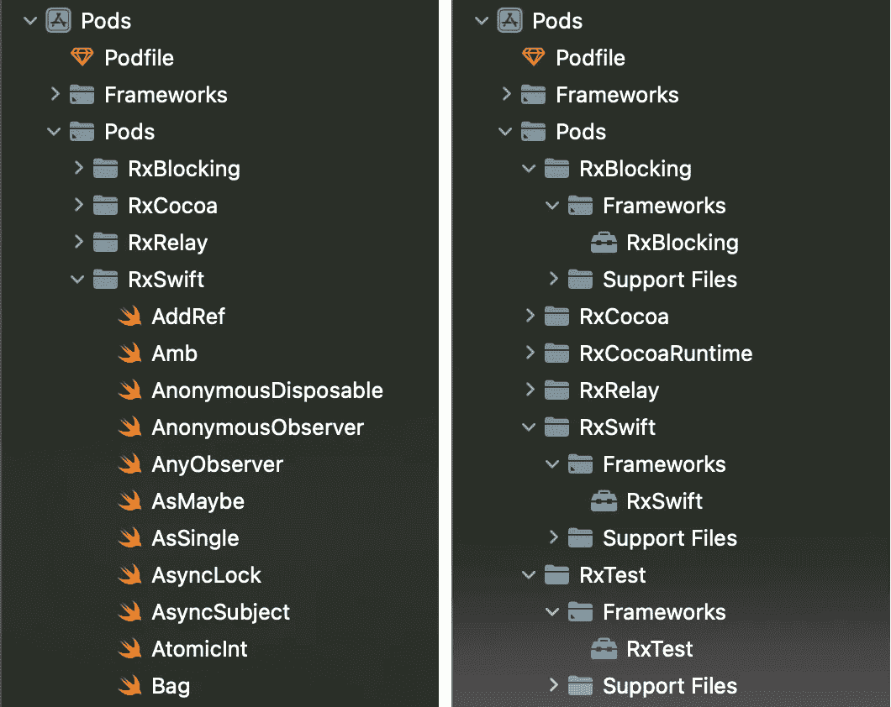

# 将 RxSwift 作为 XCFramework 与 CocoaPods 集成

> 原文：<https://betterprogramming.pub/integrating-rxswift-as-xcframework-with-cocoapods-41595f045336>

## 可能吗？

## 您可以通过一个简单的变通方法进行集成


rx swift+xc framework+cocoa pods

你好！

几周前，我试图通过 CocoaPods 集成 RxSwift 从版本 6 开始提供的预编译 XCFrameworks。但是，令我惊讶的是，用椰子脚掌是不可能做到的。唯一的方法是手动集成它们。

我想出了一个解决这个限制的方法，并认为分享它是一个好主意。这里我会一步一步解释。

我们开始吧！

## 首先是小小的免责声明

该解决方法是在以下环境下开发和测试的:

*   `RxSwift 6.5.0`
*   `Xcode 13.2.1`
*   `CocoaPods 1.11.2`

# 上下文:我为什么关心这个？

我从事一个大型项目。

我们项目的很大一部分依赖于`RxSwift`和他的伙伴们(`RxCocoa`、`RxBlocking`和`RxTest`)。我们不打算将现有的代码库迁移到`Combine`或`async/await`。

我们使用 CocoaPods 作为依赖管理器。我们也不打算将其迁移到 Swift Package Manager。

我们的项目从零开始构建需要几分钟时间(例如，我们的 CI 每次都是从零开始构建)。为了减少编译时间，我们已经用一些依赖项提供的 XCFrameworks 替换了“普通”依赖项(拥有源代码并需要编译的依赖项)。

从版本 6 开始，RxSwift 为 XCFrameworks 提供了更好的支持。现在每个新版本都附加了所有需要的 XCFrameworks。

所以我们认为将它们集成到我们的项目中是一个好主意，可以节省一些编译时间。但是不幸的是，在写这篇文章的时候，XCFrameworks 还没有在 CocoaPods 下发布。

但这不会阻止我们。

# 解决方法:想法

我们需要为每个需要的依赖关系定制`podspec`文件。那些`podspecs`将被调整以从 [RxSwift 的 GitHub 发布页面](https://github.com/ReactiveX/RxSwift/releases)获得 vendored 框架。

编辑后的`podspecs`可以本地保存在项目中，也可以远程保存在不同的规范库中。

然后，我们需要做的就是在我们的 Podfile 中使用那些编辑过的`podspecs`。

我们准备好出发了。

> 如果您不想一步一步地完成整个过程[，这里有一个存储库](https://github.com/pmanuelli/RxSwiftXCFrameworkCocoapodsExample)，其中有两个使用变通方法的示例项目:一个项目在本地修改了 podspecs，另一个项目使用远程托管的[pod specs](https://github.com/pmanuelli/RxSwiftSpecs)。
> 
> 仅对修改后的 podspecs 感兴趣？你可以在这里找到它们。

# 解决方法:循序渐进

我将一步一步地解释这些变化。为了简单起见，我将在示例中只使用`RxSwift 6.5.0`。但是同样的变化也适用于所有其他 Rx 框架和任何其他版本。

## podspec 文件的更改

我们需要对`RxSwift.podspec`文件进行一些修改。你可以在这里找到[的原始文件](https://github.com/ReactiveX/RxSwift/blob/6.5.0/RxSwift.podspec)。这些变化是:

*   改变`s.version`。为了避免混淆，我们需要改变依赖关系的版本。因为我想将 XCFramework 用于 6.5.0 版本，所以我将版本改为`6.5.0-xcframework`。
*   改变`s.source`。它需要指向包含 XCFramework 的 zip 文件。在这种情况下，信号源变为`{ :http => "https://github.com/ReactiveX/RxSwift/releases/download/6.5.0/RxSwift..xcframework.zip" }`
*   拆下`s.source_files`和`s.exclude_files`。我们不想要它们。
*   将`s.vendored_frameworks`与值`"RxSwift.xcframework"`相加

你可以在这里找到完整的编辑文件[。](https://github.com/pmanuelli/RxSwiftSpecs/blob/main/Specs/RxSwift/6.5.0-xcframework/RxSwift.podspec)

## pod 文件上的更改

最后一步是修改项目的 Podfile。这里你必须做出选择:

如果你选择本地存储`podspecs`，那么你必须改变你的依赖声明来使用本地`podspec`。您可以通过`:podspec`参数来实现这一点。例如，如果您的自定义`podspecs`存储在名为`RxSwiftSpecs`的文件夹中，那么更改将是:

```
pod 'RxSwift', :podspec => './RxSwiftSpecs/RxSwift.podspec'
```

> 您可以在这里看到使用这种方法的项目[。检查](https://github.com/pmanuelli/RxSwiftXCFrameworkCocoapodsExample/tree/main/LocalPodspecsExample)`[RxSwiftSpecs](https://github.com/pmanuelli/RxSwiftXCFrameworkCocoapodsExample/tree/main/LocalPodspecsExample/RxSwiftSpecs)` [文件夹](https://github.com/pmanuelli/RxSwiftXCFrameworkCocoapodsExample/tree/main/LocalPodspecsExample/RxSwiftSpecs)中的 [Podfile](https://github.com/pmanuelli/RxSwiftXCFrameworkCocoapodsExample/blob/main/LocalPodspecsExample/Podfile) 和本地 podspecs。

**B.** 如果您选择将您的规范存储在远程规范存储库中，那么首先您需要将规范存储库的 URL 添加到 Podfile，如下所示:

```
source 'https://github.com/pmanuelli/RxSwiftSpecs.git'
```

然后指定您在 podspec 上设置的版本:

```
pod 'RxSwift', '6.5.0-xcframework'
```

> 你可以在这里看到一个使用这种方法的项目[。在这种情况下，检查](https://github.com/pmanuelli/RxSwiftXCFrameworkCocoapodsExample/tree/main/RemotePodspecsExample) [Podfile](https://github.com/pmanuelli/RxSwiftXCFrameworkCocoapodsExample/blob/main/RemotePodspecsExample/Podfile) 和远程规格库[这里的](https://github.com/pmanuelli/RxSwiftSpecs)。

# 一个特例:RxCocoa

对`RxSwift`、`RxRelay`、`RxBlocking`和`RxTest`的修改非常简单。

但是`RxCocoa`更具挑战性。

## RxCocoa

[如 RxSwift 的 XCFramework 安装指南](https://github.com/ReactiveX/RxSwift#xcframeworks)所述，如果您想要导入`RxCocoa`，那么您还需要导入`RxCocoaRuntime`。但是我查了一下[原](https://github.com/ReactiveX/RxSwift/blob/6.5.0/RxCocoa.podspec) `RxCocoa.podspec`文件，发现`RxCocoaRuntime`并没有设置为依赖。这让我很惊讶。

因此，如果没有`RxCocoaRuntime``RxCocoa`就无法工作，那么对`podspec`的一个额外的改变就是添加依赖关系:

```
s.dependency 'RxCocoaRuntime', '6.5.0-xcframework'
```

最后的`RxCocoa.podspec`文件是这里的。

现在剩下的就是应用对`RxCocoaRuntime.podspec`的修改。

## RxCocoaRuntime

但是 RxSwift 上没有`RxCocoaRuntime.podspec`。我认为既然它不在 CocoaPods 下发布，就没有理由发布。

但是这个解决方法需要一个。

我检查了 [SPM 清单文件](https://github.com/ReactiveX/RxSwift/blob/6.5.0/Package.swift)上的`RxCocoaRuntime` 依赖项，发现[只依赖于 RxSwift](https://github.com/ReactiveX/RxSwift/blob/6.5.0/Package.swift#L30) 。因此，知道了它的依赖关系，创建`podspec`就很容易了。

最后的`RxCocoaRuntime.podspec`档是这里的。

> 关于这个框架的一个细节是它没有`6.5.0`版本。在撰写本文时，最新版本是`*6.2.0*`。我认为如果框架没有变化，就不会产生新的版本。这很有道理，但对我来说很不幸，因为我更喜欢我所有的 Rx 依赖项都有相同的版本。
> 
> 如果你喜欢，创建一个`6.2.0-framework`版本是完全可以的。
> 
> 但是我更喜欢把它命名为`*6.5.0-framework*`，尽管它使用了预编译的`*6.2.0*`版本。这样，在 Podfile 上，我所有的 Rx 依赖项都有相同的版本。

# 我们完了！

在应用了所有提到的更改之后，剩下唯一要做的事情就是运行`pod install`并看到 XCFrameworks 出现在项目上。

我们必须在左边编译的所有代码现在都被右边一些漂亮的 XCFrameworks 取代了。



# 版本更新呢？

这种解决方案的一个缺点是，现在版本更新过程比“正常”依赖关系更复杂。

首先，您需要为更新的版本创建新的`podspecs`。您应该更改`podspec`上的版本号，并将路径更改为 zip，指向新版本。

下一步取决于你把`podspecs`存放在哪里。

如果您将它们存储在本地，您可以覆盖之前的`podspecs`。但是如果您将它们托管在一个远程规范存储库中，您需要首先将它们添加到存储库中，然后更新您的 Podfile 上的版本号。

最后运行`pod update`就大功告成了。

# 结论

我不得不承认，这比我最初预计的要多一点额外的工作。但是我对最后的结果很满意。我们设法最终使用了 XCFrameworks，通过 CocoaPods 集成了它们！

这样我们就避免了一遍又一遍地编译这些依赖项(例如在我们的配置项上),并节省了一些宝贵的时间。但是这是以更复杂的解决方案和稍微困难的版本更新过程为代价的。

对我来说，完全值这个价！

> 再一次，[这里的](https://github.com/pmanuelli/RxSwiftXCFrameworkCocoapodsExample)是使用这种变通方法的示例项目，两种方法都用于存储 podspecs。
> 
> 如果你只想要版本 6.5.0 的修改过的 podspec 文件，你可以在这里找到它们[。](https://github.com/pmanuelli/RxSwiftXCFrameworkCocoapodsExample/tree/main/LocalPodspecsExample/RxSwiftSpecs)

[](https://github.com/pmanuelli/RxSwiftXCFrameworkCocoapodsExample) [## GitHub-pmanuelli/RxSwiftXCFrameworkCocoapodsExample:演示如何使用…

github.com](https://github.com/pmanuelli/RxSwiftXCFrameworkCocoapodsExample)