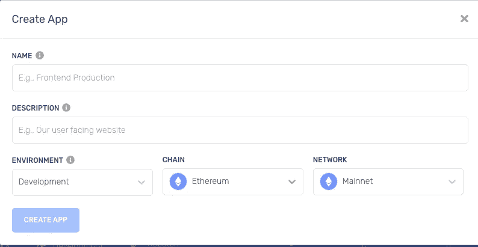
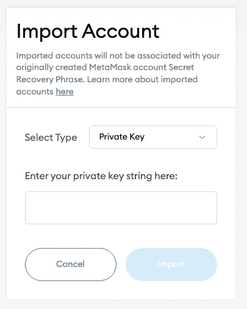
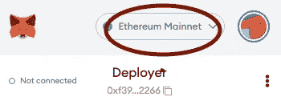
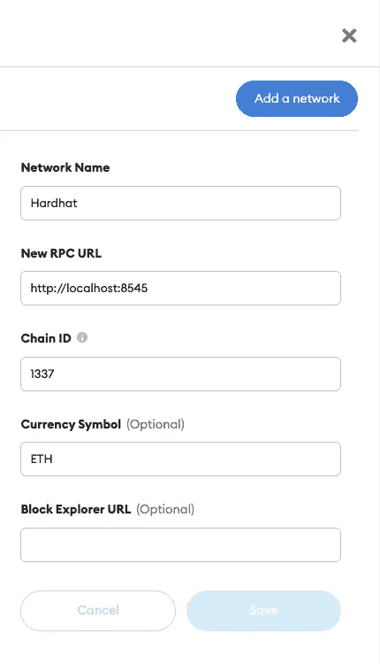
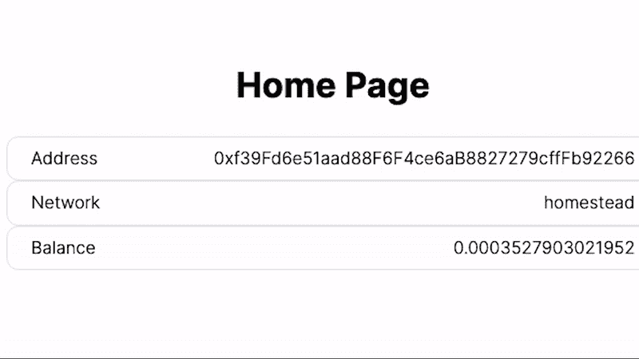

# 使用 Hardhat 与 NextJS 和 TypeScript 集成智能合约

> 原文：<https://betterprogramming.pub/integrating-smart-contracts-using-hardhat-with-nextjs-typescript-7206890b9cd8>

## 将智能合同融入您的前端


照片由 [Shubham Dhage](https://unsplash.com/@theshubhamdhage?utm_source=medium&utm_medium=referral) 在 [Unsplash](https://unsplash.com?utm_source=medium&utm_medium=referral) 上拍摄

这是一个系列的第 5 部分，如果你还没有查看以前的帖子，这里有[第一部分](https://wk0.medium.com/create-a-typescript-nextjs-project-with-jest-cypress-adbbcf237747)、[第二部分](https://wk0.medium.com/adding-tailwind-to-a-nextjs-typescript-project-d1eba5699c4d)、[第三部分](https://wk0.medium.com/adding-web3-to-our-nextjs-typescript-project-861e9ed5feaf/)和[第四部分](https://wk0.medium.com/converting-next-into-a-monorepo-with-yarn-workspaces-bf4007fdfa87)的链接。

到目前为止，我们已经初始化了一个 NextJS 应用程序，添加了 TailwindCSS，将 Web3 与 Ethers.js 集成，并转换为带有 yarn 工作区的 monorepo。

在本帖中，我们将添加 Hardhat 作为额外的 yarn 工作空间，并开始将一两个智能合同集成到我们的前端。

为了在我们的 dapp 中使用智能合约，我们将使用 [Hardhat](https://hardhat.org/) ，这是一个具有丰富插件生态系统的优秀框架。

一个伟大插件的作者， [hardhat-deploy](https://github.com/wighawag/hardhat-deploy) ，写了一个伟大的入门模板，我们将利用它。你可以在这里找到模板[。我们将使用一个我分叉的分支，你可以在这里找到](https://github.com/wighawag/template-ethereum-contracts)。

我继续将这个项目设置为工作区，并修改了一些示例代码。我们一会儿会详细讨论这个问题。

让我们首先将工作区分支克隆到我们的项目中。当然有一种优雅的方式可以做到这一点，但要保持简单:

```
git clone --branch as-workspace [git@github.com](mailto:git@github.com):wk0/template-ethereum-contracts.git
```

然后你会看到`template-ethereum-contracts/`文件夹。然后让我们做一个快速手动合并。

*   将`contracts-tests.yml`移动到`.github/workflows`文件夹
*   将`contracts`包移到我们的`packages/`文件夹中
*   从`contracts`中删除`node_modules`和任何锁定文件
*   将`template-ethereum-contracts/package.json`脚本复制到我们的根目录`package.json`
*   用`rm -r template-ethereum-contracts`移除文件夹(可能需要 sudo)

然后只需重新运行`yarn`来解析新包的依赖关系。

通过运行`yarn web`，然后运行`yarn contracts`，再次检查一切是否正常

如果遇到任何问题，只需删除每个包的内部`node_modules`，然后删除根`node_modules`和任何锁文件。您可能还想删除`.next`文件夹。

然后运行`yarn web:test:ci && yarn contracts:test:ci`以确保两者都通过。如果是这样，那么我们的 Github 动作测试也应该通过。

如果事情看起来不错，运行`yarn contracts:test`(注意:不是 ci)。您应该会从`EnvTest.test.ts`中看到一些失败的测试

我们有一些合同开发流程需要的依赖项。让我们复制示例 env 并填充它们。

```
cp packages/contracts/.env.example packages/contracts/.env
```

然后注册 API 密钥(别担心，它们都有免费层),用于:

*   [Coinmarketcap](https://coinmarketcap.com/api/)
*   [温柔地](https://tenderly.co/)
*   [以太扫描](https://etherscan.io/apis)
*   炼金术——在科万星球上用以太坊制造一个用于开发，在主网上制造一个用于生产。



炼金术注册

对于助记符，运行`npx mnemonics`(您也可以使用它通过元掩码导入)。

我建议生成一个新的助记符，即使出于安全原因你已经有了一个。你不会想在回购中不小心泄露出去的。`.env`还支持不同链/网络的独立助记符。

好了，现在我们有了一个相当不错的工作空间设置。让我们开始利用将项目的两个部分结合在一起的一些好处。

```
yarn add -W concurrently
```

并发将允许我们并发地运行我们的纱线命令——这将非常有用。

让我们在脚本中使用它来启动完整的 dapp:

```
"scripts": {
    "dev": "concurrently --kill-others-on-fail \"yarn contracts\"  \"yarn web\"",
    ...
},
```

酷，现在它超级容易快速开发。

这种设置的一个优点是 hardhat 网络——我们可以在 dapp 前端进行切换，以获得一个低风险的实验环境。

当您运行`yarn dev`时，您会注意到 hardhat 已经生成了 20 个公共&私有密钥对的列表。您可以通过打开元掩码，单击右上角的圆圈，然后导入帐户来访问这些内容。粘贴帐户#0 的私钥。



元掩码导入

如果您点击帐户上的三个点，一旦选中，您可以在帐户详细信息中对其进行重命名。我称之为 Deployer，因为这是我们在`hardhat.config.ts`中给 account 0 起的名字

同样对账户#1，即受益人，重复上述步骤。

将这两个帐户添加到元掩码后，验证本地网络是否仍在您的终端上运行，然后单击元掩码中的以太坊网络下拉列表。



单击此项，然后选择添加网络。

像这样填写网络信息:



现在你可以在元蒙版中选择安全帽。你应该看到你体内有大量的 ETH，大约 10，000 左右。确保您的本地 hardhat 节点仍在运行，否则您将得到一个错误，并且无法添加网络。

酷，现在让我们在我们的网络应用程序中利用它。

在我们加入合同之前，要支持多个网络并没有太多的工作要做，但是我们至少可以通过添加几个信息行来更好地了解状态。

在我们的`components/`文件夹中再创建两个组件，`Web3Balance.tsx` & `Web3Network.tsx`。

然后更新我们的`index.tsx`以利用新组件:

很好——您现在应该能够通过元掩码切换网络了。您应该会看到类似这样的内容:



如果你想要更多关于合同模板的解释，请留下评论，我会写一篇补充文章。接下来，我们将在 dapp 中实际使用我们的合同。

感谢阅读！

点击这里查看回购:[https://github.com/wk0/boilerplate-next/tree/tailwind](https://github.com/wk0/boilerplate-next/tree/with-contracts)

```
**Want to Connect?**Check out my website: [https://wk0.dev](https://wk0.dev/)
```