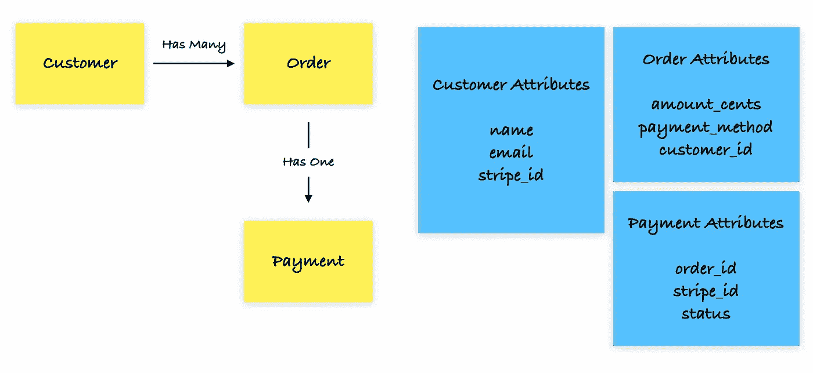
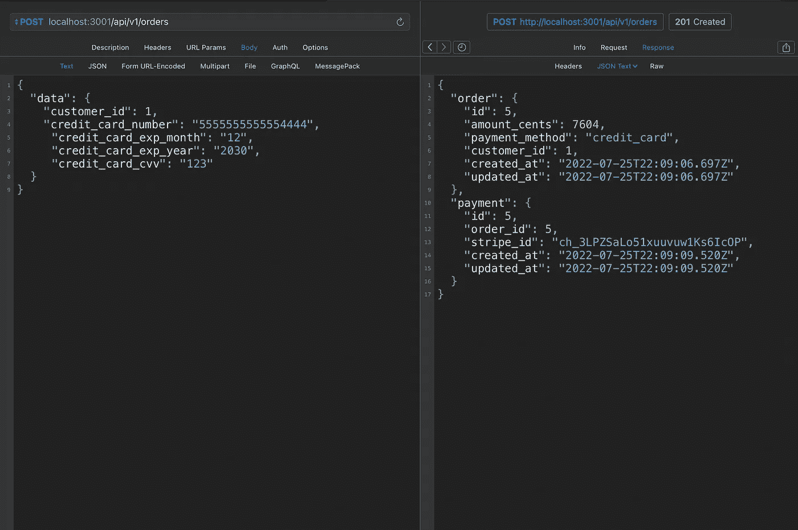
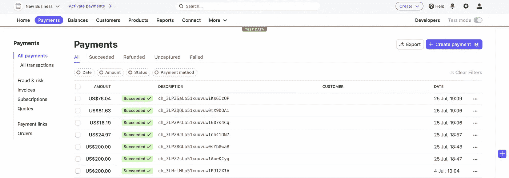

# 将 Stripe 支付网关集成到 Rails API 中

> 原文：<https://betterprogramming.pub/integrating-stripe-payment-gateway-to-your-rails-api-6c2972115e98>

## 关于 Stripe 充电 API 集成的实践指南


大家好！在本文中，我将使用 Stripe API 完成 Rails API 中的支付网关集成。这将是一个单一的付款方式，就像购买。我以前写过一篇关于循环支付方法的文章。你可以点击查看[。](https://bruno-feres.medium.com/integrating-recurring-payments-to-your-rails-api-with-stripe-9a16cb539690)

# 入门指南

Stripe APIs 对于电子商务和市场有着惊人的特性。为了让我们开发人员的生活更轻松，他们为一些编程语言提供了 SDK，包括 Ruby。

我们将使用以下代码开始将 Stripe SDK Gem 添加到我们的 Gem 文件中:

```
gem 'stripe'
```

之后不要忘记在你的终端中运行`bundle install`。

现在你需要在你的应用程序中创建一个 stripe 初始化文件。为此，在您的终端中运行以下命令:

```
touch config/initializers/stripe.rb
```

然后，打开`stripe.rb`文件，写下下面的内容:

```
Stripe.api_key = Rails.application.credentials.stripe_secret_key
```

我们没有在凭据文件中添加条带的密钥，所以让我们这样做。

要打开您的凭证文件，请在您的终端中运行以下命令:

```
EDITOR=nano rails credentials:edit
```

[在此获取您的条纹密钥。](https://dashboard.stripe.com/test/apikeys)

您的凭据文件必须如下所示:

```
# aws:
#   access_key_id: 123
#   secret_access_key: 345
# Used as the base secret for all MessageVerifiers in Rails, including the one protecting cookies.secret_key_base: [YOUR SECRET KEY BASE]
stripe_secret_key: [YOUR SECRET KEY HERE]
```

注意`secret_key_base`是自动生成的；你不需要编辑。

# 订单和支付逻辑

这一部分是关于我们这边的模型逻辑，我们的 API。它将由两种型号组成:`Order`和`Payment`。



带便利贴的纸板

我们的订单模型将有一个与之相关联的单一付款，并将属于一个客户。订单创建时，付款将作为回拨创建。请注意，我们不会存储支付方式信息(例如，信用卡数据)。

对于客户模型，您可以与您的用户模型相关联，或者在您的 API 中为它们创建一个 auth 端点。这里不探讨这种可能性，因为这不是重点。在本教程中，客户将通过种子生成。

付款方式信息将作为虚拟属性在创建订单端点上传递。

# `Models`

现在我们将根据上面看到的逻辑对`Models`进行编码。

在您的终端中运行以下命令:

```
rails g model Customer name email stripe_id
```

`Customer`属性:

*   `name`将是一个代表客户名称的字符串；
*   `email`将是一个代表客户电子邮件的字符串；
*   `stripe_id`将是一个字符串，表示 Stripe API 中对我们的`Customer`的引用。

```
rails g model Order amount_cents:integer payment_method:integer customer:references
```

`Order`属性:

*   `amount_cents`将是一个代表订单价值的整数
*   `payment_method`将是一个整数。我们将使用一个 rails enum 来跟踪它的期望值(在本教程中我们将只使用`credit_card`，[看看 Stripe](https://stripe.com/docs/api/payment_methods/create?lang=ruby) 中所有可用的支付方式)
*   `customer`将引用一个`Customer`记录

```
rails g model Payment order:references stripe_id
```

`Payment`属性:

*   `order`将是对`Order`记录的引用。
*   `stripe_id`将是一个字符串，表示 Stripe API 中对我们的`Payment`的引用。

现在我们需要对模型进行编码。它们应该是这样的:

没有条带 ID，我们的客户记录永远不会被创建。在验证过程之前，我们的回调`create_on_stripe`将被触发以在 Stripe 上创建一个客户。

点击了解更多关于 Rails enum [的信息。](/how-to-use-enums-in-rails-6-87600e292476)

我们的`get_token`方法到达 Stripe API，生成一个令牌来使用信用卡向客户收费。生成的令牌将通过 create_on_stripe 方法和其他需要的参数传递。

# 设置数据库

我们需要一个客户记录来测试控制器，所以在您的`seeds.rb`文件中添加以下代码:

```
Customer.create!(name: "Luke Skywalker", email: "[luke@test.com](mailto:luke@test.com)")
```

现在在您的终端中运行:

```
rails db:create db:migrate db:seed
```

# 控制器

现在在控制器上工作，我们将只编写一个创建动作。更好的方法是一个`order`控制器和一个`payment`控制器。首先，我们要创建一个订单。之后，我们将在结账端点创建一个支付。我在本教程中的重点不是控制器；它是支付处理和与 Stripe API 的集成。因此，付款参数将在订单创建时传递。

要生成控制器，请在终端中运行以下命令:

```
rails g controller Api::V1::Orders
```

并将以下代码添加到您的`routes`文件中。

```
Rails.application.routes.draw do
  namespace :api do
    namespace :v1 do
      post :orders, to: 'orders#create'
    end
  end
end
```

现在让我们来研究一下`Orders`控制器。代码如下:

请注意，控制器中的参数`amount_cents`和`payment_method`是自动填充的，因为在本教程中，我们只使用信用卡作为支付方式进行测试，并且我们没有`Product`模型。假设我们有一个`Product`模型来表示正在购买的东西。我们可以这样定义价格:

```
Product.find(:id).amount_cents
```

厉害！！我们现在可以测试它。

# 在 HTTP 客户端测试

在下面的截图中，我用的是一个叫 Paw 的 HTTP 客户端，不过你也可以用你最喜欢的。不会影响成绩。

*   请记住在您的请求中添加一个内容类型标题。一定是`application/json`。
*   要测试 Stripe API，使用他们提供的[测试数据](https://stripe.com/docs/testing?numbers-or-method-or-token=card-numbers)。



我们的终点成功了！

现在，您可以在[条纹仪表盘](https://dashboard.stripe.com/test/payments)中看到创建的付款。



# Stripe 使得与他们的 API 和 SDK 的集成变得非常简单和容易。

有许多关于 Stripe API 的资源没有在本文中探讨。

你可以在这里查看完整的条纹文档。

```
**Want to Connect?**If you have any questions or suggestions, [text me on Twitter](https://twitter.com/BrunoFeres4).
```