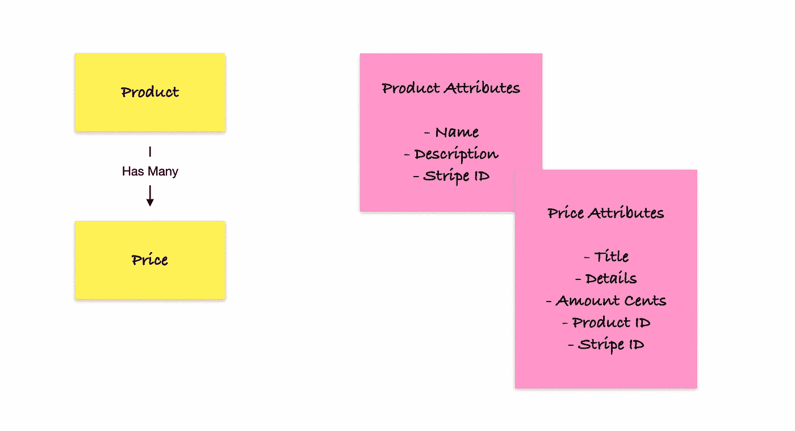

# 将 Stripe 的产品 API 集成到您的 Rails API 中

> 原文：<https://betterprogramming.pub/integrating-stripe-product-api-to-your-rails-api-b076f87547f5>

## 关于 Stripe 产品 API 集成的实践指南


# 入门指南

Stripe APIs 对于电子商务和市场有着惊人的特性。为了让我们开发人员的生活更轻松，他们为一些编程语言提供了 SDK，包括 Ruby。

我们将使用以下命令开始将条带 SDK Gem 添加到我们的 Gem 文件中:

```
gem 'stripe'
```

*之后别忘了在你的终端里运行* `*bundle install*` *。*

现在你需要在你的应用程序中创建一个 stripe 初始化文件。为此，在您的终端中运行以下命令:

```
touch config/initializers/stripe.rb
```

然后，打开`stripe.rb`文件，写下下面的内容:

```
Stripe.api_key = Rails.application.credentials.stripe_secret_key
```

我们没有在凭据文件中添加条带的密钥，所以让我们这样做。

要打开您的凭证文件，请在您的终端中运行以下命令:

```
EDITOR=nano rails credentials:edit
```

[在此获取您的条纹密钥。](https://dashboard.stripe.com/test/apikeys)

您的凭据文件必须如下所示:

```
# aws:
#   access_key_id: 123
#   secret_access_key: 345
# Used as the base secret for all MessageVerifiers in Rails, including the one protecting cookies.secret_key_base: [YOUR SECRET KEY BASE]
stripe_secret_key: [YOUR SECRET KEY HERE]
```

*注意，* `*secret_key_base*` *是自动生成的；你不需要编辑。*

# 产品逻辑

这个部分是关于我们这边的产品逻辑，我们的 API。它将由两个模型组成:产品和价格。



带便利贴的纸板

根据应用程序的需要，我们的产品模型将有尽可能多的`Prices`与之相关。但是为什么呢？

让我们假设你的一个产品是 iPhone 13。你可能知道，iPhone 13 有一堆变种，包括不同的颜色和存储。我们希望创建一个代表 iPhone 的单个`Product`记录，以及一个代表每种颜色变体的`Price`记录。

# 产品代码

现在我们将根据上面看到的逻辑对`Product`进行编码。

在您的终端中运行以下命令:

```
rails g model Product name description:text stripe_id
```

仔细看看`Product`的属性:

*   `name`将是一个代表产品名称的字符串；
*   `description`将是一个代表简短文本的字符串，描述产品；
*   `stripe_id`将是一个字符串，表示 Stripe API 中对我们的`Product`的引用。

现在，运行:

```
rails g model Price title details:text amount_cents:integer product:references stripe_id
```

当我们仔细查看价格属性时，我们会看到以下内容:

*   `title`将是一个字符串，表示我们正在销售的产品的变体；例如，它可以是“绿色”
*   `details`将是一个代表简短文本的字符串，描述产品变型
*   `amount_cents`将是一个整数，以美分表示产品的价值
*   `product_id`将是一个整数，表示对一个`Product`的引用
*   `stripe_id`将是一个字符串，代表 Stripe API 中对我们的`Price`的引用。

## **产品型号**

*   验证以确保`name` 和`stripe_id` 属性将始终存在。
*   验证以确保`stripe_id` 在数据库中是唯一的。
*   创建端点时通过产品 JSON 对象接受嵌套属性的设置。
*   与价格有许多联系。
*   当调用一个记录处理动作时，将触发“after”回调。这对于使我们的条带记录与我们的数据库保持一致是很重要的。

## **价格模型**

*   验证以确保`title`、`stripe_id`和`amount_cents`属性始终存在。
*   属于与产品的关联。
*   当调用一个记录处理动作时，将触发“after”回调。这对于使我们的条带记录与我们的数据库保持一致是很重要的。

## 产品控制器

通过这一步，我们将为产品创建一个控制器。这些动作将是一个简单的 CRUD。

在您的终端中运行:

```
rails g controller Api::V1::Products index show create update destroy
```

创建控制器后，您需要对其进行编辑，使其看起来像这样:

考虑到您可能已经了解了 Rails 控制器的逻辑，我就不再描述这个控制器代码了。如果你不熟悉，我鼓励你阅读[这篇文章](https://crystal-villanueva.medium.com/ruby-on-rails-controller-explanation-f501e0c0a92c)。

## 价格控制员

通过这一步，我们将创建一个价格控制器。这些动作将是一个简单的 CRUD。

```
rails g controller Api::V1::Prices index show create update destroy
```

创建控制器后，您需要对其进行编辑，使其看起来像这样:

我们的控制器看起来棒极了！！

# 路线

我们现在必须编辑我们的`routes.rb`文件。

它必须看起来像这样:

```
Rails.application.routes.draw do
  namespace :api do
    namespace :v1 do
      resources :products, except: %i[new edit] do
        resources :prices, only: %i[index create]
      end resources :prices, only: %i[show update destroy]
    end
  end
end
```

基本上，我们正在为产品和价格设置 CRUD 路径，但是价格路径将位于产品名称空间之下。这意味着价格端点的格式将始终如下:

```
/api/v1/products/:product_id/prices
```

# 在 HTTP 客户端上测试我们的 API

为了测试我们的 API，您需要启动您的服务器，并使用以下命令在您的终端上运行它:

```
rails s
```

## **创建产品**

方法:POST | URL: `http://localhost:3000/api/v1/products`

标题:`{ “Content-Type”: “application/json” }`

## **更新产品**

方法:PUT | URL: `http://localhost:3000/api/v1/products/1`

```
{
  "product": {
    "name": "iPhone 13"
  }
}
```

## **列出所有产品**

方法:获取|网址:`http://localhost:3000/api/v1/products`

## **检索产品**

方法:获取|网址:`http://localhost:3000/api/v1/products/1`

## **销毁产品**

方法:删除|网址:`http://localhost:3000/api/v1/products/1`

## **创建价格(针对现有产品)**

方法:贴吧|网址:`http://localhost:3000/api/v1/products/1/prices`

标题:`{ “Content-Type”: “application/json” }`

```
{
  "price": {
    "title": "Black - 128GB",
    "details": "New Green Finish",
    "amount_cents": 69900
  }
}
```

## **更新价格**

方法:上传|网址:`http://localhost:3000/api/v1/prices/1`

标题:`{ “Content-Type”: “application/json” }`

```
{
  "price": {
    "amount_cents": 59900
  }
}
```

## **检索价格**

方法:获取|网址:`http://localhost:3000/api/v1/prices/1`

## **破坏价格**

方法:删除|网址:`http://localhost:3000/api/v1/prices/1`

Stripe 使得与他们的 API 和 SDK 的集成变得非常简单和容易。

有许多关于 Stripe API 的资源没有在本文中探讨。我的意思是在未来发布其他的，与费用支付意向和网页挂钩相关的。

你可以在这里查看完整的条纹文档。

```
**Want to Connect?**If you have any questions or suggestions, [text me on Twitter](https://twitter.com/BrunoFeres4).
```