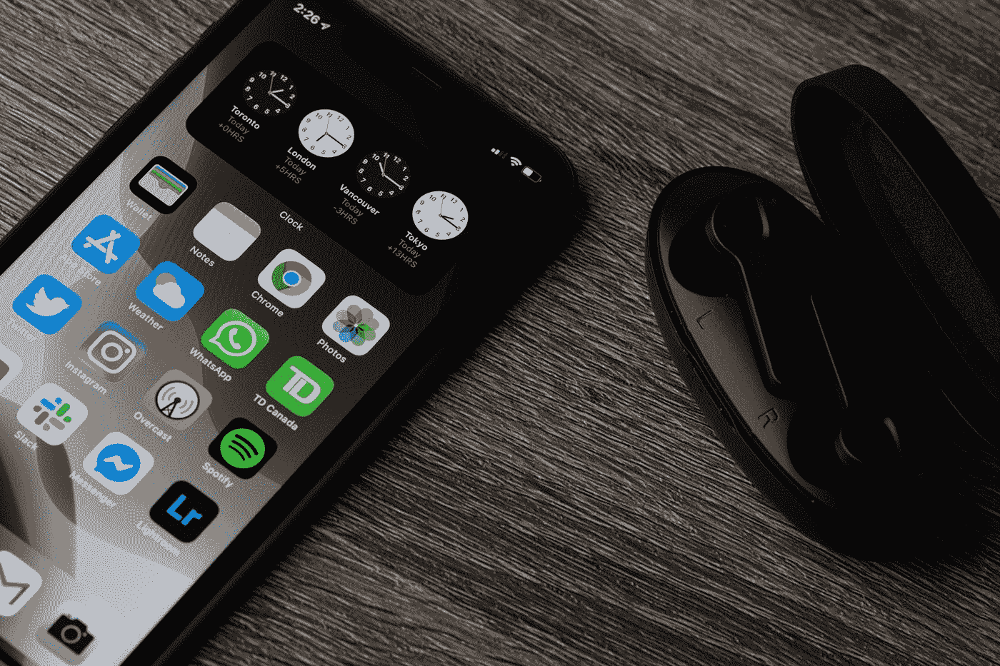

# 将 SwiftUI 与 UIKit 应用集成，以便尽早采用

> 原文：<https://betterprogramming.pub/integrating-swiftui-with-uikit-apps-for-early-adoption-1d8668442ae5>

## 你越早开始，你就越早使用 SwiftUI 做任何事情



Thom Bradley 在 [Unsplash](https://unsplash.com?utm_source=medium&utm_medium=referral) 上拍摄的照片

SwiftUI 是在 iOS 13 推出的，当时我们很多人都有一个用 UIKit 构建的大应用。SwiftUI 让我们充满热情地开始使用这个新框架来构建应用程序，就像 Swift 首次推出时一样。

当推出 Swift 时，我们必须从 Objective-C 迁移到 Swift。许多应用程序可能仍在使用(部分)Objective-C，因为这种转变需要相当长的时间。知道如何开始过渡以使这个过程尽可能短是很好的。iOS 14 越来越近，你可能[会考虑在今年晚些时候放弃 iOS 12](https://www.avanderlee.com/workflow/minimum-ios-version/) ，允许你在 SwiftUI 中编写新视图。因此，这里有一篇文章解释了如何在 UIKit 应用程序中使用 SwiftUI。

尽早在 UIKit 应用程序中添加 SwiftUI 视图将使您未来的自己更加快乐！

# 在 UIKit 应用中尽快使用 SwiftUI 的好处

从 UIKit 应用程序过渡到 SwiftUI 非常耗时，对于较大的应用程序，可能需要数年时间。当 Swift 推出时，用 Objective-C 编写的应用程序必须进行同样的转换，并且可能仍然没有完全迁移。因此，尽早采用 SwiftUI 有几个好处:

*   没有必要在将来把你的新视图重写到 SwiftUI 上。
*   您开始学习 SwiftUI，同时像平常一样进行开发。
*   向 SwiftUI 的过渡需要时间。你越早开始，你的应用程序就越早完全用 SwiftUI 编写。

# 在 UIKit 应用中采用 SwiftUI 时需要考虑的事项

要知道只有 iOS 13 及以上版本才能使用 SwiftUI。最重要的是，SwiftUI 是一项新技术，在以后的更新中得到了改进。放弃 iOS 12 意味着你可以从 SwiftUI 开始，但也意味着你开始使用 SwiftUI 的第一个版本。这可能会导致早期的意外行为和错误。

## 仅对新功能使用 SwiftUI

您可以决定仅对新功能使用 SwiftUI。即使你没有放弃 iOS 12，这也是可能的。您将使用可用的 API，这使得您新编写的视图仅在支持 SwiftUI 的版本上可用。

```
if #available(iOS 13.0, *) {
    presentSwiftUIView()
} else {
    // Fallback on earlier versions
}
```

您可以决定使用 SwiftUI 提供新功能，这些新功能使您的代码经得起未来考验，因为它消除了在几年内重写代码的需要。这显然只有在你可以决定让某个功能只对 iOS 13 及以上版本的用户可用的情况下才有效。

# 在 UIKit 视图控制器中呈现 SwiftUI 视图

一旦你有了想用 SwiftUI 开发的特性，就该用 SwiftUI 框架集成它了。SwiftUI 引入了一个名为`UIHostingController`的实例，负责“托管”SwiftUI 视图。

`UIHostingController`本身继承自`UIViewController`,这使得可以像处理任何其他视图控制器实例一样处理它。因此，呈现 SwiftUI 视图的代码就像这样简单:

```
func presentSwiftUIView() {
    let swiftUIView = SwiftUIView()
    let hostingController = UIHostingController(rootView: swiftUIView)
    present(hostingController, animated: true, completion: nil)
}
```

# 将 SwiftUI 视图添加到 UIKit 视图

同样的技术也适用于将 SwiftUI 视图添加到 UIKit 视图层次结构中。唯一的区别是，您没有呈现视图，而是将它添加为子视图控制器:

我们在这里做一些事情:

*   首先，我们将宿主控制器作为子控件添加到当前视图控制器中。
*   该视图被添加到当前视图控制器的视图层次结构中。
*   在代码中设置约束来更新 SwiftUI 视图的边界。你可以在这里了解更多关于用代码[编写自动布局的信息。](https://www.avanderlee.com/swift/auto-layout-programmatically/)
*   托管控制器被通知其包含的 SwiftUI 视图已经移动到父视图。

# 创建扩展以简化 SwiftUI 视图的添加

为了提高效率，我们可以将这个逻辑封装在`UIViewController`的扩展中。这允许我们编写与上面相同的代码，如下所示:

```
func addSwiftUIView() {
    let swiftUIView = SwiftUIView()
    addSubSwiftUIView(swiftUIView, to: view)
}
```

这个扩展看起来与我们之前的代码基本相同:

这使得将视图添加到 UIKit 视图层次结构变得非常容易，甚至允许您将 SwiftUI 视图添加到界面构建器中定义的容器视图。

# 结论

尽早在 UIKit 应用程序中添加 SwiftUI 视图将使您未来的自己更加快乐，因为您不必在以后重写它。通过一个简单的`UIViewController`扩展方法，您可以用几行代码轻松地添加一个视图。决定是否可以使用 SwiftUI 构建新功能，并利用`UIHostingController`来呈现 SwiftUI 视图。

如果您想进一步提高您的 SwiftUI 知识，请查看 [SwiftUI 类别页面](https://www.avanderlee.com/category/swiftui/)。

谢谢！