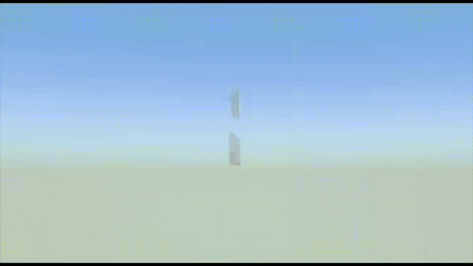
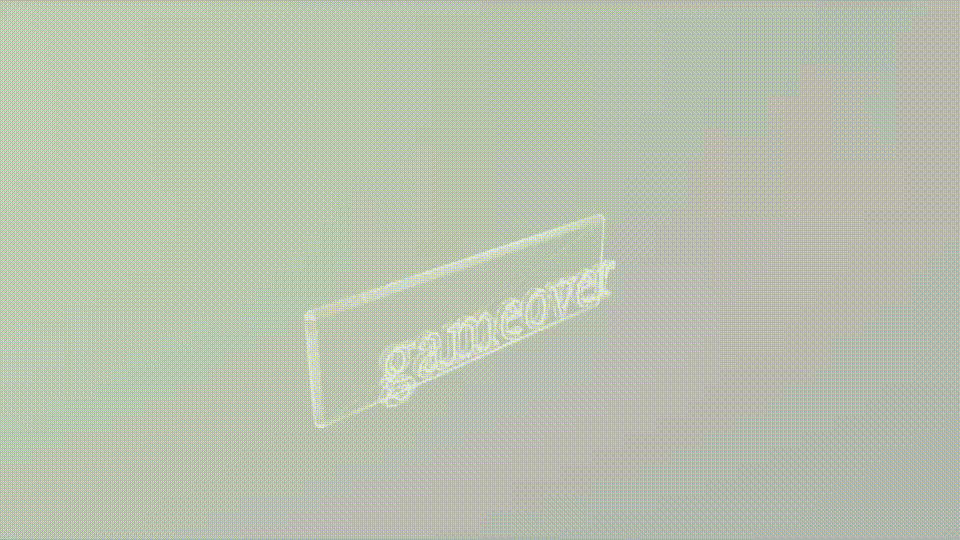
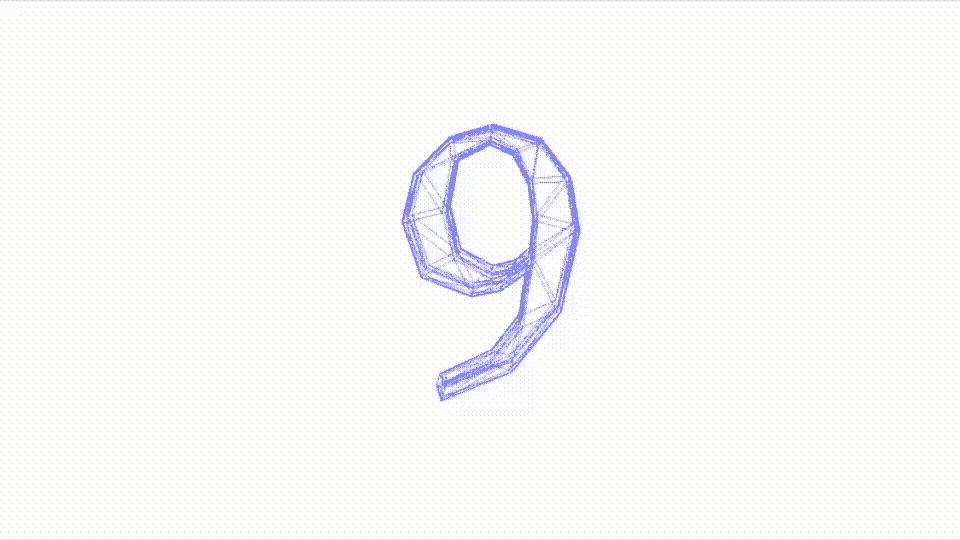
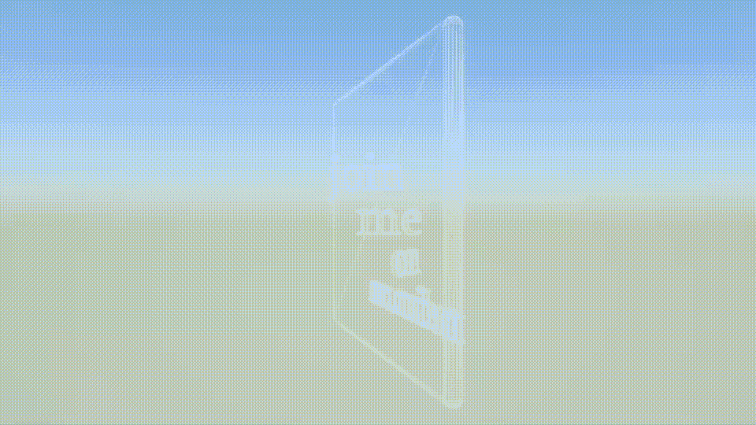

# 在 iOS 中使用 SceneKit 添加 TextEffects

> 原文：<https://betterprogramming.pub/integrating-texteffects-using-scenekit-in-ios-14c05e2c803e>

## 从不同的角度使用 SceneKit



SceneKit 生成的文本

在 SceneKit 中使用文本并不容易 SwiftUI 和 UIKit 都更容易。请和我一起阅读这篇文章，了解如何做到这一点——以及创建一些独特的文本效果来帮助你的应用脱颖而出的第二个目标。

## 旅程

首先，我将 SceneKit 实例基于我在[这个项目](/lets-build-sf-symbols-browser-in-3d-using-scenekit-and-swiftui-af8c0a0e9560)中展示的实例。我会这样做的基础上，我是由文本对象，如果你愿意互动；又名，以便我可以使用按钮的结果。



SceneKit 生成的文本

bon——你看到的是一个单独的区域，我只创建了轮廓，然后旋转和放大。这段文字背后的基本代码如下所示。是的，大约十四行来创建一行文本。

事实上，我不只是移动了文本，我还移动了相机，这就是为什么你会看到它向你移动，然后向后翻转。

现在，虽然我不能改变呈现的形状的几何形状——文本字形是形状——但我可以通过一堆节点来解决它，并在它们周围移动相机。



SceneKit 生成的文本

为此，我创建了一个节点递减计数的数组，随后我将镜头一个接一个地移向它们。我把所有的节点都放在一个圆内，让相机更努力地工作——让过渡更有趣——尽管你可以看到角度需要一些工作。

我使用一个简单的定时器触发的游戏场景中的订阅来改变摄像机。我在[这篇文章](/16-useful-extensions-for-swiftui-88aae6ff8909)中描述了一个解决方案。

Mais，等等——我不仅可以转动文本对象所附着的节点，甚至可以转动摄像机，我还可以转动文本。这是我用来作为这篇文章标题的一个效果。一个聪明的效果是，你的大脑似乎注意到文本的角度不正确，你必须努力阅读它，有时你不止一次没有抓住正确的点。



SceneKit 生成的文本

旋转节点通过计时器管理，计时器每半秒运行一次这段代码。当然，把它变成一个按钮可能不太符合苹果的用户友好准则。

文本穿过这四行代码。

```
textNode.simdEulerAngles = SIMD3(x: 0, y: GLKMathDegreesToRadians(45), z: 0)
textNode2.simdEulerAngles = SIMD3(x: 0, y: GLKMathDegreesToRadians(90), z: 0)
textNode3.simdEulerAngles = SIMD3(x: 0, y: GLKMathDegreesToRadians(135), z: 0)
textNode4.simdEulerAngles = SIMD3(x: 0, y: GLKMathDegreesToRadians(180), z: 0)
```

所有这些都让我想到了这篇关于 SceneKit 文本的短文的结尾——我确信这里有更多的可能性。