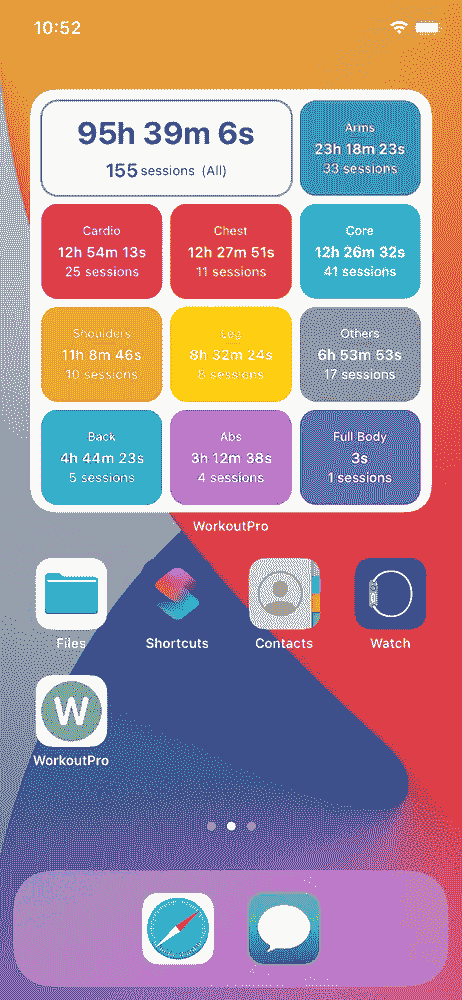

# 将 WidgetKit 集成到现有 SwiftUI 应用中

> 原文：<https://betterprogramming.pub/integrating-widgetkit-in-existing-swiftui-apps-ff285faa2896>

## 向您的 iOS 14 应用程序添加令人敬畏的小部件

米格尔·托马斯在 [Unsplash](https://unsplash.com?utm_source=medium&utm_medium=referral) 上拍摄的照片

我知道我去派对迟到了😅。你可能听说过`iOS 14`中的小部件及其使用案例。我已经开始开发一个个人使用的应用程序，使用`SwiftUI`来跟踪我的锻炼进度。我已经开始把它作为学习，后来我增加了更多的功能，因为我每天都在使用这个应用程序。

我每周检查我的锻炼总结，看看我花了多少时间，特别是身体的哪些部位。这是锻炼总结小部件的屏幕:

苹果在`WWDC20`中引入了`WidgetKit`，这引起了我的注意，所以我在我的应用程序的待办事项列表中添加了小部件支持。有很多文章从头开始支持 SwiftUI 应用程序，但很少有人支持使用核心数据支持和实时数据迁移现有应用程序。

让我们开始吧，看看用 Widget 支持更新您现有的应用程序需要哪些步骤。我使用`CoreData`作为我的本地存储。

1.  添加应用程序组
2.  将 CoreData 迁移到共享位置
3.  从 Widget 中的共享容器访问 CoreData

# 添加`App Group` s

默认情况下，保存在`CoreData`或`UserDefaults`中的所有数据只能在`host app`上访问，这意味着您的`main app`。您的微件将无法访问您的主机应用程序保存的数据。

您需要将数据保存在一个共享位置，以使数据可以被`Main app`和`app extension`(在我们的例子中是`Widget`)访问。你需要在苹果开发者门户配置`App Group`来创建一个共享容器。

按照以下步骤配置共享容器:

1.  登录您的 Apple 开发者帐户
2.  从侧面菜单中选择`Certificates, Identifiers & Profiles`
3.  从侧面菜单中选择`Identifiers`
4.  点击加号( **+** )按钮，从列表中选择`App Groups`
5.  提供您的组标识符和描述
6.  点击`Continue`然后点击`Register`

你的应用组 Id 现已准备就绪。下一步:将你的应用组 ID 链接到你的应用 ID。

1.  从可用应用 id 列表中选择您的`App ID`
2.  在功能列表中选择`App Groups`
3.  勾选`App Groups`并点击后，`Configure`按钮将被激活。
4.  从应用组列表中选择新创建的`App Group ID`，点击`Continue`
5.  点击`Save`
6.  阅读警报中的消息，并点击`Confirm`。基本上，在添加/删除应用 Id 的任何功能后，您需要创建一个新的临时配置文件。

回到 Xcode，并添加新的应用程序群组功能。在两个目标上选择新创建的应用程序组 ID—您的`Main App`和`Widget`。

# 将 CoreData 迁移到共享容器

我已经创建了自定义逻辑来将我的本地`CoreData`文件迁移到共享容器，如下所示。我在`UserDefaults`中维护了一个 bool 来检查数据库是否已经被迁移到一个共享容器中，并且只有在它还没有被迁移时才继续。下面的代码应该是不言自明的:

核心数据迁移逻辑

# 从小部件中的共享容器访问 CoreData

您应该能够使用以下代码访问现有的核心数据文件和小部件中的现有数据:

从小部件访问核心数据

注意:确保所有必需的文件都共享到您的小部件以及目标成员中。

# 结论

小部件是简略内容的正确选择。明智地将它与 CoreData 等其他强大的框架结合使用。

谢谢👨🏻‍💻