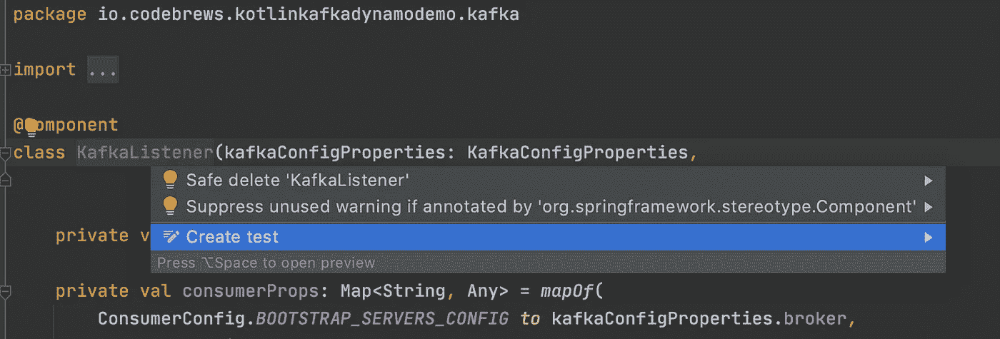
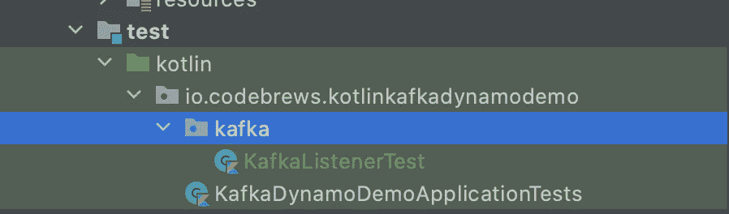
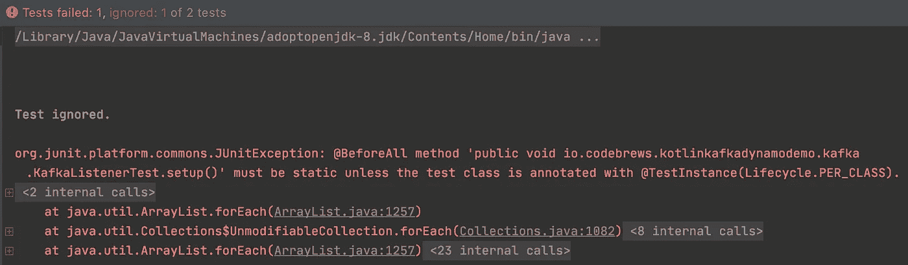
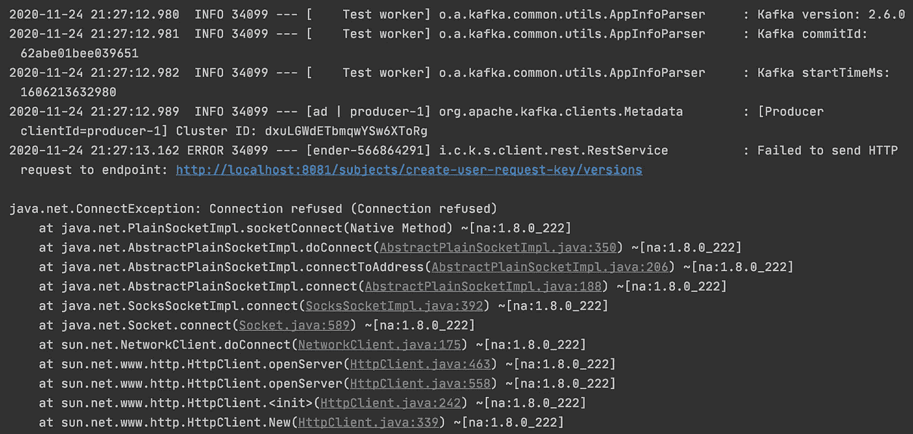
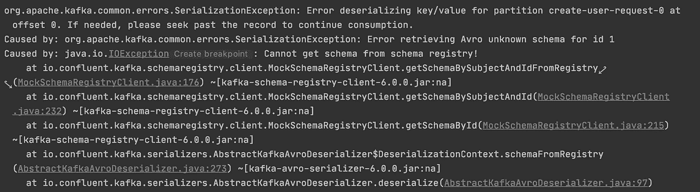
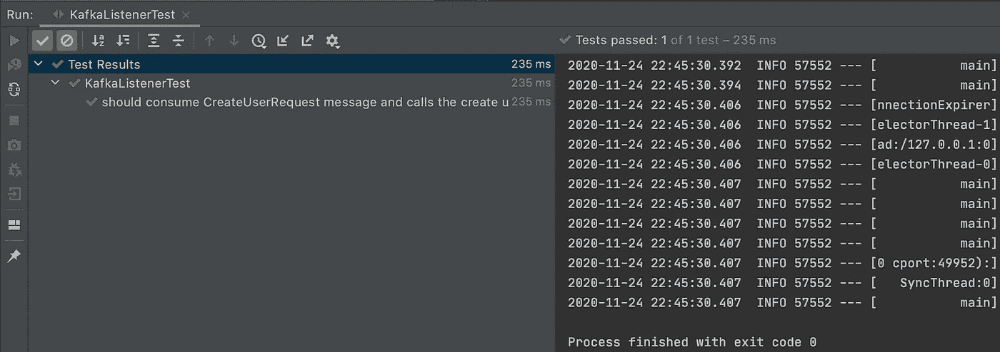

# 针对 Kafka 消费者的集成测试

> 原文：<https://betterprogramming.pub/integration-test-for-kafka-consumer-be76528b843a>

## 使用`embeddedKafka`和`JUnit5`


由[absolute vision](https://unsplash.com/@freegraphictoday?utm_source=medium&utm_medium=referral)在 [Unsplash](https://unsplash.com?utm_source=medium&utm_medium=referral) 上拍摄的照片

# 介绍

最近，我写了一篇关于如何用 [Kafka](https://kafka.apache.org/documentation/) 和 [DynamoDB](https://aws.amazon.com/dynamodb/) 构建事件驱动应用的综合[教程](https://medium.com/better-programming/a-comprehensive-guide-to-build-an-event-driven-application-with-kotlin-kafka-and-dynamodb-a8d9bfb19e42)。本教程涵盖了构建公开 2 个端点的工作应用程序的端到端过程:

*   1 x `POST`端点接收一个创建新用户的请求
*   1 x `GET`端点返回一条用户信息

`POST`端点发布一条消息，该消息包含从客户端到 Kafka 主题的用户创建请求。有一个 Kafka 监听器管道订阅这个主题，使用消息，最后在 DynamoDB 表中持久化新的用户信息。查看教程了解更多信息。

在本教程中，我们将看看如何为我们的`POST`路线编写一个集成测试，特别是在 Kafka Producer 组件上。我们将使用`embeddedKafka`和`JUnit5`。

TLDR — Github 回购[此处](https://github.com/billydh/kotlin-kafka-dynamo-demo)。

请注意`build.gradle.kts`中的依赖项和 Gradle 包装版本已根据此[拉取请求](https://github.com/billydh/kotlin-kafka-dynamo-demo/pull/2)进行了升级。

# 先决条件

为了能够跟进，请将这个 Github [repo](https://github.com/billydh/kotlin-kafka-dynamo-demo) 克隆到您的本地机器上。虽然不是强制性的，但是强烈建议您遵循关于使用 Kafka 和 DynamoDB 构建应用程序的教程，这也是我们将要编写集成测试的目的。

# 集成测试依赖项

我们需要向`build.gradle.kts`添加以下库来支持我们的 Kafka 集成测试:`org.springframework.kafka:spring-kafka-test`。这个库提供了`EmbeddedKafka`，这是一个内存中的卡夫卡，我们将在集成测试中使用它。

我们需要的另一个测试依赖项是`org.springframework.kafka:spring-kafka`，它提供了`KafkaTestUtils`类。我们将使用这个类在测试类中构造我们的 Kafka producer 属性。

我们还需要`com.nhaarman.mockitokotlin2:mockito-kotlin`库来帮助模拟方法。这几乎是 Mockito 的 Kotlin 实现。

JUnit5 依赖项已经被这个库覆盖:`org.springframework.boot:spring-boot-starter-test`，它已经在我们的`build.gradle.kts`文件中。

我们的构建`gradle`文件的依赖部分如下所示。

build.gradle.kts —带有 Kafka 测试依赖项

# 卡夫卡听众测验

让我们继续在`test`目录中创建一个新文件来包含我们的集成测试。命名为`KafkaListenerTest.kt`。

旁注:如果您在 IntelliJ 上开发，您可以这样做来在正确的位置生成测试类。将光标放在类名上，右键单击，并选择 Show Context Actions，或者按键盘上的快捷键。



一旦你完成了这些，你会看到`KafkaListenerTest`类被创建如下。



## 写出基本框架

我们将编写一个基于 Spring Boot 的测试，因为我们的 Kafka 监听器是一个 Spring 组件。我们最初的测试类如下所示。

KafkaListenerTest.kt —初始测试类结构

让我们简单地看一下这些注释的用途。

`@DirtiesContext`用于告诉 Spring 作为测试的一部分创建的应用程序上下文是脏的，应该在测试完成后清除。我们使用这个是因为如果我们有多个依赖于它的测试类，`EmbeddedKafka`可能是“脏的”。

`@EmbeddedKafka`用于在基于 Spring 的测试中提供一个内存中的 Kafka 实例。它还提供了一个`EmbeddedKafkaBroker` bean 的实例，我们可以在测试中注入和使用它。

`@SpringBootTest`用于运行基于 Spring Boot 的测试。这意味着 Spring 将管理 beans 的生命周期、依赖注入等等。

## 模仿处理程序 bean

因为我们只对测试 Kafka 消费者部分感兴趣，所以我们将使用另一个用于测试的 Spring 注释来模拟`CreateUserRequestHandler`bean:`@MockBean`。

这个注释用一个 mock 替换了应用程序上下文中相同类型的 bean。这意味着我们可以很容易地控制测试的行为。

```
@MockBean
private lateinit var mockCreateUserRequestHandler: CreateUserRequestHandler
```

## 为测试创建应用程序属性文件

正如主 Spring Boot 应用程序加载并使用在`application.yml`中定义的配置一样，我们的 Spring Boot 测试类也做同样的事情。不同之处在于，测试类将在测试文件夹中的 resources 文件夹中查找文件，而不是在主文件夹中。我们需要为我们的测试类提供这个。

现在，让我们继续将`application.yml`中的内容复制粘贴到主文件夹中。

application.yml —用于测试类

## 准备一个卡夫卡制作人

因为我们正在测试我们的 Kafka 消费者，所以我们需要一个 Kafka 生产者将消息发布到同一个主题，这样我们的消费者将从该主题中做出反应并消费它。这个 Kafka 生产者依赖于自动连线的`EmbeddedKafkaBroker`实例，因为它需要代理地址。让我们把它定义为一个后期初始化的变量。

```
@Autowired
private lateinit var embeddedKafkaBroker: EmbeddedKafkaBrokerprivate lateinit var producer: ReactiveKafkaProducerTemplate<String, CreateUserRequest>
```

此外，我们希望 Kafka 制作者使用正确类型的连续剧，以确保我们的 Kafka 消费者能够将信息去序列化。为此，我们可以使用与在`KafkaConfigProperties` bean 中定义的值相同的值。让我们将它自动连接到测试类。

```
@Autowired
private lateinit var kafkaConfigProperties: KafkaConfigProperties
```

最后，我们需要在所有测试用例运行之前初始化这个 Kafka 生成器。为此，我们可以在 test 类的方法上使用 JUnit5 的`@BeforeAll`注释。`@BeforeAll`所做的是，它指定带注释的方法将在测试类中的所有测试用例之前运行。该方法将只执行一次。

注意:测试类需要用`@TestInstance(TestInstance.Lifecycle.*PER_CLASS*)`注释，这样`@BeforeAll`注释的方法才能工作，否则你会得到这样的异常。



JUnitException

这是我们用`@BeforeAll`注释的`setup()`方法。

```
@BeforeAll
fun setup() {
    val producerProps = KafkaTestUtils.producerProps(embeddedKafkaBroker.*brokersAsString*)
        .*apply* **{** this[ProducerConfig.*KEY_SERIALIZER_CLASS_CONFIG*] = kafkaConfigProperties.serializer
            this[ProducerConfig.*VALUE_SERIALIZER_CLASS_CONFIG*] = kafkaConfigProperties.serializer
            this[AbstractKafkaSchemaSerDeConfig.*SCHEMA_REGISTRY_URL_CONFIG*] = kafkaConfigProperties.schemaRegistryUrl
        **}** producer = ReactiveKafkaProducerTemplate(SenderOptions.create(producerProps))
}
```

太好了！现在，我们的 Kafka 生产者已经准备好向`KafkaListener` bean 正在收听的主题发送消息。

## 使用动态 Kafka 代理地址

请注意，`KafkaListener`被配置为在由`KafkaConfigProperties`的`broker`属性指定的地址与 Kafka 经纪人对话。当前值被设置为`application.yml`文件中的`localhost:9092`。

另一方面，`EmbeddedKafka`每次都会在一个随机的端口上运行，所以我们无法预先确定代理的地址。为了解决这种情况，我们将修改测试文件夹中的`application.yml`文件中的`application.kafka.broker`属性。

```
application:
  ...
  ... kafka:
    broker: "${spring.embedded.kafka.brokers:#{localhost:9092}}"
```

上面的表达式被称为 SpEL (Spring Expression Language)，它在这里所做的是，如果存在的话，它将获得`spring.embedded.kafka.brokers`的值，否则默认为`localhost:9092`。`EmbeddedKafka`是设置`spring.embedded.kafka.brokers`属性的那个。这样，我们的`KafkaListener`将能够引用正确的经纪人。

## 编写测试用例

我们已经准备好编写测试用例，看看我们的 Kafka 消费者是否做了它应该做的事情。测试案例很简单:

*   给定一个`CreateUserRequest`消息发布到创建用户请求主题，
*   KafkaListener bean 应该使用该消息，并且
*   然后调用`CreateUserRequestHandler`类的`handleCreateUserRequest`方法。

让我们首先编写将消息发布到主题的测试用例部分。

```
@Test
fun `should consume CreateUserRequest message and calls the handler method`() {
    val createUserRequest = CreateUserRequest("email@some.com", "Joe", "Jones")

    val producerRecord = ProducerRecord(
        kafkaConfigProperties.createUserRequestTopic,
        UUID.randomUUID().toString(),
        createUserRequest
    )

    StepVerifier.create(producer.send(producerRecord))
        .expectNextMatches **{ it** is SenderResult **}** .verifyComplete()
}
```

在这里，我们用包含要创建的用户详细信息的`CreateUserRequest`消息创建了生产者记录，并且我们已经将消息发布到由`kafkaConfigProperties.createUserRequestTopic`定义的主题，并为消息键使用了随机 UUID。

我们用`StepVerifier`包装`producer.send(producerRecord)`调用，因为它使我们能够在订阅时验证异步发布者及其预期事件。如果我们看一下`send()`的方法签名，它的返回值类型是`Mono<SenderResult<Void>>`。

`Mono`是由 Project Reactor 提供的异步发布者类型。由此，我们知道预期事件的类型是`SenderResult`。一旦经过验证，我们就知道消息已经成功发布。这基本上就是我们对`StepVerifier`号所做的事情。

既然消息已经发布，我们期望`KafkaListener` bean 会使用它。但是我们如何确定这一点呢？通过验证是否与`mockCreateUserRequestHandler`有任何交互，特别是调用它的`handleCreateUserRequest`方法，将发布的`CreateUserRequest`作为它的输入，正好一次。

在编写验证之前，我们还需要模拟`handleCreateUserRequest`方法返回`Mono<Unit>`。如果我们不这样做，当代码到达调用`handleCreateUserRequest()`的部分时，我们将会以空指针异常结束。

```
*given*(mockCreateUserRequestHandler.handleCreateUserRequest(createUserRequest)).willReturn(Mono.just(Unit))

*verify*(mockCreateUserRequestHandler, *timeout*(5000L).times(1))
    .handleCreateUserRequest(createUserRequest)
```

这是我们整合了上述所有步骤后测试用例的样子。

KafkaListenerTest.kt

现在，继续运行测试用例。

正在执行…

等待中…

哎哟！我们有一个例外！



连接异常

让我们把注意力放在这条线上。

```
Failed to send HTTP request to endpoint: [http://localhost:8081/subjects/create-user-request-key/versions](http://localhost:8081/subjects/create-user-request-key/versions)
```

这看起来像我们的模式注册 URL。这里的问题是，我们没有运行真正的模式注册中心，我们的 Kafka 生产者在发送消息时试图连接它。

我们如何解决这个问题？通过使用 Kafka 汇合库的`MockSchemaRegistryClient`。

# 模拟 Kafka Avro 序列化器和反序列化器

我们必须在测试文件夹中定义两个新的类。一个类将扩展`KafkaAvroSerializer`，另一个将扩展`KafkaAvroDeserializer`。两者都将使用`MockSchemaRegistryClient`作为它们的模式注册客户端。

**重要提示**:要创建的两个 mocks 必须使用同一个`MockSchemaRegistryClient`实例，否则当 Kafka 消费者试图从主题中去序列化一个消息时，它会抛出这样的去序列化错误。



序列化异常

所以我们需要一个由模拟序列化器和反序列化器共享的`MockSchemaRegistryClient`实例的单例。这是我们将在测试文件夹中拥有的三个新文件。

MockSchemaRegistry.kt

MockKafkaAvroSerializer.kt

MockKafkaAvroDeserializer.kt

此外，我们还需要更新测试文件夹中`application.yml`文件中 Kafka serialiser 和 deserialiser 的值。

```
application:
  ...
  ...
  kafka:
    broker: "${spring.embedded.kafka.brokers:#{localhost:9092}}"
    serializer: io.codebrews.kotlinkafkadynamodemo.MockKafkaAvroSerializer
    deserializer: io.codebrews.kotlinkafkadynamodemo.MockKafkaAvroDeserializer
```

现在，如果我们再次运行测试，它会通过。快乐的日子！



# 结论

我们已经学习了如何使用`SpringBootTest`和`EmbeddedKafka`为 Kafka 消费者建立一个集成测试。`EmbeddedKafka`提供了一个内存中的卡夫卡实例，非常方便。另一方面，`SpringBootTest`管理测试环境中所有 Spring beans 的生命周期，因此我们可以专注于编写测试用例。

如果您想查看为 Kafka consumer 编写集成测试而添加的内容，这里有到拉请求的[链接。](https://github.com/billydh/kotlin-kafka-dynamo-demo/pull/3)

在不久的将来，我将为 Kafka producer 写另一篇关于集成测试的文章。敬请关注。