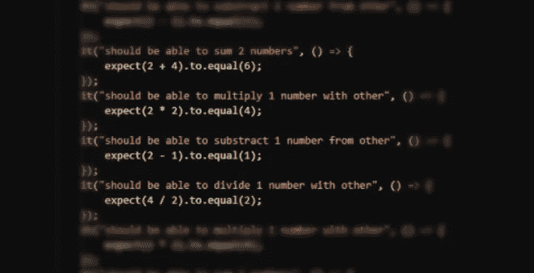

# Node.js 中的集成测试

> 原文：<https://betterprogramming.pub/integration-tests-in-node-js-f44a389a4144>

## 讨论 Mocha 运行集成测试的基本设置

在上一篇文章中，我写了单元测试的重要性以及它如何改进我们的代码库。

但是，如果您想获得更多的安全性，并在一个 [Node.js](https://nodejs.org/) 应用程序中编写集成测试，该怎么办呢？在这篇文章中，我将讨论[摩卡](https://mochajs.org/)运行集成测试的基本设置。

在创作这个作品的例子时，我把注意力集中在我的一个项目中的问题上。在这个项目中，我们有一个很大的 REST API 应用程序，它几乎没有任何测试。

然而，有一个重要的界面，之前的一个开发人员认为测试它很重要，因为这对客户的公司不倒闭至关重要。

如果发生其他事故，我们并不太担心，但这次事故几乎是世界末日。

我们的测试设置远非完美。问题是测试在真实的数据库上运行，并在其上创建真实的项目。这些项目需要通过清理过程移除。

清理经常失败，然后这个产品因为违反约束而在下一次测试运行中崩溃。我们需要手动删除该产品。

一旦测试项以某种方式在生产数据库上被创建，并且每天被复制到测试环境中，我们就不能删除它，因为我们不能访问它。

最终，我们感到无聊，并在挂钩前添加了清理功能。这是非常不必要的，在测试运行之间，我们仍然在数据库中有测试项。

为我的同事说句公道话，当我试图在 Node.js 中查找关于集成测试的信息时，几乎所有人都在谈论在工作的服务器应用程序上调用 API 路由并断言结果。

这很好，但是从我的经验来看，这些测试很难维护，因为它们测试整个路线，这可能相当复杂。此外，它们运行在真实的数据库上，因此，如果您有静态数据集，它们就会过时，无论是在测试中还是在数据库中。

也很容易忘记它们，然后你突然意识到，在发布前两天，一半的测试失败了，因为开发人员没有通过长期运行的集成测试来运行一个小的 bug 修复。

在解决这个问题时，我们还考虑了一个单独的测试数据库实例，它包含静态数据或者位于内存数据库中。我们把那些想法扔进了垃圾箱，因为维护数据是不可能的。

因此，在这一点上，我们放弃了创建更好的测试套件的所有机会。界面非常复杂，而且没有考虑到测试。

不过，不要担心。这篇文章不是关于我们对完整测试范围失去的希望。

当我开始一个不同的项目时，我被要求编写一些关于 DAOs(数据访问对象)的集成测试。测试配置已经创建，所以我只写了一些测试用例和断言。

当我开始测试时，我惊讶地发现在每个测试用例之后，测试框架都回滚了整个事务。当我检查数据库时，我发现没有任何测试数据真正写在那里。

我的思绪被吹走了。如此简单而优雅的解决方案。您可以使用最新的数据在任何处于最新状态的数据库上运行测试。我很好奇在 Node.js 中实现这样的解决方案会有多难。

所以，我用 [Express](https://expressjs.com/) 创建了一个示例项目。

这是一个存储书籍的简单应用程序。每本书都有名字和标题。API 通过图书模型路由访问数据，图书模型有一些基本的查询来创建或返回数据。

数据存储在一个 [MySQL](https://www.mysql.com/) 数据库中，可以通过 MySQL [npm](https://www.npmjs.com/) 包访问该数据库。如果您使用不同的数据库或软件包，您可能需要调整这个解决方案。

废话够多了，我们来编码吧！

# 编码

首先，我们需要一个`util`类来与数据库通信。

如你所见，我们有两种方法。一个用于连接数据库，另一个用于运行查询。我们通过构造函数发送连接配置。

在`connect`中，我们连接到数据库并遍历原型中的所有方法。我们用`util.promisify`包装它们，这样我们就可以使用`async``await`(MySQL 包支持回调，我不想经历那个地狱)。

查询方法连接到`db`(如果它尚未连接)并在其上运行查询。

所以，当我们有了数据库接口，我们就可以开始写模型了。如你所见，那里没有什么有趣的东西。唯一要提到的是，我特意创建了`createAll`方法，因此它在一个事务中运行多个查询。

在这个方法中，我们将尝试演示测试在一个事务中运行多个查询的方法的可能性。

我们还需要知道数据库的初始状态。我在表 *books* 中创建了两本书，如下表所示。

我们拥有一切—我们可以测试！

作为测试跑者，我选择了摩卡，但它会与其他跑者相似。这些是我的测试案例:

我知道这些测试测试不多，在现实世界中，您可能还会测试返回的数据。

但是，这个测试用例测试的正是我们想要的——`db`的初始状态对于每个测试都应该是相同的。

如果您按照这个顺序运行这些测试用例，您可以看到，在第一次测试运行之后，将会有三本书，在删除一本之后，将会有两本。然后，有了两本新书，就变成了四本，最后又变成了四本。

如果你把它和断言比较，你会发现我们期望不同的值。

如果您以前做过一些测试，您就会知道我们需要稍微改变一下数据库连接器。如果您查看 MySQL 的文档，您会发现运行事务非常简单。

在创建连接之后，您需要在连接上调用`beginTransaction`,这样就完成了。

因此，我们需要这样做:

如果你没有看过`method.call(this, …)`，你可以在 [w3schools](https://www.w3schools.com/js/js_function_call.asp) 了解更多。简而言之，它为给定的函数调用设置上下文。

所以，我们在这里做的是调用一个父方法(原始实现)，并说这被设置为一个`mockedDb`的实例。

`MockedDb`将所有数据库通信设置在一个事务中。然后，我们可以添加在每次运行后回滚事务的`afterEach`钩子。

就是这样！开个玩笑……如果你仔细读过，你会记得我们有使用事务和调用的`createdAll`。

这将导致`“should return 4 books in create many tries to create 2 books”`，这将真正提交事务，它将破坏我们数据库中的数据。

为了让这种痛苦消失，我们需要在连接上存根`commit`方法、`rollback`方法和`beginTransaction`。

这就是当我们在实现中调用这些方法时，数据库上不会发生任何事情的原因。

我们的`MockedDb`类将如下所示:

如果您需要测试`commit`或`rollback`，您可以使用 [Sinon](https://sinonjs.org) 来存根该方法，然后在它被调用时断言它。您可能还需要在回滚时断言它，或者拥有在提交或回滚事务时创建新事务的方法。

这个精确的解决方案不会减轻您的头痛，您将需要调整这些存根来满足您的要求。然而，如果你有一个简单的模型，你可以很容易地接受这个设置，并且知道不会有任何东西写入数据库。

你可以在我的 [GitHub](https://github.com/rochus222/integration-tests-nodejs) 上找到整个项目。

我希望你喜欢这篇文章。

干杯！