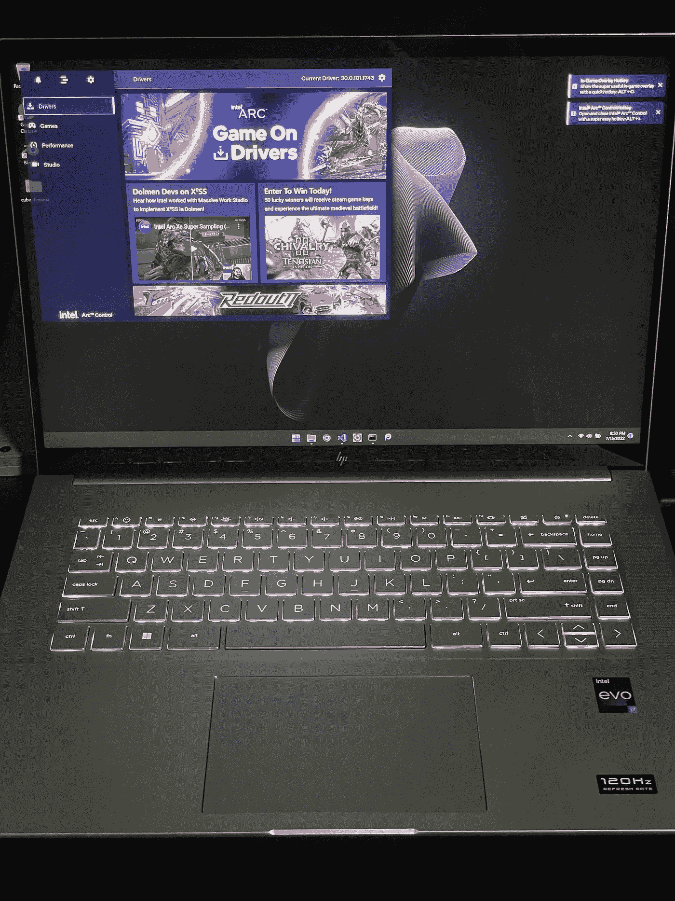
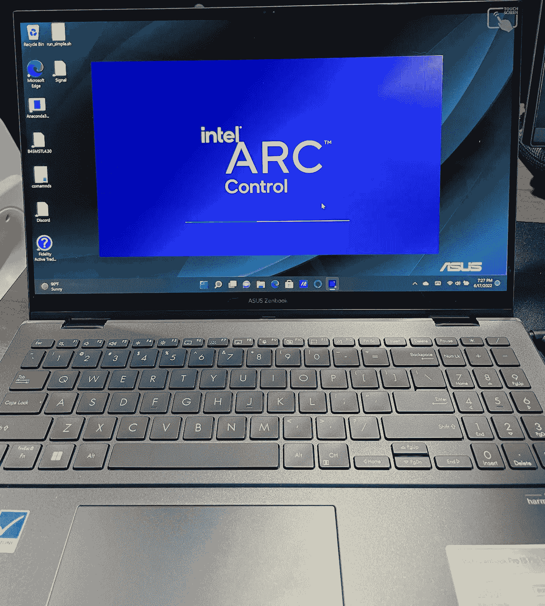
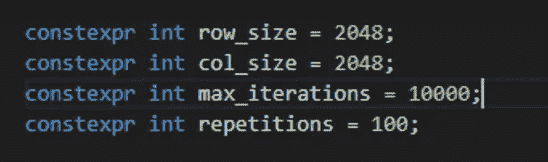
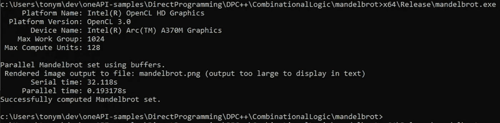
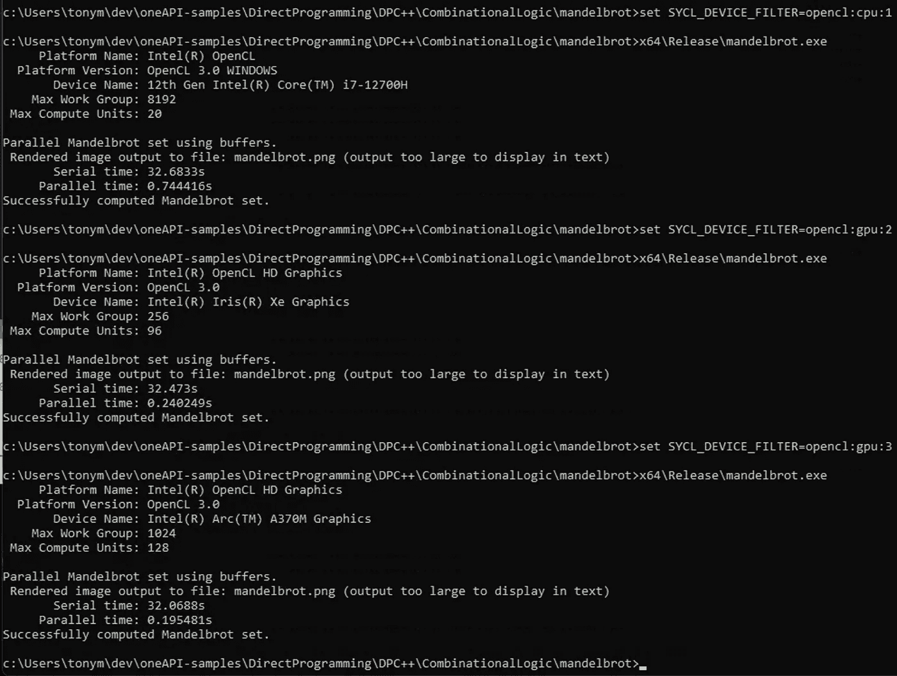
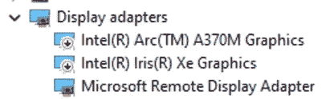
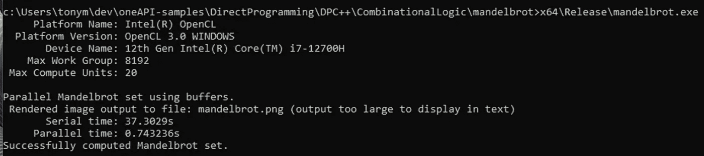
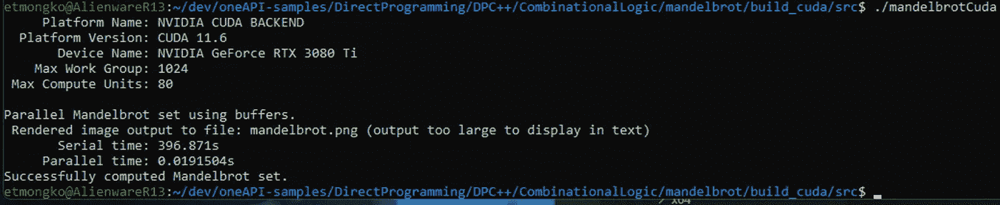

# 英特尔 Arc GPUs 和 OneAPI——它们 SYCL 吗？

> 原文：<https://betterprogramming.pub/intel-arc-gpus-and-oneapi-do-they-sycl-9b3ba7c888b8>

## 在英特尔 Arc 和 Iris Xe GPUs 上运行 oneAPI C++和 SYCL 代码


克里斯蒂安·威迪格在 [Unsplash](https://unsplash.com?utm_source=medium&utm_medium=referral) 上拍摄的照片

oneAPI 以 C++和 SYCL 为特色，支持相同的加速器代码在各种 GPU 和 CPU 架构上运行。正如我在[上一篇关于异构计算的帖子](/cuda-sycl-codeplay-and-oneapi-accelerators-for-everyone-4603fee0421)中所承诺的，这次我们将使用新的英特尔 Arc GPU 和 oneAPI 来看看 SYCL 如何与英特尔 Arc 配合使用。

# 英特尔 Arc，这里是 GPU

我们将使用的英特尔 Arc GPU 以 HP Envy 16 英寸笔记本电脑的形式出现。它由 32GB 内存的英特尔 i7–12700h 提供支持，并配有运行驱动程序版本 30.0.101.1743 的英特尔 Arc A370M。像往常一样，我自己购买了这个硬件(又名笔记本电脑，不是由英特尔提供的)，这篇文章中的一切都是你可以自己做的。



作者提供的惠普 Envy 图片

随机注意，我还购买了华硕动画书，配有英特尔 Arc GPU、16GB 内存和漂亮的有机发光二极管屏幕！我强烈建议人们也去看看，因为屏幕实在是太棒了。



作者的华硕动画书图片

# 让我们运行一些代码！

由于这是一台全新的笔记本电脑，今天我们将测试设置一个纯 Windows 开发环境，而不是我们过去使用的 WSL2+Ubuntu 环境。我们需要安装一些基本工具，如 [Git](https://git-scm.com/download/win) 、[微软 Visual Studio 2022 社区版](https://visualstudio.microsoft.com/vs/community/)和[英特尔 oneAPI 基础工具包](https://www.intel.com/content/www/us/en/developer/tools/oneapi/base-toolkit.html)。我以前介绍过这些的安装，所以这里不再赘述。安装完这些工具后，我们就可以开始在 Arc 笔记本电脑上构建和运行一些代码了。

## 构建代码

对于我们今天的测试，我们将使用来自 [oneAPI-samples 库](https://github.com/oneapi-src/oneAPI-samples)的 mandelbrot 代码。我们为 VS2022 启动了一个 x64 原生工具命令提示符，只需运行:

```
> git clone [https://github.com/oneapi-src/oneAPI-samples](https://github.com/oneapi-src/oneAPI-samples)
> cd DirectProgramming\DPC++\CombinationalLogic\mandelbrot
```

这使我们处于编译和运行示例的正确位置。在我们这样做之前，我们将调整 src/mandel.hpp 文件中的一些参数，使样本生成的图像稍大一些，并且样本的计算量更大。为此，我们将 row_size 和 col_size 变量从 512 更改为 2048，并将 max_iterations 变量设置为 10000。



src/mandel.hpp 中更新的变量

经过这些小的改动后，我们初始化我们的 oneAPI 环境并编译示例代码:

```
> c:\Program Files (x86)\Intel\oneAPI\setvars.bat
> MSBuild mandelbrot.sln /t:Rebuild /p:Configuration=”Release”
```

生成的二进制文件被写入 x64/Release/mandelbrot.exe。现在开始有趣的部分…

## 在英特尔 Arc(和其他硬件)上运行

当然，首先要做的是运行二进制文件，看看会发生什么:



成功！我们的二进制运行在英特尔 Arc GPU 上

吼吼！正如我们所看到的，二进制文件选择并运行在我们的英特尔 Arc A370M GPU 上，生成了我们期望的图像:


mandelbrot 示例输出

虽然这对于那些对英特尔 Arc 产品感兴趣的人来说非常酷，但有趣的是看看它是否能在这台笔记本电脑上的任何其他硬件上正常运行。通过运行 oneAPI 基本工具包中包含的 sycl-ls 命令，我们可以看到该系统上可以运行 sycl 代码的所有可用硬件:


sycl-ls 输出

要在不同的设备上运行二进制文件，我们只需使用以下命令设置 SYCL_DEVICE_FILTER 环境变量:

```
> set SYCL_DEVICE_FILTER=opencl:cpu:1
```

其中环境变量赋值与 sycl-ls 输出的一行中第一个大括号内的值相匹配。有趣的是，sycl-ls 输出中有 3 个有趣的目标，即 Alder Lake i7–12700h、英特尔 Iris Xe 集成 GPU 和英特尔 Arc 独立 GPU。

为了展示在多个硬件目标上测试运行是多么容易，我们可以快速使用环境变量在所有这三个目标上运行示例代码:



HP Envy 笔记本电脑上的英特尔 CPU、iGPU 和 dGPU 输出

## 我们能打破它吗？

只是为了好玩，让我们看看如果我们禁用笔记本电脑上的 GPU 会发生什么。我们的 SYCL 二进制文件会足够智能来使用 CPU 吗？

我们将使用远程桌面连接到笔记本电脑，这将允许我禁用 GPU，同时仍然使用远程连接与笔记本电脑进行交互。连接到远程桌面后，我们进入设备管理器并禁用两个 GPU。



远程桌面连接仍在运行，因此我们只需返回到我的命令提示符，取消设置 SYCL_DEVICE_FILTER 环境变量并运行示例:



我们的 SYCL 运行时选择最佳的剩余选项

## 健全性检查—另一种架构上的 SYCL

当然，仅仅运行在英特尔硬件上并不能真正向我们展示 SYCL 的全部价值。下面是在我的外星人 R13 i9–12900 KF、NVIDIA Geforce 3080Ti 卡上运行的同一个 SYCL 示例:



在 NVIDIA 3080Ti GPU 上运行 WSL2

这个例子是使用 Codeplay [oneAPI for CUDA 编译器](https://github.com/intel/llvm/blob/sycl/sycl/doc/GetStartedGuide.md#build-dpc-toolchain-with-support-for-nvidia-cuda)编译的，就像我在[的上一篇文章](/cuda-sycl-codeplay-and-oneapi-accelerators-for-everyone-4603fee0421)中一样。

我应该指出，HP Envy 正在 Windows 中运行该示例，而采用 NVIDIA GPU 的外星人系统正在使用不同编译器的 WSL2 环境中运行。比较运行的时间是没有意义的，因为这是苹果和橘子的比较。真正的收获应该是带有 SYCL 代码的 C++可以在各种硬件上运行，甚至可以在各种操作系统上运行，而无需修改代码。

# 结论

我们应该从中吸取什么？首先，基于英特尔 Arc 的系统已经上市，我们可以拿起它们玩游戏、创建内容，甚至可以在上面进行一些 GPGPU 计算！

同样重要的是，对于我们这些需要进行基于加速器的编程的人来说，oneAPI 以 C++和 SYCL 为特色，通过允许我们编写在不断增长的各种加速器硬件上运行的软件，可以帮助减少我们代码库中的变动量，并提高可维护性。作为一名开发人员，生活已经够艰难了，在我们需要编写和维护的代码量中注入一点简单性是一件值得努力的事情…

```
**Want to Connect?**If you want to see what random tech news I’m reading, you can [follow me](https://twitter.com/tonymongkolsmai) on Twitter.Tony is a Software Architect and Technical Evangelist at Intel. He has worked on several software developer tools and most recently led the software engineering team that built the data center platform which enabled Habana’s scalable MLPerf solution.Intel, the Intel logo and other Intel marks are trademarks of Intel Corporation or its subsidiaries. SYCL is a trademark of the Khronos® Group. Other names and brands may be claimed as the property of others.
```