# 高效使用 IntelliJ 的技巧——像专家一样调试

> 原文：<https://betterprogramming.pub/intellij-idea-debugging-like-a-pro-d1169545a0a7>

## 我每天学习和使用的技巧和诀窍

照片由[道格拉斯·洛佩斯](https://unsplash.com/@douglasamarelo?utm_source=medium&utm_medium=referral)在 [Unsplash](https://unsplash.com?utm_source=medium&utm_medium=referral) 拍摄

你会惊讶地发现，仍然有很多人在代码中使用 print 语句进行调试，这些语句可能可以完成工作，但是当你需要调试更复杂的东西或者如果你的目标是更高效的时候，这些语句就不够用了。

通常，这与经验或知识水平无关，而是与投入精力和时间探索所选 IDE 的特性有关。所以，我将分享一些你可能错过的很酷的技巧，它们可能最终会为你节省很多时间，而时间就是金钱(无论是你的还是你公司的)。

行断点..旋转着

我不会告诉你，你可以通过点击那一行左边的栏来添加一个行断点，这让你大吃一惊。每个在任何 IDE 中调试过东西的人都知道这一点

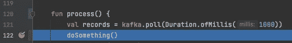

我会专注于更有趣的事情

## 有条件中断

右键单击一个已经放置好的断点会打开一个带有几个选项的弹出窗口。

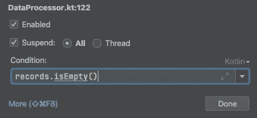

我最常用的一个部分是`**Condition**`部分，在这里你可以使用变量 i *在第*行的范围内放置一个计算为布尔的表达式，只有当条件为*真*时调试器才会中断。

## 仅挂起单线程

默认情况下，在弹出窗口中您会看到选择了`**All**`单选按钮。然而，如果您选择`**Thread**`方法，那么您只能暂停执行断点所在代码行的线程。

当您有线程时，这通常是有用的，如果线程被挂起，可能会抛出异常并死亡，就像从 Kafka 消费或超时查询数据库的线程一样。只有一个线程停止可能有助于您在检查可能有问题的代码时保持应用程序正常运行。

## 打印调试语句…用类固醇

还记得我说过印刷报表不好吗？嗯，我是说你放进代码里的那些。它们并不理想，因为每次你需要编辑或添加照片时，你都需要重启应用程序，更糟糕的是，你可能会不小心提交这些照片，要么暴露敏感信息，要么在日志中引发大量垃圾邮件。

所以，另一种选择是…..一连串急速的击鼓..使用 IntelliJ 提供的选项打印。

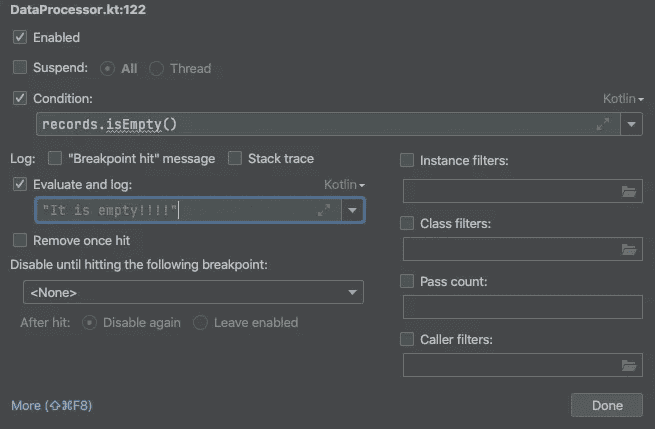

在默认弹出菜单中，默认选择**暂停**复选框。如果您取消选择它，窗口将扩大显示更多的选项。其中之一是 **Evaluate and log** ，这意味着每次调试器正常挂起(不管是正常断点，还是有条件的，挂起一个或所有线程)时，它都会打印文本框中语句的结果。它可以是字符串，也可以是使用范围内变量的任何内容。

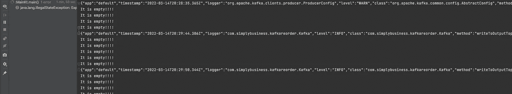

# 异常断点

但是，有时您无法精确定位导致问题的确切线路。例如，在多线程应用程序中，异常正在被吞噬，并在其他地方作为副作用出现，或者由于缺乏适当的日志记录，您不确定异常是从哪里抛出的，或者您只需要更一般地处理问题。在这些情况下，您可以添加断点异常。

如果你点击 Ctrl + Shift + F8 | Cmd + Shift +F8，你会看到这个窗口列出了所有当前添加的断点。

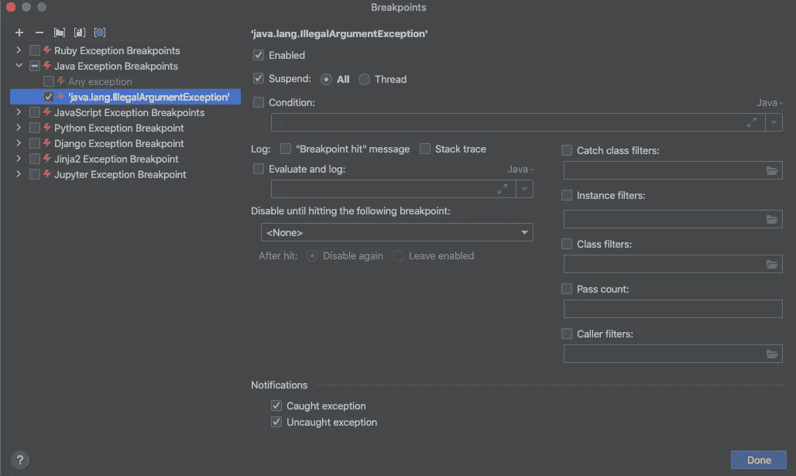

此外，您可以为当前项目的语言或特定的异常类添加一个`**Any Exception**`断点。

请记住，有时像 Spring 这样的框架在启动时可能会有内部异常，所以用这种异常启动您的应用程序并在您不感兴趣的地方挂起会有点烦人。

此外，正如您在右侧面板中看到的，这些断点也遵循相同的规则，并提供与行断点相同的选项。

# 调试器窗格

一旦执行被暂停，我想指出`**Debugger**`窗格中的一些东西。

## 变量

这是人们最熟悉的选项卡——除了悬停在范围内的变量上，您还可以在`variables`窗格中查看它们当时的值。

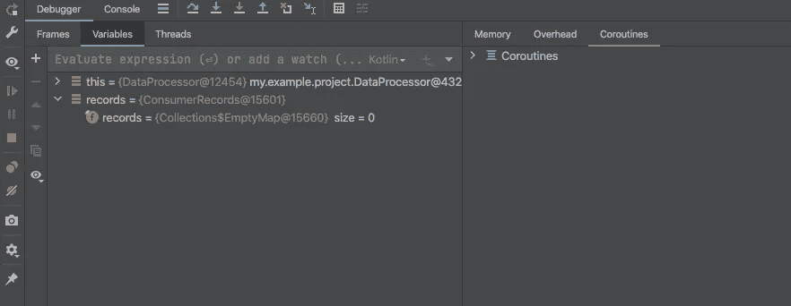

## 框架

稍微不太熟悉的选项卡是`frames`选项卡。

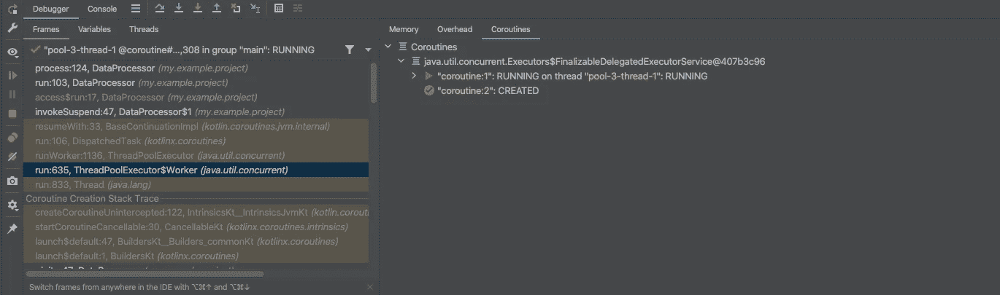

这里有趣的一点是，你不仅可以看到 stacktrace(应用程序到这行代码的路径),而且你实际上可以**回到过去。**你可以点击单个的帧，并在代码运行时查看该范围内变量的值。这在跟踪意外值时非常有用。

## 线

这里的最后一个标签是`Threads`标签。它提供了一种方法来检查所有其他线程在那个时刻的位置(如果它们也被挂起的话)。

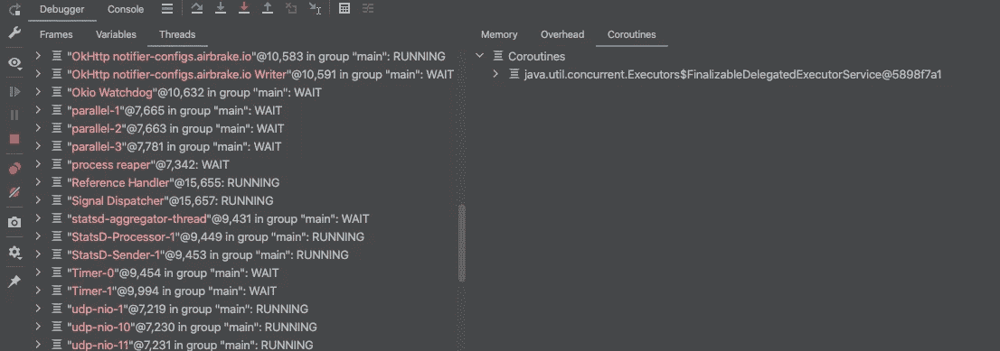

# 压型

不幸的是，有时一个断点是不够的，您需要使用一些更严肃的工具。这些大多是用于检测内存泄漏和高 CPU 使用率的工具。IntelliJ 中的分析器提供了许多以前我们需要外部工具才能实现的功能。

您可以通过“视图”菜单|工具窗口|Profiler 打开`Profiler`窗格，或者它可能已经出现在左|底|右角的某个位置。如果有一个 Java 进程正在运行，它就会出现在那里。

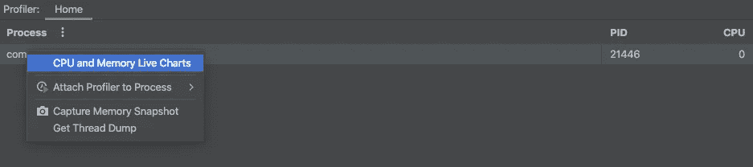

有趣的部分隐藏在上下文菜单中。

## CPU 和内存实时图表

这将向您显示应用程序运行时内存和 CPU 使用情况的时间线图。

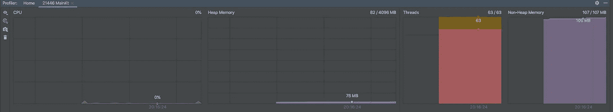

如果您想衡量应用程序在资源使用方面的情况，或者检测其中任何一个方面的任何异常峰值或下降，这将非常有用。

## 捕获内存快照

记忆快照是对实时图表的进一步补充或补充。您可以看到实际的对象和原语填满了内存，这可能有助于您识别泄漏来自哪里。

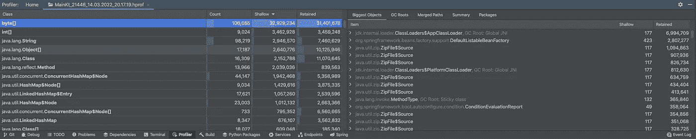

老实说，另外两个选项我用得很少，但我会很快提到

## 附加探查器

附加一个分析器或运行带有分析器的应用程序会给你很多信息，比如分析器运行时执行的所有方法的列表、发生的所有事件(如 GC、内存分配等)等等。

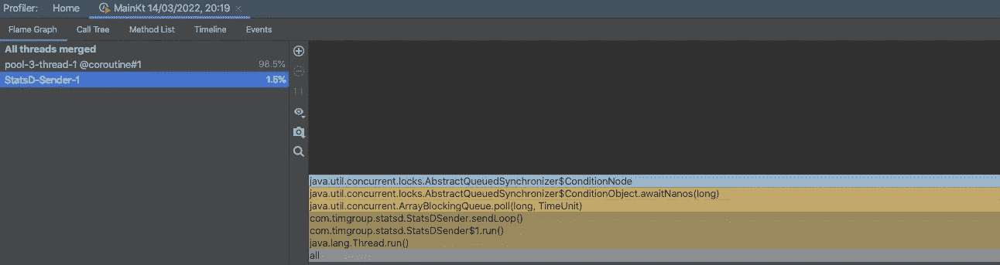

## 获取线程转储

这将打印应用程序中所有线程的 stacktrace。

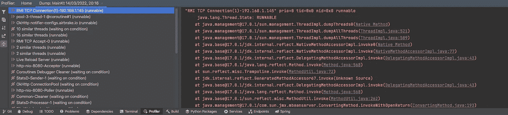

希望你能在这里找到一些你每天都会用到的新东西。IntelliJ 为你做了很多，所以不要害怕点击。

如果你想了解更多关于如何节省时间和避免错误的知识，可以看看我之前的文章——《高效重构的 10 个 IntelliJ 捷径》。