# 值得信赖的 IntelliJ 键盘快捷键

> 原文：<https://betterprogramming.pub/intellij-keyboard-shortcuts-to-swear-by-7638c0efcc76>

## 谁会使用光标呢？

照片由[考特尼·科洛](https://unsplash.com/@courtneycorlew?utm_source=medium&utm_medium=referral)在 [Unsplash](https://unsplash.com?utm_source=medium&utm_medium=referral) 拍摄

最新最棒的框架和设计模式都很酷，但是让我们认真考虑一下我们开发人员真正关心的:键盘快捷键。

生活中很少有什么事情像你学会一个新的键盘快捷键，并意识到你的生活将不再一样时那样令人满意。让我们开始吧。

注意:为了完整起见，对于 MAC，⌥指的是`option`键，⌘指的是`command`键。同样，Mac 上的 Ctrl 键也可以用一个`^`字符来表示。

# 选择

下面的快捷方式是为了成为一个向导，不需要点击`shift`和箭头键一百万次就能准确选择你想要的。

## 扩展选定

*   MAC:⌥+↓4
*   窗口:Ctrl + W

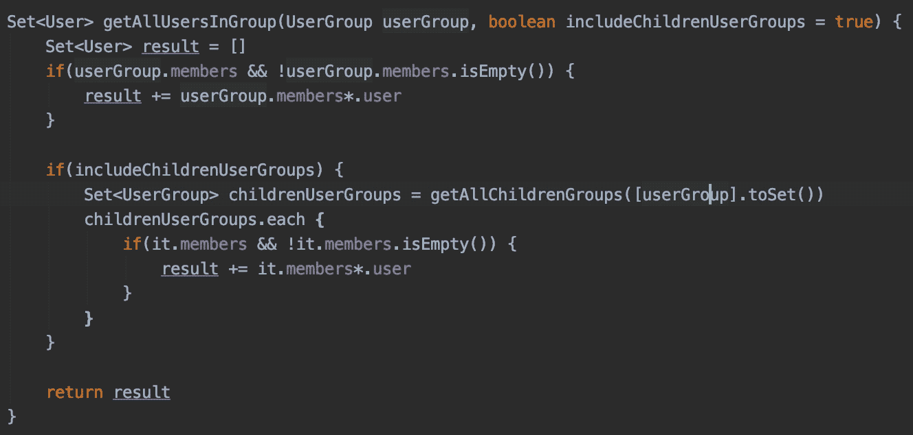

这一定是我在 IntelliJ 中最常用的键盘快捷键。它将您当前的选择扩展到下一个解析级别(如果没有选择任何内容，则从光标所在的位置创建一个选择)。上面的 gif 演示了这是什么意思，但是如果你自己使用它可能会更有意义。

当您想要选择某一组括号内的所有内容时，这非常有用，并且对于能够快速查看这组括号的开始和结束位置也非常有用。

若要反转此操作，请在 Mac 上使用⌥ + ↓或在 Windows 上使用 Ctrl + shift + w。

## 选择下一个匹配事件

*   Mac: Ctrl + G
*   Windows: Alt + J

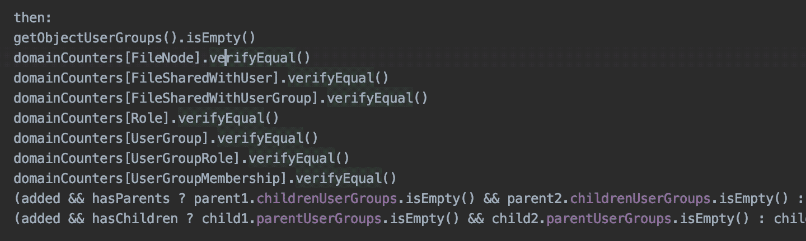

多个游标不只是针对 VS 代码！这个 IntelliJ 键盘快捷键允许您快速启动多个光标进行快速批量编辑。

# 航行

以下键盘快捷键帮助您以创纪录的速度浏览 IntelliJ 和文件。

## 打开文件结构

*   Mac: ⌘ + F12
*   Windows: Ctrl + F12

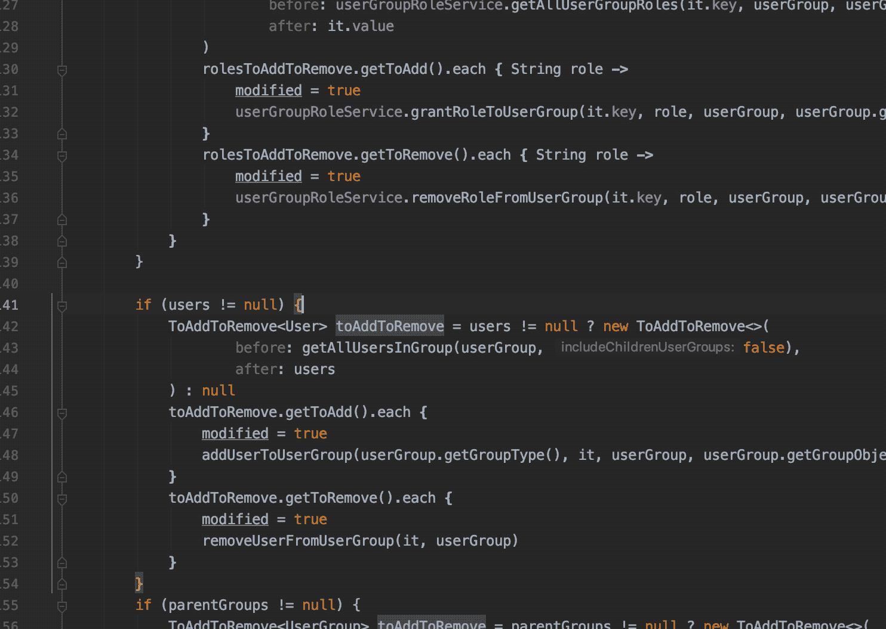

支持模糊搜索！

不再使用文本搜索在文件中查找方法！IntelliJ 的这个有点晦涩的功能被大大低估了。如果你以前从未见过它，你需要知道两件事:

1.  这是一个列出当前文件中所有方法的窗口。
2.  您可以立即开始输入，它会为您筛选列表。

这实际上意味着，如果你试图找到一个文件中的一个特定方法，你可以触发这个键盘快捷键，开始输入方法名(支持模糊搜索)，然后按回车键，你就成功了！

## 转到文件

*   Mac: ⌘ + Shift + O
*   窗口:

当按下`shift`两次打开任意位置搜索对话框时，我倾向于更多地使用这个转到文件功能，因为我通常试图找到一个文件，而任意位置搜索对话框中的其他结果最终只是噪音。

## 转到声明

*   Mac: ⌘ + B
*   Windows: Ctrl + B

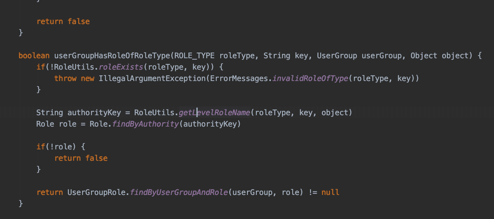

一个基本的键盘快捷键，用于到达声明方法或变量的地方。

## 峰值定义

*   Mac: ⌘ + Y 还是⌥ + space
*   Windows: Ctrl + Shift + I

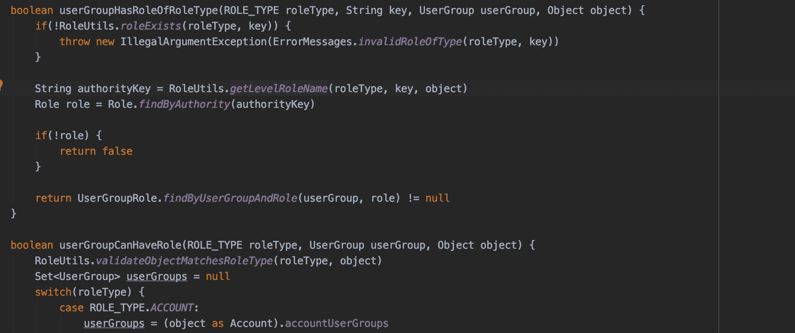

当你不想真正去定义一个方法或变量的地方，但是你想简单地看到一些细节的时候，有一个小小的变化。

## 后退/前进

*   Mac: ⌥ + ⌘ + ←或者→
*   Windows: Ctrl + Alt + ←或→

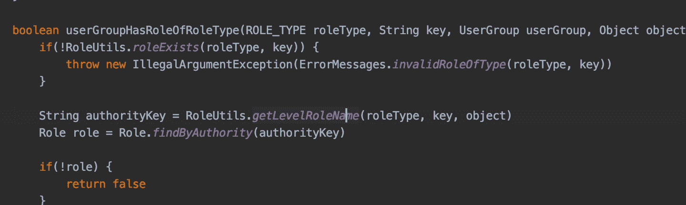

每次移动光标或跳转文件时，IntelliJ 都会记住，您可以使用上面的快捷键在历史中后退和前进，就像它是一个互联网浏览器一样。这对于能够使用此处列出的其他键盘快捷键在文件之间跳转而不需要记住跳转前的位置是至关重要的。

## 转到匹配的括号

*   Mac: Ctrl + M
*   窗口:Ctrl + Shift M

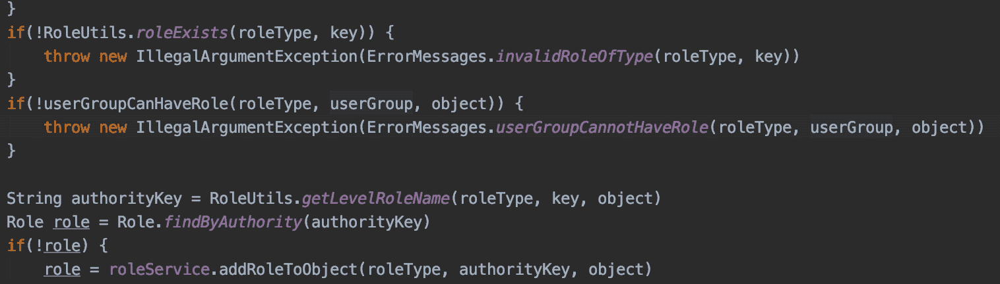

使用此键盘快捷键在匹配的括号之间跳转。如果光标在两个括号之间，插入符号将跳转到第一个括号。一旦到了括号处，您就可以重复这个快捷方式，在左括号和右括号之间来回移动。

## 转到线

*   麦克:⌘ + L
*   Windows: Ctrl + G

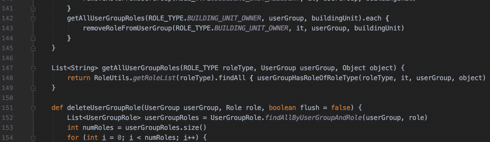

这正是当一个同事要求你查看某一行，或者如果你正在查看一个拉取请求 diff，并且想看看你在 IntelliJ。

## 显示用法

*   Mac: ⌥ + ⌘ + F7
*   Windows: Ctrl + Alt + F7

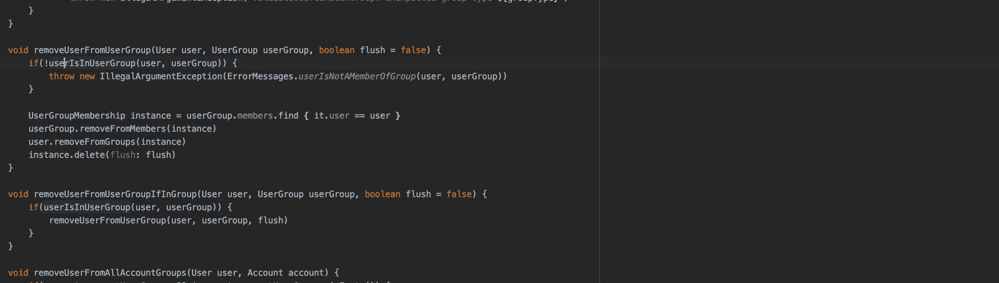

此键盘快捷方式与您可能通过右键单击找到的“查找用法”功能略有不同。它不是打开一个新的窗格，而是打开一个就地对话框，你可以在那里输入过滤结果，我更喜欢标准的 Find Usages 功能。如果您喜欢标准的查找用法功能，可以在 Mac 上使用⌥ + F7，或者在 Windows 上使用 Alt + F7。

# 编写代码

以下键盘快捷键可以帮助您更快地将新代码添加到项目中，或者重构已经存在的代码。

## 重命名变量/方法

*   麦克:Shift + F6
*   Windows: Shift + F6

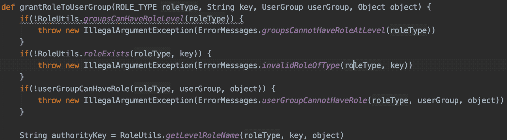

通过键盘快捷键重命名变量和方法非常方便，因为它隐藏在二级右键菜单中。当您触发此键盘快捷键时，会选择整个值，因此您可以立即开始键入新名称。这种重构也将传播到其他文件。

## 提取变量

*   Mac: ⌥ + ⌘ + V
*   Windows: Ctrl + Alt + V

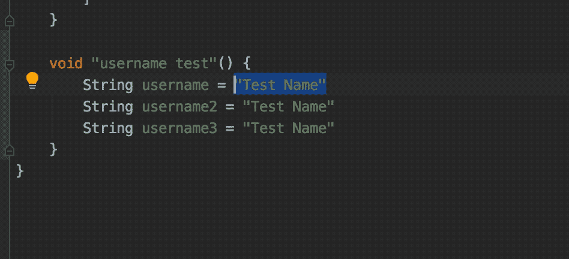

这个特性所做的比它的名字更令人兴奋。有时，您可能会发现自己在一个代码块中使用了一个文字值，然后意识到您正在多次使用它，并且您希望将它们整理到一个变量中。触发此功能，这正是会发生的事情！选择`Replace All X Occurrences`将会创建一个变量，现在所有的事件都使用这个新变量。您可以立即开始输入变量名称。

## 向上/向下移动线条

*   Mac: ⌘ + Shift + ↑或者↓
*   Windows: Shift + Alt + ↑或↓

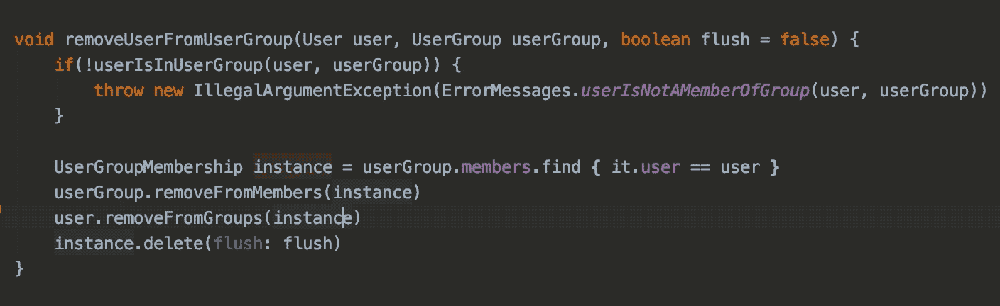

有时候生活很简单，你想要做的就是向上或向下移动一行。给你，朋友。平静地前进。

## 双线电路

*   麦克:⌘ + D
*   Windows: Ctrl + D

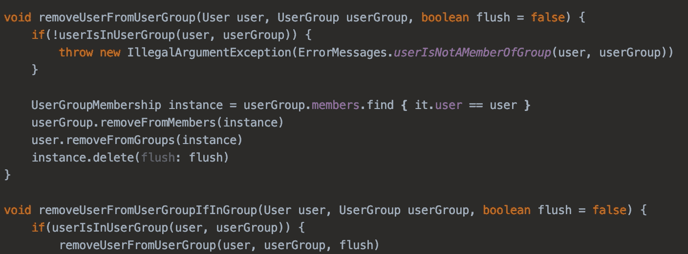

另一个简单的快捷方式，但是当我需要一些类似结构的行时，我发现自己经常使用它。

## 折叠/取消折叠块

*   Mac: ⌘ + `.`
*   Windows: Ctrl + `.`

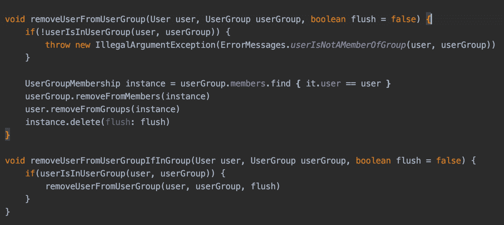

如果您不知道，您可以折叠 IntelliJ 中的代码块，例如方法体。这非常方便，尤其是在小屏幕上，如果出于某种原因，您正在某个代码块的上方和下方处理代码，并且您真的想并排查看它们。

我喜欢折叠与我目前工作无关的代码，以减少编辑器中的视觉噪音。

## 自动缩进行

*   Mac: Ctrl + ⌥ + I
*   Windows: Ctrl + Alt + I

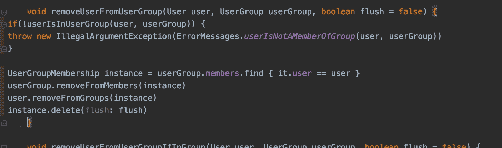

手动缩进是不必要的苦差事。用这个键盘快捷键快速完成它！

# 版本控制

下面的键盘快捷键可以帮助你成为 Git 超级巨星，但是在 IntelliJ 中。

## 前往上一个/下一个更改

*   Mac: Shift + Ctrl + ⌥ + ↑或者↓
*   Windows: Ctrl + Shift + Alt + ↑或↓

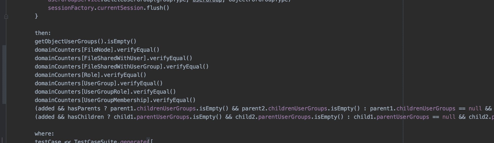

使用这些快捷键在 Git 检测到的更改之间导航。使用这个特性还会自动显示出您现在拥有的和上一个 Git 版本之间的差异，所以您也可以将它主要用于那个功能。

## 回滚更改

*   Mac: ⌥ + ⌘ + Z
*   Windows: Ctrl + Alt + Z

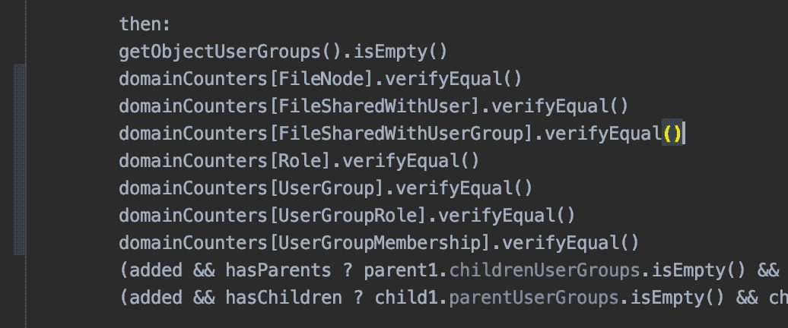

选择代码并立即恢复比重复撤销要容易得多！在代码中直接进行部分还原也比切换到另一个工具(如 Git CLI 或 GitHub Desktop)容易得多。键盘快捷键和撤销很像也很方便！

# 运行配置

现在，您终于使用这些漂亮的键盘快捷键编写了所有代码，您可以使用这些键盘快捷键运行和调试您的运行配置，而无需尝试单击那些小按钮。

## 运行/调试当前运行配置

*   Mac: Ctrl + R/D
*   Windows: Shift + F10/F9

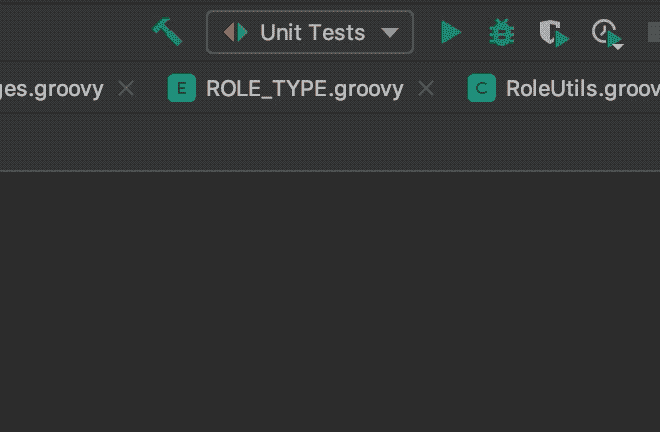

有点无聊。但是我想确定这是做什么的。这和按下绿色三角形的“播放”按钮是一样的！

使用工具栏中当前选定的运行配置运行或调试。当我写测试时，我发现自己在使用它:修改一些代码，Ctrl + R 重新运行测试，再修改一些代码，重新运行测试。

## 从编辑器运行/调试

*   Mac: Ctrl + Shift + R/D
*   Windows: Ctrl + Shift + F10/F9

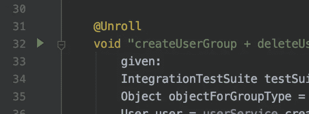

此键盘快捷键相当于单击绿色箭头并选择运行/调试。当 IntelliJ 检测到可运行的测试时，您可能最常看到这种情况！

如果您已经有了正在寻找的运行配置，前面的键盘快捷键是很好的，但是如果没有呢？此键盘快捷键允许您创建新的运行配置并立即运行/调试它们。

# 结论

键盘快捷键可以帮助你更快地完成工作，而且使用起来非常有趣。如果您正在寻找 IntelliJ 中某个特定动作的快捷键，您可以查看“帮助”>“查找动作”,看看是否有与您正在寻找的动作相关联的快捷键。否则，您可以在“首选项”>“键盘映射”中创建一个。

有一个伟大的时间在那里与你时髦的新捷径！