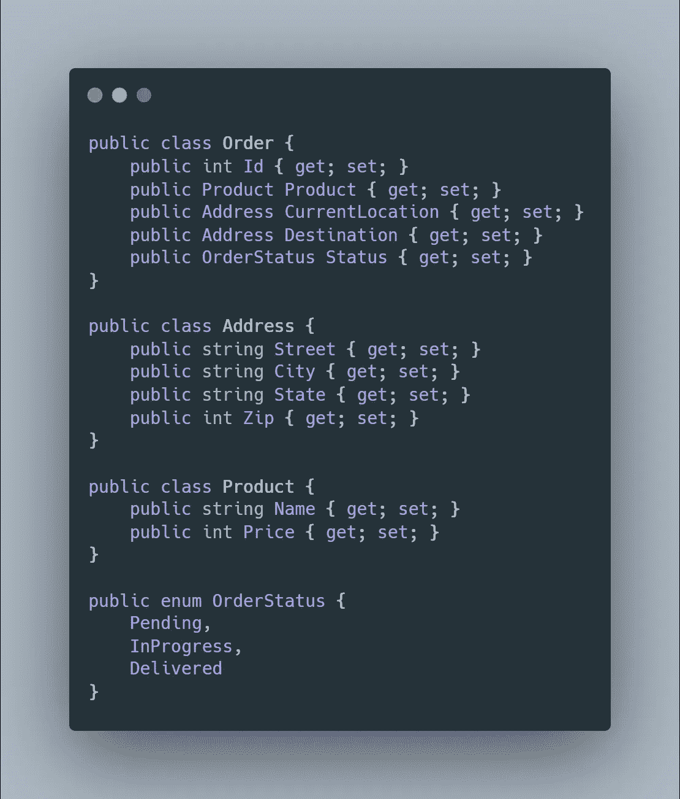
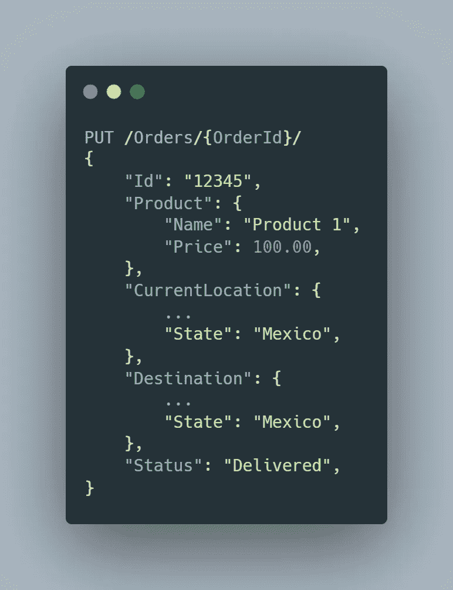
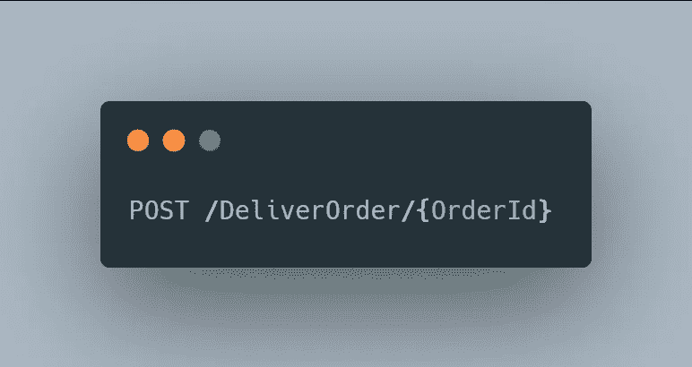

# 不要使用 CRUD 风格的 API，考虑基于意图的 Rest APIs

> 原文：<https://betterprogramming.pub/intent-based-rest-apis-or-an-alternative-to-crud-based-rest-apis-1815599db60a>

## 为什么基于意图或动作的 REST APIs 是更好的选择


照片由[泰佐斯](https://unsplash.com/@tezos?utm_source=medium&utm_medium=referral)在 [Unsplash](https://unsplash.com?utm_source=medium&utm_medium=referral) 拍摄

# 修正案

回头看看这篇文章，我相信在基于意图的 API 的上下文中，所用的例子相当糟糕。由于这一点，我写了这篇文章的续篇，不仅扩展了这个主题，而且更好地解释了我在这里解释得不好的一些部分。[随意阅读下一篇](https://techblog.pointsbet.com/a-structured-approach-to-designing-intent-based-apis-910ed1fc78f2)这里链接的文章，它应该填补了很多空白，重新更好更正确地解释了一些概念。出于对更好编程的考虑，我想提一下 sequel 文章是在不同的出版物上发表的。

# 关于休息和垃圾的快速复习

REST APIs 在最近几年已经成为行业标准，在流行程度上似乎已经超过了 RPC 和 SOAP APIs。

Roy Fielding 在他 2000 年的论文中创造了这个术语，REST 或 RESTful 代表具象状态转移，是一个构建 API 的设计范例，它有几个核心约束:

1.  **客户端-服务器**:客户端和服务器都独立工作。
2.  **无状态**:服务器不记录客户端的状态。
3.  **可缓存**:服务器标记数据是否可缓存。
4.  **统一接口**:客户端和服务器的行为遵循统一的接口，或者可以预见。
5.  分层系统:应用程序从客户机和服务器之间的所有层中抽象出来。

通常，REST API 被构建为模仿类似 CRUD 的接口，这源于 HTTP 标准方法的结构非常类似于 CRUD 接口，并且 REST API 处理可以由所述接口操纵的资源。

由此推断，REST 资源的 CRUD 生命周期是这样的:你`create` 一个资源，也许你偶尔想要`update` 它。顺着这个轨迹，你`read` 这个资源，也许你决定`delete` 它。

```
HTTP Method | CRUD Operation
POST        | Create Resource
PUT         | Update / Set Resource
GET         | Retrieve Resource
DELETE      | Delete Resource
```

# 我最关心的是污垢

我保证，这篇文章不是一篇恶意中伤的文章。它在这个世界上有它的位置(在大多数系统中，事实上)，而且我个人认为它在大多数情况下确实很方便。

然而，当一个领域或问题集在复杂性方面开始向外螺旋上升时，我相信 CRUD 开始显示出它的一些弱点。

无论如何，让我们创建一个可以用于本文其余部分的示例，这不是一个非常复杂的设计，但它应该可以满足演示的目的。



订单模型

这里我们有一个针对某种产品运输领域的简单模型。

这里的实体是订单，它封装了一个活动的订单状态，其中有几个值对象来帮助解释该状态。

## CRUD 需要非常粗粒度的设计

这是真的，在很多情况下这是没问题的，尤其是对于较小的领域或模型。许多资源包含子资源或其中的字段，这些子资源或字段与某些领域逻辑相关联。

在上例中，如果您想对订单`CurrentLocation`进行更改，可能有三个原因:

1.  订单从`pending` 到`in progress`，现在有了实际的`CurrentLocation`
2.  `progress` 中的*的顺序已经移动*
3.  原来的`in progress` 订单已经移到了它的`Destination`

假设给你一个正在进行中的`Order`*，*，它的`CurrentLocation`是“亚利桑那”。它的目的地是“墨西哥”。

在一个普通的 CRUD 类操作中，要对`Order`的`CurrentLocation` 进行更改以交付`Order`，您可能需要做如下事情:



订单实体的更新请求

这是粗粒度的，因为它将整个对象作为有效负载，这迫使用户了解业务逻辑如何工作，以便创建正确的调用(即，如果`CurrentLocation == Destination`，则`status` 应该是`Delivered`)。

这是一个为 CRUD 接口定制的请求，而不是为手边的问题定制的。

# 输入:基于意图或动作的 REST API

通过理解用户将与您的 API 交互以执行特定的*动作*或者在头脑中有特定的*意图*，很容易根据这些意图定制请求的模型，以减轻来自最终用户的知识负担，并将其转移到系统的责任中。

这偏离了 REST 的一些传统方面，几乎进入了 RPC 风格的领域，因为 API 允许对基于动词的资源或意图/动作进行操作，而不是传统的名词。

在上面的例子中，我们在 CRUD 风格的请求中看到了一些缺点，所以让我们将其与*进行比较，后者是一种可能的基于*意图的变体:



向意向资源发出的交付订单的请求

很简单，是吧？我们正在处理一个非常简单的领域。无论如何，这要求用户对领域的了解少得多，并且使用户不可能创建会使数据处于不良状态的请求。

通过发布到这个资源，我们确认用户想要将给定的`Orders`状态设置为已交付。因此，让我们将它的`CurrentLocation` 设置为`Destination`，同时，让我们将它的`Status` 更改为 delivered。

通过这样做，我们实现了用户的意图，并在我们的系统中执行了所需的业务逻辑，而不需要用户理解字段应该如何连接在一起。

如前所述，这是一个非常简单的例子，这就是为什么它看起来有点简单明了，然而，GitHub [实际上在它的合并和它的 API 中的其他地方做了一些类似的事情。它使用资源 *merges* 并接受一个 POST 请求和几个必需的字段，然而，它最终为 *commit* 资源返回一个“201 created”。*合并*资源并不映射到物理实体，而是映射到意图。整洁！](https://docs.github.com/en/rest/reference/branches#merge-a-branch)

# 结论

这可能会让你感到震惊，但是即使 CRUD APIs 在很多用例中工作得很好，它并不是在所有用例中都工作得很好。意图 API 是将用户意图具体化为 API 模型的一种方式，它将域逻辑从请求或请求链中分离出来，并放入意图资源的处理程序中，很好且安全地远离了糟糕的客户端。

ThoughtWorks 有一篇关于这个话题的精彩文章,内容更加详细。一定要去看看！