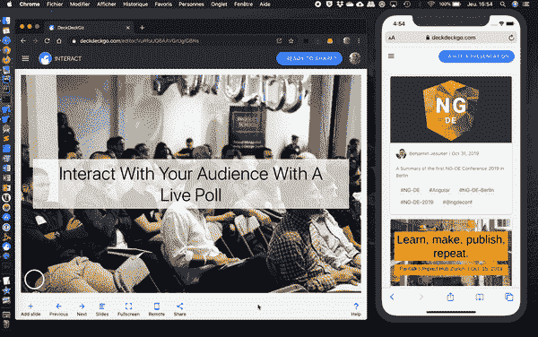

# DeckDeckGo 更新:通过现场投票与您的观众互动

> 原文：<https://betterprogramming.pub/interact-with-your-audience-with-a-live-poll-d043b95b9adf>

## 引入一项新功能，让您无需离开演示文稿即可与观众互动


尼古拉斯·格林在 [Unsplash](https://unsplash.com/?utm_source=unsplash&utm_medium=referral&utm_content=creditCopyText) 上的照片

这个想法我们已经有很长时间了，实现它花了我们一点时间，这就是为什么我们如此兴奋地推出 [DeckDeckGo](https://deckdeckgo.com/) 的新功能，这是我们用于演示的 web 开源编辑器。

它使通过现场投票与你的观众互动成为可能，而不必离开你的幻灯片。

# 用户体验

UX 可以经常被讨论，我不得不说，特别是对于这个功能，许多解决方案都是可行的。

我绞尽脑汁了好几天，填文件，做笔记，直到我最终找到了解决方案的核心原则，这些原则对我很有意义，希望对其他人也有意义:

*   观众可以是一群人，或多或少。在实时投票的情况下，并非所有参与者都在同一页面上。有些人可能投票很快，有些人可能很慢。有些人在投影幻灯片或屏幕附近，有些人可能在远处。有些人可能已经睡着了，有些人可能把手机放在包里，等等。
*   作为一名演讲者，当我不必在多个应用程序之间切换时，我发现这很方便——在某种程度上，这甚至可以让我减轻一点压力。作为一名与会者，我倾向于认为在没有太多媒体干扰的情况下，跟随一场演示会更容易。总而言之，我喜欢演示的流程尽可能保持流畅。

这就是为什么，至少在这个特性的第一个版本中，所有的信息在同一时间和任何时间都是可用的。实时更新的问题、答案、连接信息甚至投票结果都显示在同一张幻灯片上。

此外，我确实认为二维码是与参与者分享链接的最佳方式，该模板还包含一个深层链接，直接指向他们手机上的答案。



演示和投票

# 开发者心态

从第一天起，我们就一直保持着开发者的心态。这就是为什么编辑器和我们的开发人员初学者工具包都使用完全相同的核心，与引擎相同的 web 组件。

不用说，没变。这个新特性不仅在我们的编辑器中可用，在我们的初学者工具包中也可用。如果你更愿意使用 HTML 或 Markdown 来开发你的演示文稿，这很酷，你可以使用完全相同的功能。

```
<deckgo-deck>
  <deckgo-slide-poll>
    <h1 slot="question">Do you like my presentation?</h2>
    <p slot="answer-1">Sure cool</p>
    <p slot="answer-2">No</p>
    <p slot="answer-3">Potatoes</p>
    <p slot="how-to">Go to <a href="https://deckdeckgo.com/poll">deckdeckgo.com/poll</a> and use the code {0}</p>
    <p slot="awaiting-votes">Awaiting first votes</p>
  </deckgo-slide-poll>
</deckgo-deck>
```

# 无限多的可能性

当然，上述目标对我们的技术决策有影响，但是我们已经将我们的架构设计得相对灵活，能够处理这样的场景。这可能就是 DeckDeckGo 的技术之美。它是基于模板的，目标是使它们自包含。

每个模板都是用 [Stencil.js](https://stenciljs.com) 开发的独立的 web 组件，因此每个基本上都是 web。你能用网络做什么？任何事！

您想用 DeckDeckGo 创建一个实时轮询模板吗？那是可能的。你想创建一个整合了太空入侵者游戏的模板？那也是可能的。

您想创建一系列具有闪亮设计效果的可重用模板吗？当然，你可以。

或者，你想创建一个模板来加载一些 web 汇编代码，以便在你的演示文稿中直接运行你的区块链人工智能启动慢餐的新原型？那也是可能的。

有无限多的可能性，而这仅仅是开始！

# 现在就开始

现在开始创建您的下一个演示文稿:【https://deckdeckgo.com[。](https://deckdeckgo.com/)

到无限和更远的地方。

大卫