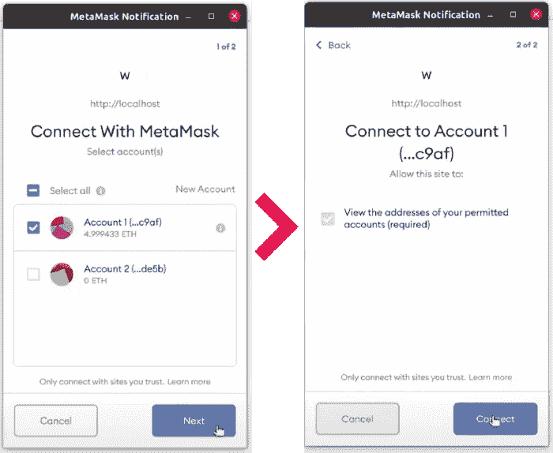
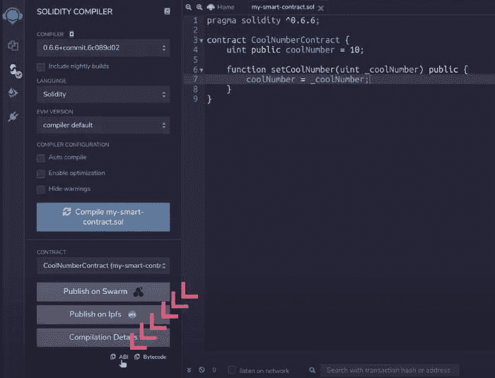
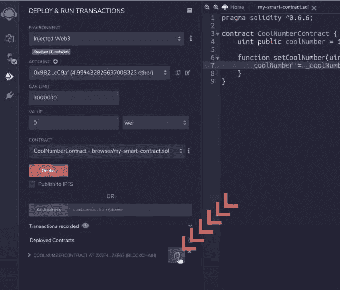
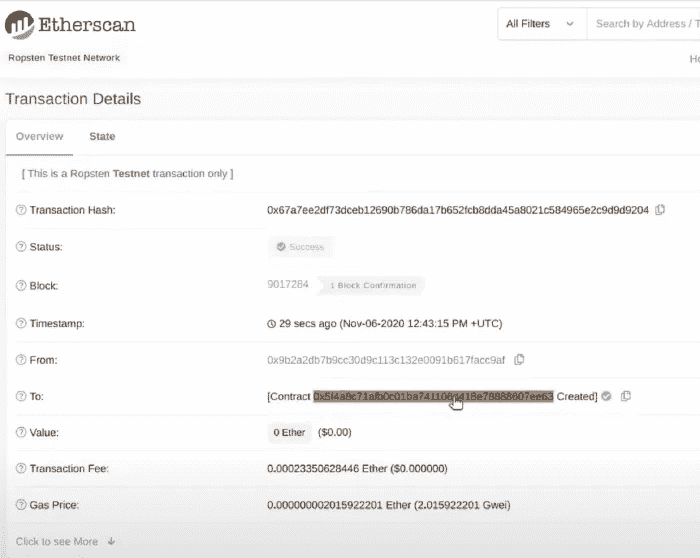
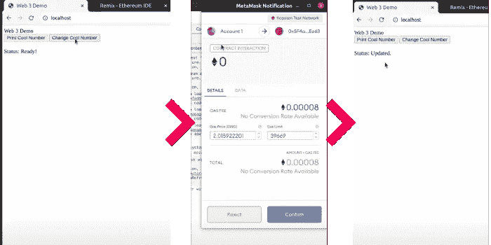

# 如何从 Web 应用程序与智能合同交互

> 原文：<https://betterprogramming.pub/interacting-with-smart-contracts-from-web-apps-57eee0129596>

## 构建使用以太坊智能合约的 web 应用程序


照片由[戴恩托普金](https://unsplash.com/@dtopkin1?utm_source=medium&utm_medium=referral)在 [Unsplash](https://unsplash.com?utm_source=medium&utm_medium=referral) 上拍摄。

你好。今天，我们将讨论如何构建能够与以太坊智能合约交互的 web 应用程序。这种互动令人着迷，因为它将为那些想在区块链开发应用程序(dapps)的网络开发者打开一个新的可能性世界。

在本教程中，我们将构建一个微型智能合约来存储和检索以太坊区块链上的数据，并创建一个允许我们访问和更改智能合约上的数据的 web 应用程序。

内容以两种格式提供—全文和视频解释，您可以在下面查看:

本文以书面形式涵盖了相同的主题。视频是完整的，这意味着你不需要任何关于区块链的特殊知识。然而，我建议查看我以前的文章[构建和部署 ERC20 智能合约](https://medium.com/better-programming/create-and-deploy-your-own-erc-20-token-on-the-ethereum-network-87931fe4db20)。

# 智能合同

让我们从展示我们将用于构建 web 应用程序的智能契约开始。由于本文的重点是将 JavaScript 与区块链连接起来，所以我尽可能地简化了合同:

也许这不是有史以来最令人印象深刻的合同，但就目前而言也够了。如果你不确定这个合同是做什么的，我来解释一下。

契约`CoolNumberContract`在区块链上存储了一个名为`coolNumber`的变量，初始值为`10`。这个变量是`public`，这意味着我们可以从区块链访问它的值，而无需构建 getter 函数。

此外，契约包含一个名为`setCoolNumber`的`public`函数，正如您可能猜到的，它将改变区块链上变量的值。这里需要记住的重要一点是，区块链数据的任何变化都需要用一个事务来表示。这意味着调用方法`setCoolNumber`将需要一个事务，并且该事务将有一个与之相关的汽油费。

在继续之前，请确保将合同部署到测试网络。

# 设置项目和依赖项

有趣的事情开始了。要通过 JavaScript 与任何以太坊区块链进行交互，您需要一个库。在我们的例子中，我们将使用 [web3](https://web3js.readthedocs.io/en/v1.3.0/) 。Web3 将允许我们通过 MetaMask 或像 Ganache 这样的 web3 提供商与任何以太坊网络进行交互。

让我们开始一个新项目。你可以使用任何你想要的框架。我会选择普通的 JavaScript 和 HTML，但是你可以使用任何框架，比如 React 或 Vue。我的所有代码都将放入一个文件`index.html`，我将从下面的结构开始:

让我们分解上面的代码，从`body`标签开始。这是一个简单的 UI，有两个按钮和一个表示状态的 span。两个按钮都调用 JavaScript 函数，这些函数目前还没有定义。

在`head`标签上，重要的标签是我们正在导入的脚本。这就是我们对 web3 的依赖。您可以像我一样将这种依赖关系添加到您的代码中，或者，如果您使用的是框架，您可以简单地导入包含以下内容的包:

```
import Web3 from ‘web3’;
```

如果您还没有安装该库，可以通过 NPM 安装:

```
npm install web3
```

最后但同样重要的是，在继续之前，我强烈建议您安装 MetaMask 扩展。如果您更喜欢使用任何其他提供程序，您可能需要相应地更改部分代码，因为提供的示例使用了由 MetaMask 注入的 web3 提供程序。

# 将您的 Web 应用程序连接到以太坊区块链

既然我们已经准备好了基本的结构和依赖项，我们就可以添加将应用程序连接到区块链的代码了。

在正文的脚本标记内，我们将添加:

除了函数`loadWeb3`，上面的所有代码都非常简单，我们将进一步解释这个函数。该功能负责建立连接，并授权我们与区块链交互。

为了使用我们的智能契约，我们需要一个新的`Web3`实例。当创建这个实例时，我们需要指定我们想要使用的提供者。因为我们使用元掩码作为代理，所以我们使用由元掩码扩展注入的`window.ethereum`提供者。

如果您现在转到浏览器并加载页面(通过文件或 web 浏览器)，您将看到元掩码授权流。它应该是这样的:



授权你的应用程序通过 MetaMask 进行连接。

请确保接受并将钱包连接到您的应用程序以继续。

# 访问智能合同

到目前为止，您的代码可以与区块链交互。现在，让我们确保您的应用程序可以与智能合约对话。

为此，我们将创建一个新函数来创建一个与您的契约接口相匹配的契约实例:

```
async function loadContract() {
    return await new window.web3.eth.Contract(ABI, contractAddress);
}
```

要获得区块链上任何契约的实例，我们只需要两样东西:契约的 [ABI 规范](https://solidity.readthedocs.io/en/v0.5.3/abi-spec.html)和契约地址，这两样都可以从 Remix 中提取。

要获得合同的 ABI 规格，请转到编译选项卡上的 Remix，确保已编译，然后单击`ABI`:



复制你的合同的 ABI 规格。

该按钮将把您的合同的 ABI 规范作为 JSON 数组复制到您的剪贴板上，我们可以直接使用它作为第一个参数的一部分。

第二个参数是部署的契约地址，您可以在部署时从 Remix 或 Etherscan 获得。



从 Remix 复制合同地址。



从以太网扫描复制合同地址。

下面是我的合同的完整功能代码:

完成这些之后，我们可以简单地从我们的 loader 函数中调用`loadContract`:

```
async function load() {
    await loadWeb3();
    window.contract = await loadContract();
    updateStatus('Ready!');
}
```

# 从智能合同中读取值

我们准备开始调用智能契约函数，我们将从从契约中检索我们的`coolNumber`开始。

多亏了 web3，我们可以很快地从合同中检索数据。下面是一个获取公共变量`coolNumber`的值的例子:

超级容易！我们使用上一节中的`contract`实例，获取方法并调用带有变量名的函数(这是我在开始提到的 getter)，最后，我们使用`call`启动远程请求。

# 更新智能合同的值

最后，我们需要确保我们也可以处理智能契约，为此，我们将通过访问我们的 setter 函数来更改存储在契约中的`coolNumber`来展示一个示例。

我们的 change 函数将简单地分配一个新的随机数，并将其保存在区块链上:

我想在这里强调两点。首先，我们引用一个目前没有定义的`getCurrentAccount()`函数。我们稍后会讨论这个问题。其次是我们如何调用我们的 setter。如果您注意我们调用契约中的`setCoolNumber`方法的那一行，它看起来与我们为调用者所做的略有不同:

```
const coolNumber = await window.contract.methods.setCoolNumber(value).send({ from: account });
```

我们不使用`call`，而是使用`send`方法。我们需要指定发送者帐户。为什么？原来我们需要一个交易来改变区块链的价值。也就是说，交易需要一个有效的 from 和 to 帐户——从发起交易的人，到本例中的智能合约地址。

我们可以使用任何帐户作为 from 值吗？不，它必须是一个你有权访问的帐户(在我们的情况下，是在你的 MetaMask 钱包上注册的)，因为你需要授权交易并确认汽油费。

既然我们弄清楚了这一点，让我们构建`getCurrentAccount()`方法:

```
async function getCurrentAccount() {
    const accounts = await window.web3.eth.getAccounts();
    return accounts[0];
}
```

Web3 很优秀。我们可以与区块链和我们的钱包互动，因此可以通过 Web3 请求钱包上注册的帐户信息。在我们的示例中，我们简单地获取所有帐户，并使用第一个帐户进行交易。

# 把所有的放在一起

如果你完成了所有的函数，你的代码应该看起来像我的。我已经把我的代码上传到 GitHub gist 上，这样你就可以把它和你的进行比较，或者用我的来玩。

我所有的联系方式都在代码里，只要你把你的 MetaMask 连接到 Ropsten，并有一些测试 ETH 来支付交易费用，你就可以使用它。

测试时，您应该会看到类似这样的内容:



应用流程

# 结论

区块链是一个让我着迷的话题，编写这个教程非常有趣。在做这件事的过程中，我学到了很多，这也是更多项目、文章和视频的基础。

如果你想让我介绍关于智能合同开发的话题，请在评论区告诉我。

感谢阅读！