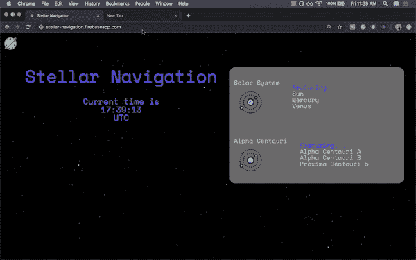
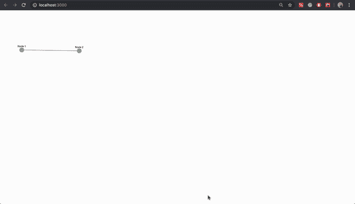

# React 中的交互式数据图形

> 原文：<https://betterprogramming.pub/interactive-data-graphing-in-react-95d7963247ff>

## 使用 Cytoscape.js 创建引人注目的可视化效果


照片由[美国宇航局](https://unsplash.com/@nasa?utm_source=medium&utm_medium=referral)

可视化数据已经成为软件工程师可用的最强大的工具之一。让大量数据具有交互性和用户友好性会产生引人注目的产品，并能揭示出原本可能被忽视的重要关联。

[Cytoscape.js](https://js.cytoscape.org) 为快速构建精确的图形模型提供了一个便捷的解决方案。凭借令人印象深刻的显示，如这张东京铁路系统的互动地图，Cytoscape 已经成为许多网络开发人员的首选网络可视化工具。

当我最近在做一个 [React 项目](https://github.com/jollyjerr/StellarNavigation-Frontend)时，我不得不筛选各种资源来获得一个功能齐全的 Cytoscape.js 实现并运行。感谢博客的力量，我以前头疼的问题可以帮助指导您完成设置过程，这样您就可以在下一个 React 项目中快速实现令人惊叹的数据可视化。



Cytoscape.js 的奇妙交互性— on React！

# 第一步——NPM

一旦有了一个 [React 应用程序并正在运行](https://reactjs.org/docs/create-a-new-react-app.html)，运行这两个命令。

```
npm install cytoscape
npm install react-cytoscapejs
```

“Cytoscape”包含我们将使用的图形工具库，而“React-cytoscapejs”将 Cytoscape 的许多普通 js 转换成 React 组件。有了这两个工具，我们可以按照 React 的传统组织代码，同时保持 Cytoscape 的功能。

# 第二步—构建我们的组件

安装了库和包之后，我们构建 React 组件，我们将使用它来显示我们的数据。我将向您展示代码，然后介绍每一部分的用途。

```
import React, { Component } from 'react'
import CytoscapeComponent from 'react-cytoscapejs'

export default class Demo extends Component {

  state = {
    w: 0,
    h: 0,
    elements: []
  }

  componentDidMount = () => {
    this.setState({
      w: window.innerWidth,
      h:window.innerHeight
    })
  }

  render() {
    return(
      <div>
        <CytoscapeComponent
            elements={this.state.elements}
            style={{ width: this.state.w, height: this.state.h }}
        />
      </div>
    )
}
```

我们首先导入 Cytoscape 和 react-cell scape js，然后构建 React“类组件”。

Cytoscape 通过呈现 HTML 画布来工作，因此我们可以在状态中保持客户端的屏幕宽度和高度，并在 React 组件挂载时捕获这些信息。

Cytoscape 还需要呈现元素的数据。在对后端 API 进行 fetch 调用之后，我们可以将这些数据存储在组件状态中，以实现传统的、类似 React 的动态呈现。

最后，在我们的渲染函数中，您可以看到`<CytoscapeComponent/>`被渲染，我们状态的元素和屏幕大小被传入。

# 第三步—访问“cy”

如果你看一下 Cytoscapes 文档，你会看到数百个预构建的函数与你的数据进行交互。不幸的是，因为这个接口位于 React 组件内部，所以我们必须更加努力地使用这些函数。

第一步是在我们的类组件中声明变量`cy`。

作为你`<CytoscapeComponent/>`上的道具，加上这一行。

```
cy={(cy) => {this.cy = cy}}
```

现在，在我们的 React 组件安装完成后，我们可以通过变量`this.cy`访问所有传统的 Cytoscape 函数！

## **警告提示:**

因为`this.cy`只能在组件挂载后声明*，所以在组件挂载前提及`this.cy`会破坏整个应用程序。这个简单的事实使得编程交互性有点不直观——但是一旦你认识到这种模式，它就会很快出现。*

为了避免这种危险，编写为您设置交互性的函数，然后从内部调用这些函数`componentDidMount`是很有帮助的。

如果您希望呈现与`cy`交互的其他 React 组件，您甚至必须遵循这种模式。这里有一个简单的交互式`<CytoscapeComponent/>`的例子，它记录用户点击的数据节点。

```
import React, { Component } from 'react'
import CytoscapeComponent from 'react-cytoscapejs'

export default class Demo extends Component {

  state = {
    w: 0,
    h: 0,
    elements: []
  }

  componentDidMount = () => {
    this.setState({
      w: window.innerWidth,
      h:window.innerHeight
    })
    this.setUpListeners()
  }

  setUpListeners = () => {
    this.cy.on('click', 'node', (event) => {
      console.log(event.target)
    })
  }

  render() {
    return(
      <div>
        <CytoscapeComponent
            elements={this.state.elements}
            style={{ width: this.state.w, height: this.state.h }}
            cy={(cy) => {this.cy = cy}}
        />
      </div>
    )
}
```

# 第四步——渲染数据和拍摄星空

如何将正确的数据传递给 React 组件完全取决于您。就我个人而言，我在 Python 的后端完成了所有的计算和格式化，这样在一个 fetch 调用之后，所有的东西都可以立即显示。

`<CytoscapeComponent/>`需要一个对象数组。每个期望的节点应该至少有两个主键，`data:`和`position:`。图‘边’只有一个主键，`data:`，需要引用两个节点的 id。下面是一个格式正确的数据的简单示例:

```
elements = [
{ data: { id: 'one', label: 'Node 1' }, position: { x: 0, y: 0 } },
{ data: { id: 'two', label: 'Node 2' }, position: { x: 100, y: 0 }},
{ data: { source: 'one', target: 'two', label: 'Edge from Node1 to Node2'}}
]
```

从这一点开始，您有一个功能性的数据画布要探索，所有这些都包含在一个标准的 React 格式中！



我们的成品！

除了 Cytoscape 之外，还有数百个(如果不是数千个)额外的库要导入——定制的层次似乎永远不会结束。当您开发项目时，请记住这些核心内容，以避免偷偷摸摸的错误:

*   总是在 React 组件的顶部导入额外的资源。
*   不要在组件安装前读取的任何代码中引用`cy`。这样做会使你的应用程序立即崩溃，而且随着你的应用程序包含更多的 Cytoscape 功能，调试起来会很棘手。
*   研究“细胞视图”和“反应-细胞视图”的文档，因为涉及到反应时，一些功能的语法略有不同。

资源:

*   [细胞图](https://js.cytoscape.org)
*   [反应细胞图](https://github.com/plotly/react-cytoscapejs)

祝您的数据映射之旅好运！干杯，编码快乐。