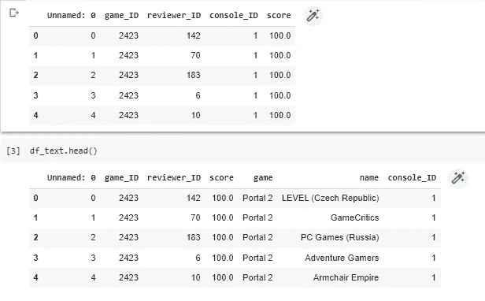
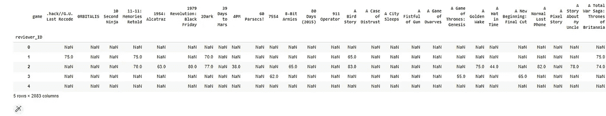
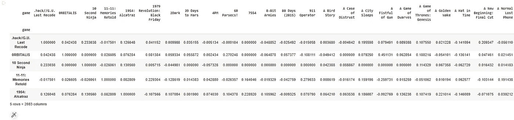
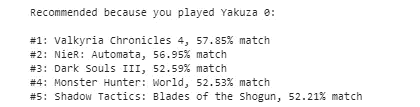
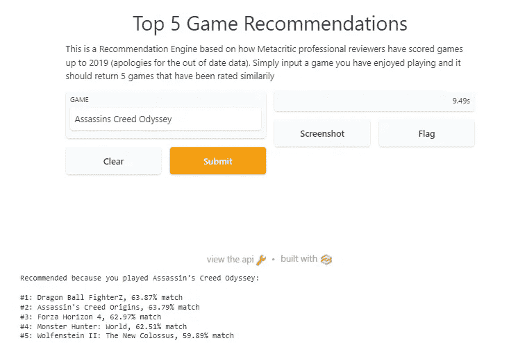

# 使用元评论数据集的交互式推荐引擎

> 原文：<https://betterprogramming.pub/interactive-recommendation-engine-using-metacritic-review-dataset-6cb8d62c76d4>

## 如何使用 Python 创建一个包含视频游戏元数据的推荐引擎，该引擎可以通过 Gradio 的文本输入进行交互


照片由[肖恩·多](https://unsplash.com/@everywheresean?utm_source=unsplash&utm_medium=referral&utm_content=creditCopyText)在 [Unsplash](https://unsplash.com/s/photos/gaming-esports?utm_source=unsplash&utm_medium=referral&utm_content=creditCopyText) 上拍摄

在互联网上通过 Python 的许多推荐引擎教程中，我有一个使用来自 IGN、PC Gamer 等出版物的元评论的评论数据生成推荐。

您可以在 [Kaggle](https://www.kaggle.com/skateddu/metacritic-critic-games-reviews-20112019) 上访问原始数据集。

你也可以在 Kaggle 上访问我在这个笔记本[中使用的版本。](https://www.kaggle.com/seyi92coding/metacritic-review-scores-20112019)

# 上传您的模块

像往常一样，我们将需要上传相关模块。

```
import pandas as pd
import numpy as np
import scipy as sp
from scipy import sparse
from sklearn.metrics.pairwise import cosine_similarity
from fuzzywuzzy import fuzz
```

# 上传和清理数据集

如果您计划使用不同的数据集创建自己的推荐引擎，您需要的 3 个最重要的列(功能)是:

*   用户标识
*   项目 ID
*   评级

在这种情况下，我的数据集包括项目的名称(视频游戏标题)和用户的名称(出版物)，因此输出对于真实世界的场景是用户友好的。

```
df = pd.read_csv("/content/Ratings_3col_Metacritic.csv",  error_bad_lines=False, encoding='utf-8')df_text = pd.read_csv("/content/Ratings_withText_Metacritic.csv",  error_bad_lines=False, encoding='utf-8')df.head()
df_text.head()
```



来自 Google Colab 中的 Metacritic 数据集的截图

我们必须进行常规检查，以确保没有任何无效数据。这些是我最喜欢的。

```
#Show an overview of the dataset
df.info()
df_text.info()#Drop unneccessary columns to speed up processingdf = df.drop(['Unnamed: 0'], axis=1)
df_text = df_text.drop(['Unnamed: 0'], axis=1)#Which columns have null values?print(df.columns[df.isna().any()].tolist())#How many null values per column? - Count the missing values in each columndf.isnull().sum()
```

# 格式化数据集，以便我们可以转换成数据透视表

从这一点开始，我将遵循这个 Kaggle 笔记本中显示的方法。

在接下来的步骤中:

*   我们希望只关注一种类型的控制台，这样可以提高建议的相关性
*   将数据集合并到一个数据框架中
*   删除重复项
*   我们只需要主要的 3 列。

然后，我们将为数据集创建一个数据透视表，其中的每一行都代表每个审阅者的所有分数。

```
#step 1 - Filter to one console typemeta_df = df[df['console_ID']== 1]#step 2 - Merge on Game ID across both datasetsmeta_df = meta_df.merge(df_text, left_on = 'game_ID', right_on = 'game_ID', suffixes= ['_meta', ''])#step 3 - Remove duplicate reviewsdef create_uid(row):
#create unique ID based on reviewer and game
    code = str(row['reviewer_ID']) + "_" + str(row['game_ID'])
    return codemeta_df['uid'] = meta_df.apply(create_uid, axis=1)
#drop duplicates of reviewers who reviewed the same game
meta_df = meta_df.drop_duplicates('uid')#step 3 - Only return the important columns
meta_df = meta_df[['game', 'reviewer_ID', 'score']]
```

准备好数据框架后，我们将创建一个以用户为行、以游戏为列的数据透视表。这个数据透视表将帮助我们根据评论者如何评论同一个游戏集合来计算他们之间的相似性。

```
pivot = meta_df.pivot_table(index=['reviewer_ID'], columns=['game'], values='score')
pivot.head()
```



数据透视表第一次迭代的屏幕截图

如您所见，有许多 NaN 值，我们将在数据透视表的第二次迭代中解决。

# 工程数据透视表还

作者:

*   价值正常化。

当特征在固定范围内或多或少均匀分布时，我们使用称为[线性缩放](https://developers.google.com/machine-learning/data-prep/transform/normalization)的标准化技术。评级标准化意味着将不同尺度上测量的值调整到一个名义上的共同尺度，通常是在平均之前。

*   将 NaN 值填充为 0。

大多数审查数据集将像这样稀疏，所以我们需要以某种方式填充 NaN 值。根据你的相似性技术，可能会有一个使用不同方法的争论。

*   为下一步调换支点。

交换行列可以让我们更容易地删除未评级的评论。

*   删除值为 0 的列(未分级)。
*   使用 scipy 包转换为稀疏矩阵格式进行相似度计算。

一旦我们的数据透视表成形，我们就可以运行余弦相似度函数，该函数将被转换成数据帧供我们进一步分析。

```
#Applying lambda function to multiple rows using Dataframe.apply()
#(x-np.mean(x))/(np.max(x)-np.min(x)) = Formulapivot_n = pivot.apply(lambda x: (x-np.mean(x))/(np.max(x)-np.min(x)), axis=1)# step 2 - Fill NaNs with Zeros
pivot_n.fillna(0, inplace=True)# step 3 - Transpose the pivot table
pivot_n = pivot_n.T# step 4 - Locate the columns that are not zero (unrated)
pivot_n = pivot_n.loc[:, (pivot_n != 0).any(axis=0)]# step 5 - Create a sparse matrix based on our pivot table
piv_sparse = sp.sparse.csr_matrix(pivot_n.values)
```

# 余弦相似模型

我们可以根据游戏评论者对游戏的评价来计算余弦相似度。他们越接近，就越有可能被评论者评为相似。

```
#Compute cosine similarity between samples in X and Y.
game_similarity = cosine_similarity(piv_sparse)#Turn our similarity kernel matrix into a dataframe
game_sim_df = pd.DataFrame(game_similarity, index = pivot_n.index, columns = pivot_n.index)game_sim_df.head()
```



标准化并填入 NaN 值后的数据透视表屏幕截图

正如你所看到的，NaN 值消失了，数据被标准化了，根据所有评论者的评分，给每一个游戏一个相似的分数。越接近 1.00000，它们的评级就越接近。

# 文本匹配

不太可能有人会输入准确的关键字来进行推荐，因此我们需要将用户输入的语句与数据集中最可能的项目进行匹配。

我们通过以下方式做到这一点:

*   创建一个基于“Levenshtein 距离”匹配 2 个输入的函数
*   创建新的数据帧，包含:游戏标题，游戏 ID
*   创建一个基于提交的 ID 返回游戏标题的函数

然后，通过以下方式将所有内容整合在一起的函数:

*   为每个游戏标题和用户输入分配匹配分数
*   按最高匹配分数到最低匹配分数排序
*   标识最高分数和游戏标题
*   将两者返回给用户

```
# create a function to find the closest title
def matching_score(a,b):
    #fuzz.ratio(a,b) calculates the Levenshtein Distance between a and b, and returns the score for the distance
    return fuzz.ratio(a,b)# if exactly the same, the score becomes 100df_game_names = df_text[['game','game_ID']].drop_duplicates(subset=['game_ID']).set_index('game_ID')
df_game_names = df_text.set_index('game_ID')# a function to convert index to title
def get_title_from_index(index):
    return df_game_names.iloc[index]['game']# a function to return the most similar title to the words a user type
def find_closest_title(title):
    #matching_score(a,b) > a is the current row, b is the title we're trying to match
    leven_scores = list(enumerate(df_game_names['game'].apply(matching_score, b=title)))
    sorted_leven_scores = sorted(leven_scores, key=lambda x: x[1], reverse=True)
    closest_title = get_title_from_index(sorted_leven_scores[0][0])
    distance_score = sorted_leven_scores[0][1]
    return closest_title, distance_score
# Bejeweled Twist, 100#Check matching works
get_title_from_index(20)
title, distance_score = find_closest_title('Dragonball Z')
print(title)
```

测试输出将返回:DragonBall FighterZ。很接近了。

# 推荐功能

首先，它根据输入提取最匹配的可用名称，然后根据游戏标题对相似性数据帧进行排序。

```
def game_recommendation(game):
    #Insert closest title here
    game, distance_score = find_closest_title(game)
    #Counter for Ranking
    number = 1
    print('Recommended because you played {}:\n'.format(game))
    for n in game_sim_df.sort_values(by = game, ascending = False).index[1:6]:
    print("#" + str(number) + ": " + n + ", " + str(round(game_sim_df[game][n]*100,2)) + "% " + "match")
    number +=1game_recommendation('Yakuza 0')
```



输出的屏幕截图

嘣！

但这并没有结束，我们可以让它与 Gradio 更加互动

# 使推荐器与 Gradio 交互

没有用户推荐，推荐者会怎样？

有了 Gradio，我们可以让任何人更容易使用输入，甚至超调一些参数。

如果你想知道更多关于你可以用 Gradio 做的很酷的事情，请访问他们的网站。

```
import gradio as grrecommender_interface = gr.Interface(game_recommendation, ["text"],["text"], title="Top 5 Game Recommendations", description="This is a Recommendation Engine based on how Metacritic professional reviewers have scored games up to 2019 (apologies for the out of date data). Simply input a game you have enjoyed playing and it should return 5 games that have been rated similarily")recommender_interface.launch(debug=True)
```

结果是:



推荐器的 Gradio 界面截图

这只是开始。我可以通过以下方式让这种方式更具互动性:

*   允许用户定义建议数量
*   添加参考数据集以包含/排除某些类型

此处可查看[完整笔记本。](https://colab.research.google.com/drive/1LYc8gtwW5q9p7jtX7axOMD7MtPN4XROM?usp=sharing)

或者如果你喜欢 Github，[你可以在这里访问代码。](https://github.com/SeyiAgboola/Recommender-Engines-with-Gradio/blob/main/Recommend_Video_Games_Based_on_Metacritic_Reviews_With_Gradio.ipynb)

如果您想用 Gradio 构建自己的推荐引擎，可以随意借用它作为起点。此外，如果您在构建过程中需要帮助，我可以推荐这些 Datacamp 课程。