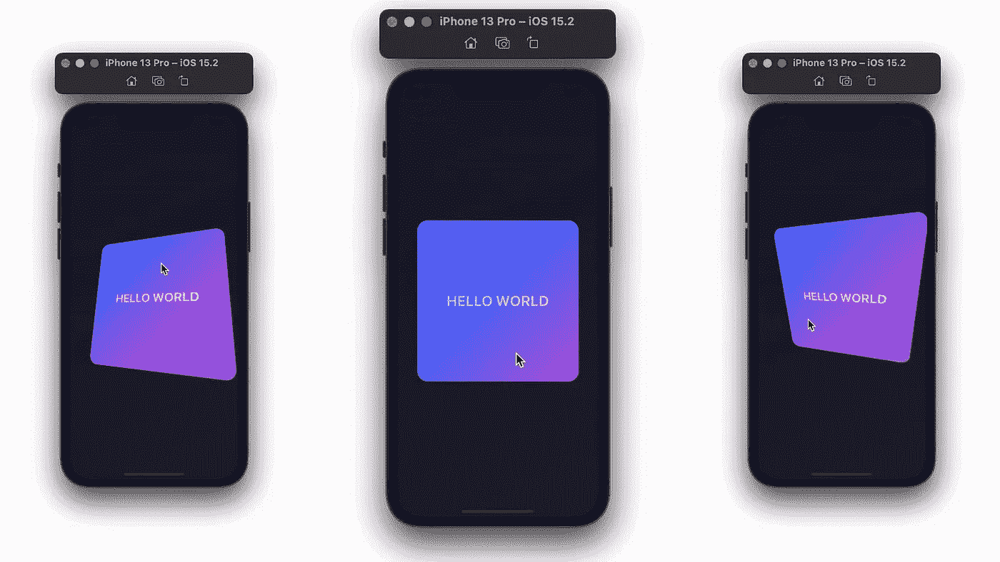
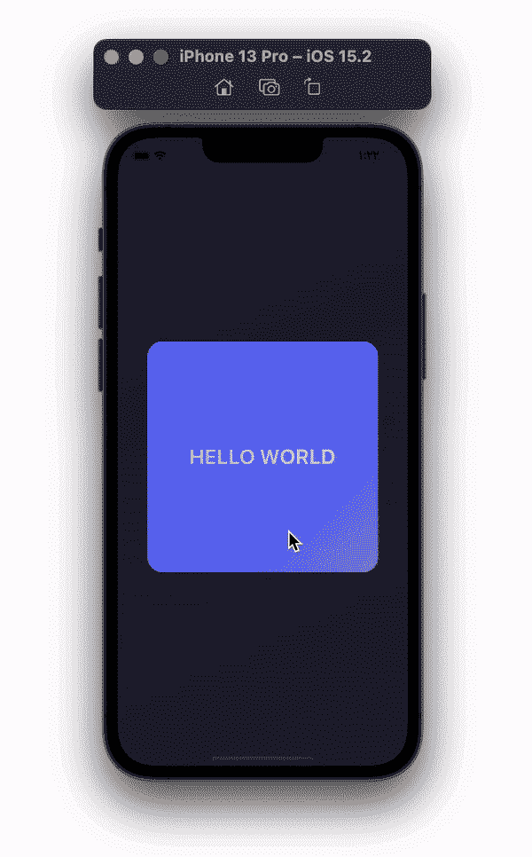
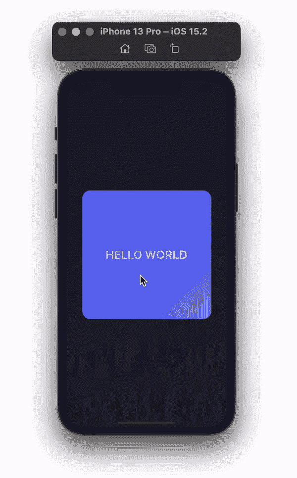

# SwiftUI 中的交互式视角

> 原文：<https://betterprogramming.pub/interactive-view-corners-in-swiftui-4e5de8339289>

## 使用用户的拖动手势移动视图

# 视角

从您想要互动的视图开始。在这里，您可以随意定制。

下面，当用户与视图交互时，我添加了`hueRotation()`来改变视图的颜色。在本文中，我们将这种观点称为`MyView`。

# 交互式视图

为了使我的视图具有交互性，将其嵌入到`GeometryReader`中，以帮助我们获得局部框架的 x 和 y 中点。在`GeometryReader`中，创建一个`DragGesture`变量。用户拖动时，使用`onChange()`移动`MyView`，使用`.onEnded()`将视图重置为正常的开始位置。

在`.onChange()`中，我们需要检查所有的四个角。与其检查角落里最远的点，不如把我们的视野分成四部分；左上、右上、左下和右下。

我们想将`MyView`向用户拖动运动的方向倾斜。获取用户拖动的位置，并将其与几何阅读器本地框架内的位置进行比较。

对`MyView`增加`.rotation3DEffect()`并传递 x、y 轴的状态变量和旋转角度。现在，为所有三个值添加`MyView`动画。

返回`.onChange()`，根据拐角将`x`和`y`轴的值在 1 和-1 之间改变。检查下面的代码，查看每个角落的正确 x 和 y 值。从 0 度开始，当用户开始拖动`MyView`时，将其更改为 20 度。

# ContentView

最后，将`InteractiveView()`添加到您的父视图中并运行应用程序。

# 视图修改器调整

如果你想有多个交互视图，最好把`InteractiveView()`做成一个视图修改器。

将您的结构类型从`View`更改为`ViewModifier`。在身体功能中添加身体。将`MyView`替换为内容，并如下移除`.frame()`修饰符。

在您的父视图中，添加`modifier()`并将其传递给我们的`InteractiveView()`。最后，将`frame()`修饰词添加到`MyView`中。

谢谢你的阅读！